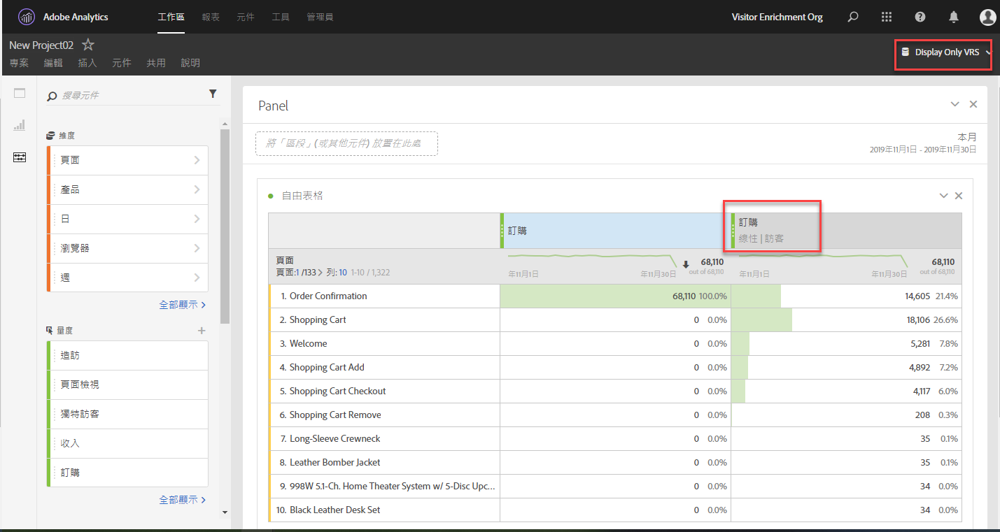

# 歸因面板概觀

>[!IMPORTANT] 「歸因」面板適用於Adobe Analytics Ultimate、Prime、Select和Foundation SKU的所有客戶。

歸因面板是「歸 [因IQ](../../attribution-iq.md) 」功能，可讓您將許多新類型的歸因模型新增至自由表格、視覺化和計算量度。 所有的歸因模型都有兩個元件:

* **** 歸因模型：模型描述群組中點擊的轉換分佈。 例如，首次接觸或上次接觸。
* **** 歸因回顧視窗：回顧視窗說明每個模型會考慮哪些點擊群組。 例如，瀏覽或訪客。

## 歸因模型

| UI圖示 | 歸因模型 | 定義 | 使用時機 |
| --- | --- | --- | --- |
|  | 上次接觸 | 將100%的評分給予最近在轉換前發生的觸點。 | 最基本且最常見的歸因模型。 它常用於轉換，且考慮週期短。 上次接觸通常由管理搜尋行銷或分析內部搜尋關鍵字的團隊使用。 |
|  | 首次接觸 | 為首次在歸因回顧視窗中看到的觸點提供100%評分。 | 另一個常用歸因模型，可用於分析行銷通道，以提升品牌認知度或客戶獲取。 展示廣告或社交行銷團隊經常使用它，但也很適合評估現場產品建議的成效。 |
|  | 同一次接觸 | 將100%評分給予發生轉換的點擊。 如果接觸點未發生在與轉換相同的點擊上，則會在「無」下方分組。 | 評估轉換時立即顯示的內容或使用者體驗時的實用模型。 產品或設計團隊通常會使用此模型來評估轉換發生的頁面的成效。 |
|  | 線性 | 對每個觸點給予同等的評價，以促成轉化。 | 適用於考慮週期較長的轉換或需要更頻繁客戶參與的使用者體驗。 團隊通常會使用它來測量行動應用程式通知的效能，或與訂閱型產品搭配使用。 |
|  | U 形 | 將40%的評分給予第一次互動，40%的評分給予上次互動，並將剩下的20%分給中間的任何接觸點。 若是單一接觸點的轉換，則會獲得100%評分。 對於具有兩個接觸點的轉換，兩者均獲得50%評分。 | 對於重視互動、引入或關閉轉換、但仍想辨識協助互動的人而言，這是個絕佳的模型。 U型歸因常被採用更平衡方法的團隊所使用，但想要給予找到或關閉轉換的渠道更多評價。 |
|  | J 形 | 將60%的評分給予上次互動，將20%的評分給予第一次互動，並將剩下的20%分給中間的任何接觸點。 若是單一接觸點的轉換，則會獲得100%評分。 對於具有兩個接觸點的轉換，上次互動的評分為75%，第一次互動的評分為25%。 | 對於那些將尋找者和成交者列為優先順序，但希望將注意力集中在成交互動的人而言，這個模型非常好。 J-Shifed歸因經常被採用更平衡方法並希望給予關閉轉化渠道更多評價的團隊所使用。 |
|  | 反向 J | 給予首次接觸點60%的評分，給予上次接觸點20%的評分，並將剩餘20%的評分除以中間的任何接觸點。 若是單一接觸點的轉換，則會獲得100%評分。 對於具有兩個接觸點的轉換，第一次互動的評分為75%，最後一次互動的評分為25%。 | 這種模式最適合那些將尋找者和關閉者列為優先順序，但希望專注於尋找互動的人。 J反向歸因被採用更平衡方法並希望給予啟動轉換的渠道更多評價的團隊所使用。 |
|  | 自訂 | 可讓您指定要給首次接觸點、上次接觸點以及兩者間任何接觸點的粗細。 即使輸入的自訂數字未加到100，指定的值也會標準化為100%。 若是單一接觸點的轉換，則會獲得100%評分。 對於與兩個接觸點的互動，會忽略中間參數。 然後，將第一和最後一個接觸點標準化為100%，並據以分配評價。 | 此模型最適合想要完全控制其歸因模型，並有其他歸因模型無法滿足的特定需求的使用者。 |
|  | 時間衰減 | 使用自訂的半衰期參數（預設值為7天）進行後續和指數衰減。 每個頻道的權重取決於在觸點啟動和最終轉換之間所經過的時間量。 用來判斷評分的公式 `2``(-t/halflife)`是，其 `t` 中是接觸點與轉換之間的時間量。 接著，所有觸點都會標準化為100%。 | 最適合定期執行視訊廣告或針對預定日期的事件行銷的團隊。 行銷事件後發生轉換的時間越長，獲得的評分就越少。 |
|  | 參與率 | 給予所有獨特觸點100%的評價。 相較於其他歸因模型，轉換的總數會被誇大。 參與率會消除重複多次出現的渠道。 | 非常好地瞭解哪些客戶經常接觸到特定的互動。 媒體組織經常使用此模型來計算內容速度。 零售組織通常使用此模型來瞭解其網站的哪些部分對轉換至關重要。 |

## 回顧視窗

回顧視窗是轉換應回顧以包含觸點的時間長度。 在檢視不同回顧視窗時，給予第一次互動更多評價的歸因模型會發現更大的差異。

* **** 瀏覽回顧視窗：回顧轉換發生的瀏覽的開始。 瀏覽回顧視窗很窄，因為除了瀏覽以外，它們不會再看。 瀏覽回顧視窗會遵循虛擬報表套裝中已修改的瀏覽定義。
* **** 訪客回顧視窗：查看截至目前日期範圍當月1日的所有瀏覽。 訪客回顧視窗很寬，因為可跨多次瀏覽。 例如，如果報表日期範圍是9月15日- 9月30日，則訪客回顧日期範圍包括9月1日- 9月30日。

## 範例

考量下列範例:

1. 9月15日，訪客透過付費搜尋廣告來到您的網站，然後離開。
2. 9月18日，訪客透過朋友傳送的社交媒體連結再次來到您的網站。 他們新增數個項目至購物車，但不購買任何項目。
3. 在9月24日，您的行銷團隊會寄送電子郵件給他們，內含購物車中某些項目的抵用券。 他們會套用抵用券，但請造訪數個其他網站，看看是否有其他抵用券可供使用。 他們透過展示廣告尋找另一個，最終以$50的價格購買。

視您的回顧視窗和歸因模型而定，渠道會獲得不同的評分。 以下是一些值得注意的範例：

* 使用 **首次接觸** 和瀏覽回 **顧視窗**，歸因只會查看第三次瀏覽。 在電子郵件和展示廣告之間，電子郵件是第一位，因此，電子郵件在$50的購買中獲得100%的評分。
* 使用 **首次接觸** 和訪客回 **顧視窗**，歸因會查看所有三次瀏覽。 付費搜尋是第一個，因此在50美元的購買中，它獲得100%的評分。
* 使用 **線性** 和瀏覽 **回顧視窗**，評分會分為電子郵件和顯示。 這兩個渠道各獲得25美元評分。
* 使用 **線性****和訪客回顧視窗**，評分會分為付費搜尋、社交、電子郵件和顯示。 每個渠道的此次購買獲得$12.50的評分。
* 使用 **J形** 、訪客回 **顧視窗**，評分會分為付費搜尋、社交、電子郵件和顯示。
   * 60%的評分是用來展示的，價格是30美元。
   * 20%的評分被給予付費搜尋，10美元。
   * 剩下的20%分為社交和電子郵件，每封5美元。
* 使用 **「時間衰減** 」和訪客回 **顧視窗**，評分會分為付費搜尋、社交、電子郵件和顯示。 使用預設的7天半衰期：
   * 顯示觸點與轉換之間的間隔為0天。 `2``(-0/7)` `= 1`
   * 電子郵件觸點與轉換之間間隔0天。 `2``(-0/7)` `= 1`
   * 社交觸點與轉換之間的6天間隔。 `2``(-6/7)` `= 0.552`
   * 付費搜尋觸點與轉換之間的間隔為9天。 `2``(-9/7)` `= 0.41`
   * 將這些值標準化會產生下列結果：
      * 顯示：33.8%,16.88美元
      * 電子郵件：33.8%獲得16.88美元
      * 社交：18.6%,9.32美元
      * 付費搜尋：13.8%,6.92美元

> [!TIP] 如果信用屬於多個渠道，其他轉換事件（例如訂購或自訂事件）也會被分割。 例如，如果兩個渠道使用線性歸因模型對自訂事件做貢獻，則兩個渠道都會獲得0.5個自訂事件。 這些事件分數會在所有瀏覽中加總，然後四捨五入至最接近的整數以用於報告。

## 將歸因與行銷管道搭配使用

當行銷渠道首次推出時，它們只提供首次接觸和上次接觸維度。 有了這些額外的歸因模型，您不再需要明確的首次／上次接觸維度。 Adobe提供一般 **的行銷渠道維度** ，以便與您選擇的歸因模型搭配使用。 這些一般行銷渠道維度的行為與「上次接觸渠道」維度相同，但標籤不同，以防止在使用不同歸因模型的行銷渠道時混淆。

由於行銷渠道維度取決於傳統的瀏覽定義（由其處理規則定義），因此無法使用虛擬報表套裝來變更其瀏覽定義。

## 搭配多值變數使用歸因

Analytics中的某些維度可在單一點擊上包含多個值。 常見範例包括清單變數和產品變數。

將歸因套用至多值點擊時，相同點擊中的所有值都會獲得相同的評價。 由於許多值可以接收此評價，因此報表總計可能與每個單獨行項目的總和不同。 報表總計會進行去重複化，而每個個別維度值會獲得適當的評分。

## 將歸因與區隔搭配使用

歸因一律會在區段之前執行，而區段會在套用報表篩選器之前執行。 此概念也適用於使用區段的虛擬報表套裝。

例如，如果您建立套用「顯示點擊」區段的VRS，您可以使用某些歸因模型在表格中看到其他渠道。

