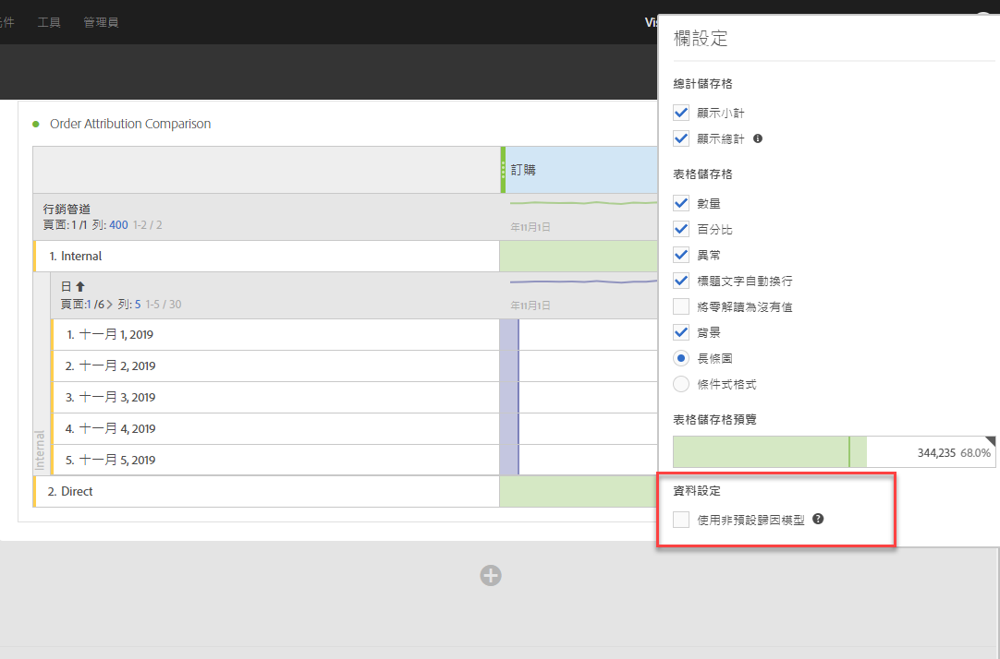
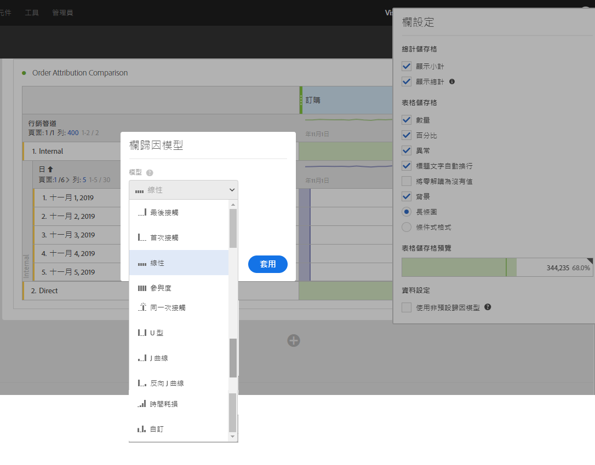
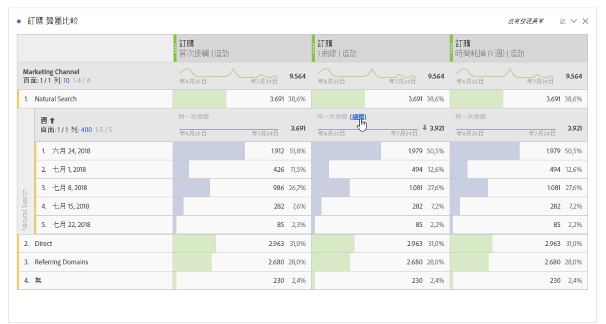
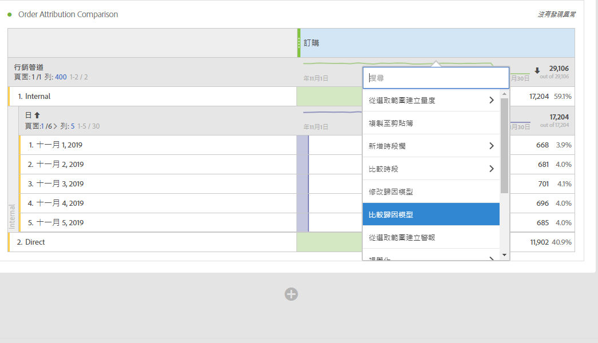
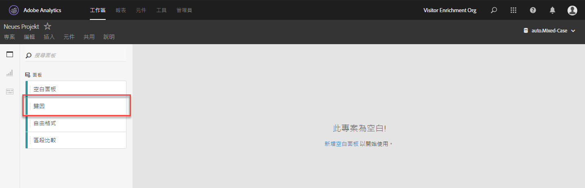
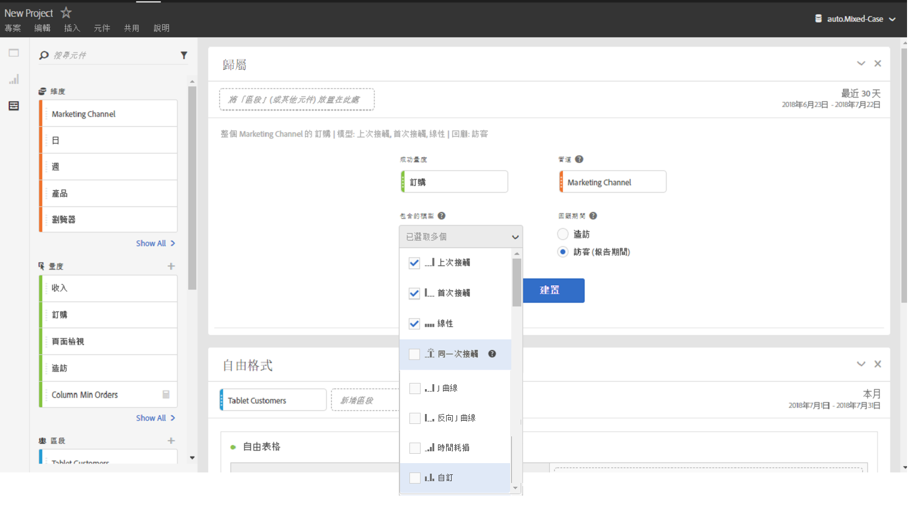
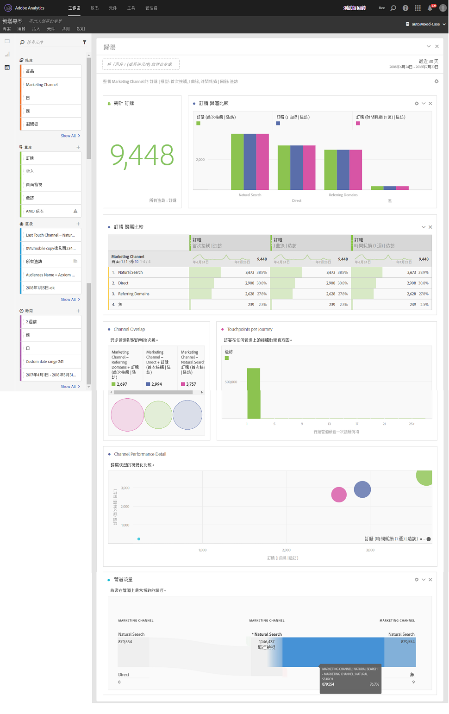

# 在 Analysis Workspace 中使用歸因 

Analysis Workspace 中的歸因 IQ 可讓您交互比較任何支援的歸因模型、透過進階的流失與流量視覺效果將重要的轉換行銷序列加以視覺化、快速顯示任何行銷管道或促銷活動趨勢並查看效能隨時間的變化、找出管道/促銷活動績效中的統計數據異常、並在效能下降或提升時收到警報。

## 在自由表格中使用歸因 {#section_F2F72AE840EB4EA781302A559726E6F4}

Analysis Workspace 自由表格支援適用於幾乎所有量度的歸因模型。歸因模型可在「欄設定」中的自由表格量度欄中進行設定：

1. 按一下自由表格欄中的「設定」(齒輪) 圖示。

   

1. 在下 **[!UICONTROL Data Settings]**&#x200B;面，檢查 **[!UICONTROL Use non-default attribution model]**。 如需不同歸因模型的詳細資訊，請參閱[歸因 IQ 概述](attribution.md)。

   

## 將歸因模型套用到資料劃分{#section_ED1E7532CF084B5AB0942BD80B4770C9}

您也可以將歸因模型套用到任何自由表格中的劃分，使該欄擁有與上層欄相同或不同的歸因模型。舉例來說，您可以在「行銷管道」維度中分析線性訂單，但將「U 形訂單」套用至管道中的特定追蹤代碼。若要編輯套用到劃分的歸因模型，只要將滑鼠移到劃分模型上，然後按一下「編輯」即可：

## 比較不同歸因模型 {#section_1D74C09549CC4EC8A952A7392C76D375}

If you&#39;d like to quickly and easily compare one attribution model to another, right click a metric and select **[!UICONTROL Add comparative attribution model]**:

如此可輕鬆快速地比較不同的歸因模型，而無須再次拖曳量度和進行設定。

## 歸因面板和視覺效果 {#section_6B02F28182F14ECC9FC5020F224726E6}

您可以使用歸因面板輕鬆建立比較不同歸因模型的分析。若要存取歸因面版，

1. 請按一下最左邊的面板圖示。
1. 將歸因面版拖曳到您的 Analysis Workspace 專案中。

   

1. 新增您想要歸因的成功量度和任何管道維度 (例如行銷管道或內部促銷活動)。

   

1. 選取您要比較的[歸因模型](attribution.md)和回溯窗口。

   歸因面板將傳回豐富的資料和視覺效果，協助您更了解行銷管道 (或其他維度) 如何共同運作。

   

   以下是每個視覺效果的說明：

| 視覺效果 | 說明 |
|--- |--- |
| 總量度 | 在回報時間視窗中發生的轉換總數。這些是在您所選取的維度中歸因的轉換。 |
| 量度歸因比較長條圖 | 以視覺化的方式比較您所選取維度中個別維度項目的歸因轉換。長條圖中的每種顏色均代表個別選取的歸因模型。 |
| 量度歸因自由表格 | 顯示長條圖中的資料：選取表格中不同的欄或列，即可篩選長條圖以及面版中的數個其他視覺效果。此表格的用途與 Workspace 中其他自由表格相同：讓您新增量度、區段和劃分等。 |
| 維度重疊圖表 | Venn 圖表會顯示前三個維度項目 (例如管道) 和項目參與相關轉換的頻率。舉例來說，重疊的泡泡圖大小代表訪客接觸到兩個維度項目 (例如管道) 時，轉換發生的頻率。選取自由表格中的其他列即可依據您的選取項目更新視覺效果。 |
| 每個歷程的行銷接觸點 | 色階分佈圖代表訪客在報表日期範圍中的行銷 (或任何維度) 接觸點數量。此圖表在查看多點接觸歸因影響資料集情形時相當實用。如果幾乎所有訪客都只有單一接觸點，結果中的歸因模型將不會顯示太大差異。 |
| 行銷管道效能詳細資料 | 讓您使用散佈圖以視覺效果的方式比較最多三種歸因模型。 |
| 行銷管道流量 | 可讓您查看最常進行互動的管道，以及在訪客歷程中的順序。 |
