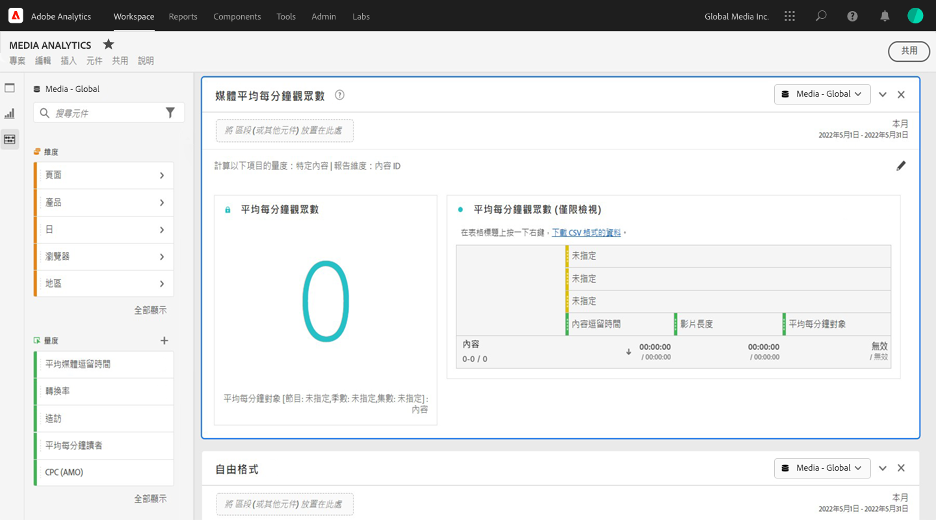
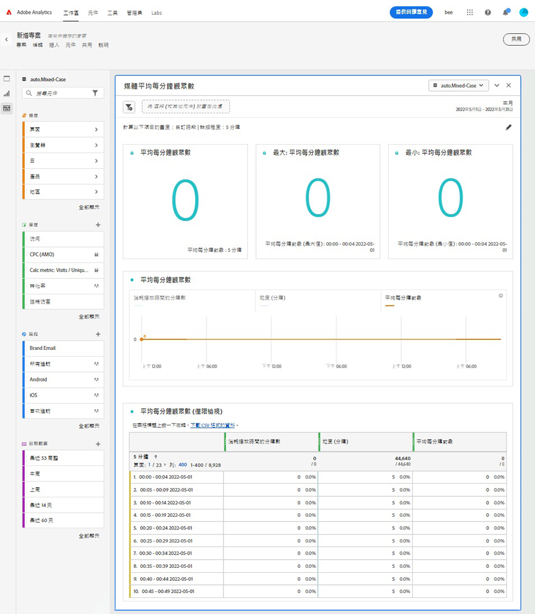

# 媒體平均分鐘觀眾數面板 {#media-average-minute-audience-panel}

<!-- markdownlint-disable MD034 -->

>[!CONTEXTUALHELP]
>id="workspace_mediaminuteaverageaudience_button"
>title="媒體平均分鐘觀眾數"
>abstract="建立一個面板來分析特定內容或特定時段內的每分鐘平均對象數。"

<!-- markdownlint-enable MD034 -->

<!-- markdownlint-disable MD034 -->

>[!CONTEXTUALHELP]
>id="workspace_mediaaverageminuteaudience_panel"
>title="媒體平均分鐘觀眾數"
>abstract="顯示特定媒體內容或自訂時段內的效能。  **一般參數&#x200B;** **計算指標**：選取要用於面板的指標。選取&#x200B;**特定內容**&#x200B;可根據內容長度分析特定內容或事件的平均分鐘觀眾數。**選取自訂時段**&#x200B;可分析自訂選定時段內的平均分鐘觀眾數變化。 **報告維度**：選取按&#x200B;**內容 ID** 維度的&#x200B;**影片名稱**&#x200B;進行報告。僅當您選取特定內容作為指標時才可用。 **詳細程度**：選取報告的詳細程度。僅當您選取自訂時段作為指標時才可用。 **篩選內容依據 (可選)**：選取特定節目、季別、劇集，或選取自訂維度來篩選內容。  **進階設定&#x200B;** **表格設定**：選取是否在表格中顯示計算值。 **逗留時間量度**：選取您想要用於特定內容計算的逗留時間量度。僅當您選取特定內容作為指標時才可用。"

<!-- markdownlint-enable MD034 -->

>[!BEGINSHADEBOX]

_本文記錄了_  _&#x200B;**Adobe Analytics**&#x200B;_&#x200B;中的「媒體平均每分鐘觀眾數」面板。 _檢視本文章[&#128279;](https://experienceleague.adobe.com/en/docs/analytics-platform/using/cja-workspace/panels/average-minute-audience-panel)CustomerJourneyAnalytics_ 版本的&#x200B;_&#x200B;**媒體平均每分鐘觀眾數面板**。_

>[!ENDSHADEBOX]

>[!NOTE]
>
>**[!UICONTROL 媒體平均每分鐘觀眾數]**&#x200B;面板僅適用於已購買適用於串流媒體的Adobe Analytics附加元件的客戶。
>
>請聯絡您的 Adobe 銷售代表或 Adobe 帳戶團隊以取得更多資訊。
>

在 Analysis Workspace 中，平均分鐘觀眾數可提供

* 觀看特定媒體串流所花的時間除以內容的時長的資訊，或
* 在選取詳細程度的自訂時段期間內觀看所花費的時間。

媒體平均分鐘觀眾數面板，可讓您透過比較任意長度或類型的方案來了解內容平均耗用量。例如，透過比較 30 分鐘情境喜劇和 3 小時運動賽事，您可以了解平均耗用量。

此外，您可以使用媒體平均分鐘觀眾數面板比較或附加數位平均分鐘觀眾數和線性電視平均分鐘量度。

媒體平均分鐘觀眾數面板與平均分鐘觀眾數量度相比提供以下優勢：

* 支援自訂時段

* 允許在處理視圖後更新持續時間分類 (如果持續時間分類不存在或需要更正)

  如果在使用量度時進行此更新，則持續時間分類不存在 (如果此分類不存在)。或者持續時間分類已經過期 (如果分類存在但不正確)。

## 使用

若要使用&#x200B;**[!UICONTROL 媒體平均分鐘觀眾數]**&#x200B;面板：

1. 建立&#x200B;**[!UICONTROL 媒體平均分鐘觀眾數]**&#x200B;面板。有關如何建立面板的資訊，請參閱[建立面板](panels.md#create-a-panel)。

1. 確保您為面板選取資料檢視，該面板具有從Adobe Analytics for Streaming Media附加元件設定的元件。

1. 指定面板的[輸入](#panel-input)。

1. 觀察面板的[輸出](#panel-output)。

### 面板輸入

使用此區段中所述的輸入設定來設定媒體平均分鐘觀眾數面板。

1. 設定以下輸入設定：

   | 設定 | 說明 |
   |---------|------------|
   | **面板日期範圍** | 面板日期範圍預設為&#x200B;[!UICONTROL **本月**]。您可將其編輯為一次檢視一天或數月。  此視覺效果僅限 1440 列資料 (例如，以分鐘為詳細程度測量 24 小時)。 如果日期範圍和詳細程度組合結果超過 1440 列，則詳細程度會自動更新以符合完整的日期範圍。 |
   | [!UICONTROL **將區段放置在此處 (或其他任何元件)**] | 如同其他面板，此設定會根據您已建立的區段篩選選取項目。此設定是檢視特定平台、直播串流或其他常見媒體區段的絕佳方式。 |
   | [!UICONTROL **計算以下項目的量度**] | 選擇是否要查看平均分鐘觀眾數[**[!UICONTROL 特定內容]**](#specific-content)。或者如果您想了解[**[!UICONTROL 自訂時段]**](#custom-time-period)的平均分鐘觀眾數。  請選取&#x200B;[!UICONTROL **自訂時段**]： <ul><li>如果持續時間不適用，或者 </li><li>您想要檢視此時間序列的平均分鐘觀眾數，而此序列包含多個內容片段，或者</li><li>未指定特定持續時間的內容 (例如在直播串流或活動期間)</li></ul></li></li></ul> 
此設定會變更工作流程和報表輸出。
 |

1. 繼續[特定內容](#specific-content)或者[自訂時段](#custom-time-period)，取決於您在下拉式清單的&#x200B;[!UICONTROL **計算量度**]。

#### 特定內容

1. 當[設定面板輸入時，](#panel-inputs)如果您已選取在下拉式選單的&#x200B;[!UICONTROL **計算量度**]&#x200B;之&#x200B;[!UICONTROL **特定內容**]，指定以下設定選項：

   | 設定 | 說明 |
   |---------|------------|
   | [!UICONTROL **報告維度**] | 當您選取特定內容時，可以選取報表輸出來使用影片名稱或內容 ID 欄位，以顯示其內容及其相關的平均分鐘觀眾數。 |
   | [!UICONTROL **內容篩選依據 (可選)**] | 根據您想要的檢視或是資料結構化的方式來選擇如何篩選特定內容。 <ul>[!UICONTROL **節目、季度、集數**]：在下拉式清單顯示您可使用搜尋來篩選的可用節目 (或透過從左側邊攔拖放節目名稱)。您可以在該處結束選擇，以查看所有季度的節目，也可以依個別季度然後依個別集數篩選節目。 此設定會針對所選時段顯示這些節目、季度或集數的資料。</li><li>[!UICONTROL **自訂維度**]：如果您的節目名稱在自訂維度下，您可以在維度 (可選) 下拉式清單或使用左側邊欄搜尋來尋找。此維度項目會自動根據該選擇填入，而且被視為集數。</li><li>[!UICONTROL **無**]：針對您所選的選取項目來顯示所有具有平均分鐘觀眾數資料的影片名稱。(根據預設選取此選項。)</li></ul> |

1. 繼續「[特定內容進階設定](#specific-content-advanced-settings)」，以設定進階設定。

#### 特定內容進階設定

1. 使用&#x200B;[!UICONTROL **特定內容**]，選取在下拉式選單的「[!UICONTROL **計算量度**]」後，選取「[!UICONTROL **顯示進階設定**]」，然後指定以下設定選項：

   | 選項 | 說明 |
   |---------|------------|
   | **[!UICONTROL 表格設定]** | 預設選項 (**[!UICONTROL 在表格中顯示計算值]**) 會將平均分鐘觀眾數的分子和分母顯示為表格中的前幾欄。取消選取此選項將移除這兩欄。平均分鐘觀眾數欄仍保留在表格中影片名稱或內容 ID 旁。 |
   | **[!UICONTROL 逗留時間量度]** | 您可以選擇預設「**[!UICONTROL 內容逗留時間]**」選項，其中僅包括內容時間。或者您可以選擇使用「**[!UICONTROL 媒體逗留時間]**」，包括內容和廣告時間一起作為平均分鐘觀眾數的分子計算。 |

1. 請選取「[!UICONTROL **建置**]」，以完成媒體平均分鐘觀眾數面板的建立。

1. 繼續「[面板輸出](#panel-output)」，了解有關如何使用媒體平均分鐘觀眾數面板的資訊。

#### 自訂時段

1. 當[設定面板輸入時，](#panel-inputs)如果您已選取在下拉式選單的&#x200B;[!UICONTROL **計算量度**]&#x200B;之&#x200B;[!UICONTROL **自訂時段**]，指定以下設定選項：

   | 選項 | 說明 |
   |---------|------------|
   | **[!UICONTROL 詳細程度]** | 預設詳細程度為 [!UICONTROL **5 分鐘**]，但是您可以在選取的時段內選擇用於時間序列分母的任何詳細程度。例如，選取12:00 pm到12:30 pm當作5分鐘詳細程度，會傳回超過半小時的平均每分鐘觀眾數，以及每5分鐘時段的平均每分鐘觀眾數。 這些列會當作時間序列圖表的資料點使用。 |
   | [!UICONTROL **內容篩選依據 (可選)**] | 根據您想要的檢視或是資料結構化的方式來選擇如何篩選特定內容。 <ul>[!UICONTROL **節目、季度、集數**]：在下拉式清單顯示您可使用搜尋來篩選的可用節目 (或透過從左側邊攔拖放節目名稱)。您可以在該處結束選擇，以查看所有季度的節目，也可以依個別季度然後依個別集數篩選節目。 此設定會針對所選時段顯示這些節目、季度或集數的資料。</li><li>[!UICONTROL **自訂維度**]：如果您的節目名稱在自訂維度下，您可以在維度 (可選) 下拉式清單或使用左側邊欄搜尋來尋找。此維度項目會自動根據該選擇填入，而且被視為集數。</li><li>[!UICONTROL **無**]：針對您所選的選取項目來顯示所有具有平均分鐘觀眾數資料的影片名稱。(根據預設選取此選項。)</li></ul> |

1. 繼續「[自訂時段進階設定](#custom-time-period-advanced-settings)」，以設定進階設定。

#### 自訂時段進階設定

1. 使用「[!UICONTROL **自訂時段**]」，選取在下拉式選單的「[!UICONTROL **計算量度**]」後，選取「[!UICONTROL **顯示進階設定**]」，然後指定以下設定選項：

   | 選項 | 說明 |
   |---------|------------|
   | **[!UICONTROL 表格設定]** | 預設設定會顯示表格中的計算值，該表格會將平均分鐘觀眾數的分子和分母顯示為表格中的前幾欄。 取消選取這個選項會移除這兩欄，只留下時段旁邊的平均分鐘觀眾數。 |

1. 請選取「[!UICONTROL **建置**]」，以完成媒體平均分鐘觀眾數面板的建立。

1. 繼續「[面板輸出](#panel-output)」，了解有關如何使用媒體平均分鐘觀眾數面板的資訊。

### 面板輸出

當[設定面板輸入時，](#panel-inputs)面板輸出差異取決於您在下拉式選單的&#x200B;[!UICONTROL **計算量度**]&#x200B;中選擇「[!UICONTROL **特定內容**]」或「[!UICONTROL **自訂時段**]」。

#### 特定內容

媒體平均分鐘觀眾數面板會傳回以下內容：

* 您整個選擇的平均分鐘觀眾數總計
* 顯示在表格中之個別影片的篩選器和平均分鐘觀眾數
* 內容花費時間及影片長度 (持續時間)，前提是已選取該進階設定

若要隨時編輯和重建面板，在右上方選取「」。

#### 特定內容資料來源

媒體平均分鐘觀眾數面板僅使用平均分鐘觀眾量度來收集資料。面板中不能使用劃分或其他量度。

| 量度 | 說明 |
|--------|-------------|
| **[!UICONTROL 平均分鐘觀眾數]** | 檢視您的媒體串流所花的時間除以透過「分類」提供的影片長度 (持續時間)。 |

#### 自訂時段 {#custom-time-period-output}

媒體平均分鐘觀眾數面板會傳回以下內容：

* 您整個選取項目範圍的平均分鐘觀眾數總計

* 最高和最低平均分鐘觀眾數

* 線列圖表顯示整個選取項目範圍內的平均分鐘觀眾數。

* 下表顯示此詳細程度的篩選條件和平均分鐘觀眾數，以及每個時段的內容逗留時間和詳細程度

  只有選取進階設定下的「[!UICONTROL **在表格中顯示計算值**]」選項時，才會顯示此表格。

若要隨時編輯和重建面板，請選取右上方的「」。

#### 自訂時段資料來源

媒體平均分鐘觀眾數面板僅使用平均分鐘觀眾量度來收集資料。面板中不能使用劃分或其他量度。

| 量度 | 說明 |
|---|---|
| **[!UICONTROL 平均分鐘觀眾數]** | 檢視您的媒體串流所花的時間除以總選取範圍或所選的詳細程度 (以分鐘計)。 |

>[!MORELIKETHIS]
>
> [建立面板](/help/analyze/analysis-workspace/c-panels/panels.md#create-a-panel)
> &#x200B;> [媒體同時檢視者面板](media-concurrent-viewers.md)
> &#x200B;> [媒體播放時間面板](media-playback-time-spent.md)
>

<!--

# Media average minute audience panel

>[!NOTE]
>
>The Media average minute audience panel is available only to customers who have purchased the Streaming Media Collection Add-on. 
>
>Contact your Adobe Sales Representative or Adobe Account Team to purchase the Streaming Media Collection Add-on. 

In Analysis Workspace, average minute audience is the time spent viewing your media stream divided by the duration of the content or the total selection of the period and selected granularity.

The Media average minute audience panel enables you to better understand average consumption of your content by comparing programs of any length or genre. For example, you can understand average consumption when comparing a 30-minute sitcom with a 3-hour sporting event.

In addition, you can use the Media average minute audience panel to compare or append this digital average minute audience to linear TV average minute metrics. 

The Media average minute audience panel provides the following benefits over the Average Minute Audience metric:

* Supports custom time periods

* Allows for updating the duration classification after views are processed (if it was not present or if it needs to be corrected)

  If you did this when using the metric, it either won't exist (if the classification wasn't present) or it will be out of date (if the classification was present but incorrect).

## Access the Media average minute audience panel

1. In Analysis Workspace, go to a report suite that has streaming media components enabled. 

1. In the left nav, select the **Panels** icon.

   

1. Drag the [!UICONTROL **Media average minute audience**] panel onto the canvas in Analysis Workspace.

1. To configure the panel, continue with [Panel inputs](#panel-inputs).

## Panel inputs {#Input}

Use the input settings described in this section to configure the Media average minute audience panel.

1. Begin creating a Media average minute audience panel, as described in [Access the Media average minute audience panel](#access-the-media-average-minute-audience-panel).

1. Configure the following input settings:

   | Setting | Description |
   |---------|------------|
   | **Panel date range** | The panel date range default is [!UICONTROL **This month**]. You can edit it to view a single day or many months at a time.    This visualization is limited to 1440 rows of data (for example, 24-hours at minute-level granularity). If a date range and granularity combination results in more than 1440 rows, the granularity is automatically updated to accommodate the full date range. |
   | [!UICONTROL **Drop a segment here (or any other component)**] | Like other panels, this setting filters your selections based on segments you've created. This is a great way to look at specific platforms, live streams, or other common media segments. |
   | [!UICONTROL **Calculate metric for**] | Choose whether you want to see the average minute audience for a specific piece of content, or if you want to see the average minute audience for a custom period of time:<ul><li>**Specific content:** This is available only if the duration has been updated using Classifications. If the duration is unavailable, or if you want to view the average minute audience for a time series with multiple pieces of content or content without a specific assigned duration (like during a live stream or event), then you should select [!UICONTROL **Custom time period**]. (Durations can be set using Classifications either before or after processing time.)</li><li>**Custom time period:** This is available regardless of whether the durations is made available using Classifications.</li></ul> 
This setting changes the workflow and report output.
  |

1. Continue with [Specific content](#specific-content) or [Custom time period](#custom-time-period), depending on the option you chose in the [!UICONTROL **Calculate metric for**] drop-down menu.

### Specific content

1. If you selected [!UICONTROL **Specific content**] in the [!UICONTROL **Calculate metric for**] drop-down menu when [configuring panel inputs](#panel-inputs), specify the following configuration options:

   | Setting | Description |
   |---------|------------|
   | [!UICONTROL **Reporting dimension**] | When you choose specific content, you can select the report output to use either the video name or content ID fields to show the content and its associated average minute audience for the time period selected. |
   | [!UICONTROL **Filter content by (optional)**] | Choose how to filter the specific content, depending on the view you want or the way your data is structured. <ul>[!UICONTROL **Show, season, episode**]: Displays your available shows in the drop-down, which you can filter using a search (or by dragging and dropping the show name from the left column). You can end your selection there to see all the seasons of your show, or you can filter by individual seasons and then by individual episodes. This setting shows the data for those shows, seasons, or episodes for the selected time period.</li><li>[!UICONTROL **Custom dimension**]: If your show name is under a custom dimension, you can find it either by searching in the dimension (optional) drop down or by using the left column search. The dimension item automatically populates based on that selection and is treated as an episode.</li><li>[!UICONTROL **None**]: Shows all the video names that have average minute audience data for the selection you've chosen. (This options is selected by default.)</li></ul>  |

1. Continue with [Specific content advanced settings](#specific-content-advanced-settings) to configure advanced settings. 

### Specific content advanced settings

1. With [!UICONTROL **Specific content**] selected in the [!UICONTROL **Calculate metric for**] drop-down menu, select [!UICONTROL **Show advanced settings**], then specify the following configuration options:

   | Setting | Description |
   |---------|------------|
   | Table settings | The default setting shows the calculation values in the table, which shows the numerator and denominator of the average minute audience as the preceding columns in the table. Deselecting this option removes those two columns, leaving only the average minute audience next to the video name or content ID. |
   | Time spent metric | You can choose the default content time spent, which includes only content time, or you can choose to use the media time spent, which includes content and ad time together as the numerator calculation for the average minute audience. |

1. Select [!UICONTROL **Build**] to finish creating the Media average minute audience panel.

1. Continue with [Panel output](#panel-output) for information about how to use the Media average minute audience panel.

### Custom time period

1. If you selected [!UICONTROL **Custom time period**] in the [!UICONTROL **Calculate metric for**] drop-down menu when [configuring panel inputs](#panel-inputs), specify the following configuration options:

   | Setting | Description |
   |---------|------------|
   | Granularity | The default granularity is [!UICONTROL **5-Minute**], but you can choose any of the granularities that are used as the denominator for the time series within your overall time period selection made in the calendar selection. For example, selecting 12:00 pm to 12:30 pm with a 5-minute granularity returns the average minute audience over the full half hour as well as six rows with the average minute audience for each 5-minute period. These rows are used as the datapoints for the time series chart. |
   | [!UICONTROL **Filter content by (optional)**] | Choose how to filter the specific content, depending on the view you want or the way your data is structured. <ul>[!UICONTROL **Show, season, episode**]: Displays your available shows in the drop-down, which you can filter using a search (or by dragging and dropping the show name from the left column). You can end your selection there to see all the seasons of your show, or you can filter by individual seasons and then by individual episodes. This setting shows the data for those shows, seasons, or episodes for the selected time period.</li><li>[!UICONTROL **Custom dimension**]: If your show name is under a custom dimension, you can find it either by searching in the dimension (optional) drop down or by using the left column search. The dimension item automatically populates based on that selection and is treated as an episode.</li><li>[!UICONTROL **None**]: Shows all the video names that have average minute audience data for the selection you've chosen. (This options is selected by default.)</li></ul>  |

1. Continue with [Custom time period advanced settings](#custom-time-period-advanced-settings) to configure advanced settings. 

### Custom time period advanced settings

1. With [!UICONTROL **Custom time period**] selected in the [!UICONTROL **Calculate metric for**] drop-down menu, select [!UICONTROL **Show advanced settings**], then specify the following configuration option:

   | Setting | Description |
   |---------|------------|
   | Table settings | The default setting displays the calculation values in the table, which displays the numerator and denominator of the average minute audience as the preceding columns in the table. Deselecting this option removes those two columns leaving only the average minute audience next to the time period. |

1. Select [!UICONTROL **Build**] to finish creating the Media average minute audience panel.

1. Continue with [Panel output](#panel-output) for information about how to use the Media average minute audience panel.

## Panel output

The panel output differs depending on whether you chose [!UICONTROL **Specific content**] or [!UICONTROL **Custom time period**] in the [!UICONTROL **Calculate metric for**] drop-down menu when [configuring panel inputs](#panel-inputs).

### Specific content

The Media average minute audience panel returns the following:

* Total average minute audience for your entire selection
* Filters and average minute audience for the individual videos displayed in a table 
* Content time spent and video length (duration) if that advanced setting was selected

To edit and rebuild the panel at any time, select the Edit (pencil) icon in the top right.

### Specific content data source

The Media average minute audience panel uses only the Average Minute Audience metric to gather data. Breakdowns or other metrics cannot be used in the panel.

| Metric | Description |
|--------|-------------|
| Average Minute Audience | The time spent viewing your media stream divided by the video length (duration) supplied via Classifications. |

### Custom time period {#custom-time-period-output}

The Media average minute audience panel returns the following:

* The total average minute audience for your entire selection

* The maximum and minimum average minute audience

* The line series graph showing the average minute audience over the entire selection.

* A table that shows the filters and average minute audience for the granularities, as well as the content time spent and granularity for each time period 

  This table displays only if the option under advanced settings called [!UICONTROL **Show calculation values in table**] is selected.

To edit and rebuild the panel at any time, select the Edit (pencil) icon in the top right.

### Custom time period data source

The Media average minute audience panel uses only the Average Minute Audience metric to gather data. Breakdowns or other metrics cannot be used in the panel.

|Metric|Description|
|---|---|
|Average Minute Audience| The time spent viewing your media stream divided by the total selection or selected granularity in minutes.|

-->