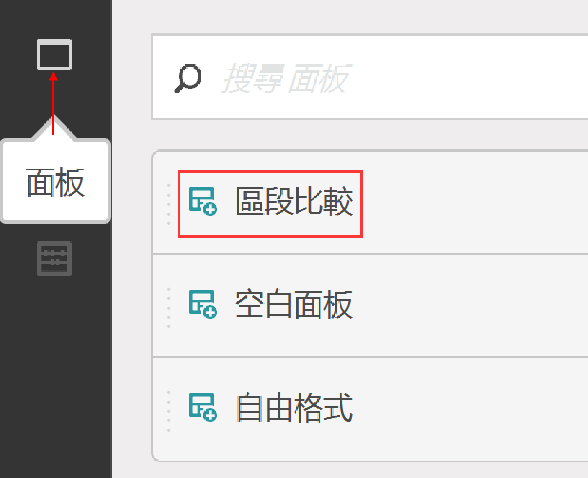
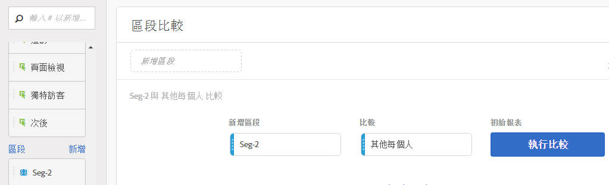
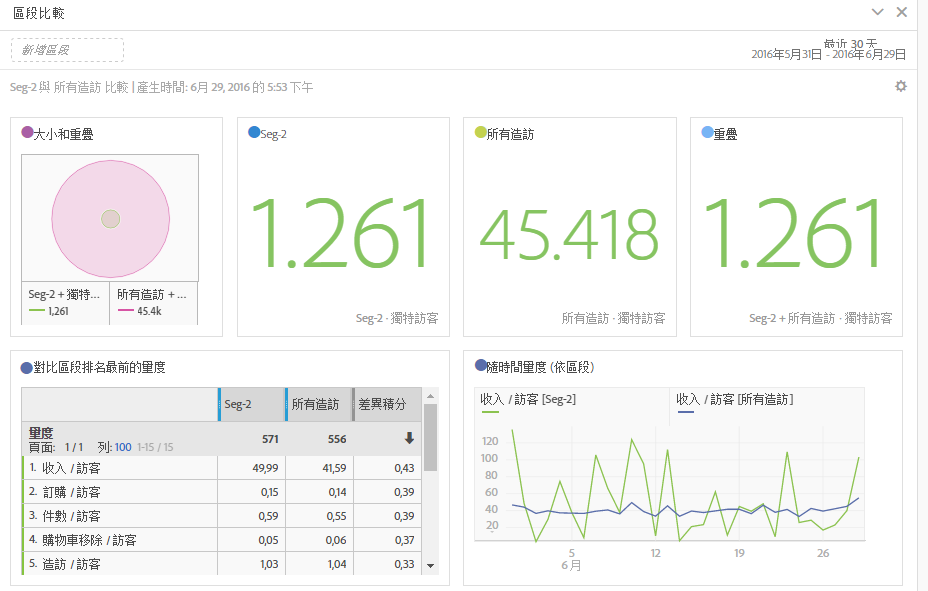
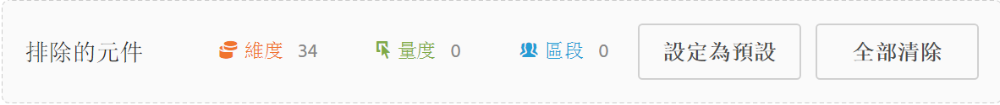

# 比較區段

說明如何比較 Analysis Workspace 中的區段。

>[!NOTE]
>
>You can also compare segments within a [fallout analysis](../../../../analyze/analysis-workspace/visualizations/fallout/compare-segments-fallout.md#section_E0B761A69B1545908B52E05379277B56).

## Compare segments {#section_8F2BFC45131C49B4A2E08A063CD7A91F}

1. Navigate to **[!UICONTROL Analytics]** &gt; **[!UICONTROL Workspace]** and open a project.

1. 從「**[!UICONTROL 面板]**」左側邊界上的欄，選擇「**區段比較]」並將其拖曳至新的或現有的專案中。[!UICONTROL **

   

1. 請確定比較日期範圍已正確設定。
1. 請選取區段進行比較並將它們拖曳至面板內。例如，假設您有一個「超級顧客」區段。

   

   在您將區段拖曳至面板後，Analytics 會自動建立「**[!UICONTROL 其他每個人]」區段，當中包含「不」在您所選區段中的每個人 - 在這個案例中，則為所有「非超級顧客」。**&#x200B;這可讓您省下建立此區段的工作。「其他每個人」會自動新增至「**[!UICONTROL 比較]」欄位中的面板。**&#x200B;您可以隨意將它刪除，並將「超級顧客」與您所選的任何其他區段進行比較。

   

1. 按一下「**[!UICONTROL 顯示進階選項]」從區段比較分析中排除元件 (維度、量度或區段)。**&#x200B;如需詳細資訊，請參閱[從「比較」排除元件](../../../../analyze/analysis-workspace/c-panels/c-segment-comparison/compare-segments.md#section_5E98FFA0744140C08D83700E3F025937)。

1. After you've selected the right "Compare Against" segment, click **[!UICONTROL Build]**.

   此動作會啟動後端處理，遍查每個維度、量度及其他區段，並尋找 個區段之間的統計差異。在工具的最頂端，我們會顯示進度長條，指出我們完成掃描重要差異的每個量度及維度之前所剩餘的時間。此外，我們會優先讓您最常使用的維度、量度和區段先執行，以便盡快為您提供最相關的結果。

   一旦後端處理完成掃描後，您會注意到幾個新的視覺效果:

   

   

1. 解譯「區段比較」的結果，方法為檢閱[新的視覺效果、表格及摘要](../../../../analyze/analysis-workspace/c-panels/c-segment-comparison/segment-comparison.md#concept_74FAC1C6D0204F9190A110B0D9005793)。

## Exclude components from comparison {#section_5E98FFA0744140C08D83700E3F025937}

有時候，您可能希望透過區段比較來排除某些維度、量度或區段。例如，假設您想要比較美國行動裝置使用者區段與德國行動裝置使用者區段。此時，包含所有與地理位置相關的維度就毫無意義，因為這兩個區段之間存在顯著的地理位置差異。因此您可以排除這些維度。方法如下:

1. 在您將想要比較的區段拖曳至面板中以後，按一下&#x200B;**[!UICONTROL 「顯示進階選項」]以排除您的區段比較分析中的元件 (維度、量度或區段)。**

   

1. 將您想要排除的元件拖放至&#x200B;**[!UICONTROL 「排除的元件」]面板中的任意位置。**(您可以將此視為要排除元件的「黑名單」。)您可以將這些元件設為預設值，或者&#x200B;**[!UICONTROL 「全部清除」]以從頭來過。**

   

1. 按一下&#x200B;**[!UICONTROL 「設定為預設」]**&#x200B;以從&#x200B;**所有**&#x200B;區段比較中排除這些元件。

1. 若您需要修訂排除的元件的清單，可以在元件 (例如，「維度」) 上連按兩下，排除的維度的清單隨即顯示:

   

1. Just delete any unwanted dimensions by clicking the x next to them, then save the list by clicking **[!UICONTROL Set as Default]**.

