# 區段比較面板概述 {#segment-comparison-overview}

<!-- markdownlint-disable MD034 -->

>[!CONTEXTUALHELP]
>id="workspace_segmentcomparison_button"
>title="區段比較"
>abstract="快速比較所有資料點的兩個區段，以自動找到相關的差異。"

<!-- markdownlint-enable MD034 -->

<!-- markdownlint-disable MD034 -->

>[!CONTEXTUALHELP]
>id="workspace_segmentcomparison_panel"
>title="區段比較面板"
>abstract="快速比較所有資料點的兩個區段，以自動找到相關的差異。  **引數&#x200B;** **新增區段**：您要分析的第一個區段。 **比較對象**：您要比較的第二個區段。 這會自動填入&#x200B;*其他所有人*，這與您的第一個區段相反。 如有需要，您可以使用不同的區段來取代。 **進階設定**：在區段比較中排除要分析的元件的功能。"
<!-- markdownlint-enable MD034 -->

>[!BEGINSHADEBOX]

*本文會在&#x200B;**Adobe Analytics**中記錄區段比較面板。 **Customer Journey Analytics**中沒有對應的面板。*

>[!ENDSHADEBOX]

「區段比較」面板是[「區段 IQ」](../../segment-iq.md)中的工具，可從不限數量的區段中找出統計數據上最顯著的差異。此功能會針對您存取的所有維度和量度進行反覆自動分析。它會從提升公司 KPI 的客群細分群體當中找出關鍵特性，讓您查看任何細分群體重疊的程度。

+++ 以下是有關區段比較的影片：

>[!VIDEO](https://video.tv.adobe.com/v/23976/?quality=12)

+++

## 使用

若要使用&#x200B;**[!UICONTROL 歸因]**&#x200B;面板：

1. 建立&#x200B;**[!UICONTROL 歸因]**&#x200B;面板。 有關如何建立面板的資訊，請參閱[建立面板](../panels.md#create-a-panel)。

1. 指定面板的[輸入](#panel-input)。

1. 觀察面板的[輸出](#panel-output)。

### 面板輸入

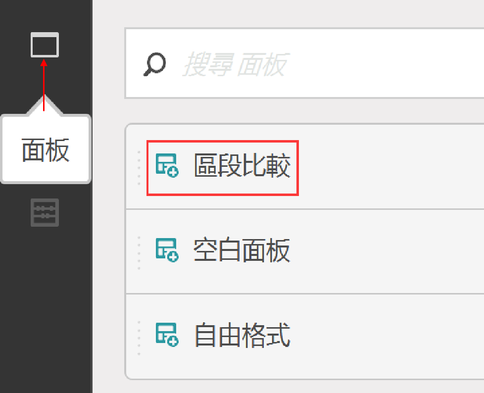

1. 請選取區段進行比較並將它們拖曳至面板內。

   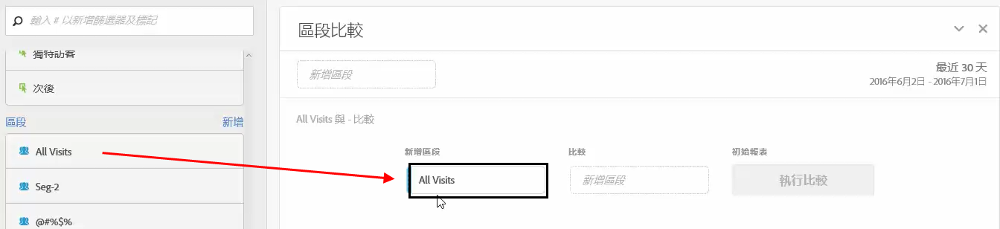

   在您將區段拖曳至面板後，Analytics 會自動建立[!UICONTROL 「其他所有人」]區段，當中包含「不」在您所選區段中的每個人。此為比較面板中常用的區段，但您可以任意將之移除，並選取不同區段用於比較。

   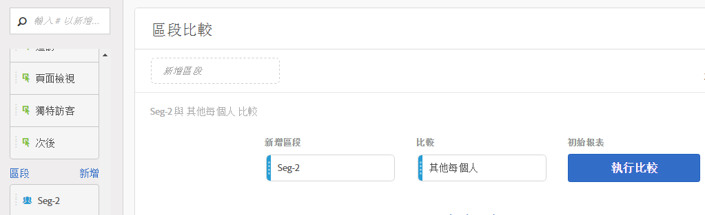

1. 決定好要比較的兩個區段後，按一下[!UICONTROL 「建立」]。

   此動作會啟動後端處理程序，找出兩個所選區段與所有維度、量度和其他區段之間的統計差異。面板上方的進度列會指出系統還需要多少時間分析每個量度和維度。最常使用的量度、維度和區段會優先執行，方便您及時查看最關心的結果。

## 排除「比較」中的元件

有時候，您會想在區段比較中排除某些維度、量度或區段。舉例來說，如果您想比較「美國的手機用戶」和「德國的手機用戶」區段，則納入地理相關維度是沒有意義的，因為區段本身已指出這些差異。

1. 在將兩個所需區段加入面板後，按一下[!UICONTROL 「顯示進階選項」]。
1. 將您想要排除的元件拖放至[!UICONTROL 「排除的元件」]面板。

   

按一下[!UICONTROL 「設為預設值」] 即可在所有日後的區段比較中自動排除目前選擇的元件。如果要編輯排除的元件，請按一下「元件類型」，然後按一下元件旁的「X」，將該元件重新納入分析。按一下「全部清除」則會將所有元件重新納入區段比較中。

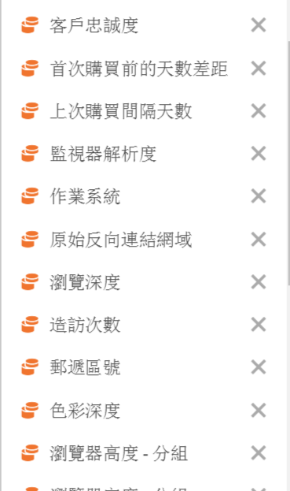

### 面板輸出

Adobe 分析完所需的兩個區段後，會透過數個視覺效果顯示結果：

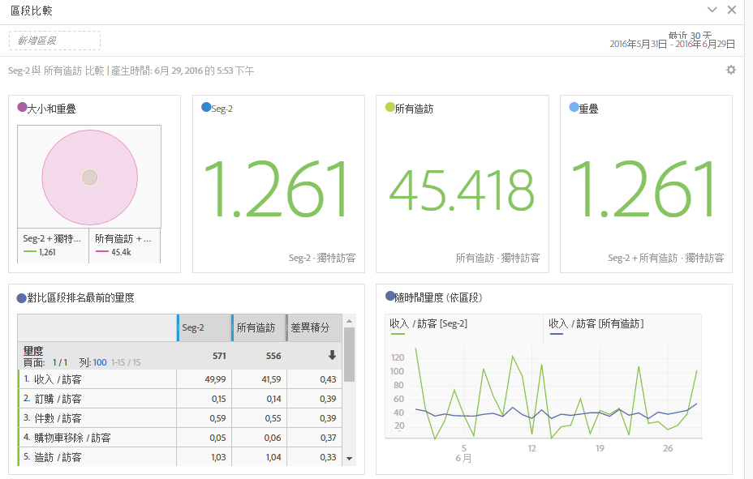

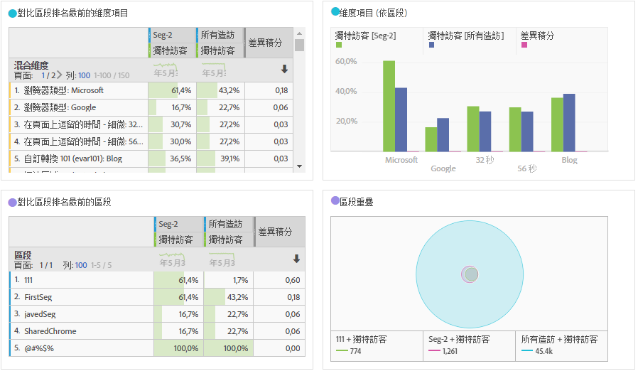

#### 大小和重疊

透過文氏圖表呈現每個所選區段的相對大小，以及彼此重疊的程度。您可以在視覺效果上暫留以查看每個重疊或非重疊區段中的訪客數。您也可在重疊上按一下滑鼠右鍵來建立全新區段以供進一步分析。如果兩個區段互斥，兩個圓圈不會彼此重疊 (通常使用點擊容器的區段會有此現象)。

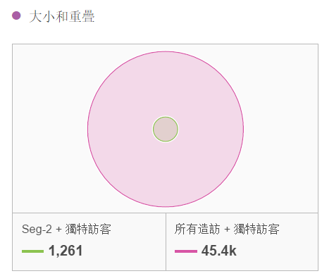

#### 人口摘要

「大小和重疊」視覺效果的右側會顯示每個區段和重疊中的不重複訪客總數。

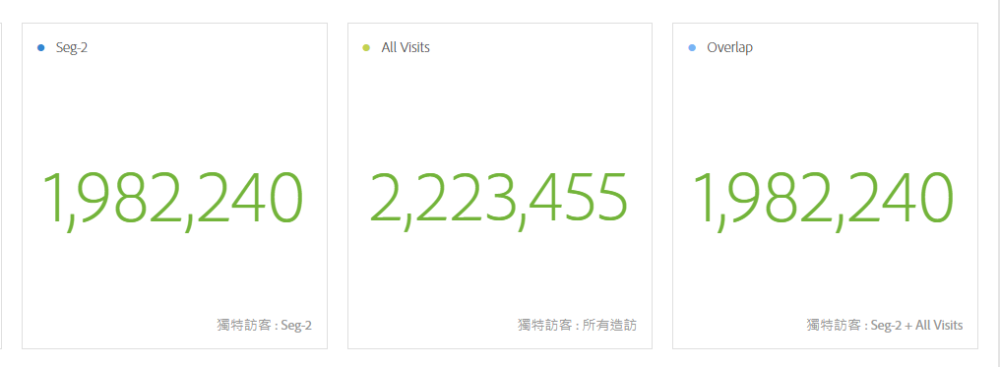

#### 排名在前的量度

顯示兩個區段之間最具統計顯著性的量度。此表格中的每一列代表一個差異量度，依其在每個區段之間的差異程度排名。差異積分為 1 表示該量度具有統計顯著性，積分為 0 則表示沒有顯著性。

這項視覺效果類似 Analysis Workspace 中的自由表格。如果需要對特定量度進行更深入的分析，請將滑鼠指標暫留在該條列項目上，然後按一下「建立視覺效果」。系統隨即會建立新表格以分析該特定量度。如果量度與您的分析無關，您可以將滑鼠指標暫留在該條列項目，按一下「X」加以移除。

>[!NOTE]
>
>區段比較完成後才加到此表格的量度不會收到差異積分。

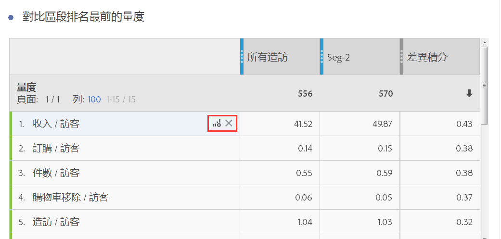

#### 一段時間後的量度 (依區段)

量度表格右側是連結的視覺效果。再按一下表格左側的條列項目，此視覺效果就會更新，顯示一段時間後量度的變化趨勢。

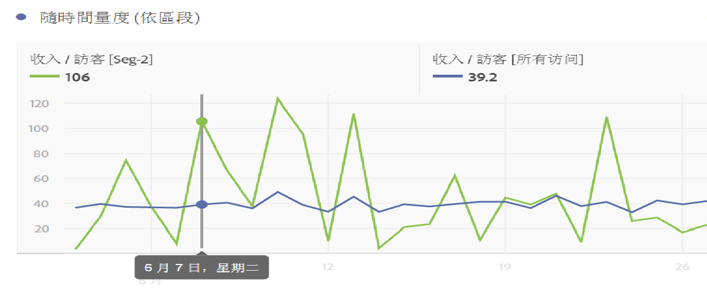

#### 排名在前的維度

顯示所有維度中最具統計顯著性的維度項目。每一列會顯示展示此維度項目的每個區段的百分比。例如，此表格可能會顯示「區段 A」中 100% 的訪客採用「瀏覽器類型：Google」維度項目，而「區段 B」只有 19.6% 的採用此維度項目。差異積分為 1 表示該量度具有統計顯著性，積分為 0 則表示沒有顯著性。

這項視覺效果類似 Analysis Workspace 中的自由表格。如果需要對特定維度項目進行更深入的分析，請將滑鼠指標暫留在該條列項目上，然後按一下「建立視覺效果」。系統隨即會建立新表格以分析該特定維度項目。如果維度項目與您的分析無關，您可以將滑鼠指標暫留在該條列項目，按一下「X」加以移除。

>[!NOTE]
>
>區段比較完成後才加到此表格的維度項目不會收到「差異積分」。

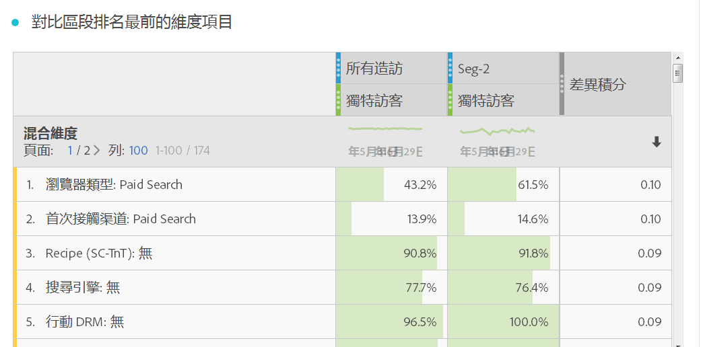

#### 維度項目 (依區段)

維度表格右側是已連結的長條圖視覺效果。表格會呈現長條圖中所有已顯示的維度項目。按一下表格左側的條列項目，就會更新右側的視覺效果。

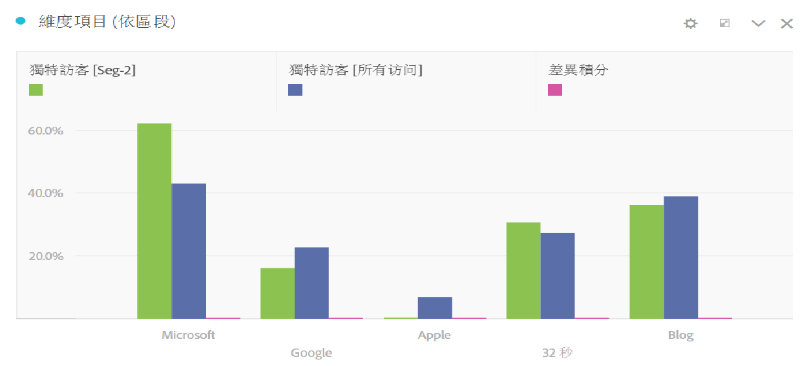

#### 排名在前的區段

顯示哪些其他區段 (用於比較的兩個所選區段以外的區段) 具有統計上的顯著重疊。舉例來說，此表格可能會顯示第三個區段「重複訪客」與「區段 A」高度重疊，但與「區段 B」不重疊。差異積分為 1 表示該量度具有統計顯著性，積分為 0 則表示沒有顯著性。

這項視覺效果類似 Analysis Workspace 中的自由表格。如果需要對特定區段進行更深入的分析，請將滑鼠指標暫留在該條列項目上，然後按一下「建立視覺效果」。系統隨即會建立新表格以分析該特定區段。如果區段與您的分析無關，您可以將滑鼠指標暫留在該條列項目，按一下「X」加以移除。

>[!NOTE]
>
> 區段比較完成後才加到此表格的區段不會收到差異積分。

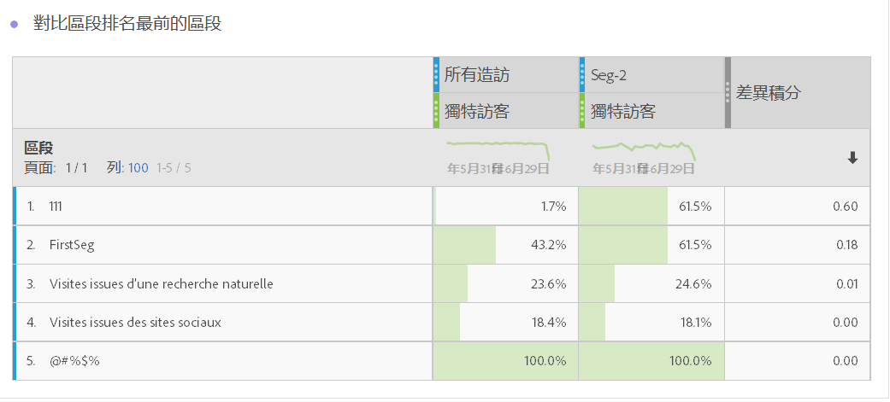

#### 區段重疊

區段表格右側是已連結的文氏圖表視覺效果。它會顯示套用在比較區段上最具統計顯著性的區段。例如，「區段 A」+「具統計顯著性的區段」與「區段 B」+「具統計顯著性的區段」。按一下表格左側的區段條列項目，就會更新右側的文氏圖表。

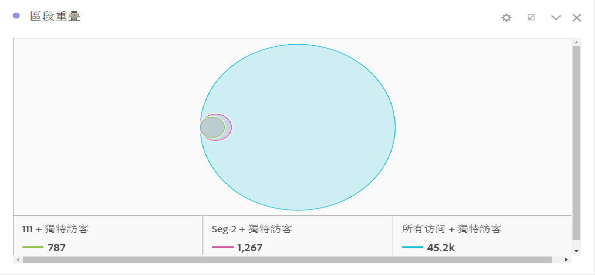
