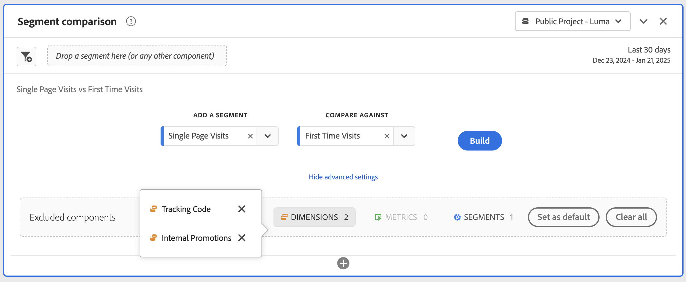

# 區段比較面板概觀 {#segment-comparison-overview}

<!-- markdownlint-disable MD034 -->

>[!CONTEXTUALHELP]
>id="workspace_segmentcomparison_button"
>title="區段比較"
>abstract="快速比較所有資料點的兩個區段，以自動找到相關的差異。"

<!-- markdownlint-enable MD034 -->

<!-- markdownlint-disable MD034 -->

>[!CONTEXTUALHELP]
>id="workspace_segmentcomparison_panel"
>title="區段比較面板"
>abstract="快速比較所有資料點的兩個區段，以自動找到相關的差異。  **引數&#x200B;** **新增區段**：您要分析的第一個區段。 **比較**：您要比較的第二個區段，此區段會自動填入&#x200B;*其他所有人* （與第一個區段相反）。 如有需要，您可以使用不同的區段取代&#x200B;*其他所有人*。 **進階設定**：在區段比較中排除元件被分析的能力。"
<!-- markdownlint-enable MD034 -->

>[!BEGINSHADEBOX]

_本文記錄_ _**Adobe Analytics** 中的區段比較面板。 _**Customer Journey Analytics**_ _中無等效面板_。_

>[!ENDSHADEBOX]

「區段比較」面板可從不限數量的區段中找出統計資料上最顯著的差異。 此功能會針對您存取的所有維度和量度進行反覆自動分析。比較會自動找出帶動公司KPI的受眾區段關鍵特性，讓您檢視區段重疊的程度。

>[!BEGINSHADEBOX]

請參閱  [區段比較](https://video.tv.adobe.com/v/23976?quality=12&learn=on){target="_blank"}的示範影片。

>[!ENDSHADEBOX]

## 使用

若要使用&#x200B;**[!UICONTROL 歸因]**&#x200B;面板：

1. 建立&#x200B;**[!UICONTROL 歸因]**&#x200B;面板。有關如何建立面板的資訊，請參閱[建立面板](../panels.md#create-a-panel)。

1. 指定面板的[輸入](#panel-input)。

1. 觀察面板的[輸出](#panel-output)。

### 面板輸入

您可以使用下列輸入設定來設定[!UICONTROL 區段比較]面板。

| 輸入 | 說明 |
| --- | --- |
| **[!UICONTROL 新增區段]** | 選取您要比較的維度。 |
| **[!UICONTROL 比較對象]** | 選取您要用來比較初始選取區段的維度。 如果您未選取特定區段，則此預設區段為&#x200B;**[!UICONTROL 其他所有人]**&#x200B;使用。 |
| **[!UICONTROL 顯示/隱藏進階設定]** | 請選取「**[!UICONTROL 顯示進階設定]**」以設定&#x200B;**[!UICONTROL 排除的元件]**；選取「**[!UICONTROL 隱藏進階設定]**」以隱藏&#x200B;**[!UICONTROL 排除的元件]**。 |
| **[!UICONTROL 排除的元件]** | 您可以指定的元件，例如&#x200B;**[!UICONTROL 維度]**、**[!UICONTROL 量度]**&#x200B;或&#x200B;**[!UICONTROL 區段]**&#x200B;以供排除。 <ul><li>將一個或多個維度、量度或區段從容器拖曳至&#x200B;**[!UICONTROL 排除的元件]**&#x200B;容器中。</li><li>若要移除元件，請選取類型 (**[!UICONTROL 維度]**、**[!UICONTROL 量度]**&#x200B;或&#x200B;**[!UICONTROL 區段]**)，並選取「」以移除元件。若要移除所有元件，請選取「**[!UICONTROL 清除全部]**」。</li><li>若要將目前維度、量度和區段的選取項目設定為預設值，請選取「**[!UICONTROL 設定為預設值]**」。</li></ul> |

請選取「**[!UICONTROL 「建置]**」以建置面板。

### 面板輸出

Adobe Analytics分析完所需的兩個區段後，輸出面板會透過數個視覺效果顯示結果：

| 視覺效果 | 說明 |
|---|---|
| **[!UICONTROL 大小和重疊]** | 使用[文氏圖表](/help/analyze/analysis-workspace/visualizations/venn.md)視覺效果說明每個選取區段的相對大小，以及彼此重疊的程度。 |
| **[!UICONTROL 第一區段的不重複訪客]** | 顯示第一個區段不重複訪客的[摘要數字](/help/analyze/analysis-workspace/visualizations/summary-number-change.md)視覺效果（在單頁造訪範例中） |
| **[!UICONTROL 第二區段的不重複訪客]** | 顯示第二個區段（在「首次造訪」範例中）不重複訪客的[摘要數字](/help/analyze/analysis-workspace/visualizations/summary-number-change.md)視覺效果 |
| 針對區段&#x200B;**[!UICONTROL 排名在前的量度]** | [自由格式表格](/help/analyze/analysis-workspace/visualizations/freeform-table/freeform-table.md)顯示選取區段的熱門量度。 |
| **[!UICONTROL 一段時間後的量度 (根據區段)]** | [折線圖](/help/analyze/analysis-workspace/visualizations/line.md)視覺效果顯示選取區段特定期間的量度。 |
| **[!UICONTROL 對比區段的熱門維度項目]** | [自由格式表格](/help/analyze/analysis-workspace/visualizations/freeform-table/freeform-table.md) 顯示選取區段的混合維度項目。 |
| **[!UICONTROL 維度項目 (根據區段)]** | [橫條圖](/help/analyze/analysis-workspace/visualizations/horizontal-bar.md)視覺效果根據區段顯示維度項目。 |
| **[!UICONTROL 對比區段的熱門區段]** | [自由格式表格](/help/analyze/analysis-workspace/visualizations/freeform-table/freeform-table.md) 顯示對比區段的熱門區段。 |
| **[!UICONTROL 區段重疊]** | [文氏圖表](/help/analyze/analysis-workspace/visualizations/venn.md)視覺效果顯示區段重疊。 |

使用「」以重新設定並重建面板。

<!--
#### Size and overlap

Illustrates the comparative sizes of each selected segment and how much they overlap with each other using a venn diagram. You can hover over the visual to see how many visitors were in each overlapping or non-overlapping section. You can also right click on the overlap to create a brand new segment for further analysis. If the two segments are mutually exclusive, no overlap is shown between the two circles (typically seen with segments using a hit container).

#### Population summaries

To the right of the Size and Overlap visualization, the total unique visitor count in each segment and overlap is shown.

#### Top metrics

Displays the most statistically significant metrics between the two segments. Each row in this table represents a differentiating metric, ranked by how different it is between each segment. A difference score of 1 means it is statistically significant, while a difference score of 0 means there is no statistical significance.

This visualization is similar to freeform tables in Analysis Workspace. If deeper analysis on a specific metric is desired, hover over a line item and click 'Create visual'. A new table is created to analyze that specific metric. If a metric is irrelevant to your analysis, hover over the line item and click the 'X' to remove it.

>[!NOTE]
>
>Metrics added to this table after the segment comparison has finished do not receive a Difference Score.

#### Metric over time by segment

To the right of the metrics table is a linked visualization. You can click a line item in the table on the left, and this visualization updates to show that metric trended over time.

#### Top dimensions

Shows the most statistically significant dimension items across all of your dimensions. Each row shows the percentage of each segment exhibiting this dimension item. For example, this table might reveal that 100% of visitors in 'Segment A' had the dimension item 'Browser Type: Google', whereas only 19.6% of 'Segment B' had this dimension item. A difference score of 1 means it is statistically significant, while a difference score of 0 means there is no statistical significance.

This visualization is similar to freeform tables in Analysis Workspace. If deeper analysis on a specific dimension item is desired, hover over a line item and click 'Create visual'. A new table is created to analyze that specific dimension item. If a dimension item is irrelevant to your analysis, hover over the line item and click the 'X' to remove it.

>[!NOTE]
>
>Dimension items added to this table after the segment comparison has finished do not receive a Difference Score.

#### Dimension items by segment

To the right of the dimensions table is a linked bar chart visualization. It shows all displayed dimension items in a bar chart. Clicking a line item in the table on the left updates the visualization on the right.

#### Top segments

Shows which other segments (other than the two segments selected for comparison) have statistically significant overlap. For example, this table can show that a third segment, 'Repeat Visitors', overlaps highly with 'Segment A' but does not overlap with 'Segment B'. A difference score of 1 means it is statistically significant, while a difference score of 0 means there is no statistical significance.

This visualization is similar to freeform tables in Analysis Workspace. If deeper analysis on a specific segment is desired, hover over a line item and click 'Create visual'. A new table is created to analyze that specific segment. If a segment is irrelevant to your analysis, hover over the line item and click the 'X' to remove it.

>[!NOTE]
>
>Segments added to this table after the segment comparison has finished do not receive a Difference Score.

#### Segment overlap

To the right of the segments table is a linked venn diagram visualization. It shows the most statistically significant segment applied to your compared segments. For example, 'Segment A' + 'Statistically significant segment' vs. 'Segment B' + 'Statistically significant segment'. Clicking a segment line item in the table on the left updates the venn diagram on the right.

-->
