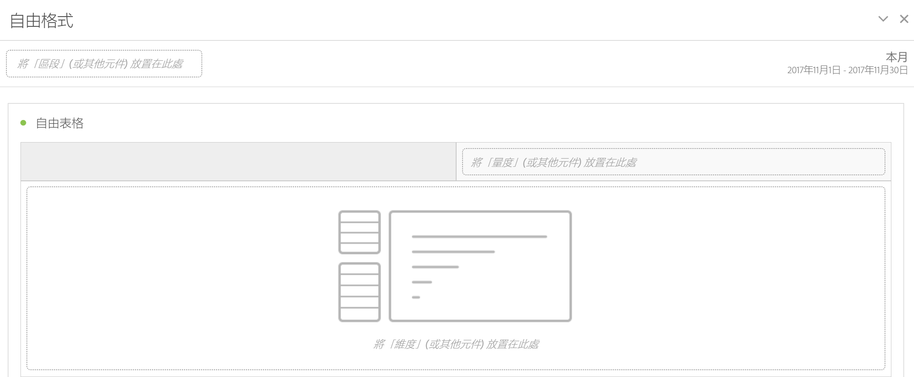

# 自由面板

>[!BEGINSHADEBOX]

_本文記錄_ _&#x200B;**Adobe Analytics** 中的自由格式面板。_ _請參閱[自由格式面板](https://experienceleague.adobe.com/zh-hant/docs/analytics/analyze/analysis-workspace/panels/freeform-panel)，以取得本文的_  _&#x200B;**Customer Journey Analytics** 版本。_

>[!ENDSHADEBOX]

在預設啟動狀態中，**[!UICONTROL 自由格式面板]**&#x200B;為使用[自由格式表格](/help/analyze/analysis-workspace/visualizations/freeform-table/freeform-table.md) 視覺效果的空白面板。

## 使用

若要使用&#x200B;**[!UICONTROL 自由格式面板]**：

1. 建立一個&#x200B;**[!UICONTROL 自由格式面板]**。有關如何建立面板的資訊，請參閱[建立面板](panels.md#create-a-panel)。

   

1. 請參閱 [Analytics 元件指南](/help/components/home.md)，以了解如何新增元件至自由格式面板和[自由格式表格](/help/analyze/analysis-workspace/visualizations/freeform-table/freeform-table.md)視覺效果。

>[!MORELIKETHIS]
>
>[建立面板](/help/analyze/analysis-workspace/c-panels/panels.md#create-a-panel)
>&#x200B;>[Analytics 元件指南](/help/components/home.md)
>&#x200B;>[自由格式表格視覺效果](/help/analyze/analysis-workspace/visualizations/freeform-table/freeform-table.md)
>
