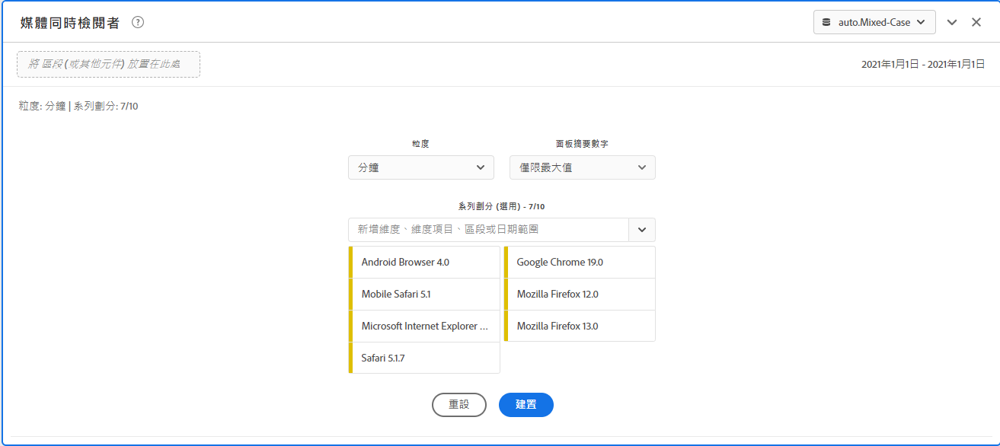
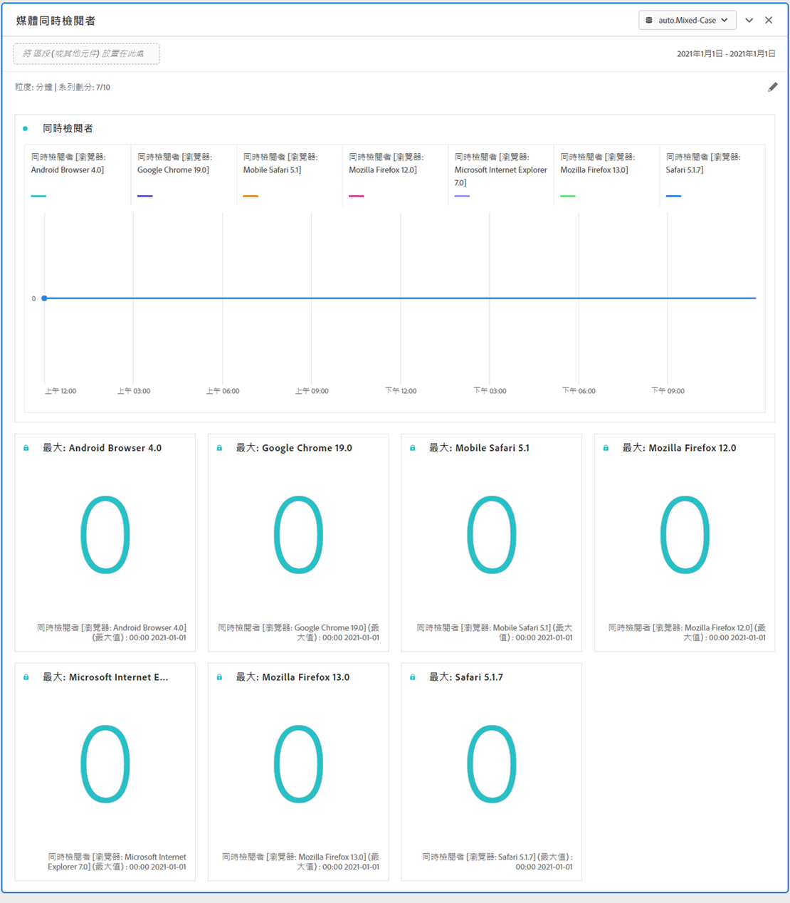
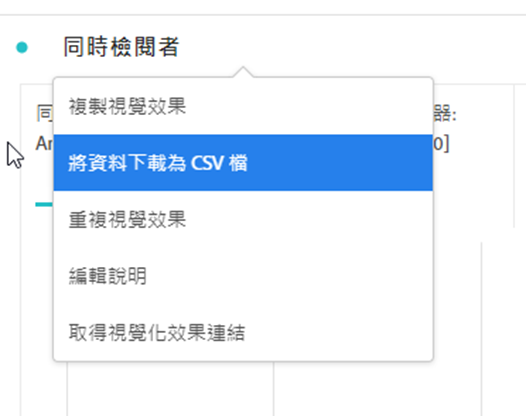
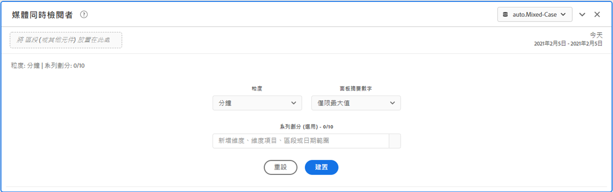

# 媒體同時檢閱者面板 {#media-concurrent-viewers-panel}

<!-- markdownlint-disable MD034 -->

>[!CONTEXTUALHELP]
>id="workspace_mediaconcurrentviewers_button"
>title="媒體同時檢視者"
>abstract="建立一個面板來分析特定內容或特定時段內的每分鐘平均對象數。"

<!-- markdownlint-enable MD034 -->

<!-- markdownlint-disable MD034 -->

>[!CONTEXTUALHELP]
>id="workspace_mediaconcurrentviewers_panel"
>title="媒體同時檢視者"
>abstract="分析一段時間內的同時檢閱者、查看尖峰同時觀看人數或進行劃分和比較。  **詳細程度**：選取要查看同時檢閱者的時段。 **面板摘要數字**： 顯示摘要數字以及每行日期或時間詳細資料的選項。最大值將顯示尖峰同時觀看人數的詳細資料。最小值將顯示低谷期的詳細資料。 **序列劃分 (可選)**：按區段、維度、維度項目或日期範圍劃分視覺效果。一次最多可檢視 10 行。劃分限於單一層級。"

<!-- markdownlint-enable MD034 -->

>[!BEGINSHADEBOX]

_本文記錄_ _**Adobe Analytics Analytics** 中的媒體同時檢視者面板。_ _請參閱[媒體同時檢視者面板](https://experienceleague.adobe.com/zh-hant/docs/analytics/analyze/analysis-workspace/panels/media-concurrent-viewers)，以取得本文的_  _**Customer Journey Analytics** 版本。_

>[!ENDSHADEBOX]

>[!NOTE]
>
>「媒體平均每分鐘觀眾數」面板僅適用於已購買適用於串流媒體的Adobe Analytics附加元件的客戶。
>
>請聯絡您的 Adobe 銷售代表或 Adobe 帳戶團隊以取得更多資訊。
>

**[!UICONTROL 媒體同時檢視者]**&#x200B;面板可啟用特定期間進行的同時檢視者分析，並提供尖峰同時檢視的詳細資訊，以及具備劃分和比較的能力。

您可以分析同時觀看人數，以了解發生尖峰期同時觀看人數或客戶流失的時間，以針對內容品質和檢視者參與度提供重要解析。並有助於疑難排解或完成數量和規模的相關規劃。

在 Analysis Workspace 中，同時檢視者量度為在特定時間點檢視您媒體串流的不重複人員數量，而不計工作階段數量。

>[!BEGINSHADEBOX]

請參閱  [媒體同時檢視者面板](https://video.tv.adobe.com/v/330177?quality=12&learn=on){target="_blank"}的示範影片。

>[!ENDSHADEBOX]

## 使用

若要使用&#x200B;**[!UICONTROL 媒體同時檢視者]**&#x200B;面板。

1. 建立&#x200B;**[!UICONTROL 媒體同時檢視者]**&#x200B;面板。有關如何建立面板的資訊，請參閱[建立面板](panels.md#create-a-panel)。

1. 確保您為面板選取資料檢視，該面板具有從Adobe Analytics for Streaming Media附加元件設定的元件。

1. 指定面板的[輸入](#panel-input)。

1. 觀察面板的[輸出](#panel-output)。

### 面板輸入

您可以使用下列輸入設定來設定媒體同時檢視者面板：

| 設定 | 說明 |
|---|---|
| **[!UICONTROL 面板日期範圍]** | 面板的日期範圍預設為「今天」。您可編輯為一次檢視一天或多個月。   此視覺效果僅限 1440 列資料 (例如以分鐘為最小單位測量 24 小時)。如果日期範圍和詳細程度組合結果超過 1440 行，則詳細程度會自動更新以符合完整的日期範圍。 |
| **[!UICONTROL 詳細程度]** | 詳細程度的預設為「分鐘」。 此視覺效果僅限 1440 列資料 (例如以分鐘為最小單位測量 24 小時)。如果日期範圍和詳細程度組合結果超過 1440 行，則詳細程度會自動更新以符合完整的日期範圍。 |
| **[!UICONTROL 面板摘要數字]** | 若要查看同時檢閱者的日期或時間詳細資訊，可使用累加數。「最大值」是顯示尖峰同時檢閱的詳細資訊。**[!UICONTROL 最小值]**&#x200B;會顯示低谷期的詳細資訊。面板預設僅會顯示「最大值」，但您可變更為顯示「最小值」或「最大值和最小值」兩者。  如果您使用劃分功能，每項會顯示累加數。 |
| **[!UICONTROL 序列劃分]** | 您可視需要將視覺效果根據篩選器、維度、維度項目或日期範圍劃分。 您一次最多可檢視 10 行。劃分限於單一層級。 拖曳維度時，系統將根據選取面板日期範圍自動選取最熱門的維度項目。 若要比較日期範圍，請將 2 個或多個日期範圍拖曳至序列劃分篩選器。 |

以下為&#x200B;**[!UICONTROL 僅包含最大值]**&#x200B;摘要數字的「**[!UICONTROL 分鐘]**」詳細程度的面板設定範例。並根據&#x200B;**[!UICONTROL 其他]**、**[!UICONTROL 表格]**、**[!UICONTROL 行動電話]**、**[!UICONTROL 遊戲主機]**、**[!UICONTROL 媒體播放器]**、**[!UICONTROL 電視盒]**、**[!UICONTROL 電視]**&#x200B;進行劃分。

### 面板輸出

「媒體同時檢閱者」面板會傳回一個線圖和累加數，以含有最大和/或最小同時檢閱者的詳細資訊。面板頂端會提供一個摘要行，為您提示您所選取的面板設定。

隨時可選取「」，以編輯和重建面板。

如果您已選取序列劃分、折線圖上的一條線，則會顯示每項摘要數字：

### 資料來源

此面板中使用的唯一量度為&#x200B;**[!UICONTROL 同時檢視者]**：

| 量度 | 說明 |
|---|---|
| **[!UICONTROL 同時檢視者]** | 在特定時間點檢視您媒體串流的不重複人員數量，而不計工作階段數量。 |

本檢視中不提供自由表格。若要檢視資料來源，您可以從折線圖視覺效果內容選單下載資料來源，然後選取「**[!UICONTROL 將資料下載為 CSV]**」。會包括序列劃分。

## 常見問題

| 問題 | 回答 |
|---|---|
| 自由表格在哪裡？我如何可看到資料來源？ | 本檢視中無法使用自由表格。您可以從折線圖內容選單下載資料來源，然後選取「**[!UICONTROL 將資料下載為 CSV]**」。 |
| 我的詳細程度為何會變更？ | 此視覺效果僅限 1440 列資料 (例如以分鐘為最小單位測量 24 小時)。如果日期範圍和詳細程度組合結果超過 1440 列，則詳細程度會自動更新以符合完整的日期範圍。  從較大的日期範圍變更至較小的日期範圍時，一旦日期範圍變更，詳細程度將更新至允許的最低詳細程度。若要查看更高的詳細程度，請編輯面板並重建。 |
| 我該如何比較影片名稱、篩選器、內容類型和其他內容？ | 若要在單一視覺效果中比較這些項目，可將篩選器、維度或特定維度項目拖曳至序列劃分篩選器內。  此檢視限於 10 項劃分。若要檢視超過 10 項，您必須使用多個面板。 |
| 我如何比較日期範圍？ | 若要比較單一視覺效果中的日期範圍，可拖動 2 個或多個日期範圍並使用序列劃分篩選器。此日期範圍將覆寫面板日期範圍。 |
| 如何改變視覺效果類型？ | 此面板僅允許進行時間序列的線圖視覺效果。 |
| 我是否可執行異常偵測？ | 否。 異常偵測不適用於此面板。 |
| 為什麼使用不重複人員而非使用中的工作階段？ | 使用不重複人員會移除顯示邊界 (工作階段同時結束和開始所在處) 不需要的「尖峰」。 |
| 讓同時檢閱者檢閱的詳細程度高於分鐘是什麼意思？ | 以大於一分鐘為詳細程度的單位時，同時檢閱者人數是指該時間範圍內所有分鐘數的不重複同時檢閱者的總和。例如，以一小時層級為詳細程度的同時檢視者，其人數是指這小時所有分鐘數的不重複同時檢視者之總和。 |
| Workspace 面板是否會顯示與「同時檢閱者報告」相同的資訊？ | 否。 在 Analysis Workspace 中，「同時檢視者」量度定義為在特定時間點檢視您媒體串流的不重複人員數量。而不計工作階段數量。  此量度與「報告」區段中使用「同時作用中工作階段」的「同時檢視者」報告不同。使用不重複人員可移除顯示邊界 (工作階段同時結束和開始所在處) 不需要的「尖峰」。 |

<!-- For more information about Media Concurrent Viewers, visit [MA doc page]( https://url). -->

>[!MORELIKETHIS]
>
>[建立面板](/help/analyze/analysis-workspace/c-panels/panels.md#create-a-panel)
>>[媒體播放時間面板](media-playback-time-spent.md)
>>[媒體平均分鐘觀眾數面板](average-minute-audience-panel.md)
>
<!--
# Media Concurrent Viewers panel

Customers who have purchased the Streaming Media Collection Add-on can analyze concurrent viewers to understand where peak concurrency occurred or where drop-offs happened to provide valuable insight into the quality of content and viewer engagement, and to help with troubleshooting or planning for volume or scale.

In Analysis Workspace, Concurrent Viewers is the number of unique visitors viewing your media stream(s) at a specific point in time, regardless of the number of sessions.

The Media Concurrent Viewers panel enables analysis of concurrent viewers over time, with details on peak concurrency and the ability to break down and compare.  To access the Media Concurrent Viewers panel, navigate to a report suite with streaming media components enabled. Then, click the panel icon on the far-left and drag the panel into your Analysis Workspace project.

Here is a video overview of this panel:

>[!VIDEO](https://video.tv.adobe.com/v/330177/?quality=12)

## Panel Inputs {#Input}

You can configure the Media Concurrent Viewers panel using these input settings:

|Setting|Description|
|---|---|
|Panel date range|The panel date range default is Today.  You may edit it to view a single day or many months at a time.    This visualization is limited to 1440 rows of data (for example, 24-hours at minute-level granularity).  If a date range and granularity combination results in more than 1440 rows, the granularity is automatically updated to accommodate the full date range.|
|Granularity|The granularity default is Minute.    This visualization is limited to 1440 rows of data (for example, 24-hours at minute-level granularity).  If a date range and granularity combination results in more than 1440 rows, the granularity is automatically updated to accommodate the full date range.|
|Panel summary numbers| To see date or time details for concurrent viewers, a summary number is available. The Maximum shows details for peak concurrency. The Minimum shows details for the trough.  The panel default shows Maximum only, but you can change it to show Minimum or both Maximum and Minimum.  If you are using breakdowns, a summary number is displayed for each.|
|Series breakdown| Optionally, you can break down your visualization by segments, dimensions, dimension items, or date ranges.   - You may view up to 10 lines at a time. Breakdowns are limited to a single level.  - When dragging a dimension, the top dimension items will be automatically selected based on the selected panel date range.  - To compare date ranges, drag 2 or more date ranges into the series breakdown filter.|

### Default view

### Series breakdown view

## Panel Output {#Output}

The Media Concurrent Viewers panel returns a line chart and summary numbers to include details for the maximum and/or minimum concurrent viewers.  At the top of the panel, a summary line is provided to remind you of the panel settings you selected.

At any time, you can edit and rebuild the panel by clicking the edit pencil on the top right.

If you selected series breakdown, a line on the line chart and a summary number is displayed for each:

### Data Source

The only metric that can be used in this panel is Concurrent Viewers:

|Metric|Description|
|---|---|
|Concurrent Viewers| Number of unique visitors viewing your media stream(s) at a specific point in time, regardless of the number of sessions.  This is different than Concurrent Viewer reporting in the Reports section, which uses Concurrent Active Sessions.  Using unique visitors accounts for removal of unwanted 'spikes' at show boundaries (where sessions are ending and starting at the same time).|

A Freeform table is not available in this view.  In order to view the data source, you may right-click on the line chart and download as a .csv file.  Series breakdowns will be included.

## FAQs {#FAQ}

|Question|Answer|
|---|---|
|Where is the Freeform table? How can I see the data source?| The Freeform table is not available in this view.  You can download the data source by right-clicking on the line chart and downloading the CSV file.|
|Why did my granularity change?|This visualization is limited to 1440 rows of data (for example, 24-hours at minute-level granularity).  If a date range and granularity combination results in more than 1440 rows, the granularity will be automatically updated to accommodate the full date range.  When changing from a larger date range to a smaller one, the granularity will be updated to the lowest detail allowable once the date range is changed. To view a higher granularity, edit the panel and rebuild.|
|How do I compare video names, segments, content types, etc?|To compare these in a single visualization, drag segments, dimensions, or specific dimension items in the series breakdown filter.  The view is limited to 10 breakdowns.  To view more than 10, you must use multiple panels.|
|How do I compare date ranges?|To compare date ranges in a single visualization, use the series breakdowns by dragging 2 or more date ranges.  These date ranges will override the panel date range.|
|How do I change the visualization type?|This panel only allows for the line visualization for the time series.|
|Can I run anomaly detection?|No.  Anomaly detection is not available for this panel.|
|Why use unique visitors instead of active sessions?|Using unique visitors enables removal of unwanted spikes at show boundaries (where sessions are ending and starting at the same time).|
|What does it mean to have concurrent viewers at higher granularity than minute?|With a granularity larger than a minute, concurrent viewers is the sum of unique concurrent viewers for all minutes within that time range.  For example, at hour-level granularity concurrent viewers is the sum of unique concurrent viewers for all minutes within the hour.|
|Does the workspace panel show the same information as the Concurrent Viewers Report?|No.  In Analysis Workspace, Concurrent viewers is defined as the number of unique visitors viewing your media stream at a specific point in time, regardless of the number of sessions.  This is different than Concurrent Viewer reporting in the Reports section, which uses Concurrent Active Sessions.  Using unique visitors accounts for removal of unwanted spikes at show boundaries—where sessions are ending and starting at the same time.|

-->
