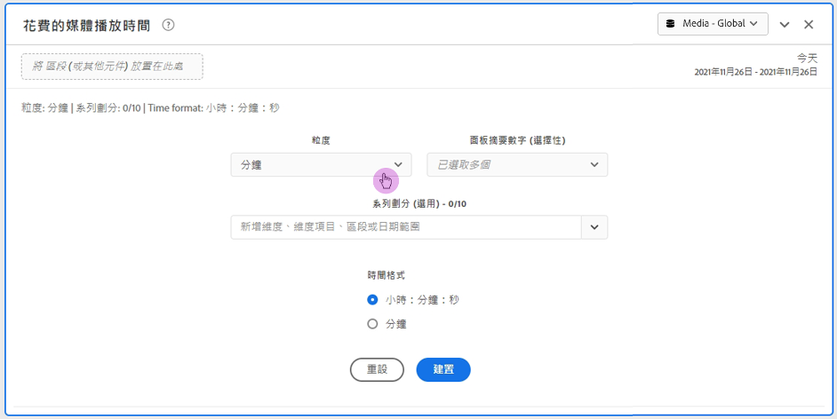
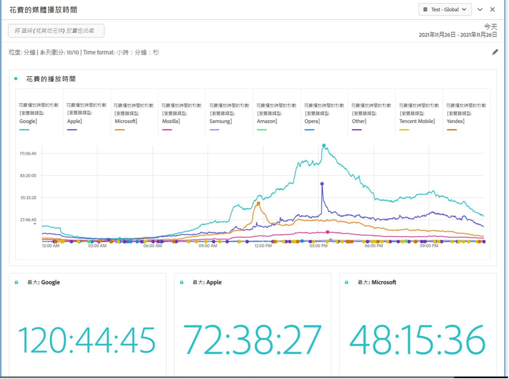

# 媒體播放時間面板 {#media-playback-time-spent-panel}

<!-- markdownlint-disable MD034 -->

>[!CONTEXTUALHELP]
>id="workspace_mediaplaybacktimespent_button"
>title="媒體播放時間"
>abstract="建立一個面板來分析一段時間內的視訊觀看量，包括各種詳細程度等級以及劃分和比較的功能。"

<!-- markdownlint-enable MD034 -->

<!-- markdownlint-disable MD034 -->

>[!CONTEXTUALHELP]
>id="workspace_mediaplaybacktimespent_panel"
>title="媒體播放時間"
>abstract="分析一段時間內的視訊觀看量，選取各種詳細程度，劃分和比較。  **詳細程度**：選取要查看同時檢閱者的時段。 **面板摘要數字 (可選)**：顯示摘要數字以及每行日期或時間詳細資料的選項。最大值將顯示尖峰播放時間的詳細資料。最小值將顯示低谷期的詳細資料。總和將顯示播放時間總計的詳細資料。 **序列劃分 (可選)**：按區段、維度、維度項目或日期範圍劃分視覺效果。一次最多可檢視 10 行。劃分限於單一層級。 **時間格式**：顯示視覺效果之時間格式的選項，以小時或分鐘為單位。"

<!-- markdownlint-enable MD034 -->

>[!BEGINSHADEBOX]

*本文記錄了&#x200B;**Adobe Analytics**中的「媒體播放時間」面板。 請參閱此文章的&#x200B;**Customer Journey Analytics**版本的[媒體播放時間面板](https://experienceleague.adobe.com/en/docs/analytics/analyze/analysis-workspace/panels/media-playback-time-spent)。*

>[!ENDSHADEBOX]

>[!NOTE]
>
>「媒體平均每分鐘觀眾數」面板僅適用於已購買Adobe Analytics適用的串流媒體收集附加元件的客戶。
>如需詳細資訊，請聯絡您的Adobe銷售代表或Adobe客戶團隊。
>

**[!UICONTROL 媒體播放時間]**&#x200B;面板可啟用一段時間的播放分析，提供尖峰同時觀看人數的詳細資訊，並可加以劃分及比較。

在Analysis Workspace中，「播放時間」是指在特定時間點觀看您的媒體串流所花費的時間。 其中包含暫停、緩衝和開始時間。

已購買串流媒體收集附加元件的客戶可分析所花費的播放時間，以獲得內容品質和檢視者參與度的寶貴見解。 以及在疑難排解或規劃數量或規模時提供協助。

播放時間可協助您瞭解：

* 尖峰同時觀看人數的發生位置。

* 下降發生在何處。

+++ 觀看此功能的示範影片。

>[!VIDEO](https://video.tv.adobe.com/v/338699)

+++

## 使用

若要使用&#x200B;**[!UICONTROL 媒體播放時間]**&#x200B;面板：

1. 建立&#x200B;**[!UICONTROL 媒體播放時間]**&#x200B;面板。 有關如何建立面板的資訊，請參閱[建立面板](panels.md#create-a-panel)。

1. 請確定您為面板選取資料檢視，該面板具有從串流媒體收集設定的元件。

1. 指定面板的[輸入](#panel-input)。

1. 觀察面板的[輸出](#panel-output)。

### 面板輸入

您可使用以下這些輸入設定來設定「媒體播放時間」面板。

| 設定 | 說明 |
|---|---|
| 面板日期範圍 | 面板的日期範圍預設為「今天」。您可將其編輯為一次檢視一天或多個月。 此視覺效果僅限 1440 列資料 (例如，以分鐘為最小單位測量 24 小時)。如果日期範圍和粒度組合結果超過 1440 行，則粒度會自動更新以符合完整的日期範圍。 |
| 粒度 | 粒度的預設為「分鐘」。 此視覺效果僅限 1440 列資料 (例如，以分鐘為最小單位測量 24 小時)。如果日期範圍和粒度組合結果超過 1440 行，則粒度會自動更新以符合完整的日期範圍。 |
| 面板摘要數字 | 若要查看播放時間的日期或時間詳細資訊，可使用摘要數字。「最大值」會顯示高峰期同時觀看人數的詳細資訊。「最小值」會顯示低谷期的詳細資訊。「總和」會加總選取範圍所花費的總播放時間。面板預設僅顯示「最大值」，但您可加以改變，以顯示「最小值」、「總和」或三者的任何組合。 如果您使用劃分功能，每項會顯示累加數。 |
| 序列劃分 | 您可視需要將視覺效果劃分為篩選器、維度、維度專案或日期範圍。
- 一次最多可檢視 10 行。劃分限於單一層級。

 — 拖曳維度時，系統會自動根據所選面板日期範圍選取最上層的維度專案。
- 若要比較日期範圍，請將 2 個或多個日期範圍拖放到序列劃分篩選器。 |
| 時間格式 | 您可以在`Hours:Minutes:Seconds` （預設）或`Minutes` （以整數顯示，四捨五入為0.5）中檢視播放時間。 |
| 日期序列顯示 | 如果您選擇至少兩個日期範圍篩選作為系列劃分，您將看到選取覆蓋（預設）或序列的選項。 覆蓋顯示具有常見x軸起點的線條，以便它們平行執行，而序列顯示具有特定x軸起點的線條。 如果資料排列整齊（例如，篩選器1在下午8:44結束，而篩選器2在下午8:45開始），則這些線條會依序顯示。 |

### 面板輸出

「媒體播放時間」面板會返回折線圖和摘要數字，以包括播放時間最大值、最小值和/或總和的詳細資訊。面板頂端會提供一個摘要行，為您提示您所選取的面板設定。

在任何時候，選取以編輯和重建面板。

如果您選取序列劃分，線圖上會顯示一條線，且每項會顯示累加數：

### 資料來源

此面板中能使用的唯一量度是「播放時間」。

| 量度 | 說明 |
|---|---|
| 播放時間 | 在選取的粒度期間檢視的內容總數`hours:minutes:seconds` （或`minutes`），包括暫停、緩衝和開始時間。 |

## 常見問題

| 問題 | 回答 |
|---|---|
| 自由表格在哪裡？我如何可看到資料來源？ | 

本檢視中無法使用自由表格。若要下載資料來源，請從折線圖中的快顯選單中選取下載CSV檔案的選項。
 |
| 
為什麼我的粒度改變了？
 | 
此視覺效果僅限 1440 列資料 (例如以分鐘為最小單位測量 24 小時)。如果日期範圍和粒度組合結果超過 1440 列，則粒度會自動更新以符合完整的日期範圍。

從較大的日期範圍變更為較小的日期範圍時，一旦日期範圍改變，詳細程度將更新為允許的最低詳細程度。 若要查看更高的粒度，請編輯面板並重建。
 |
| 

如何比較視訊名稱、篩選器、內容型別等？
 | 
若要在單一視覺效果中比較這些，請將篩選器、維度或特定維度專案拖曳至系列劃分篩選器中。

此檢視限於 10 項劃分。若要檢視超過 10 項，您必須使用多個面板。
 |
| 我如何比較日期範圍？ | 若要比較單一視覺效果中的日期範圍，可拖動 2 個或多個日期範圍以使用系列劃分。這些日期範圍會覆寫面板日期範圍。 |
| 如何改變視覺效果類型？ | 

此面板僅允許進行時間序列的線圖視覺效果。
 |
| 我是否可執行異常偵測？ | 

否。 異常偵測不適用於此面板。
 |

>[!MORELIKETHIS]
>
>[Create a panel](/help//analyze/analysis-workspace/c-panels/panels.md#create-a-panel)
>[媒體平均每分鐘觀眾數面板](average-minute-audience-panel.md)
>[媒體同時檢閱者面板](media-concurrent-viewers.md)
>

<!--
# Media Playback Time Spent panel

In Analysis Workspace, Playback Time Spent is the amount of time spent viewing your media streams at a specific point in time. It includes pause, buffer, and time to start.

The Media Playback Time Spent panel enables analysis of playback over time, with details on peak concurrency and the ability to break down and compare. 

Customers who have purchased the Streaming Media Collection Add-on can analyze playback time spent to gain valuable insight into the quality of content and viewer engagement, and to help when troubleshooting or planning for volume or scale.

Playback Time Spent can help you understand:

* Where peak concurrency occurred

* Where drop-offs occurred 

Following is a video overview of this panel:

>[!VIDEO](https://video.tv.adobe.com/v/338699)

## Use the Media Playback Time Spent panel

1. Go to a report suite with streaming media components enabled. 
1. Select the panel icon on the far-left, then drag the panel into your Analysis Workspace project.
1. Continue with the following sections to customize the Media Playback Time Spent panel

   * [Panel Inputs](#panel-inputs)
   * [Panel Output](#panel-output)

## Panel Inputs {#Input}

You can configure the Media Playback Time Spent panel using these input settings:

|Setting|Description|
|---|---|
|Panel date range|The panel date range default is Today. You may edit it to view a single day or many months at a time. This visualization is limited to 1440 rows of data (for example, 24-hours at minute-level granularity). If a date range and granularity combination results in more than 1440 rows, the granularity is automatically updated to accommodate the full date range.|
|Granularity|The granularity default is Minute. This visualization is limited to 1440 rows of data (for example, 24-hours at minute-level granularity). If a date range and granularity combination results in more than 1440 rows, the granularity is automatically updated to accommodate the full date range.|
|Panel summary numbers|To see date or time details for playback time spent, a summary number is available. The Maximum shows details for peak concurrency. The Minimum shows details for the trough. Sum adds up the total playback time spent for the selection. The panel default shows Maximum only, but you can change it to show Minimum, Sum, or any combination of the three. If you are using breakdowns, a summary number is displayed for each.|
|Series breakdown|Optionally, you can break down your visualization by segments, dimensions, dimension items, or date ranges.
- You may view up to 10 lines at a time. Breakdowns are limited to a single level.

- When dragging a dimension, the top dimension items will be automatically selected based on the selected panel date range.
- To compare date ranges, drag 2 or more date ranges into the series breakdown filter.|
|Time format|You can view the playback time spent in either `Hours:Minutes:Seconds` (default) or in `Minutes` (which is displayed in whole numbers, rounded up at .5). |
|Date sequence display|If you've placed at least two date range segments as series breakdowns you'll see the option to select either overlay (default) or sequential. Overlay will display the lines with a common x-axis start so that they run in parallel, while sequential will display the lines with their specific x-axis start. If the data lines up (for example, segment 1 ends at 8:44 pm and segment 2 starts at 8:45 pm), then the lines will show in sequence. |

## Default view

## Panel Output {#Output}

The Media Playback Time Spent panel returns a line chart and summary numbers to include details for the maximum, minimum, and/or sum of playback time spent. At the top of the panel, a summary line is provided to remind you of the panel settings you selected.

At any time, you can edit and rebuild the panel by clicking the edit pencil on the top right.

If you selected series breakdown, a line on the line chart and a summary number is displayed for each:

### Data Source

The only metric that can be used in this panel is Playback Time Spent.

|Metric|Description|
|---|---|
|Playback Time Spent|Total `hours:minutes:seconds` (or `minutes`) of content viewed during the selected granularity including pause, buffer, and time to start.|

## FAQs

|Question|Answer|
|---|---|
|Where is the Freeform table? How can I see the data source?|The Freeform table is not available in this view. You can download the data source by right-clicking on the line chart and downloading the CSV file.|
|Why did my granularity change?|This visualization is limited to 1440 rows of data (for example, 24-hours at minute-level granularity). If a date range and granularity combination results in more than 1440 rows, the granularity will be automatically updated to accommodate the full date range. 
When changing from a larger date range to a smaller one, the granularity will be updated to the lowest detail allowable once the date range is changed. To view a higher granularity, edit the panel and rebuild.
|
| How do I compare video names, segments, content types, etc?| To compare these in a single visualization, drag segments, dimensions, or specific dimension items in the series breakdown filter.The view is limited to 10 breakdowns. To view more than 10, you must use multiple panels.|
|How do I compare date ranges?|To compare date ranges in a single visualization, use the series breakdowns by dragging 2 or more date ranges. These date ranges will override the panel date range.|
|How do I change the visualization type?|This panel only allows for the line visualization for the time series.|
|Can I run anomaly detection?|No. Anomaly detection is not available for this panel.|

-->
