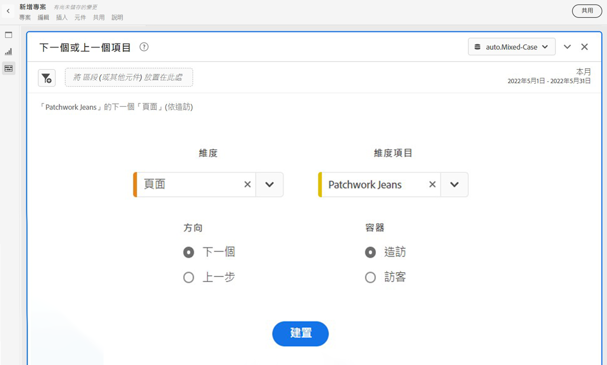
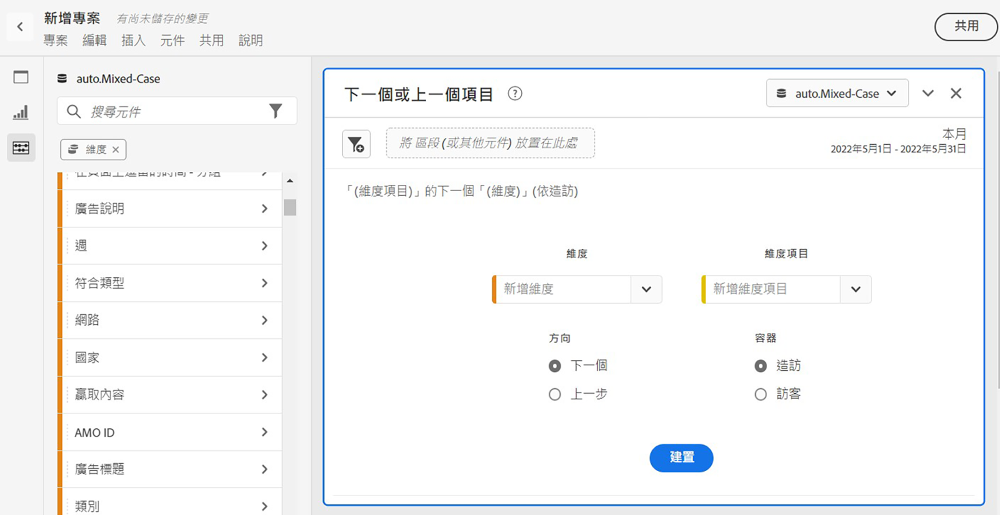
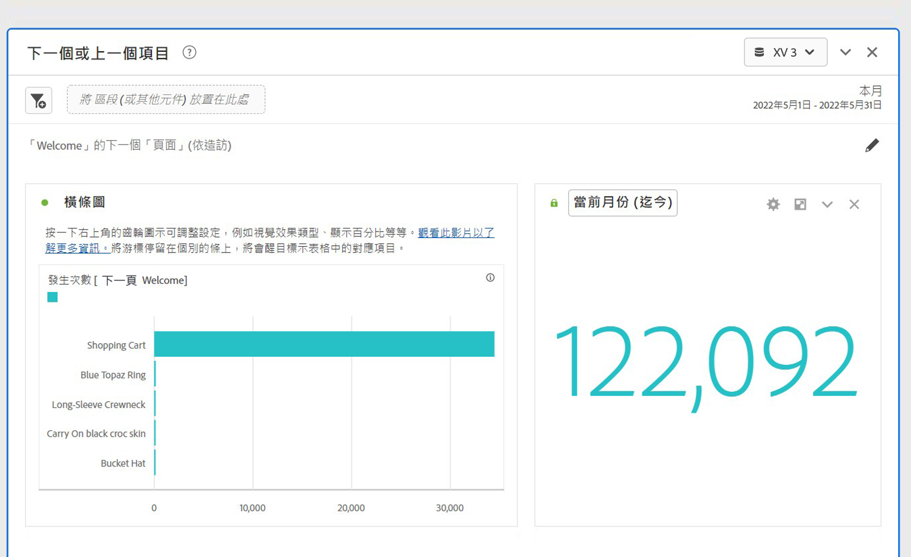
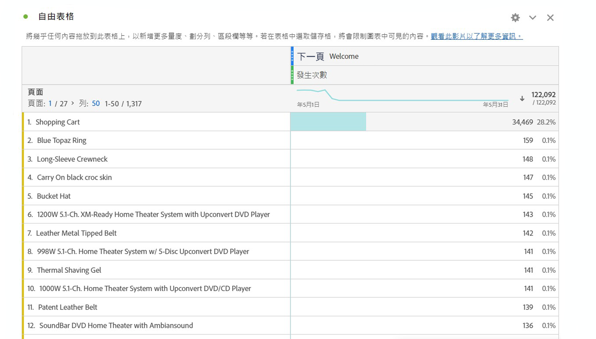

# 下一個或上一個項目面板 {#next-or-previous-item-panel}

>[!CONTEXTUALHELP]
>id="workspace_nextorpreviousitem_button"
>title="下一個或上一個項目"
>abstract="建立一個面板來了解人們來自的前一個維度或人們前往的下一個維度。"

>[!CONTEXTUALHELP]
>id="workspace_nextorpreviousitem_panel"
>title="下一個或上一個項目"
>abstract="分析訪客之前最常來自什麼地方或接下來最常造訪什麼地方。  **維度**：選取維度。例如，**頁面**。 **維度項目**：選取特定維度項目。例如，**首頁**。 **方向**：選取「**下一個**」可查看緊接在所選維度項目之後的維度項目。選取「**上一個**」以查看您所選維度項目之前的維度項目。 **容器**：選取「**工作階段**」以查看同一工作階段中的下一個/上一個維度項目，或選取「**人員**」查看同一個人的下一個/上一個維度項目。"

>[!BEGINSHADEBOX]

_本文記錄 _&#x200B;**Adobe Analytics**&#x200B;中的下一個或上一個專案面板_。_ _檢視此文章的[&#128279;](/help/analyze/analysis-workspace/c-panels/next-previous.md)CustomerJourneyAnalytics_ 版本的&#x200B;_&#x200B;**下一個或上一個專案面板**。_

>[!ENDSHADEBOX]

**[!UICONTROL 下一個或上一個項目]**&#x200B;面板包含許多表格和視覺效果，用於識別特定維度的下一個或上一個維度項目。例如，您可能想要探索客戶造訪首頁後最常造訪哪些頁面。

## 使用

若要使用&#x200B;**[!UICONTROL 下一個或上一個項目]**&#x200B;面板：

1. 請建立&#x200B;**[!UICONTROL 下一個或上一個項目]**&#x200B;面板：有關如何建立面板的資訊，請參閱[建立面板](panels.md#create-a-panel)。

1. 指定面板的[輸入](#panel-input)。

1. 觀察面板的[輸出](#panel-output)。

### 面板輸入

您可以使用這些輸入設定，來設定[!UICONTROL 下一個或上一個項目]：

| 輸入 | 說明 |
| --- | --- |
| **[!UICONTROL 維度]** | 請選取您想要探索下一個或上一個項目的維度。 |
| **[!UICONTROL 維度項目]** | 請選取下一個/上一個查詢中心的特定維度項目。 |
| **[!UICONTROL 方向]** | 請指定您尋找[!UICONTROL 下一個]或[!UICONTROL 上一個]維度項目。 |
| **[!UICONTROL 容器]** | 選取容器&#x200B;**[!UICONTROL 造訪]**&#x200B;或&#x200B;**[!UICONTROL 訪客]** （預設），以決定查詢的範圍。 |

{style="table-layout:auto"}

請選取「**[!UICONTROL 建置]**」以建置面板。

### 面板輸出

[!UICONTROL 下一個或上一個項目]面板會傳回一組豐富的資料和視覺效果，協助您更了解特定維度項目之後或之前的事件發生次數。

| 視覺效果 | 說明 |
| --- | --- |
| **[!UICONTROL 橫條圖]** | 根據您選取的維度項目列出下一個 (或上一個) 項目。將游標停留在個別的條上，將會醒目提示自由格式表格中的對應項目。 |
| **[!UICONTROL 摘要數字]** | 目前月份 (迄今為止) 所有下一個或上一個維度項目顯示發生次數的高階摘要數字。 |
| **[!UICONTROL 自由格式表格]** | 根據您選取的維度項目以表格格式列出下一個 (或上一個) 項目。例如，在前往首頁或工作區頁面之後 (或之前)，哪些是人員造訪最受歡迎的頁面 (根據發生次數)。 |

{style="table-layout:auto"}

>[!MORELIKETHIS]
>
>[建立面板](/help//analyze/analysis-workspace/c-panels/panels.md#create-a-panel)
>

<!--
# Next or previous item panel

This panel contains a number of tables and visualizations to easily identify the next or previous dimension item for a specific dimension. For example, you might want to explore which pages customers went to most often after they visited the Home page.

## Access the panel

You can access the panel from within [!UICONTROL Reports] or within [!UICONTROL Workspace].

| Access point | Description |
| --- | --- |
| [!UICONTROL Reports] | <ul><li>The panel is already dropped into a project.</li><li>The left rail is collapsed.</li><li>If you selected [!UICONTROL Next page], default settings have already been applied, such as [!UICONTROL Page] for [!UICONTROL Dimension], and the top page as the [!UICONTROL Dimension Item], [!UICONTROL Next] for [!UICONTROL Direction] and [!UICONTROL Visit] for [!UICONTROL Container]. You can modify all these settings.</li></ul>|
| Workspace | Create a new project and select the Panel icon in the left rail. Then drag the [!UICONTROL Next or previous item] panel above the Freeform table. Notice that the [!UICONTROL Dimension] and [!UICONTROL Dimension Item] fields are left blank. Select a dimension from the drop-down list. [!UICONTROL Dimension items] are populated based on the [!UICONTROL dimension] you chose. The top dimension item gets added, but you can select a different item. The defaults are Next and Visitor. Again, you can modify these as well.
 |

{style="table-layout:auto"}

## Panel Inputs {#Input}

You can configure the [!UICONTROL Next or previous item] panel panel using these input settings:

| Setting | Description |
| --- | --- |
| Segment (or other component) drop zone | You can drag and drop segments or other components to further filter your panel results. |
| Dimension | The dimension for which you want to explore next or previous items. |
| Dimension Item | The specific item at the center of your next/previous inquiry. |
| Direction | Specify whether you are looking for the [!UICONTROL Next] or the [!UICONTROL Previous] dimension item. |
| Container | [!UICONTROL Visit] or [!UICONTROL Visitor] (default) determine the scope of your inquiry. |

{style="table-layout:auto"}

Click **[!UICONTROL Build]** to build the panel.

## Panel output {#output}

The [!UICONTROL Next or previous item] panel returns a rich set of data and visualizations to help you better understand what occurrences follow or precede specific dimension items.

| Visualization | Description |
| --- | --- |
| Horizontal bar | Lists the next (or previous) items based on the dimension item you chose. Hovering over an individual bar highlights the corresponding item in the Freeform table. |
| Summary number | High-level summary number of all next or previous dimension item occurrences for the current month (so far.) |
| Freeform table | Lists the next (or previous) items based on the dimension item you chose, in a table format. For example, which were the most popular pages (by occurrences) that people went to after (or before) the home page or the workspace page. |

{style="table-layout:auto"}

-->