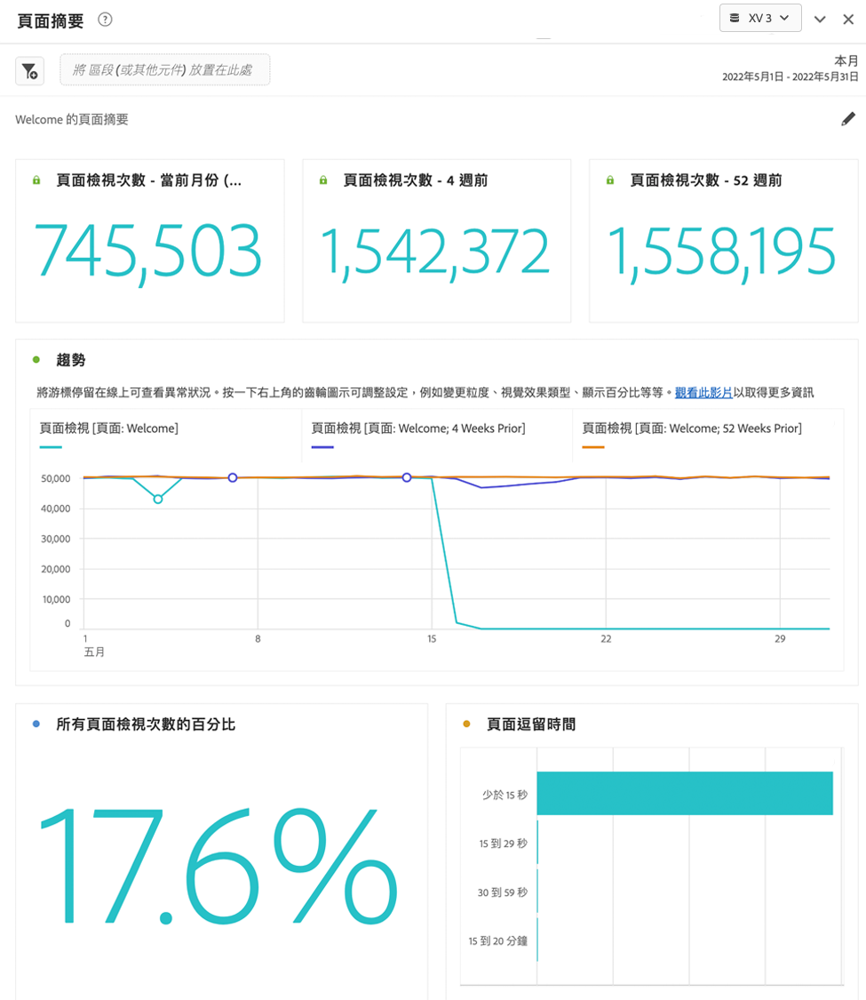
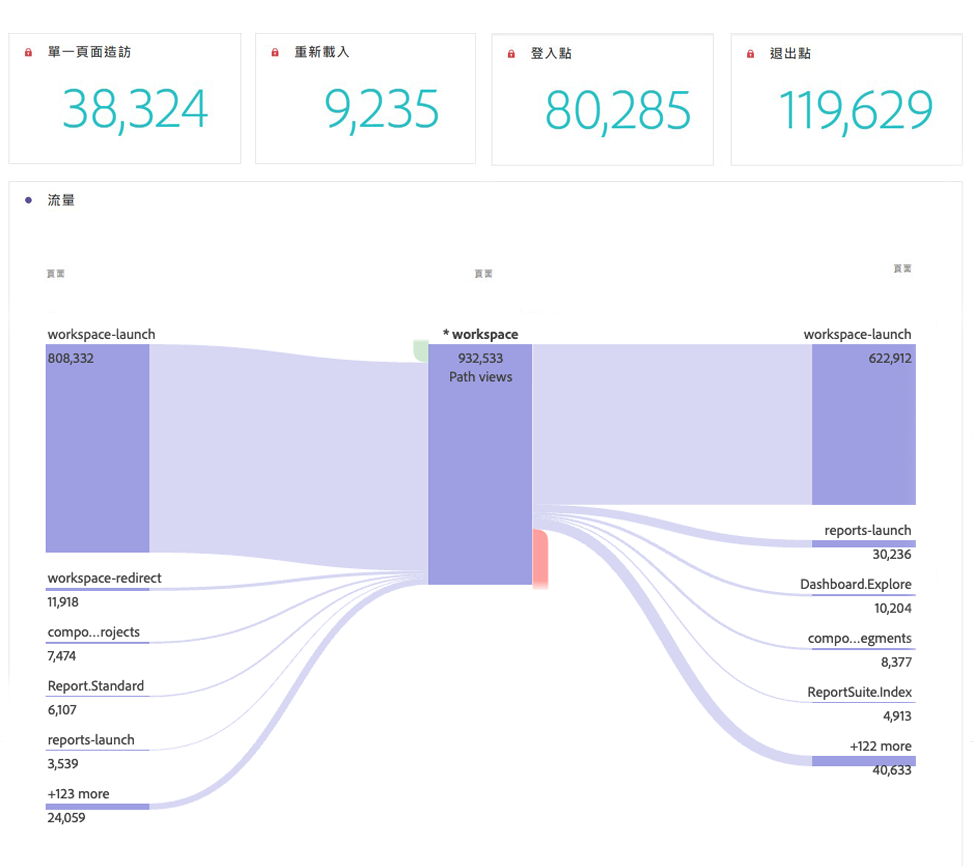

# 頁面摘要面板

此面板可讓您輕鬆探索有關特定頁面的關鍵統計資料。

## 存取面板

您可以從[!UICONTROL 報表]內或[!UICONTROL Workspace]記憶體取面板。

| 存取點 | 說明 |
| --- | --- |
| [!UICONTROL 報表] | <ul><li>該面板已放入專案中。</li><li>左側邊欄會摺疊。</li><li>僅支援頁面維度。</li><li>已套用預設設定，在此案例中，[!UICONTROL 頁面]維度的最常造訪的頁面。 您可以修改此設定。</li></ul> |
| Workspace | 建立新專案，並在左側欄中選取「面板」圖示。 將[!UICONTROL 頁面摘要]面板拖曳至自由表格上方。 請注意，頁面[!UICONTROL Dimension專案]欄位留空。 從下拉式清單中選取維度專案。 |

## 面板輸入 {#Input}

您可以使用這些輸入設定來設定[!UICONTROL 頁面摘要]面板：

| 設定 | 說明 |
| --- | --- |
| 區段（或其他元件）拖放區域 | 您可以拖放區段或其他元件以進一步篩選面板結果。 |
| 頁面維度專案 | 從下拉式清單中，選取您要探索其主要統計資料的頁面維度專案。 |

{style="table-layout:auto"}

按一下&#x200B;**[!UICONTROL 建置]**&#x200B;以建置面板。

## 面板輸出 {#output}

[!UICONTROL 頁面摘要]面板會傳回一組豐富的量度資料和視覺效果，協助您更清楚瞭解特定頁面的統計資料。

| 量度/視覺效果 | 說明 |
| --- | --- |
| [!UICONTROL 頁面檢視次數] — 目前為止 | 當月此頁面的頁面檢視次數。 |
| [!UICONTROL 頁面檢視次數] - 4週前 | 上個月此頁面的頁面檢視次數。 |
| [!UICONTROL 頁面檢視次數] - 52週前 | 去年此頁面的頁面檢視次數。 |
| [!UICONTROL 趨勢] | 本月、4週前和52週前的趨勢頁面檢檢視表。 |
| [!UICONTROL 所有頁面檢視的百分比] | 瀏覽此頁面之所有頁面檢視次數的百分比摘要數字。 |
| [!UICONTROL 頁面逗留時間] | 列示此頁面逗留時間的橫條圖。 |
| [!UICONTROL 單頁造訪次數] | 此摘要數字會列出此為唯一造訪頁面的頁面檢視次數。 |
| [!UICONTROL 重新載入] | [!UICONTROL 重新載入]量度會顯示重新載入期間維度專案出現的次數。 訪客重新整理瀏覽器是觸發重新載入的最常見方式。 |
| [!UICONTROL 登入點] | [!UICONTROL 登入點]量度會顯示指定的維度專案在造訪中被擷取為第一個值的次數。 |
| [!UICONTROL 退出點] | [!UICONTROL 退出]量度會顯示指定的維度專案在造訪中被擷取為最後一個值的次數。 |
| [!UICONTROL 流量] | 以所選頁面為焦點的流量圖。 您可以像在任何[流量圖](/help/analyze/analysis-workspace/visualizations/c-flow/create-flow.md)中一樣深入鑽研資料。 |

{style="table-layout:auto"}

