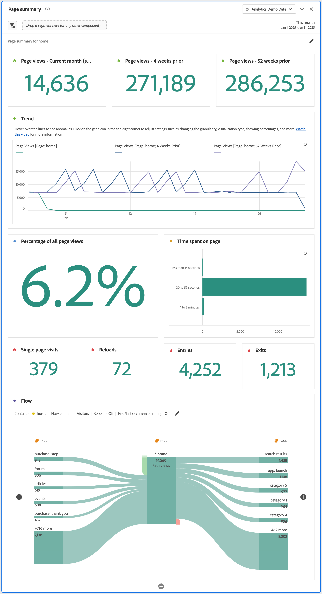

# 頁面摘要面板 {#page-summary}

<!-- markdownlint-disable MD034 -->

>[!CONTEXTUALHELP]
>id="workspace_pagesummary_button"
>title="頁面摘要"
>abstract="快速地檢視部分高層級的量度以及進出特定頁面的移動。"

<!-- markdownlint-enable MD034 -->

<!-- markdownlint-disable MD034 -->

>[!CONTEXTUALHELP]
>id="workspace_pagesummary_panel"
>title="頁面摘要面板"
>abstract="快速地檢視部分高層級的量度以及進出特定頁面的移動。  **參數&#x200B;** **新增頁面維度項目**：開啟元件邊欄，找到頁面維度，並且按一下胡蘿蔔圖示將其展開，查看維度項目。 然後，將您想要了解的特定頁面拖曳到產生器中。 拖放維度項目後，報表即會自動填入有關頁面的關鍵資訊。"

<!-- markdownlint-enable MD034 -->

>[!BEGINSHADEBOX]

_本文會在_  _**Adobe Analytics**&#x200B;中記錄頁面摘要面板。_ _在_  _**Customer Journey Analytics**._中沒有對應的面板

>[!ENDSHADEBOX]

**[!UICONTROL 頁面摘要]**&#x200B;面板可讓您探索特定頁面的關鍵統計資料。

## 使用

若要使用「**[!UICONTROL 頁面摘要]**」面板：

1. 建立「**[!UICONTROL 頁面摘要]**」面板： 有關如何建立面板的資訊，請參閱[建立面板](panels.md#create-a-panel)。

1. 指定面板的[輸入](#panel-input)。

1. 觀察面板的[輸出](#panel-output)。

您可以從「[!UICONTROL 報告]」或「[!UICONTROL Workspace]」內存取此面板。

| 存取點 | 說明 |
| --- | --- |
| [!UICONTROL 報告] | <ul><li>此面板已拖曳至專案中。</li><li>左側邊欄已摺疊。</li><li>僅支援「頁面」維度。</li><li>已套用預設設置，在此情況下，[!UICONTROL 頁面] 維度最熱門的造訪頁面。 您可以修改此設定。</li></ul> |
| Workspace | 建立新專案並選取左側邊欄的面板圖示。 將[!UICONTROL 頁面摘要]面板拖曳至自由格式表格上方。 請注意，此頁面[!UICONTROL 維度項目] 欄位留空。 從下拉式清單中選取維度項目。 |

### 面板輸入 {#panel-input}

您可以使用這些輸入設定，來設定[!UICONTROL 頁面摘要]面板。

| 輸入 | 說明 |
| --- | --- |
| **[!UICONTROL 頁面]** | 選取您要探索其關鍵統計資料的頁面的頁面維度。 例如&#x200B;**[!UICONTROL home]**，探索首頁的統計資料。 使用下拉式功能表選取頁面或開始輸入（例如`home`）以快速搜尋頁面。 |

{style="table-layout:auto"}

請選取「**[!UICONTROL 建置]**」以建置面板。

### 面板輸出 {#panel-output}

[!UICONTROL 頁面摘要]面板傳回一組豐富的亮度資料和視覺化效果，以協您更了解特定頁面的統計資料。

| 視覺效果 | 說明 |
| --- | --- |
| **[!UICONTROL 頁面檢視次數] - 目前月份 (迄今** | [摘要數字](/help/analyze/analysis-workspace/visualizations/summary-number-change.md)視覺效果顯示目前月份頁面的頁面檢視次數。 |
| **[!UICONTROL 頁面檢視次數] - 4 週前** | [摘要數字](/help/analyze/analysis-workspace/visualizations/summary-number-change.md)視覺效果顯示此頁面過去一個月的頁面檢視次數。 |
| **[!UICONTROL 頁面檢視次數] - 52 週前** | [摘要數字](/help/analyze/analysis-workspace/visualizations/summary-number-change.md)視覺效果顯示此頁面過去一年的頁面檢視次數。 |
| **[!UICONTROL 趨勢]** | 本月、4 週前及 52 週前的頁面檢視次數趨勢[線](/help/analyze/analysis-workspace/visualizations/line.md)視覺效果。 |
| **[!UICONTROL 所有頁面檢視次數的百分比]** | 造訪此頁面的所有頁面檢視次數的百分比摘要數字。 |
| **[!UICONTROL 頁面逗留時間]** | [橫條圖](/help/analyze/analysis-workspace/visualizations/horizontal-bar.md)視覺效果顯示在此頁面的逗留時間。 |
| **[!UICONTROL 單次頁面造訪數]** | [摘要數字](/help/analyze/analysis-workspace/visualizations/summary-number-change.md)顯示此頁面是唯一造訪的頁面之頁面檢視次數。 |
| **[!UICONTROL 重新載入]** | [摘要數字](/help/analyze/analysis-workspace/visualizations/summary-number-change.md)顯示重新載入期間維度項目出現的次數。 訪客重新整理瀏覽器是觸發重新載入的最常見方式。 |
| **[!UICONTROL 登入]** | [摘要數字](/help/analyze/analysis-workspace/visualizations/summary-number-change.md)顯示指定的維度項目在造訪中被擷取為第一個值的次數。 |
| **[!UICONTROL 退出]** | [摘要數字](/help/analyze/analysis-workspace/visualizations/summary-number-change.md)顯示指定的維度項目在造訪中被擷取為最後一個值的次數。 |
| **[!UICONTROL 流量]** | [流量](/help/analyze/analysis-workspace/visualizations/c-flow/flow.md) 視覺效果使用選取頁面作業焦點。 您可以僅如同在任何[流量](/help/analyze/analysis-workspace/visualizations/c-flow/create-flow.md)視覺效果一樣進一步深入了解資料。 |

{style="table-layout:auto"}

使用「」以重新設定並重建面板。
