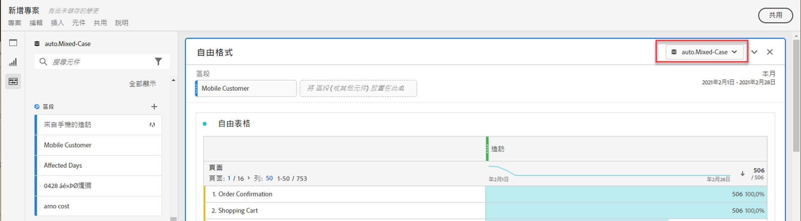
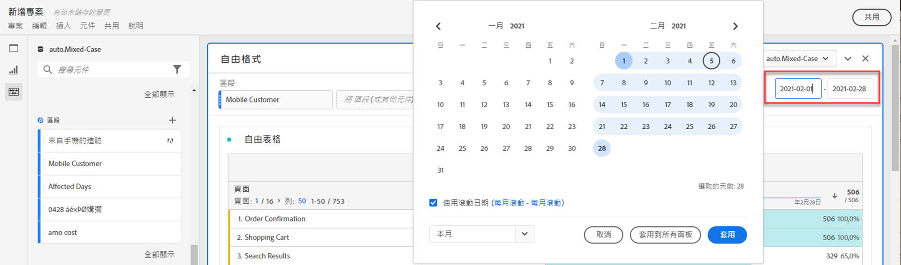
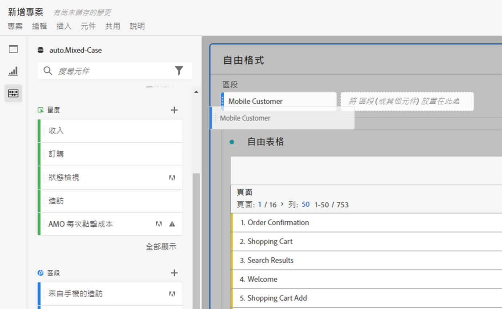
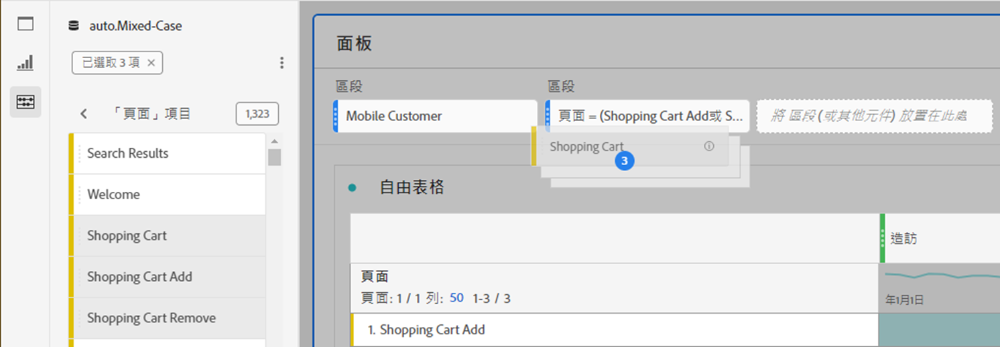
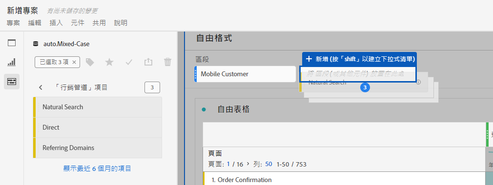
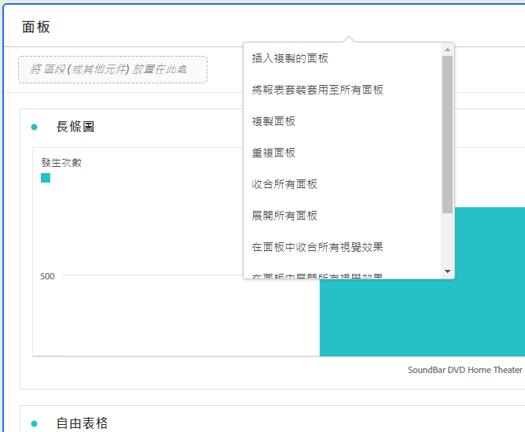
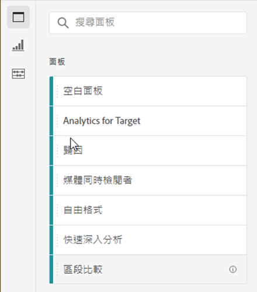
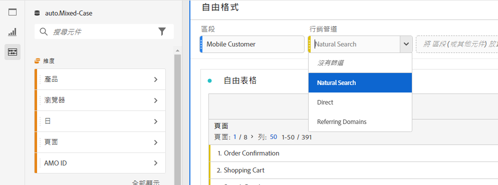

# 面板概觀

[!UICONTROL 面板]是表格與視覺效果的集合。您可以從 Workspace 左上角的圖示或[空白面板](/help/analyze/analysis-workspace/c-panels/blank-panel.md)來存取面板。當您想要根據時段、報表套裝或分析使用案例來組織專案時，面板會很有幫助。

## 面板類型

[!UICONTROL Adobe Analytics]的 Analysis Workspace 中提供以下面板類型：

| 面板名稱 | 說明 |
| --- | --- |
| [空白面板](/help/analyze/analysis-workspace/c-panels/blank-panel.md) | 從可用面板和視覺效果中選擇以開始分析。 |
| [歸因](attribution.md) | 使用任何維度和轉換量度，快速比較和視覺化任何數量的歸因模型。 |
| [Analytics for Target](a4t-panel.md) | 在 Analysis Workspace 中分析 Target 的活動和體驗。 |
| [自由格式](freeform-panel.md) | 執行無限制的比較和劃分，然後新增視覺效果以展現豐富的資料故事。 |
| [媒體平均分鐘觀眾數](average-minute-audience-panel.md) | 分析特定內容或自訂時段的平均每分鐘觀眾數。 |
| [媒體同時檢視者](media-concurrent-viewers.md) | 分析不同時段的同時檢視者，並取得尖峰同時檢視情形的詳細資訊，並可加以劃分及比較。 |
| [媒體播放時間](/help/analyze/analysis-workspace/c-panels/media-playback-time-spent.md) | 分析播放時間，以了解何時達到尖峰同時檢視人數或是檢視人數何時下降。 |
| [下一個或上一個項目](next-previous.md) | 顯示人們造訪的下一頁或上一頁。 |
| [快速深入分析](quickinsight.md) | 快速建置自由格式表格和伴隨的視覺效果，加快分析及揭露深入分析的速度。 |
| [頁面摘要](page-summary.md) | 探索有關特定頁面的關鍵統計資料。 |
| [區段比較](/help/analyze/analysis-workspace/c-panels/c-segment-comparison/segment-comparison.md) | 快速比較所有資料點的兩個區段，以自動找到相關差異。 |

[!UICONTROL 快速深入分析]、[!UICONTROL 空白]和[!UICONTROL 自由格式]面板是您開始分析的絕佳地方，而[!UICONTROL 歸因]則適合更進階的分析。位於版面底部，因此您可以隨時新增空白面板。

預設的開始面板為[!UICONTROL 自由格式]面板，但您可以將[空白面板](/help/analyze/analysis-workspace/c-panels/blank-panel.md)或[快速深入分析](/help/analyze/analysis-workspace/c-panels/quickinsight.md)設為預設面板。請參閱[專案和分析偏好設定](/help/analyze/analysis-workspace/user-preferences.md#projects--analyses-preferences)。

## 建立面板

若要建立面板：

* 將面板從&#x200B;**[!UICONTROL 面板]**&#x200B;左側面板拖曳至版面上。
* 從[空白面板](blank-panel.md)中選取一個面板。
* 使用 Workspace 中的&#x200B;**[!UICONTROL 插入]**&#x200B;選單並選取您的面板。或者，您可以使用任何[快速鍵](../build-workspace-project/fa-shortcut-keys.md)來插入面板。

  

您可以：

* 選取，在任何面板&#x200B;**當中**，以新增其他視覺效果。出現快顯視窗讓您選取視覺效果。

  

  | 選取… | 若要建立... |
  |---|---|
  |  | [自由格式表格](/help/analyze/analysis-workspace/visualizations/freeform-table/freeform-table.md) |
  |  | [折線圖](/help/analyze/analysis-workspace/visualizations/line.md) |
  |  | [條狀圖](/help//analyze/analysis-workspace/visualizations/bar.md) |
  |  | [摘要數字](/help/analyze/analysis-workspace/visualizations/summary-number-change.md) |
  |  | [文字](/help/analyze/analysis-workspace/visualizations/text.md) |
  |  | [流失](/help/analyze/analysis-workspace/visualizations/fallout/fallout-flow.md) |
  |  | [流程](/help/analyze/analysis-workspace/visualizations/c-flow/flow.md) |
  |  | [堆疊區域圖](/help/analyze/analysis-workspace/visualizations/area.md) |
  |  | [同類群組表格](/help/analyze/analysis-workspace/visualizations/cohort-table/t-cohort.md) |
  |  | [項目符號](/help/analyze/analysis-workspace/visualizations/bullet-graph.md) |
  |  | [環形圖](/help/analyze/analysis-workspace/visualizations/donut.md) |
  |  | [摘要變更](/help/analyze/analysis-workspace/visualizations/summary-number-change.md) |
  |  | [直方圖](/help/analyze/analysis-workspace/visualizations/histogram.md) |
  |  | [散佈圖](/help/analyze/analysis-workspace/visualizations/scatterplot.md) |
  |  | [文氏圖表](/help/analyze/analysis-workspace/visualizations/venn.md) |
  |  | [樹狀圖](/help/analyze/analysis-workspace/visualizations/treemap.md) |

* 選取，在工作區最後一個面板的&#x200B;**外面**，以新增另一個[空白面板](blank-panel.md)。

## 報告套裝

每個面板都與一個[報告套裝](/help/admin/admin/c-manage-report-suites/report-suites-admin.md)相關，由**[!UICONTROL *報告套裝名稱&#x200B;*]**&#x200B;識別 (在面板右上方的下拉式選單中)。

建立新面板時，預設報告套裝會根據您上次在 Analysis Workspace 專案中使用的面板報告套裝。

在專案中，您可以使用一或[多個報表套裝](https://experienceleague.adobe.com/docs/analytics/analyze/analysis-workspace/build-workspace-project/multiple-report-suites.html) (根據分析使用案例而定)。

報表套裝清單是依相關性來分類；Adobe 是根據目前使用者最近使用套裝情形和使用套裝頻率，以及組織內使用套裝頻率等來定義相關性。

>[!IMPORTANT]
>
>選取的報告套裝會決定哪些維度、量度和區段，可供面板建置視覺效果時使用。
>
>
>當您切換面板的報告套裝時，某些元件可能在新報告套裝中無法使用。此變更可能會導致您的視覺效果無法正確呈現。您可能會看到如下警告：
>
>* 此面板包含選取報告套裝中未啟用的元件。請變更報告套裝或在報告套裝中啟用所需的元件。
>* 無法呈現視覺效果：請檢查您的欄和列以確保它們包含有效元件。
>

## 行事曆

面板行事曆會控制面板內表格和視覺效果的報告日期範圍。

>[!NOTE]
>
>如果在視覺效果或面板中使用日期範圍元件 (例如，作為區段)，日期範圍元件會覆寫面板行事曆。
>

1. 首先選取開始日期，然後選取結束日期來選取日期範圍。或者，您可以從&#x200B;[!UICONTROL *選取預設集*]&#x200B;下拉式選單中選取&#x200B;**[!UICONTROL 預設集]**。

1. 或者，選取&#x200B;**[!UICONTROL 顯示進階設定]**&#x200B;以進行：

   * 指定&#x200B;**[!UICONTROL 開始時間]**&#x200B;和&#x200B;**[!UICONTROL 結束時間]** (預設值 `12:00 AM` (`0:00`) 和 `11:59 PM` (`23:59`) 除外)。結束時間始終會包含 59 秒。對於涵蓋很多天的日期範圍，則開始時間適用於日期範圍的第一天，而結束時間則適用於日期範圍的最後一天。使用 **[!UICONTROL (重設時間值)]** 將開始和結束時間重設為預設值。
   * **[!UICONTROL 使日期範圍元件與面板行事曆相對應]**。如果停用，面板中使用的日期範圍元件將與目前時間相對應。如果啟用，面板中使用的日期範圍元件將與面板行事曆相對應。
   * **[!UICONTROL 使用遞延日期]**。如果啟用，預設的日期範圍，例如&#x200B;**[!UICONTROL 前 7 個整天]**&#x200B;會隨著目前日期和時間的進展而動態更新。如果停用，此類預設集一旦套用就不會更新。

     

     您可以選取括號中的文字 (例如&#x200B;**[!UICONTROL 固定開始 - 每天遞延]**) 以延長面板並指定&#x200B;**[!UICONTROL 開始]**&#x200B;和&#x200B;**[!UICONTROL 結束]**&#x200B;的詳細資訊。

      1. 選取&#x200B;**[!UICONTROL 開始於]**、**[!UICONTROL 結束於]**，或&#x200B;**[!UICONTROL 固定日期]**。
      1. 當您已選取&#x200B;**[!UICONTROL 開始於]**&#x200B;或&#x200B;**[!UICONTROL 結束於]**，您可以建置完整的運算式。例如：**[!UICONTROL 結束於]**&#x200B;**[!UICONTROL 今年]**&#x200B;**[!UICONTROL 加上]**`1`**[!UICONTROL 天]**。為運算式的個別部分選擇適當的值。
         * 選取目前的值。例如&#x200B;**[!UICONTROL 今年]**。
         * 選取一個值進行其他計算。例如，**[!UICONTROL 加]**。
         * 當您指定其他計算時，請指定一個值。例如 `1`。
         * 當您已指定其他計算時，請選取用於計算的時段。例如&#x200B;**[!UICONTROL 天]**。

     選取&#x200B;**[!UICONTROL 隱藏詳細資訊]**&#x200B;以隱藏遞延日期計算的詳細資訊。

1. 選取&#x200B;**[!UICONTROL 套用]**&#x200B;將日期範圍套用至您呼叫行事曆的面板。選取&#x200B;**[!UICONTROL 套用至所有面板]**&#x200B;將日期範圍套用至 Workspace 專案中的所有面板。

## 下拉區域 {#dropzone}

面板放置區可讓您將區段和下拉式區段套用至面板內的所有表格和視覺效果。您可以將一或多個區段套用至面板。

### 區段

將任何區段從左側面板拖放至面板放置區，即可開始劃分面板。重複此程序，即可新增其他區段至面板。區段會並排顯示於面板頂部。

#### 快速區段

也可以直接將非區段元件拖曳至放置區以建立快速區段，節省前往「[區段產生器](/help/components/segmentation/segmentation-workflow/seg-build.md)」的時間和作業。以此方法建立的區段會自動被定義為事件層級的區段。透過選取區段名稱旁的「」，可以快速修改此定義。

<!-- For more information, see [Quick segments](/help/components/segmentation/). -->

### 下拉式區段

>[!BEGINSHADEBOX]

如需示範影片，請參閱 [下拉式區段](https://video.tv.adobe.com/v/23877?quality=12&learn=on){target="_blank"}。

>[!ENDSHADEBOX]

#### 靜態下拉式區段

靜態下拉式區段可讓您以有限方式與資料互動。例如，您可新增行動裝置類型的下拉式區段，以便於您可以將面板劃分為平板電腦、手機或桌面電腦等區段。

靜態下拉式區段也可用於將許多專案合而為一。例如，如果您的一個專案擁有套用不同國家區段的許多版本，您可以將所有版本整合為單一專案並新增一個國家/地區的下拉式區段。

##### 建立靜態下拉式區段

* 針對使用維度項目的下拉式區段，請在左側面板中選取單一維度，並在按住 ⇧ (*Shift*) 的同時將維度拖曳至面板放置區。此動作建立一個下拉式區段，內含與該維度相關的所有維度項目。

  或者，如果您希望下拉式區段僅包括與某個維度相關的特定維度項目，請選取左側面板中所需維度旁邊的右箭頭圖示。此動作會公開所有可用的維度項目。從這個清單中選取多個維度項目，使用 ⇧ +  (*Shift* + *選取*) 或 ^ +  (*control* + *選取*)，然後將它們拖曳至面板下拉區域，**同時按住** ⇧。

* 針對使用單一元件類型 (例如僅維度、僅篩選器或僅量度) 的下拉式區段，使用 ⇧+  或 ^ + ，在左側面板中選取多個相同類型的項目。然後&#x200B;**按住** ⇧ 的同時，將項目拖曳至面板放置區中。

  即可建立一個包含您選取元件的單一下拉式區段。

* 針對使用混合元件類型 (例如 2 個量度和 3 個區段) 的下拉式區段，使用 ⇧ +  或 ^ + 來選取多個元件。**在按住** ⇧ 的同時，將選取項目拖曳到面板放置區中。在此情況下，系統會將所有元件類型視為獨立的下拉式區段。例如，若您同時選取了量度和維度項目，則會建立兩個獨立的下拉式區段：一個包含維度項目，另一個包含量度。

下拉式區段提供以下內容選單選項：

* **[!UICONTROL 刪除下拉式選單]**：從面板中移除下拉式選單。
* **[!UICONTROL 刪除標籤]**：移除下拉式選單上方顯示的文字。若要修改標籤，停留在標籤上並選取「」。
* **[!UICONTROL 新增標籤]**：您對專案新增下拉式區段時，會有一個標籤自動設定為元件名稱。如果您刪除此標籤，即可使用此選項再次新增。
* **[!UICONTROL 必要選取項目]**：需在面板上設定區段。

##### 使用靜態下拉式區段

使用者可以透過下列任何方式，使用下拉式區段選單來劃分面板：

* 在下拉式區段中選取單一區段，將其套用至面板。

* 在下拉式區段中選取多個區段，將其套用至面板。區分此面板以包括所有已選取的區段。

#### 動態下拉式區段

動態下拉式區段可讓您根據面板報告範圍內的資料和其他下拉式區段中的值來決定可用值。例如，您可以使用「國家/地區」維度和「城市」維度建立兩個動態下拉式選單。您從&#x200B;**[!UICONTROL 國家/地區]**&#x200B;下拉式清單選取一個國家/地區時，**[!UICONTROL 城市]**&#x200B;下拉式清單會動態調整成僅顯示該國家/地區內的城市。

同樣的概念適用於所有維度；會顯示僅出現在面板日期範圍內和選取區段中的維度項目。在靜態下拉式區段中選取的維度項目，會影響動態下拉式區段中的可用值。然而，反之則不然；在動態下拉式區段中選取的維度項目，不會影響靜態下拉式區段中的可用值。

如果您預期將來會收集特定維度項目，可手動選取維度項目。您也可以清除動態下拉式區段，使其不包含值，從而允許其他動態下拉式區段包含更多值。請選取「**[!UICONTROL 全部重設]**」，可清除該面板所有下拉式篩選器中的選取項目。

若要建立動態下拉式區段：

* **同時按住** ⇧，將單一維度拖放到面板放置區中。

請注意動態下拉式區段不適用於量度、區段或日期範圍。

動態下拉式區段提供與靜態下拉式區段相同的內容選單選項。

## 內容選單

透過面板標題的內容選單 (按一下右鍵) 可使用面板的其他功能。

提供下列選項：

| 選項 | 說明 |
| --- | --- |
| **[!UICONTROL 插入複製的面板]** | 讓您將複製的面板貼到專案內另一個位置或不同的專案中。 |
| **[!UICONTROL 插入複製的視覺化呈現]** | 將複製的視覺效果貼上到面板、專案內另一個位置或不同的專案中。 |
| **[!UICONTROL 將報告套裝套用至所有面板]** | 將此面板的報告套裝套用至專案中的所有其他面板。 |
| **[!UICONTROL 複製面板]** | 複製面板以便將其插入專案內另一個位置或不同的專案中。 |
| **[!UICONTROL 重複面板]** | 複製目前的面板，您可以修改它。 |
| **[!UICONTROL 收摺所有面板]** | 收摺所有專案面板。 |
| **[!UICONTROL 展開所有面板]** | 展開所有專案面板。 |
| **[!UICONTROL 收摺面板中的所有視覺效果]** | 收摺目前面板中的所有視覺效果。 |
| **[!UICONTROL 展開面板中所有視覺效果]** | 展開目前面板中的所有視覺效果。 |
| **[!UICONTROL 編輯說明]** | 新增 (或編輯) 面板的文字說明。 |
| **[!UICONTROL 取得面板連結]** | 將使用者導向專案中的特定面板。已選取連結後，收件者必須先登入系統，然後才會被導向所連結的正確面板。 |

## 設定

有些面板 (例如[!UICONTROL 歸因]、[!UICONTROL 實驗]、[!UICONTROL 媒體平均分鐘觀眾數] 等) 有一個設定對話框，可協助您建置視覺化呈現。使用面板上方的來存取和變更設定。

<!--
## Panel types

The following panel types are available in Analysis Workspace:

| Panel name | Description |
| --- | --- |
| [Blank panel](blank-panel.md) | Choose from available panels and visualizations to start your analysis. |
| [Quick Insights panel](quickinsight.md) | Quickly build a freeform table and an accompanying visualization in order to analyze and uncover insights faster. |
| [Analytics for Target panel](a4t-panel.md) | Analyze Target activities and experiences in Analysis Workspace. |
| [Attribution panel](attribution.md) | Quickly compare and visualize any number of attribution models using any dimension and conversion metric. |
| [Freeform panel](freeform-panel.md) | Perform unlimited comparisons and breakdowns, then add visualizations to tell a rich data story. |
| [Media Average Minute Audience panel](average-minute-audience-panel.md) | Analyze average minute audience over time, with details on peak views and the ability to break down and compare. |
| [Media Concurrent Viewers panel](media-concurrent-viewers.md) | Analyze concurrent viewers over time, with details on peak concurrency and the ability to break down and compare. |
| [Media Playback Timespent panel](/help/analyze/analysis-workspace/c-panels/media-playback-time-spent.md) | Analyze concurrent viewers over time, with details on peak concurrency and the ability to break down and compare. |
| [Segment Comparison panel](c-segment-comparison/segment-comparison.md) | Quickly compare two segments across all data points to automatically find relevant differences. |

[!UICONTROL Quick Insights], [!UICONTROL Blank] and [!UICONTROL Freeform] panels are great places to start your analysis, while [!UICONTROL Analytics for Target], [!UICONTROL Attribution], [!UICONTROL Media Concurrent Viewers] and [!UICONTROL Segment Comparison] lend themselves to more advanced analyses. A `"+"` button is available in projects so you can add blank panels at any time.

The default starting panel is the [!UICONTROL Freeform] panel, but you can make the [blank panel](/help/analyze/analysis-workspace/c-panels/blank-panel.md) your default as well.

## Report suite {#report-suite}

Tables and visualizations within a panel derive data from the [!UICONTROL report suite] selected in the top right of the panel. The report suite also determines what components are available in the left rail. Within a project, you can use one or [many report suites](https://experienceleague.adobe.com/docs/analytics/analyze/analysis-workspace/build-workspace-project/multiple-report-suites.html) depending on your analysis use cases. To apply a single report suite to all panels in a project, **right-click panel header > Apply report suite to all panels**.

The list of report suites is sorted on relevancy, which Adobe defines based on how recently and frequently the suite has been used by the current user, and how frequently the suite is used within the organization.

## Calendar {#calendar}

The panel calendar controls the reporting range for tables and visualizations within a panel.

>[!NOTE]
>If a (purple) date range component is used within a table, visualization or panel drop zone, it overrides the panel calendar.

You can apply a minute-level date range under the advanced settings of your panel calendar. If you are reporting on a date range that spans many days, start time applies to the first day and end time applies to the last day in your range.

## Drop zone {#dropzone}

The panel drop zone enables you to apply segment and drop-down filters to all tables and visualizations within a panel. You can apply one or many filters to a panel. 

### Segment filters

Drag and drop any segments from the left rail into the panel drop zone to begin filtering your panel. Repeat this process to add additional filters to the panel. Filters appear side by side at the top of the panel.

### Ad hoc segment filters

Non-segment components can also be dragged directly into the drop zone to create ad hoc segments, saving you the time and effort of going to the Segment Builder. Segments created in this way are automatically defined as hit-level segments. This definition can be modified by clicking the information icon (i) next to the segment, then the pencil-shaped edit icon and editing it in the Segment Builder.

Ad hoc segments are a type of quick segment, and are local to the project. They do not show up in the left rail unless you make them public.

For more information, see [Quick segments](/help/analyze/analysis-workspace/components/segments/quick-segments.md).

### Static drop-down segments

Static drop-down segments enable you to interact with the data in a controlled way. For example, you can add a drop-down segment for Mobile Device Types so that you can segment the panel by Tablet, Mobile Phone, or Desktop.

Static drop-down segments can also be used to consolidate many projects into one. For example, if you have many versions of the same project with different Country segments applied, you can consolidate all versions into a single project and add a Country drop-down segment.

#### Create static drop-down segments

* For drop-down segments using dimension items, select a single dimension from the left rail and drop it into the panel dropzone **while holding `[Shift]`**. This creates a drop-down segment with all the dimension items that are associated with that dimension. 

  Or, if you want the drop-down segment to include only specific dimension items that are associated with a dimension, click the right arrow icon next to the desired dimension in the left rail. This action exposes all available dimension items. Select multiple dimension items from this list using `[Shift + Click]` or `[Ctrl + Click]`, then drop them into the panel dropzone **while holding** `[Shift]`.

* For drop-down segments using a single component type (for example, only dimensions, or only segments, or only metrics), select multiple items of the same type in the left rail using `[Shift + Click]` or `[Ctrl + Click]`, then drop them into the panel dropzone **while holding `[Shift]`**.

  A single drop-down segment is created with components that you selected.

* For drop-down segments using a mix of component types (such as 2 metrics and 3 filters), select multiple components using `[Shift + Click]` or `[Ctrl + Click]`. Drop the selection into the panel dropzone **while holding `[Shift]`**. In this context, all component types are treated as separate drop-down segments. For example, if you include both metrics and dimension items in your selection, two separate drop-down segments are created: one drop-down segments includes dimension items, and the other includes metrics.

  

Right-clicking a drop-down segment provides the following options:

* **[!UICONTROL Delete drop-down]**: Removes the drop-down segment from the panel. 
* **[!UICONTROL Delete label]**: Remove the text above a drop-down segment. To modify the label, select the pencil icon.
* **[!UICONTROL Add label]**: When you add a drop-down segment to a project, a label is automatically set to the component name. If you delete the label, you can add it again with this option.
* **[!UICONTROL Require selection]**: Requires that a segment is set on the panel. 

[Watch the video](https://experienceleague.adobe.com/docs/analytics-learn/tutorials/analysis-workspace/using-panels/using-panels-to-organize-your-analysis-workspace-projects.html) to learn more about how to add drop-down filters to your project.

#### Use static drop-down segments

Use the drop-down segments menu in any of the following ways in order to filter the panel:
     
* Apply a single segment to the panel by selecting the segment from the drop-down menu.

* Apply multiple segments to the panel by selecting more than one segment from the drop-down menu. The panel is filtered to include any of the selected segments. 

  To remove a segment from the list, select it again in the drop-down menu.

  

### Dynamic drop-down segments

Dynamic drop-down segments allow you to determine available values based on data within the panel's reporting range and values in other drop-down segments. For example, you can create two dynamic drop-downs using the [Countries](/help/components/dimensions/countries.md) dimension and [Cities](/help/components/dimensions/cities.md) dimension. When you select a country from the [!UICONTROL Countries] drop-down list, the [!UICONTROL Cities] drop-down list dynamically adjusts to only show cities within that country.

This same concept applies to all dimensions; only dimension items that appear within the panel's date range and selected segments are visible. Dimension items selected in static drop-down segments affect available values in dynamic drop-down segments. However, the inverse is not true; Dimension items selected in dynamic drop-down segments do not affect available values in static drop-down segments.

Manual selection of dimension items is available if you anticipate a certain dimension item to be collected in the future. You can also clear a dynamic drop-down segment so that it does not contain a value, allowing other dynamic drop-down segments to contain more values. Select **[!UICONTROL Reset all]** to clear the selection from all drop-down segments for that panel.

To create a dynamic drop-down segment:

* Drag and drop a single dimension into the panel dropzone **while holding `[Shift]`**.
* Dynamic drop-down segments are not available for metrics, segments, or date ranges.
* Right-click a drop-down segment and select **[!UICONTROL Delete dropdown]** to delete it.

Right-clicking a dynamic drop-down filter provides the same options as static drop-down filters.

## Right-click menu {#right-click}

Additional functionality for a panel is available by right-clicking on the panel header.

The following settings are available:

| Setting | Description |
| --- | --- |
| Insert Copied Panel/Visualization|Lets you paste ("insert") a copied panel or visualization to another place within the project, or into a different project.|
| Copy Panel | Lets you right-click and copy a panel, so that you can insert it to another place within the project, or into a different project.|
| Apply Report Suite to all panels | Lets you apply the active panel report suite to all panels in the project.|
| Duplicate Panel | Makes an exact duplicate of the current panel, which you can then modify. |
| Collapse/Expand all Panels | Collapses and expands all project panels. |
| Collapse/Expand all Visualizations in Panel | Collapses and expands all visualizations in the current panel. |
| Edit Description | Add (or edit) a text description for the panel. |
| Get Panel Link | Lets you direct someone to a specific panel within a project. When the link is clicked, the recipient will be required to login before being directed to the exact panel linked to. |

-->
