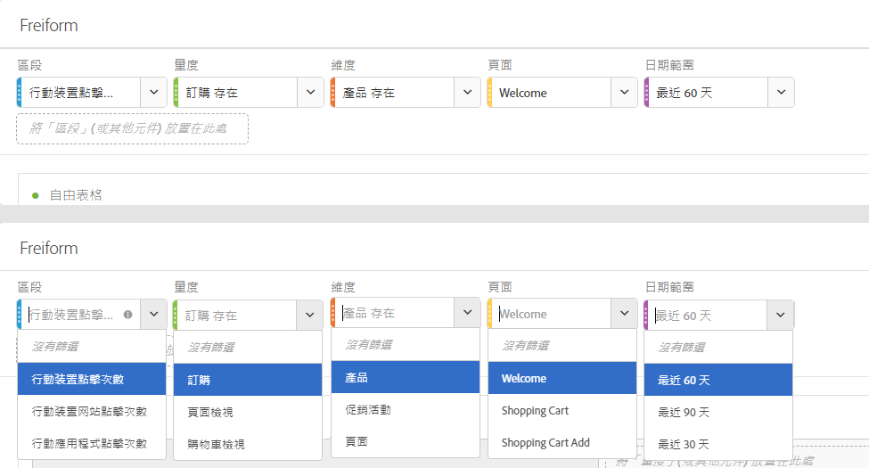
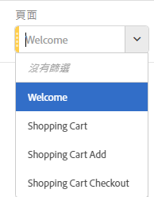
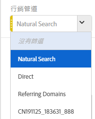

# 面板概述

面板是表格與視覺效果的集合。您可以透過 Workspace 左上方的圖示存取面板。當您要根據時段、業務單位以及地理位置等組織專案時，面板會非常實用。分析工作區提供下列六種面板：

* [空白面板](blank-panel.md)
* [快速洞察面板](quickinsight.md)
* [Analytics for Target面板](a4t-panel.md) （即將推出）
* [歸因面板](attribution.md)
* [自由面板](freeform-panel.md)
* [區段比較面板](c-segment-comparison/segment-comparison.md)

「快速洞察」、「空白」和「自由格式」面板是您開始分析的絕佳場所，而「Analytics for Target」、「歸因IQ」和「區段比較」則適用於更進階的分析。 專案 `"+"` 中有一個按鈕，讓您隨時都可以新增空白麵板。

The default starting panel is the Freeform panel, but you can make the [blank panel](/help/analyze/analysis-workspace/c-panels/blank-panel.md) your default as well.

## 面板中的下拉式篩選器 {#section_D2828EEDD52944528E87F470EAB581CF}

面板拖放區域具有下拉式篩選器功能。這些篩選器可讓您以有限方式與專案資料互動，以便進行深入分析、簡化專案，以及/或與其他人分享深入分析。

以下是簡化專案的範例：假設您的專案/面板有多種版本，提供特定國家/地區報表。您現在可以將這些專案/面板摺疊為單一面板，並將其加入國家/地區下拉式清單中，而不用在不同的資料集間篩選。

請記住：

* 您可以在下拉式清單中放置多個元件 (或維度項目)，然後在元件之間進行切換，即可篩選面板內容。
* 您也可以在相同面板上建立多個下拉式清單。
* 您可以按下拉式清單的標題並加以修改來自訂標題，或按一下標題旁邊的「x」，完全刪除下拉式清單。
* 您可以下列使用任何元件類型，建立下拉式篩選器：維度、日期範圍、區段以及量度。請注意，下拉式日期範圍一律會覆蓋面板日期範圍。
* 我們維持左側欄的元件顏色：維度項目下拉式功能表為黃色、量度為綠色、區段為藍色，而日期範圍為紫色。
* 拖放區域仍會為以區段形式拖入的項目，建立點擊層級的區段。如往常，您可以按一下區段旁邊的資訊圖示 (i) ，然後按一下鉛筆形狀的編輯圖示，在「區段產生器」中編輯這些區段。

**若要建立和使用下拉式篩選器：**

1. 從左側欄選取任何項目，並&#x200B;**在按住   鍵**&#x200B;的同時，將其拖放至面板拖放區域。

   

   這會將元件轉換為下拉式清單，而非區段。(只要不按住   鍵，仍然可以新增區段。)

   

1. 從下拉式清單選取其中一個選項，來變更下方面板的資料。(您也可以選取&#x200B;**[!UICONTROL 「沒有篩選器」]**，選擇不篩選任何面板資料。)
1. 例如，若想依行銷管道切割資料，您可以新增另一個名為「行銷管道」的下拉式清單。

   

