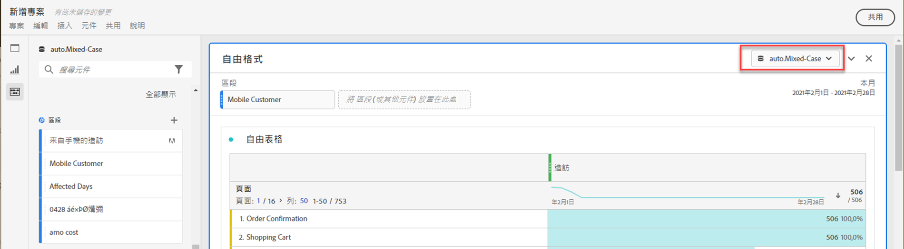
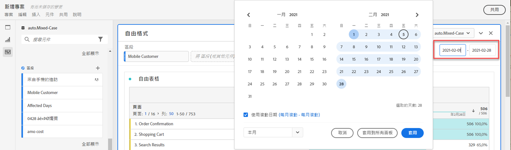
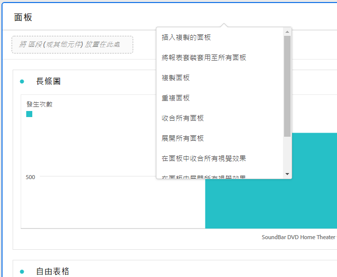

# 面板概觀

[!UICONTROL 面板]是表格與視覺效果的集合。您可以從 Workspace 左上角的圖示或[空白面板](/help/analyze/analysis-workspace/c-panels/blank-panel.md)來存取面板。當您想要根據時段、報表套裝或分析使用案例來組織專案時，面板會很有幫助。

## 面板類型

[!UICONTROL Adobe Analytics]的 Analysis Workspace 中提供以下面板類型：

| 面板名稱 | 說明 |
| --- | --- |
| [空白面板](/help/analyze/analysis-workspace/c-panels/blank-panel.md) | 從可用面板和視覺效果中選擇以開始分析。 |
| [歸因](attribution.md) | 使用任何維度和轉換量度，快速比較和視覺化任何數量的歸因模型。 |
| [Analytics for Target](a4t-panel.md) | 在 Analysis Workspace 中分析 Target 的活動和體驗。 |
| [自由格式](freeform-panel.md) | 執行無限制的比較和劃分，然後新增視覺效果以展現豐富的資料故事。 |
| [媒體平均分鐘觀眾數](average-minute-audience-panel.md) | 分析特定內容或自訂時段的平均每分鐘觀眾數。 |
| [媒體同時檢視者](media-concurrent-viewers.md) | 分析不同時段的同時檢視者，並取得尖峰同時檢視情形的詳細資訊，並可加以劃分及比較。 |
| [媒體播放時間](/help/analyze/analysis-workspace/c-panels/media-playback-time-spent.md) | 分析播放時間，以了解何時達到尖峰同時檢視人數或是檢視人數何時下降。 |
| [下一個或上一個項目](next-previous.md) | 顯示人們造訪的下一頁或上一頁。 |
| [快速洞察](quickinsight.md) | 快速建置自由格式表格和伴隨的視覺效果，加快分析及發現洞察的速度。 |
| [頁面摘要](page-summary.md) | 探索有關特定頁面的關鍵統計資料。 |
| [區段比較](/help/analyze/analysis-workspace/c-panels/c-segment-comparison/segment-comparison.md) | 在所有資料點快速比較兩個區段，以自動找到相關差異。 |

[!UICONTROL 快速洞察]、[!UICONTROL 空白]和[!UICONTROL 自由格式]面板是您開始分析的絕佳地方，而[!UICONTROL 歸因]則適合更進階的分析。位於版面底部，因此您可以隨時新增空白面板。

預設的開始面板為[!UICONTROL 自由格式]面板，但您可以將[空白面板](/help/analyze/analysis-workspace/c-panels/blank-panel.md)或[快速洞察](/help/analyze/analysis-workspace/c-panels/quickinsight.md)設為預設面板。請參閱[專案和分析偏好設定](/help/analyze/analysis-workspace/user-preferences.md#projects--analyses-preferences)。

## 建立面板

若要建立面板：

* 將面板從&#x200B;**[!UICONTROL 面板]**&#x200B;左側面板拖曳至版面上。
* 從[空白面板](blank-panel.md)中選取一個面板。
* 使用 Workspace 中的&#x200B;**[!UICONTROL 插入]**&#x200B;選單並選取您的面板。或者，您可以使用任何[快速鍵](../build-workspace-project/fa-shortcut-keys.md)來插入面板。

  

您可以：

* 選取，在任何面板&#x200B;**當中**，以新增其他視覺效果。出現快顯視窗讓您選取視覺效果。

  

  | 選取… | 若要建立... |
  |---|---|
  |  | [自由格式表格](/help/analyze/analysis-workspace/visualizations/freeform-table/freeform-table.md) |
  |  | [折線圖](/help/analyze/analysis-workspace/visualizations/line.md) |
  |  | [條狀圖](/help/analyze/analysis-workspace/visualizations/bar.md) |
  |  | [摘要數字](/help/analyze/analysis-workspace/visualizations/summary-number-change.md) |
  |  | [文字](/help/analyze/analysis-workspace/visualizations/text.md) |
  |  | [流失](/help/analyze/analysis-workspace/visualizations/fallout/fallout-flow.md) |
  |  | [流程](/help/analyze/analysis-workspace/visualizations/c-flow/flow.md) |
  |  | [堆疊區域圖](/help/analyze/analysis-workspace/visualizations/area.md) |
  |  | [同類群組表格](/help/analyze/analysis-workspace/visualizations/cohort-table/t-cohort.md) |
  |  | [項目符號](/help/analyze/analysis-workspace/visualizations/bullet-graph.md) |
  |  | [環形圖](/help/analyze/analysis-workspace/visualizations/donut.md) |
  |  | [摘要變更](/help/analyze/analysis-workspace/visualizations/summary-number-change.md) |
  |  | [直方圖](/help/analyze/analysis-workspace/visualizations/histogram.md) |
  |  | [散佈圖](/help/analyze/analysis-workspace/visualizations/scatterplot.md) |
  |  | [文氏圖表](/help/analyze/analysis-workspace/visualizations/venn.md) |
  |  | [樹狀圖](/help/analyze/analysis-workspace/visualizations/treemap.md) |

* 選取，在工作區最後一個面板的&#x200B;**外面**，以新增另一個[空白面板](blank-panel.md)。

## 管理面板

您可以透過以下方式管理面板：

* 若要收合面板，請選取「」。
* 若要顯示收合的面板，請選取「」。
* 若要刪除面板，請選取。 若要還原，請選取&#x200B;**[!UICONTROL 編輯]** > **[!UICONTROL 還原]** (**[!UICONTROL *cmd *+*z *]**|**[!UICONTROL * ctrl *+* z *]**)。
* 若要移動面板，只要有出現（通常是將游標停留在標頭上），就請拖放面板。

## 報告套裝

每個面板都與一個[報告套裝](/help/admin/tools/manage-rs/report-suites-admin.md)相關，由**[!UICONTROL *報告套裝名稱&#x200B;*]**&#x200B;識別 (在面板右上方的下拉式選單中)。

建立新面板時，預設報告套裝會根據您上次在 Analysis Workspace 專案中使用的面板報告套裝。

在專案中，您可以使用一或[多個報表套裝](/help/analyze/analysis-workspace/build-workspace-project/multiple-report-suites.md) (根據分析使用案例而定)。

報表套裝清單是依關聯性來分類；Adobe是根據目前使用者最近使用套裝情形和多常使用套裝來定義關聯性。 以及組織內使用套裝的頻率。

>[!IMPORTANT]
>
>選取的報告套裝會決定哪些維度、量度和區段，可供面板建置視覺效果時使用。
>
>
>當您切換面板的報告套裝時，某些元件可能在新報告套裝中無法使用。此變更可能會導致您的視覺效果無法正確呈現。您可能會看到如下警告：
>
>* 此面板包含選取報告套裝中未啟用的元件。請變更報告套裝或在報告套裝中啟用所需的元件。
>* 無法呈現視覺效果：請檢查您的欄和列以確保它們包含有效元件。
>

## 行事曆

面板行事曆會控制面板內表格和視覺效果的報告日期範圍。

>[!NOTE]
>
>如果在視覺效果或面板中使用日期範圍元件 (例如，作為區段)，日期範圍元件會覆寫面板行事曆。
>

1. 首先選取開始日期，然後選取結束日期來選取日期範圍。或者，您可以從&#x200B;[!UICONTROL *選取預設集*]&#x200B;下拉式選單中選取&#x200B;**[!UICONTROL 預設集]**。

1. 或者，選取&#x200B;**[!UICONTROL 顯示進階設定]**&#x200B;以進行：

   * 指定&#x200B;**[!UICONTROL 開始時間]**&#x200B;和&#x200B;**[!UICONTROL 結束時間]** (預設值 `12:00 AM` (`0:00`) 和 `11:59 PM` (`23:59`) 除外)。結束時間始終會包含 59 秒。對於涵蓋很多天的日期範圍，則開始時間適用於日期範圍的第一天，而結束時間則適用於日期範圍的最後一天。使用 **[!UICONTROL (重設時間值)]** 將開始和結束時間重設為預設值。
   * **[!UICONTROL 使日期範圍元件與面板行事曆相對應]**。如果停用，面板中使用的日期範圍元件會與目前時間相關。 如果啟用，面板中使用的日期範圍元件會相對於面板行事曆。
   * **[!UICONTROL 使用遞延日期]**。如果啟用，預設日期範圍（例如&#x200B;**[!UICONTROL 最近7天整]**）會動態更新為目前的日期和時間進度。 如果停用，此類預設集一旦套用就不會更新。

     

     您可以選取方括弧中的文字（例如&#x200B;**[!UICONTROL 固定開始 — 每日滾動]**）來延伸面板，並指定&#x200B;**[!UICONTROL 開始]**&#x200B;和&#x200B;**[!UICONTROL 結束]**&#x200B;的詳細資料。

      1. 選取&#x200B;**[!UICONTROL 開始於]**、**[!UICONTROL 結束於]**，或&#x200B;**[!UICONTROL 固定日期]**。
      1. 當您已選取&#x200B;**[!UICONTROL 開始於]**&#x200B;或&#x200B;**[!UICONTROL 結束於]**，您可以建置完整的運算式。例如：**[!UICONTROL 結束於]**&#x200B;**[!UICONTROL 今年]**&#x200B;**[!UICONTROL 加上]**`1`**[!UICONTROL 天]**。為運算式的個別部分選擇適當的值。
         * 選取目前的值。例如，**[!UICONTROL 目前的年份]**。
         * 選取一個值進行其他計算。例如，**[!UICONTROL 加]**。
         * 當您指定其他計算時，請指定一個值。例如，`1`。
         * 當您已指定其他計算時，請選取用於計算的時段。例如&#x200B;**[!UICONTROL 天]**。

     選取&#x200B;**[!UICONTROL 隱藏詳細資訊]**&#x200B;以隱藏遞延日期計算的詳細資訊。

1. 選取&#x200B;**[!UICONTROL 套用]**&#x200B;將日期範圍套用至您呼叫行事曆的面板。選取&#x200B;**[!UICONTROL 套用至所有面板]**&#x200B;將日期範圍套用至 Workspace 專案中的所有面板。

## 下拉區域 {#dropzone}

面板拖放區域標示為&#x200B;**[!UICONTROL _拖放元件以篩選或劃分資料_]**，可讓您篩選或劃分面板的資料。 用來篩選或劃分資料的區段或劃分會套用至面板內的所有自由表格和視覺效果。

區段和劃分可讓您以可控制的方式與資料互動。 例如，您可以為行動裝置型別新增區段下拉式功能表，如此一來，您就可以選取平板電腦、手機或桌上型電腦來篩選面板。

區段也可用來將許多專案整合為一個。 例如，如果您有同一個專案的不同版本，每個版本套用了不同的國家/地區區段，您可以將所有版本合併為單一專案，並新增一個國家/地區區段下拉式功能表。

下圖顯示將元件新增至拖放區域時所產生的（快速）區段或劃分的不同變數。

### 新增或取代

若要新增或取代（快速）區段或劃分：

1. 從「元件」邊欄中選取一或多個元件。 使用⇧+或^+選取一個以上的元件。
1. 將選取專案拖曳至拖放區域（標示為&#x200B;**[!UICONTROL _拖放元件，以篩選或劃分資料_]** ❶），或拖曳至已放置在拖放區域附近的現有元件上。
1. 當您看到 **[!UICONTROL 新增（按Shift建立下拉式清單）]**&#x200B;或 **[!UICONTROL 取代（按Shift新增到下拉式清單）]**&#x200B;時，您有兩個選項：

   

   * 放置選取專案以建立下列元件：
      * 您放置[的任何區段元件的](#segment)區段❷。
      * [快速區段](#quick-segment)，適用於您放置❸的任何非區段元件（日期範圍、量度、維度、維度專案）。
   * 按住&#x200B;**⇧(Shift)，拖放選取專案**&#x200B;以建立下列元件：
      * 靜態區段[下拉式功能表](#drop-down-menu)，其中包含您要針對您放置❹的選取區段進行篩選的專案。
      * 靜態區段[下拉式功能表](#drop-down-menu)，其中包含您要針對您放置❺的選取日期範圍篩選的專案。
      * 靜態區段[下拉式功能表](#drop-down-menu)，其中包含您要針對您放置❻的選取量度進行篩選的專案。
      * 靜態區段[下拉式功能表](#drop-down-menu)或劃分[下拉式功能表](#drop-down-menu)，其中包含要篩選或劃分所選維度&#x200B;*專案* （您拖曳❼）的專案。
      * 動態區段[下拉式功能表](#drop-down-menu)或劃分[下拉式功能表](#drop-down-menu)，其中包含您要針對您放置❽的所選維度進行篩選或劃分的專案。

### 區段

您放置的任何區段元件都會用來劃分面板。 使用區段來取得面板資料和視覺效果的分段深入分析。

### 快速區段

任何已捨棄的非區段元件（維度、維度專案、量度、日期範圍）會定義[快速區段](#quick-segment)來劃分面板。 使用任何非區段元件來建立快速區段，而不使用[區段產生器](/help/components/segmentation/segmentation-workflow/seg-quick.md)。 以這種方式建立的區段會自動定義為事件層級區段，並依預設標示為&#x200B;**[!UICONTROL 快速區段]**。

或者，您可以使用來建立快速區段。

如需如何建立和管理快速區段，請參閱[快速區段](/help/components/segmentation/segmentation-workflow/seg-quick.md)。

### 下拉式選單

當您按住時建立的下拉式功能表⇧可以：

* 包含[靜態](#static)或[動態](#dynamic)專案清單。
* 行為[篩選面板](#filter)或[劃分面板](#breakdown)。

#### 靜態

已為選取的維度&#x200B;*專案*、量度、區段和日期範圍建立靜態下拉功能表。 靜態下拉式選單中的專案是根據您放置的所選元件，而當您新增或取代元件時，專案不會變更。

#### 動態

動態下拉式功能表只有在您拖放維度元件時才會建立。 動態下拉式功能表在標籤中以表示。

動態下拉式功能表中的可用專案是根據：

* 從面板拖放區域中的其他下拉式功能表、區段和快速區段中的選取專案產生的資料，以及
* 面板報告範圍內的可用資料。

例如，您可以使用國家/地區維度和城市維度新增兩個動態下拉功能表。 當您從&#x200B;**[!UICONTROL 國家]**&#x200B;下拉式功能表選取國家/地區時，**[!UICONTROL 城市]**&#x200B;下拉式功能表會動態調整以僅顯示選定國家/地區內的城市。 當您有其他靜態下拉式功能表時，在這些下拉式功能表中選取的專案也會影響動態下拉式功能表中的可用專案。 在動態下拉式功能表中選取的專案不會影響靜態下拉式功能表中的可用專案。

#### 篩選面板

對於您按住&#x200B;**⇧位時放置**&#x200B;的任何量度、區段或日期範圍元件，都會建立區段下拉式功能表。 該下拉式功能表可讓您根據拖放元件的可用專案來篩選面板。

對於您按住&#x200B;*⇧位時放置*&#x200B;的任何&#x200B;**維度**&#x200B;元件，會建立區段下拉式功能表。 該下拉式功能表可讓您根據可放置的維度專案（[靜態](#static)區段下拉式功能表）或維度元件（[動態](#dynamic)區段下拉式功能表）的專案來篩選面板。 若要明確設定下拉式功能表以使用區段進行篩選：

* 選取，並從元件篩選器❾。

#### 劃分面板

對於您按住&#x200B;*⇧位時放置*&#x200B;的任何&#x200B;**維度**&#x200B;元件，會建立區段下拉式功能表。 您可以改為設定下拉式功能表來劃分。 若要明確設定下拉式功能表以使用劃分進行劃分：

* 選取，然後從元件劃分❾。

>[!IMPORTANT]
>
>劃分僅適用於維度和維度專案，不適用於區段、日期範圍或量度。
>

#### 區段與劃分

在下列情況下，請考慮劃分面板，而非篩選面板（使用區段）：

* 如果您在面板中使用已啟用歸因的量度，區段通常會清除已啟用歸因的量度。 劃分會套用至查詢中的不同點，執行此操作是為了擷取面板的資料。 因此，劃分不會清除這些啟用屬性的量度。

  例如，使用&#x200B;**[!UICONTROL Luma：產品類別]** **[!UICONTROL 篩選器]** 區段時，檢視以&#x200B;**[!UICONTROL 線上收入]**&#x200B;量度為基礎的屬性與&#x200B;**[!UICONTROL Luma：產品類別]**  **[!UICONTROL 女性]**&#x200B;劃分之間的差異。

  

* 如果您在劃分下拉式選單中使用子事件層級維度，劃分會在該子事件層級執行。 區段下拉式選單中的區段會在事件層級執行。

  例如，檢視使用&#x200B;**[!UICONTROL Luma：產品子類別]** **[!UICONTROL 篩選器]** 區段時，**[!UICONTROL 線上收入]**&#x200B;量度與&#x200B;**[!UICONTROL Luma：產品子類別]**  **[!UICONTROL 頂端]**&#x200B;劃分之間的差異。 劃分會在子事件層級明確執行查詢，而區段會在事件層級執行查詢。

  

### 管理

您可以依照以下方式管理放置區域中的元件：

| 在面板拖放區域中要做什麼…… | 做法…… |
|---|---|
| 移除區段或快速區段。 | 在元件中選取。 |
| 從下拉式功能表中移除選取的專案。 | 選取專案中的。 |
| 從下拉式選單中移除所有選取的專案。 | 在下拉式功能表中選取。 |
| 編輯任何元件的標籤。 | 將滑鼠懸停在元件的標籤上，並選取。 |
| 刪除任何元件的標籤。 | 將滑鼠懸停在元件的標籤上，並從元件的內容功能表中選取&#x200B;**[!UICONTROL 刪除標籤]**。 |
| 從拖放區域刪除元件。 | 從元件的內容功能表中選取&#x200B;**[!UICONTROL 刪除下拉式清單]**。 |
| 取得區段或快速區段的資訊。 | 將游標暫留在元件內，並選取以開啟包含元件資訊的資料字典。 |
| 取得定義下拉式功能表之元件的資訊。 | 將滑鼠暫留在下拉式功能表中，並選取以開啟包含元件資訊的資料字典。 |
| 編輯快速區段。 | 將滑鼠懸停在快速區段內，並選取。 如需詳細資訊，請參閱[快速區段](/help/components/segmentation/segmentation-workflow/seg-quick.md)。 |
| 在下拉式功能表中需要選取。 | 從元件的內容功能表中選取&#x200B;**[!UICONTROL 需要選取]**。 |
| 讓下拉式功能表不允許篩選。 | 從元件的內容功能表中選取&#x200B;**[!UICONTROL 不允許篩選]**。 |
| 重設所有元件並清除下拉式功能表的所有選取專案。 | 選取&#x200B;**[!UICONTROL 全部重設]**。 |

>[!BEGINSHADEBOX]

如需示範影片，請參閱 [在Analysis Workspace中使用篩選器](https://experienceleague.adobe.com/zh-hant/docs/analytics-learn/tutorials/analysis-workspace/using-panels/using-drop-down-filters){target="_blank"}。

>[!ENDSHADEBOX]

>[!BEGINSHADEBOX]

如需示範影片，請參閱 [動態下拉式功能表](https://experienceleague.adobe.com/zh-hant/docs/customer-journey-analytics-learn/tutorials/analysis-workspace/tips-and-tricks/dynamic-drop-downs){target="_blank"}。

{{videocja}}

>[!ENDSHADEBOX]

## 內容選單

透過面板標題的內容選單 (按一下右鍵) 可使用面板的其他功能。

提供下列選項：

| 選項 | 說明 |
| --- | --- |
| **[!UICONTROL 插入複製的面板]** | 讓您將複製的面板貼到專案內另一個位置或不同的專案中。 |
| **[!UICONTROL 插入複製的視覺化呈現]** | 將複製的視覺效果貼上到面板、專案內另一個位置或不同的專案中。 |
| **[!UICONTROL 將報告套裝套用至所有面板]** | 將此面板的報表套裝套用至專案中的所有其他面板。 |
| **[!UICONTROL 複製面板]** | 複製面板以便將其插入專案內另一個位置或不同的專案中。 |
| **[!UICONTROL 重複面板]** | 複製目前的面板，您可以修改它。 |
| **[!UICONTROL 收摺所有面板]** | 收摺所有專案面板。 |
| **[!UICONTROL 展開所有面板]** | 展開所有專案面板。 |
| **[!UICONTROL 收摺面板中的所有視覺效果]** | 收摺目前面板中的所有視覺效果。 |
| **[!UICONTROL 展開面板中所有視覺效果]** | 展開目前面板中的所有視覺效果。 |
| **[!UICONTROL 編輯說明]** | 新增 (或編輯) 面板的文字說明。 |
| **[!UICONTROL 取得面板連結]** | 將使用者導向專案中的特定面板。已選取連結後，收件者必須先登入系統，然後才會被導向所連結的正確面板。 |

## 設定

有些面板 (例如[!UICONTROL 歸因]、[!UICONTROL 實驗]、[!UICONTROL 媒體平均分鐘觀眾數] 等) 有一個設定對話框，可協助您建置視覺化呈現。使用面板上方的來存取和變更設定。

