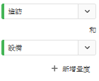

# 快速深入分析面板 {#quick-insights-panel}

<!-- markdownlint-disable MD034 -->

>[!CONTEXTUALHELP]
>id="workspace_quickinsights_button"
>title="快速深入分析"
>abstract="建立一個面板來快速建置自由格式表格和伴隨的視覺化描繪，加快分析及揭露深入分析的速度。"

<!-- markdownlint-enable MD034 -->

>[!BEGINSHADEBOX]

_本文記錄_ _&#x200B;**Adobe Analytics** 中的快速深入分析面板。_ _請參閱[快速深入分析面板](https://experienceleague.adobe.com/zh-hant/docs/analytics/analyze/analysis-workspace/panels/quickinsight)，以取得本文的_  _&#x200B;**Customer Journey Analytics** 版本。_

>[!ENDSHADEBOX]

[!UICONTROL 快速深入分析]為 [!UICONTROL Analysis Workspace] 的非分析師和新使用者提供指引，瞭解如何快速輕鬆回答業務問題。對於想要快速解答簡單的問題而無須自行建立表格的進階使用者，這也是絕佳的工具。

當您首次使用 [!UICONTROL Analysis Workspace]，您可能想知道：

* 哪些視覺化呈現最有用、
* 哪些維度和量度可能有助於深入分析、
* 拖放項目的位置、
* 在哪裡建立篩選
* 及更多內容。

為了協助您解決這些問題，[!UICONTROL 快速深入分析]會運用演演算法，提供您的公司最常使用的維度、量度、區段和日期範圍。 此演算法是根據您自己的公司在 [!UICONTROL Analysis Workspace] 的資料元件使用情況。實際上，您會在下拉式清單中看到標記為「[!UICONTROL 熱門]」的維度、量度和區段，如下所示：

[!UICONTROL 快速深入分析]可協助您

* 在 [!UICONTROL Analysis Workspace] 中適當建立資料表格及隨附的視覺效果。
* 瞭解 [!UICONTROL Analysis Workspace] 的基本元件和部件所適用的術語和辭彙。
* 在[!UICONTROL 自由表格]中輕鬆進行維度的簡單劃分、新增多個量度或比較區段。
* 變更或試用各種視覺效果類型，以快速且直覺地找出您的分析適用的尋找工具。

## 基本關鍵術語

以下是您需要熟悉的一些基本術語。每個資料表格都包含 2 個以上建置要素 (元件)，讓您用來說明自己的資料故事。

| 組成要素 (元件) | 定義 |
|---|---|
| **[!UICONTROL 維度]** | 維度是量度資料的描述或特性，您可以在專案中加以檢視、劃分及比較。這是可劃分為維度項目的非數值和日期。例如，*瀏覽器*&#x200B;或&#x200B;*頁面*&#x200B;是維度。 |
| **[!UICONTROL 維度項目]** | 維度項目是維度的個別值。例如，瀏覽器維度的維度項目為 *Chrome*、*Firefox*、*Edge*&#x200B;等。 |
| **[!UICONTROL 量度]** | 量度是有關訪客活動的量化資訊，例如瀏覽次數、點進、重新載入、平均逗留時間、件數、訂購、收入等。 |
| **[!UICONTROL 視覺化呈現]** | Workspace 提供[一些視覺化呈現](/help/analyze/analysis-workspace/visualizations/freeform-analysis-visualizations.md)，方便您建置資料的視覺呈現方式。例如長條圖、環形圖、直方圖、折線圖、地圖、散佈圖等。 |
| **[!UICONTROL 維度劃分]** | 維度劃分是用其他維度來劃分某個維度。例如，您可以將「依行動裝置劃分美國各州」劃分為每個州的行動裝置造訪次數。或者，您可以依行動裝置類型、區域、內部促銷活動等來劃分行動裝置。 |
| **[!UICONTROL 區段]** | 區段可讓您根據特性或網站互動來識別訪客的子集。例如，您可以建置[!UICONTROL 人員]區段，根據 <li>屬性：瀏覽器類型、裝置、造訪次數、國家/地區、性別；或</li><li>互動：促銷活動、關鍵字搜尋、搜尋引擎；或</li><li>進入和退出：來自 Facebook 的訪客、已定義的登陸頁面、反向連結網域；或</li><li> 自訂變數：表單欄位、已定義的類別、客戶 ID。 |

## 使用

若要使用&#x200B;**[!UICONTROL 快速深入分析]**&#x200B;面板：

1. 建立一個&#x200B;**[!UICONTROL 快速深入分析]**&#x200B;面板。有關如何建立面板的資訊，請參閱[建立面板](panels.md#create-a-panel)。

1. 首次使用&#x200B;**[!UICONTROL 快速深入分析]**&#x200B;面板時，您可能要完成簡短的[!UICONTROL 入門教學課程]，以了解一些基本概念。選取「快速深入分析」面板標題旁的，然後從快顯視窗中選取&#x200B;**[!UICONTROL 入門教學課程]**。

1. 指定面板的[輸入](#panel-input)。

1. 觀察面板的[輸出](#panel-output)。

### 面板輸入

選取您的建置要素：

* **[!UICONTROL 分析]**  - 指定維度 (橘色)
* **[!UICONTROL 依據]**  - 指定量度 (綠色)
* **[!UICONTROL 篩選條件]**  - 指定區段 (藍色)
* **[!UICONTROL 在]** - 指定日期範圍 (紫色)。

您必須至少選取一個維度和一個量度才能使視覺化呈現正常運作。

您可以透過三種方式指定建置要素：

* 從左側面板拖放元件。
* 開始在建置要素欄位之一中輸入內容。找到輸入後，建置要素欄位會自動填入可能的值。
* 指定建置區塊下拉式清單（例如&#x200B;**[!UICONTROL Analyze]**&#x200B;中的&#x200B;**[!UICONTROL 國家]**），並搜尋可能值的清單（使用）以取得您要使用的值（例如&#x200B;**[!UICONTROL 國家/地區代碼]**）。

選取&#x200B;**[!UICONTROL 清除]**&#x200B;以清除所有輸入欄位。

### 面板輸出

1. 當您已新增至少一個維度和一個量度後，就可以看到結果。

   

   * 以[!UICONTROL 過去 12 個月]來自[!UICONTROL 搜尋引擎]的[!UICONTROL 造訪數]來劃分包含維度 ([!UICONTROL 國家/地區網站]) 和量度 ([!UICONTROL 造訪數]) 的自由格式表格。

   * 隨附的視覺效果，在此案例中為[長條圖](/help/analyze/analysis-workspace/visualizations/bar.md)。產生的視覺效果會以您新增至表格的資料類型為基礎。任何以時間為基礎的資料 (例如，每日/月的[!UICONTROL 造訪]次數)，都會預設為[!UICONTROL 折線圖]。任何非時間型資料 (例如，每個[!UICONTROL 裝置]的[!UICONTROL 造訪]次數) 都會預設為[!UICONTROL 長條圖]。您可以按一下視覺化呈現類型旁的下拉箭頭，以變更視覺化呈現類型。

1. 嘗試新增一些更精細的功能，如以下[更多秘訣](#more-tips)所述

1. 您可能想要使用&#x200B;**[!UICONTROL 專案 > 儲存]**&#x200B;來儲存專案。

## 更多秘訣

[!UICONTROL 快速深入分析產生器]會出現其他有用的提示，其中部分取決於您最後的動作。

* 首先，您可能要完成&#x200B;**[!UICONTROL 更多秘訣]**&#x200B;教學課程。本教學課程會在您建立專案的 24 小時後顯示，其中至少包含一個維度和一個量度。選取「快速深入分析」面板標題旁的，然後從快顯視窗中選取&#x200B;**[!UICONTROL 更多秘訣]**。

  

* 您可以分析多個維度和量度、結合或比較區段，以及指定日期範圍：

  

   * **[!UICONTROL 分析]**&#x200B;維度&#x200B;**[!UICONTROL 劃分依據]**：最多可將維度劃分為 3 個層級，以深入研究您真正需要的資料。請參閱➊、➋和➌。

   * 新增更多量度&#x200B;**[!UICONTROL 依據]**：您最多可以再增加 2 個量度。請參閱➍和➎。

   * **[!UICONTROL 篩選條件]**：您最多可以再增加 2 個區段。例如，新增「預訂」作為區段，並結合您所比較的「預訂常客」和「首次搭機者」區段。請參閱➏、➐和➑。

   * 在：您可以指定日期範圍。請參閱「➒」。

## 已知限制

如果您嘗試直接在表格中進行編輯，[!UICONTROL 快速深入分析]面板會無法同步。選取面板右上方的[!UICONTROL 重新同步產生器]，將其還原為先前的&#x200B;**[!UICONTROL 快速深入分析]**&#x200B;設定。

直接在表格中新增任何項目之前，您會收到警告：

否則，直接建立表格會使其與傳統自由格式表格運作模式相同，沒有可協助新使用者的功能。

>[!MORELIKETHIS]
>
>[建立面板](/help/analyze/analysis-workspace/c-panels/panels.md#create-a-panel)
>
<!--
# Quick Insights panel

[!UICONTROL Quick Insights] provides guidance for non-analysts and new users of [!UICONTROL Analysis Workspace] to learn how to answer business questions quickly and easily. It is also a great tool for advanced users who want to answer a simple question quickly without having to build a table themselves.

When you first start using this [!UICONTROL Analysis Workspace], you might wonder what visualizations would be most useful, which dimensions and metrics might facilitate insights, where to drag and drop items, where to create a segment, etc. 

To help with this, and based on your own company's usage of data components in [!UICONTROL Analysis Workspace], [!UICONTROL Quick Insights] leverages an algorithm that will present you with the most popular dimensions, metrics, segments, and date ranges your company uses. In fact, you will see dimensions, metrics, and segments tagged as [!UICONTROL Popular] in the drop-down list, as shown here:

[!UICONTROL Quick Insights] helps you

* Properly build a data table and an accompanying visualization in [!UICONTROL Analysis Workspace].
* Learn the terminology and vocabulary for basic components and pieces of [!UICONTROL Analysis Workspace].
* Do simple breakdowns of dimensions, add multiple metrics, or compare segments easily within a [!UICONTROL Freeform table].
* Change or try out various visualization types to find the find tool for your analysis quickly and intuitively.

Here is a video overview of the [!UICONTROL Quick Insights] panel:

>[!VIDEO](https://video.tv.adobe.com/v/37248/?quality=12)

## Basic key terminology

Following are some of the basic terms you need to be familiar with. Each data table consists of 2 or more building blocks (components) that you utilize to tell your data story.

|Building block (Component)|Definition|
|---|---|
|[!UICONTROL Dimension]|Dimensions are descriptions or characteristics of metric data that can be viewed, broken down, and compared in a project. They are non-numeric values and dates that break down into dimension items. For example, "browser", or "page" are dimensions.|
|[!UICONTROL Dimension item]|Dimension items are individual values for a dimension. For example, dimension items for the browser dimension would be "Chrome", "Firefox", "Edge", etc.|
|[!UICONTROL Metric]|Metrics are quantitative information about visitor activity, such as views, click-throughs, reloads, average time spent, units, orders, revenue, and so on.|
|[!UICONTROL Visualization]|Workspace offers [a number of visualizations](/help/analyze/analysis-workspace/visualizations/freeform-analysis-visualizations.md) to build visual representations of your data, such as bar charts, donut charts, histograms, line charts, maps, scatterplots, and others.|
|[!UICONTROL Dimension Breakdown]|A dimension breakdown is a way to literally break down a dimension by other dimensions. In our example, you could break down US States by Mobile Devices to get the mobile device visits per state, or you could break Mobile Devices down by Mobile Device types, by Regions, by Internal Campaigns, etc..|
|[!UICONTROL Segment]|Segments let you identify subsets of visitors based on characteristics or website interactions. For example, you can build [!UICONTROL Visitor] segments based on attributes: browser type, device, number of visits, country, gender, or based on interactions: campaigns, keyword search, search engine, or based on exits and entries: visitors from Facebook, a defined landing page, referring domain, or based on custom variables: form field, defined categories, customer ID.  |

## Get started with Quick Insights

1. Log in to Adobe Analytics using the credentials you have been provided with.
1. Go to [!UICONTROL Workspace] and click **[!UICONTROL Create New Project]** and then click **[!UICONTROL Quick Insights]**. (You can also access this panel from the **[!UICONTROL Panel]** menu in the left rail.)

    

    

1. When you first start out, go through the short tutorial that teaches you some of the [!UICONTROL Quick Insights panel] basics. Or, click to **[!UICONTROL Skip Tutorial]**.
1. Select your building blocks (also known as components): dimensions (orange), metrics (green), segments (blue), or date ranges (purple) You have to select at least one dimension and one metric for a table to be built automatically. 

    

    You have three ways of selecting the building blocks:
    * Drag and drop them from the left rail.
    * If you know what you are looking for: Start typing and [!UICONTROL Quick Insights] will fill in the blanks for you.
    * Click on the drop-down and search the list.

1. When you have added at least one dimension and one metric, the following will be created for you:

    * A Freeform table with the dimension (here, US States) vertically and the metric (here, Visits) horizontally at the top. Check out this table: 

    

    * An accompanying visualization, in this case a [bar chart](/help/analyze/analysis-workspace/visualizations/bar.md). The visualization that is generated is based on the type of data you added to the table. Any time-based data (such as [!UICONTROL Visits] per Day/Month) defaults to a [!UICONTROL Line] chart. Any non-time-based data (such as [!UICONTROL Visits] per [!UICONTROL Device]) defaults to a [!UICONTROL Bar] chart. You can change the type of visualization by clicking on the drop-down arrow next to the visualization type.

1. (Optional) Drill down on dimensions and see dimension items by clicking the > right-arrow next to the dimension.

1. Try adding some more refinements as described below under "More tips."

1. Save your project by clicking **[!UICONTROL Project > Save]**.

## More tips

Other useful hints will pop up in the [!UICONTROL Quick Insights Builder], some of them depending on your last action.

* First, complete the **[!UICONTROL More tips]** tutorial: Access it via the Help (?) icon next to the [!UICONTROL Quick Insights] title. This tutorial shows up 24 hours after you have created a project with at least one dimension and one metric.

    

* **Breakdown by**: You can use up to 3 levels of breakdowns on dimensions to drill down to the data you really need.

    

* **Add more metrics**: You can add up to 2 more metrics by using the AND operator to add them the table.

    

* **Add more segments**: You can add up to 2 more segments by using the AND or OR operators to add them the table. Look at what happens to the table when you add Mobile Users OR Loyal Visitors. They are next to each other, above the metrics. If you added Mobile Users AND Loyal Visitors, you would see results from both segments together, and they would be stacked on top of each other in the table.

    

## Known limitations

If you try to edit directly within the table, it will cause the [!UICONTROL Quick Insights] panel to become out of sync. You can restore it to the previous [!UICONTROL Quick Insights] settings by clicking **[!UICONTROL Resync Builder]** at the top right of the panel.

 

You will get a warning before adding anything directly to the table:

 

Otherwise, building directly will cause the table to now behave as a traditional Freeform table, without the helpful features for new users.

-->