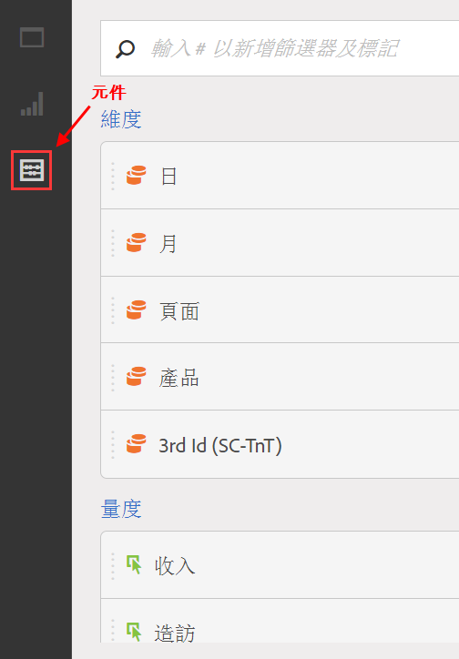
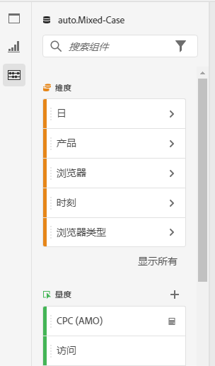
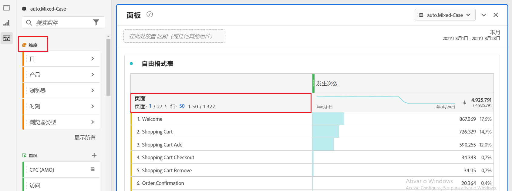
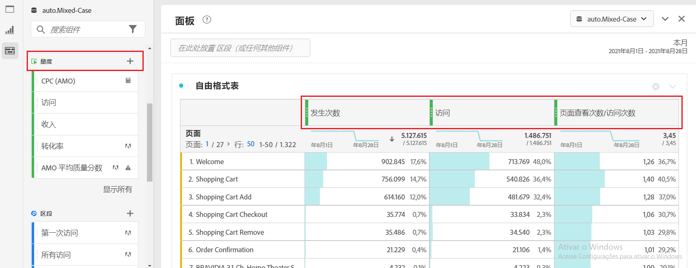
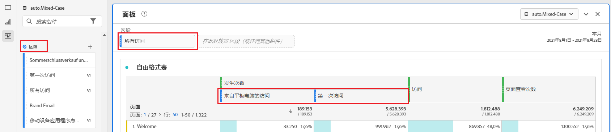
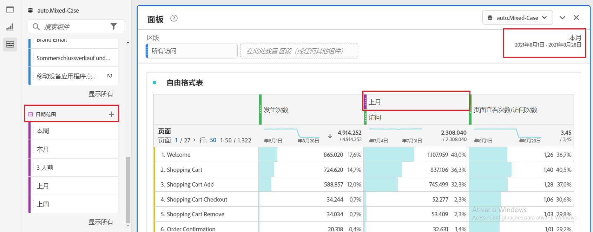
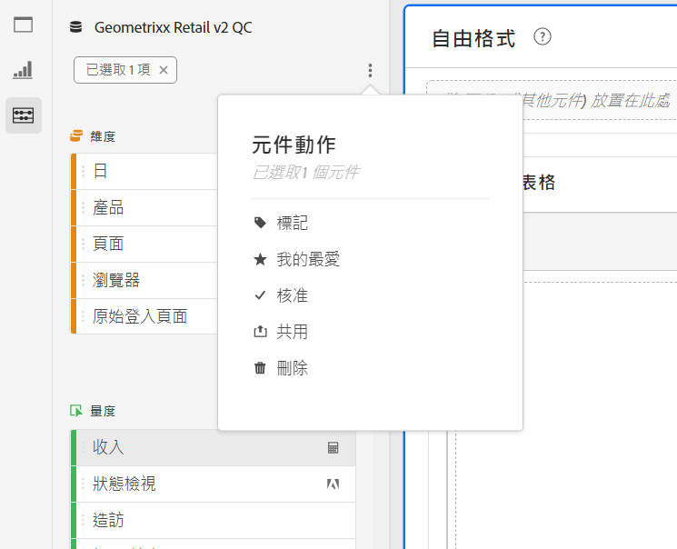

# 元件概觀

元件是 Adobe Analytics 中的功能，可用於視覺效果 (例如自由格式表格)，或與報告功能搭配使用。

若要從 Adobe Analytics 主介面管理元件：

1. 從頂端列選取&#x200B;**[!UICONTROL 元件]**。
1. 選取&#x200B;**[!UICONTROL 元件]**&#x200B;以查看您可以管理的元件概觀，或直接從選單中選取您要管理的元件。

您可以管理下列元件：

* [區段](/help/components/segmentation/seg-home.md)：建置、管理、共用強大且重點明確的客群區段，並將其套用到您的報告中。區段讓您根據特性或互動來識別人員子集。
* [計算量度](/help/components/c-calcmetrics/cm-overview.md)：將量度和公式作為新元件用於報告中
* [日期範圍](calendar-date-ranges/custom-date-ranges.md)：自訂和調整 Analysis Workspace 提供的日期範圍。
* [已排程的專案](../curate-share/t-schedule-report.md)：管理已排程的專案。
* [位置](../../../components/locations/locations-manager.md)：管理匯出專案的位置。
* [警報](/help/components/c-alerts/intellligent-alerts.md)：根據變更的百分比或特定資料點對您發送通知。
* [註解](annotations/overview.md)：向您的組織傳達內容相關的資料細微差別和洞察。
* [偏好設定](/help/analyze/analysis-workspace/user-preferences.md)：管理 Analysis Workspace 的偏好設定。

## Analysis Workspace 元件

Analysis Workspace 中的元件由量度、維度、區段和日期範圍組成，您可以將它們拖放至 Workspace 專案的面板和視覺效果中。您建立的自訂元件會新增至這些面板，例如計算量度或自訂日期範圍。

若要存取元件面板，請選取在按鈕面板中的**[!UICONTROL 元件]**。

請參閱[建立專案](/help/analyze/analysis-workspace/home.md)，以了解在專案中如何使用元件的詳細資訊。

## 管理元件 {#actions}

您可以使用 Analysis Workspace **[!UICONTROL 元件]**&#x200B;選單快速建立新元件。請參閱[Analysis Workspace 選單](/help/analyze/analysis-workspace/home.md#menu)以了解更多詳細資訊。

您可以管理元件 (個別或選取多個元件)。

1. 選取一個或多個元件。

1. 從內容選單，或從「元件」動作按鈕 (位於元件頂端) 選取下列其中一項動作。

   >[!TIP]
   >
   >按住 **[!UICONTROL Shift]** 或按住 **[!UICONTROL Command]** (macOS 版) 或 **[!UICONTROL Ctrl]** (Windows 版)，即可選取多個元件。

   

   | 元件動作 | 說明 |
   |--- |--- |
   |  [!UICONTROL **標記**] | 以套用標記的方式組織或管理元件。然後您可以透過選取篩選或輸入 `#`，依左側面板的標記進行搜尋。標記也會作為元件管理員中的篩選器。 |
   |  [!UICONTROL **最愛項目**] | 將元件新增至最愛項目清單。如同標記，您可以依左側面板的「最愛項目」搜尋，並在元件管理員中依這些條件篩選。 |
   |  **[!UICONTROL 取消最愛項目]** | 將元件從最愛項目清單移除。 |
   |  [!UICONTROL **核准**] | 將元件標示為「已核准」，向您的使用者表示此元件已獲得組織核准。如同標記，您可以在左側面板中依已批准進行搜尋和篩選。識別已核准的元件。 |
   |  [!UICONTROL **共用**] | 缃元件提供給組織中的用戶共用。此選項僅適用於自訂元件，例如區段或計算量度。 |
   |  [!UICONTROL **刪除**] | 刪除您不再需要的元件。 此選項僅適用於自訂元件，例如區段或計算量度。 |

自訂元件也可透過其各自的元件管理員來管理。如需範例，請參閱[管理區段](/help/components/segmentation/segmentation-workflow/seg-manage.md)。

## 管理元件清單

您可以在 Analysis Workspace 的左側面板中搜尋、篩選元件清單並進行排序，以找到特定元件。

### 搜尋

1. 選取左側面板中的&#x200B;**元件** 。

2. 在搜尋欄位中開始輸入要用於專案中的元件的名稱。

   顏色和圖示識別元件類型。**維度**是橘色的，**區段**是藍色的，**日期範圍**是紫色的，而&#x200B;**量度**是綠色的。 Adobe 圖示  表示計算量度範本或區段範本。計算機圖示 表示管理員在您組織中所建立的計算量度。

3. 從下拉式選單中選取元件。

### 篩選器

1. 在左側面板中選取&#x200B;**元件**&#x200B;圖示。

2. 選取&#x200B;**篩選條件**，或在搜尋欄位中輸入 `#`。

3. 選取以下任一篩選條件選項以篩選元件清單：

   | 圖示 | 篩選條件選項 | 說明 |
   |---------|---|----------|
   |  | **[!UICONTROL 已核准]** | 僅顯示標記為由管理員核准的元件。 |
   |  | **[!UICONTROL 我的最愛]** | 僅顯示「我的最愛」清單中的元件。 如需有關將元件新增到最愛項目清單的資訊，請參閱「[管理元件](#manage-components)」。 |
   |  | **[!UICONTROL 維度]** | 僅顯示維度的元件。 |
   |  | **[!UICONTROL 量度]** | 僅顯示量度的元件。 |
   |  | **[!UICONTROL 區段]** | 僅顯示屬於區段的元件。 |
   |  | **[!UICONTROL 日期範圍]** | 僅顯示日期範圍的元件。 |
   |  | **[!UICONTROL *標記名稱&#x200B;*]** | 僅顯示具有特定已選取標記的元件。Adobe 範本有一個專用標記，是來自 Adobe 的[預設計算量度](/help/components/c-calcmetrics/cm-reference/default-calcmetrics.md)。 |

   在篩選器中選取以移除此篩選器。

4. 您可以選擇排序元件清單，如[對元件清單進行排序](#sort-the-component-list)中所述。

### 排序

<!-- {{release-limited-testing-section}}-->

1. (可選) 依據[篩選元件清單](#filter-the-component-list)中的說明，對元件清單套用任何篩選條件。

2. 選取左側面板中的&#x200B;**元件** 」。

3. 選取&#x200B;**排序**，然後選取以下任一篩選器選項，將元件清單排序。

提供下列排序選項：

{{components-sort-options}}

## 存取權限

在 Analysis Workspace 中，管理員可以[組織](/help/analyze/analysis-workspace/curate-share/curate.md)在報告中向使用者公開的元件。

<!--
# Components overview

Components in Analysis Workspace consist of dimensions, metrics, segments, and date ranges that you can drag-and-drop onto a project. 

To access the Components menu, click the **[!UICONTROL Components]** icon in the left rail. You can switch among [panels](https://experienceleague.adobe.com/docs/analytics/analyze/analysis-workspace/panels/panels.html), [visualizations](https://experienceleague.adobe.com/docs/analytics/analyze/analysis-workspace/visualizations/freeform-analysis-visualizations.html), and components from the left rail icons or by using [hotkeys](/help/analyze/analysis-workspace/build-workspace-project/fa-shortcut-keys.md).

You can also adjust the [View density settings](https://experienceleague.adobe.com/docs/analytics/analyze/analysis-workspace/build-workspace-project/view-density.html) for the project to see more values in the left rail at once by going to **[!UICONTROL Project > Project Info & Settings > View Density]**.

## Dimensions {#dimensions}

[**Dimensions**](https://experienceleague.adobe.com/docs/analytics/components/dimensions/overview.html) are text attributes that describe your visitor behavior and can be viewed, broken down, and compared in your analysis. They can be found in the left Component rail (orange section) and are typically applied as rows of a table. 

Examples of dimensions include [!UICONTROL Page Name], [!UICONTROL Marketing Channels], [!UICONTROL Device Type], and [!UICONTROL Products]. Dimensions are provided by Adobe and are captured through your custom implementation (eVar, Props, classifications, etc).

Each dimension also contains **dimension items** within it. Dimension items can be found in the left Component rail by clicking the right-arrow next to any dimension name (items are yellow).

Examples of dimension items include [!UICONTROL Homepage] (within the [!UICONTROL Page] dimension), [!UICONTROL Paid Search] (within the [!UICONTROL Marketing Channel] dimension), [!UICONTROL Tablet] (within the [!UICONTROL Mobile Device Type] dimension), and so on.

## Metrics {#metrics}

[**Metrics**](https://experienceleague.adobe.com/docs/analytics/components/metrics/overview.html) are quantitative measures about visitor behavior. They can be found in the left Component rail (green section) and are typically applied as columns of a table.

Examples of metrics include [!UICONTROL Page views], [!UICONTROL Visits], [!UICONTROL Orders], [!UICONTROL Average Time spent], and [!UICONTROL Revenue/Order]. Metrics are provided by Adobe, or captured through your custom implementation ([!UICONTROL Success events]), or created using the [Calculated metric builder](https://experienceleague.adobe.com/docs/analytics/components/calculated-metrics/calcmetric-workflow/cm-build-metrics.html).

## Segments {#segments}

[**Segments**](https://experienceleague.adobe.com/docs/analytics/analyze/analysis-workspace/components/segments/t-freeform-project-segment.html) are audience filters that are applied to your analysis. They can be found in the left Component rail (blue section) and are typically applied at the top of a panel or above metric columns in a table. 

Examples of segments include [!UICONTROL Mobile Device Visitors], [!UICONTROL Visits from Email], and [!UICONTROL Authenticated Hits]. Segments are provided by Adobe, or created in the [panel dropzone](https://experienceleague.adobe.com/docs/analytics/analyze/analysis-workspace/panels/panels.html), or created using the [Segment builder](https://experienceleague.adobe.com/docs/analytics/components/segmentation/segmentation-workflow/seg-build.html).

## Date Ranges {#date-ranges}

[**Date Ranges**](https://experienceleague.adobe.com/docs/analytics/analyze/analysis-workspace/components/calendar-date-ranges/calendar.html) are the range of dates you conduct your analysis across. They can be found in the left Component rail (purple section) and are typically applied in the calendar of each panel.

You can make the date range components relative to the panel calendar. For additional information, see [About relative panel date ranges](/help/analyze/analysis-workspace/components/calendar-date-ranges/calendar.md#relative-panel-dates).

Examples of date ranges include July 2019, [!UICONTROL Last 4 weeks], and [!UICONTROL This month]. Date ranges are provided by Adobe, applied in the [panel calendar](https://experienceleague.adobe.com/docs/analytics/analyze/analysis-workspace/panels/panels.html), or created using the [Date range builder](https://experienceleague.adobe.com/docs/analytics/analyze/analysis-workspace/components/calendar-date-ranges/custom-date-ranges.html).

## Manage components {#actions}

You can manage components directly in the left rail. 

1. Right-click a component.

   Or
   
   Select a component, then select the **Action** (3-dot) icon at the top of the component list.

   >[!TIP]
   >
   >   You can select multiple components by holding Shift, or by holding Command (on Mac) or Ctrl (on Windows).

   

   | Component action | Description |
   |--- |--- |
   | [!UICONTROL **Tag**] | Organize or manage components by applying tags to them. You can then search by tag in the left rail by clicking the filter or typing #. Tags also act as filters in the component managers. |
   | [!UICONTROL **Favorite**] | Add the component to your list of favorites. Like tags, you can search by Favorites in the left rail and filter by them in the component managers. |
   | [!UICONTROL **Approve**] | Mark components as Approved to signal to your users that the component is organization-approved. Like tags, you can search by Approved in the left rail and filter by them in the component managers. |
   | [!UICONTROL **Share**] | Share components to users in your organization. This option is available for custom components only, such as segments or calculated metrics. |
   | [!UICONTROL **Delete**] | Delete components that you no longer need. This option is available for custom components only, such as segments or calculated metrics. |

Custom components can also be managed through their respective Component managers. For example, the [Segment Manager](/help/components/segmentation/segmentation-workflow/seg-manage.md).

## Search, filter, and sort the component list

You can search, filter, and sort the component list in the left rail of Analysis Workspace to quickly locate a particular component. 

### Search the component list

1. Select the **Components** icon  in the left rail.

2. In the search field, begin typing the name of the component you want to use in your project.

   The type of component can be identified by both color and icon. **Dimensions**  are orange, **Segments**  are blue, **Date ranges**  are purple, and **Metrics**  are green. The Adobe icon indicates either a calculated metric template or a segment template, and the calculator icon  indicated a calculated metric that was created by an Analytics administrator in your organization. 

3. Select the component when it appears in the drop-down list.

### Filter the component list

1. Select the **Components** icon  in the left rail.

2. Select the **Filter** icon .

   Or

   Type the pound sign (#) in the search field.

3. Select any of the following filter options to filter the list of components:

   |Option | Function |
   |---------|----------|
   | [!UICONTROL **Approved**] | Show only components that are marked as Approved by an administrator. |
   | [!UICONTROL **Favorites**] | Show only components that are in your list of Favorites. For information about adding components to your list of favorites, see [Components overview](/help/analyze/analysis-workspace/components/analysis-workspace-components.md). |
   | [!UICONTROL **Dimensions**] | Show only components that are Dimensions. |
   | [!UICONTROL **Metrics**] | Show only components that are Metrics. |
   | [!UICONTROL **Segments**] | Show only components that are Segments.  |
   | [!UICONTROL **Date ranges**] | Show only components that are Date Ranges. |
   | [!UICONTROL **Show all**] | Show all components. This option is available only for administrators. |
   | [!UICONTROL **Unapproved**] | Show only components that are not yet marked as Approved by an administrator. As an administrator, this is helpful when identifying components that require your review and approval. This option is available only for administrators. |

4. (Optional) To further hone the list, you can sort the component list, as described in [Sort the component list](#sort-the-component-list).

### Sort the component list

1. (Optional) Apply any filters to the component list, as described in [Filter the component list](#filter-the-component-list).

2. Select the **Components** icon  in the left rail.

3. Select the **Sort** icon , then select any of the following filter options to sort the list of components:

   {{components-sort-options}}

-->