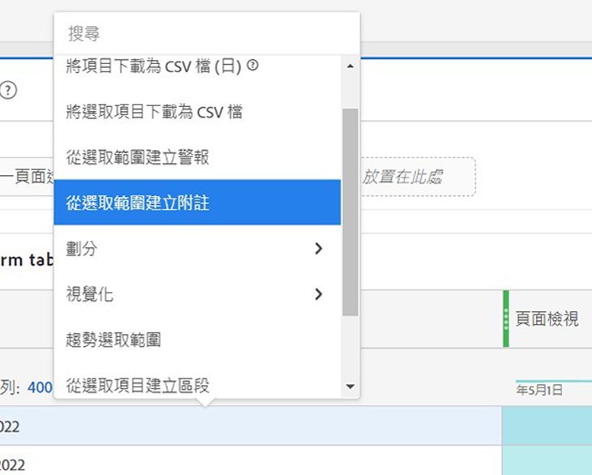
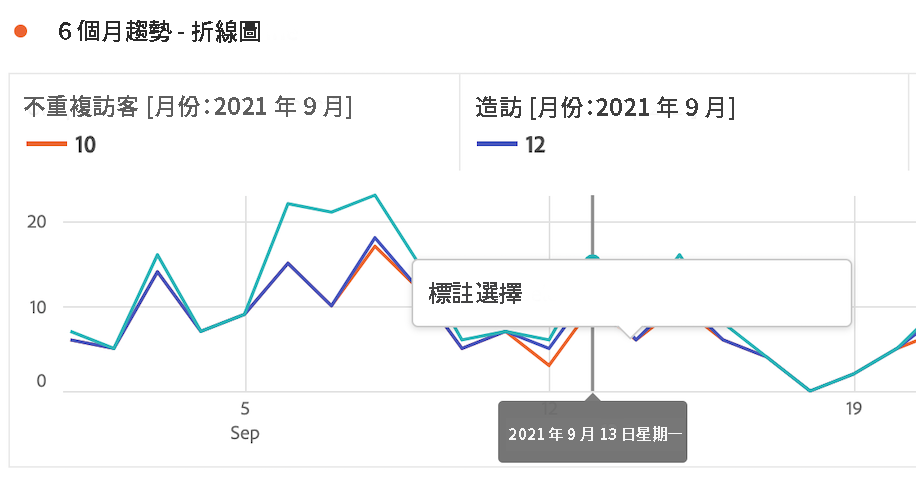
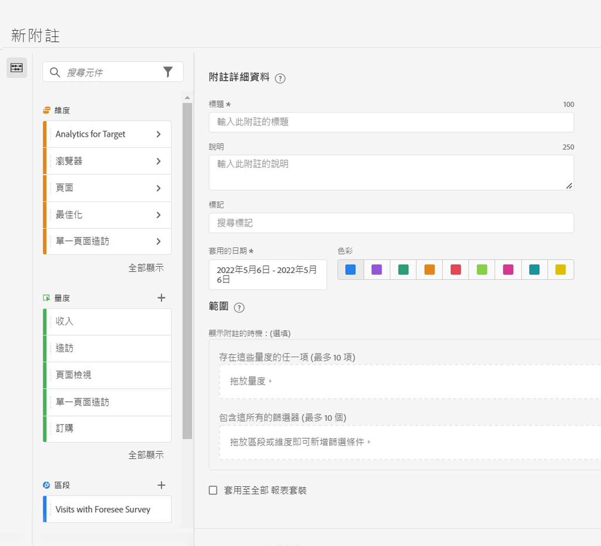

# 建立註解 {#create-annotations}

<!-- markdownlint-disable MD034 -->

>[!CONTEXTUALHELP]
>id="components_annotations_details"
>title="註解詳細資料"
>abstract="註解讓您能夠有效地將內容相關的資料細微差別和深入解析傳達給您的組織。 註解讓您將行事曆事件和特定的維度/量度連結起來。"

<!-- markdownlint-enable MD034 -->

<!-- markdownlint-disable MD034 -->

>[!CONTEXTUALHELP]
>id="components_annotations_scope"
>title="範圍"
>abstract="您可以透過範圍自訂將要新增註解的資料。計算量度和區段不會自動繼承套用至其定義中所用元件的註解。您可以將新的計算量度新增至現有註解的範圍區段。新區段需要新的註解。"

<!-- markdownlint-enable MD034 -->

根據預設，只有管理員才能建立註解。使用者有權檢視註解，就像檢視其他 Analytics 元件一樣 (例如區段、計算量度等)。

但是，管理員可以透過 [Adobe Admin Console](https://experienceleague.adobe.com/docs/analytics/admin/admin-console/permissions/analytics-tools.html) 將「[!UICONTROL 註解建立]」權限 (Analytics 工具) 授予使用者。

1. 有幾種方法可以開始建立註解：

| 建立方法 | 詳細資料 |
| --- | --- |
| **前往 [!UICONTROL Analytics] > [!UICONTROL 元件] > [!UICONTROL 註解]。** | 註解管理員頁面隨即開啟。 按一下[!UICONTROL 建立新註解]，[!UICONTROL 註解產生器]隨即開啟。 |
| **以滑鼠右鍵按一下表格上的點。** | 隨即開啟[!UICONTROL 註解產生器]。 請注意，根據預設，以這種方式建立的註解只會出現在其建立所在的專案中。 但是您可將這些註解提供給所有專案使用。 也請注意，系統已填入日期及任何量度等。
 |
| **以滑鼠右鍵按一下[!UICONTROL 折線]圖中的點。** | 隨即開啟[!UICONTROL 註解產生器]。 請注意，根據預設，以這種方式建立的註解只會出現在其建立所在的專案中。 但是您可將這些註解提供給所有專案使用。 也請注意，系統已填入日期及任何量度等。
 |
| **在 Workspace 中，前往[!UICONTROL 元件] > [!UICONTROL 建立註解]。** | 隨即開啟[!UICONTROL 註解產生器]。 |
| **使用此快速鍵**&#x200B;來開啟註解產生器：(PC) `ctrl` `shift` + o，(Mac) `shift` + `command` + o | 請注意，使用快速鍵建立註解時，您會為目前日期建立單日註解，而不會預先選取任何範圍 (量度或維度)。 |

{style="table-layout:auto"}

1. 填入[!UICONTROL 註解產生器]元素。

   

   | 元素 | 說明 |
   | --- | --- |
   | [!UICONTROL 僅限專案的註解] | 預設情況下，註解會套用在目前的專案。若勾選此方框，即可讓註解用於您擁有的所有專案。
  |
   | [!UICONTROL 標題] | 為註解命名，例如，「紀念日」 |
   | [!UICONTROL 說明] | (選用) 提供註解的說明，例如，「美國的國定假日」。 |
   | [!UICONTROL 標記] | (選用) 透過建立或套用標記來編排註解。 |
   | [!UICONTROL 套用的日期] | 選取需要出席的活動日期或日期範圍，使註解能夠顯示。 |
   | [!UICONTROL 顏色] | 在註解上套用顏色。註解會顯示在所選取顏色的專案中。顏色可用於將註解分類，例如，國定假日、外部活動、追蹤問題等。 |
   | [!UICONTROL 範圍] | (選用) 拖放會觸發註解的量度。然後拖放作為篩選器的維度或區段 (即註解將藉以顯示)。如果您不指定範圍，註解將套用至您所有的資料。<ul><li>**[!UICONTROL 出現這些量度的任一項]**：最多拖放 10 個可觸發註解顯示的量度。</li><li>**[!UICONTROL 包含這所有的篩選器]**：最多拖放 10 個做為註解顯示時機之篩選器的維度或區段。</li></ul>
使用案例：eVar 阻止了收集特定日期範圍的資料。將 eVar 拖曳至「**[!UICONTROL 出現這些量度的任一項]**」對話框中。否則您的[!UICONTROL 瀏覽]量度不會報告任何資料 - 遵循相同程序。
**注意：**&#x200B;套用到元件然後當作計算量度或區段定義使用的任何註解都不會自動繼承該註解。 必須也將所需的計算量度新增到範圍區段中，才能顯示該註解。 不過，應該針對您想要加入相同資訊當作註解的任何區段建立新的註解。
例如，您可將註解套用到特定日子的[!UICONTROL 訂單]。 然後您可將計算量度中的[!UICONTROL 訂單]用於相同日期範圍。 新的計算量度不會自動顯示訂單的註解；也必須也將計算量度新增到範圍區段中，才能顯示該註解。 |
   | [!UICONTROL 套用於所有報表套裝] | 預設情況下，註解會套用在原始的報表套裝。若勾選此方框，您即可將註解套用在公司的所有報表套裝。 |

   {style="table-layout:auto"}

1. 按一下「**[!UICONTROL 儲存]**」。
