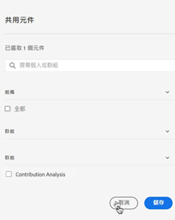

# 管理注釋

>[!NOTE]
>
>此功能當前正在有限的測試中。

的 [!UICONTROL 元件] > [!UICONTROL 注釋] manager提供了多種管理注釋的方法，如共用、篩選、標籤、批准、複製、刪除和標籤為收藏夾。

的 [!UICONTROL 注釋] manager向您顯示您擁有的所有注釋，這些注釋已作用於所有項目，並且已與您共用。

>[!NOTE]
>
>[!UICONTROL 注釋] 您僅為特定項目建立的項目不顯示在經理中。

## 注釋管理器用戶介面

| UI元素 | 說明 |
| --- | --- | 
| [!UICONTROL 標題和說明] | 在注釋生成器中提供。 要編輯標題和說明，請按一下標題連結 — 這將帶您返回到注釋生成器。 |
| [!UICONTROL 報表套裝] | 此注釋適用的報表套件。 |
| [!UICONTROL 所有者] | 指示批注的所有者。 作為非管理員，您只能查看您擁有的或與您共用的注釋。 |
| [!UICONTROL 應用日期範圍] | 此批注應用於的日期或日期範圍。 |
| [!UICONTROL 共用對象] | 列出與注釋共用的個人或組數。 按一下以獲取更多詳細資訊。 |
| [!UICONTROL 修改日期] | 顯示上次修改批注的日期和時間。 |

## 編輯注釋

編輯注釋意味著您可以調整日期範圍、顏色、範圍，或者它是否適用於所有報表套件或項目。 可以通過兩種方式編輯注釋：

* 在折線圖中，將滑鼠懸停在注釋上，然後按一下跨距內的鉛筆表徵圖。

* 在 [!UICONTROL 注釋管理器]，按一下注釋標題。

這兩個選項都將您重新置於注釋生成器中。 您可以在此處進行必要的調整並保存新版本。

## 共用批注

1. 選擇要共用的注釋並按一下 [!UICONTROL 共用]。

1. 在 [!UICONTROL 共用元件] 對話框，搜索要與其共用注釋的個人或組。

1. 下 [!UICONTROL 組織],...。

1. 按一下「[!UICONTROL 儲存]」。

## 標籤注釋

要跟蹤

