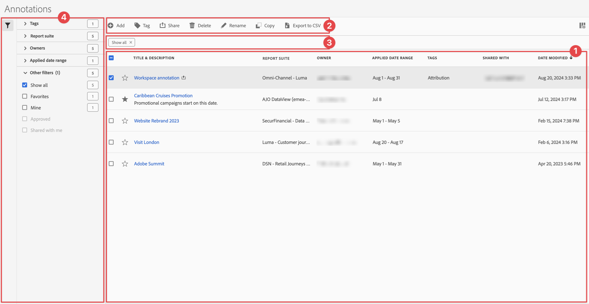
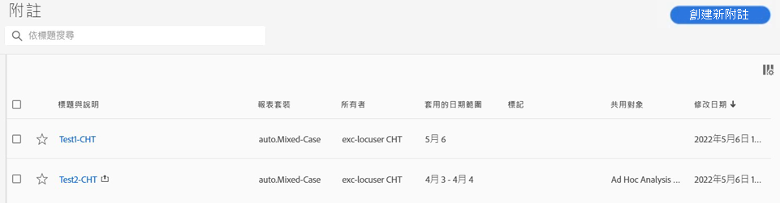

# 管理註解

您可以從中央「[!UICONTROL 註解]」管理介面共用、篩選、標記、核准、複製、刪除註解或將註解標記為最愛項目。若要管理註解：

* 在主介面中選取&#x200B;**[!UICONTROL 元件]**，然後選取&#x200B;**[!UICONTROL 註解]**。

>[!NOTE]
>
>您在特定 Workspace 專案中建立的註解不會出現在[!UICONTROL 註解]管理員中，除非您已將註解設定為可供所有專案使用。
>

## 註解管理器

註解管理器具有以下介面元素：

### 註解清單

註解清單➊會顯示您擁有的所有註解、已設定您所有專案範圍的註解，以及與您共用的註解。 清單有以下欄位：

| 欄 | 說明 |
| --- | --- | 
|  | 選取將註解設為最愛項目或取消最愛項目。 |
| **[!UICONTROL 標題和說明]** | 在註解產生器中提供。如要編輯標題和說明，請選取標題連結 - 開啟[註解產生器](/help/analyze/analysis-workspace/components/annotations/create-annotations.md#annotation-builder)。共用註解以表示。 |
| **[!UICONTROL 報告套裝]** | 套用此註解的報表套裝。 |
| **[!UICONTROL 所有者]** | 註解的所有者。做為使用者，您只能看到您擁有的註解或與您共用的註解。 |
| **[!UICONTROL 套用的日期範圍]** | 此註解套用的日期或日期範圍。 |
| **[!UICONTROL 標記]** | 此註解的標記。 |
| **[!UICONTROL 共用對象]** | 您共用註解的個人或群組。選取開啟「**[!UICONTROL 共用元件]**」對話框。 |
| **[!UICONTROL 修改日期]** | 顯示上次修改註解的日期和時間。 |

{style="table-layout:auto"}

使用指定要顯示的欄位。

### 動作列

您可以使用動作列➋對註解進行動作。 動作列包含以下動作：

| 圖示 | 動作 | 說明 |
|:--:|---|---|
|  | **[!UICONTROL 新增]** | 使用[註解產生器](create-annotations.md#annotation-builder)新增其他註解。 |
|  | [!UICONTROL *依標題搜尋*] | 當未選取清單中任何註解時，使用此搜尋欄位搜尋註解。 |
|  | **[!UICONTROL 標記]** | 標記所選取的註解。在&#x200B;**[!UICONTROL 標記元件]**&#x200B;對話框中，選取或取消選取所選取註解的標記。選取&#x200B;**[!UICONTROL 儲存]**&#x200B;以儲存所選取註解的標記。 |
|  | **[!UICONTROL 共用]** | 共用所選取的註解。在&#x200B;**[!UICONTROL 共用元件]**&#x200B;對話框中，您可以*搜尋個人或群組*，或者您可以選取&#x200B;**[!UICONTROL 組織]**&#x200B;或&#x200B;**[!UICONTROL 群組]**。選取&#x200B;**[!UICONTROL 儲存]**&#x200B;以儲存所選取註解的共用詳細資訊。如需更多詳細資訊，請參閱[共用註解](#share-annotations)。 |
|  | **[!UICONTROL 刪除]** | 刪除所選取的註解。系統會提示您進行確認。 |
|  | **[!UICONTROL 重新命名]** | 重新命名所選取的單一註解。選取後，您可以用內嵌方式重新命名。 |
|  | **[!UICONTROL 複製]** | 複製所選取的註解。使用相同的名稱和字尾建立新註解 (複製) |
|  | **[!UICONTROL 匯出至 CSV]** | 將註解匯出至 `Annotations List.csv` 檔案。 |

### 使用中的篩選欄

篩選器列➌顯示作用中的篩選器（如果有的話）。 您可以使用快速移除篩選條件。如果指定多個篩選條件，您可以使用&#x200B;**[!UICONTROL 移除全部]**&#x200B;來移除所有篩選條件。

### 篩選面板

您可以使用&#x200B;**[!UICONTROL 篩選器]**&#x200B;左側面板➍來篩選註解。 篩選面板顯示篩選的類型和執行該篩選的註解數量。選取以切換篩選面板的顯示內容。

若要對篩選清單進行篩選：

1. 選取開啟「篩選」面板。如果您需要更多空間顯示篩選清單，可以再次選取來關閉面板。
1. 您可以使用任何可用的 [篩選部分](#filter-sections)來篩選註解。

   >[!INFO]
   >
   >*項目*&#x200B;是指[註解清單](manage-annotations.md#annotations-list)中所顯示的註解項目。
   > 

#### 篩選部分

{{tagfiltersection}}
{{reportsuitefiltersection}}
{{ownerfiltersection}}
{{daterangefiltersection}}
{{otherfiltersfiltersection}}

[註解清單](manage-annotations.md#annotations-list)會根據您的篩選設定進行自動更新。您可以在[使用中的篩選欄](manage-annotations.md#active-filter-bar)中查看已設定的篩選。

## 編輯註解

編輯註解有兩個方式：

* 在 Workspace 專案中，使用[元件資訊](/help/analyze/analysis-workspace/components/use-components-in-workspace.md#component-info)圖示。

* 在[[!UICONTROL 註解]清單](#annotations-list)中選取註解標題。

您使用[註解產生器](/help/analyze/analysis-workspace/components/annotations/create-annotations.md#annotation-builder)來編輯註解。

## 共用註解

共用註解或使用與您共用的註解時適用以下情況：

* 您與其他使用者共用的專案中僅限專案的註解，會向那些使用者顯示。使用者無法編輯或刪除這些僅限專案的註解。
* 如果您儲存註解並直接與使用者共用，該使用者必須具有管理員權限，才能編輯和刪除註解。

* 如果是與您共用專案，則在該專案中建立的註解僅顯示在該專案中。若是直接與您共用註解，則該註解在可以顯示註解的所有專案中均會出現。

## 註解和時區

所有註解在建立時均有時間戳記，但不包含小時或時區資訊。在報表時間，會使用為面板設定的報表套裝的時區。

<!--
# Manage annotations

The [!UICONTROL Annotations manager] shows you all of the annotations that you own or that have been shared with you. Project-specific annotations do not appear here. You can use this interface to share, filter, tag, copy, delete, and favorite your annotations. Administrators can manage and approve annotations.

**[!UICONTROL Components]** > **[!UICONTROL Annotations]**

## Annotations Manager user interface

| UI Element | Description |
| --- | --- | 
| [!UICONTROL Title and Description] | Provided in the Annotations Builder. To edit the title and description, click the title link - this takes you back to the Annotations Builder.  |
| [!UICONTROL Report Suite] | The report suites that this annotation applies to.  | 
| [!UICONTROL Owner] | Indicates who owns the annotation. As a non-Admin, you can see only annotations that you own or those that were shared with you. |
| [!UICONTROL Applied Date Range] | The date or date range that this annotation applies to. |
| [!UICONTROL Shared with] | Lists how many individuals or groups that you shared the annotation with. Click for more detail. |
| [!UICONTROL Date Modified] | Shows the date and time that the annotation was last modified. |

{style="table-layout:auto"}

## Edit annotations

Editing an annotation means that you can adjust date ranges, colors, scope, or whether it applies to all report suites or projects. You can edit annotations in two ways:

* In a line chart, hover over the annotation and click the pencil icon within the popover.
* In the [!UICONTROL Annotations Manager], click the title of the annotation.

Both of these options land you back in the [!UICONTROL Annotations Builder]. There, you can make the necessary adjustments and save the new version.

## Share annotations

When sharing annotations or working with annotations that were shared with you, keep this in mind:

* If you create a project with project-only annotations, then share the project with another user, annotations cannot be edited or deleted by anyone that you share the project with.
* If you save an annotation and share it directly with a user, they can edit/delete the annotation only if they have admin rights.
* If a project is shared with you with a project-only annotation, it shows up only in that project. If the annotation is shared directly with you, it shows up in all projects where that annotation can be displayed. 

## Annotations and time zones

All annotations are created with a timestamp, but no hours or timezone information. At report time, the timezone of the panel's report suite is always applied. For example, an annotation created for Christmas Day happens on December 25 no matter what report suite timezone you are in. 

## Other annotation tasks

The Annotations manager lets Administrators edit, add, tag, delete, rename, approve, copy, export, and filter annotations. It is not visible to non-Admin users. 

Additional options are available when you select at least one annotation:

| Task | Description |
| --- | --- |
| [!UICONTROL Add] | Takes you to the Annotations builder where you can create annotations. |
| [!UICONTROL Tag] | All users can create tags for annotations and apply one or more tags to an annotation. However, you can see tags only for annotations that you own. |
| [!UICONTROL Delete] | Deleting an annotation removes it from any project in your organization. |
| [!UICONTROL Rename] | Renaming an annotation renames it in all projects that it was applied to. |
| [!UICONTROL Copy] | Creates a distinct copy with its own annotation ID, but with the same name and definition.|
| [!UICONTROL Export to CSV] | Export the annotation definition to a .csv file.|
| [!UICONTROL Filter] (left rail) | Filter by tags, report suite, owners, and other filters (Mine, Approved, Favorites, Shared with me, and Show All).|

{style="table-layout:auto"}

-->