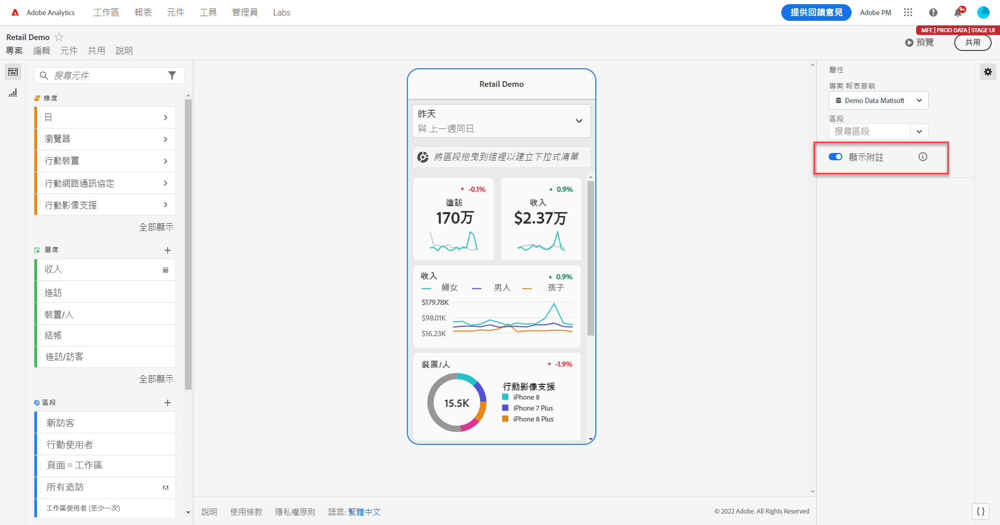
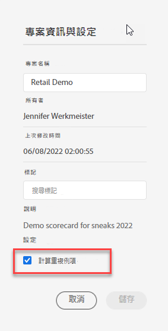

# 共用行動計分卡中的註解

您可以在行動計分卡中顯示在 Workspace 中建立的註解。行動計分卡中的註解讓您共用有關組織和行銷活動內容資料的細微差別和深入分析。

## 在行動計分卡中顯示註解

如果要顯露行動計分卡中的註解，先從 Workspace 專案或元件選單建立註解。

有關建立註解的詳細資訊，請參閱[建立註解](create-annotations.md)。行動計分卡預設為關閉註解，您想在行動計分卡中顯露的每張計分卡均必須啟用註解。

1. 開啟註解。如果想要開啟註解，請參閱[開啟或關閉註解](overview.md#turn-annotations-on-or-off)。

1. 建立註解並確保其分享到您的所有專案。請參閱[建立註解](create-annotations.md)以了解更多資訊。

1. 選取&#x200B;**[!UICONTROL 顯示註解]**&#x200B;以在行動計分卡上顯示該註解。

   

   您可以選擇確認已選取&#x200B;**[!UICONTROL 顯示註解]** (在&#x200B;**[!UICONTROL 專案]** > **[!UICONTROL 專案資訊與設定]**&#x200B;中

## 在行動計分卡中檢視註解

啟用註解時，可在計分卡產生器看到註解圖示。註解僅會顯示在詳細檢視的圖表與表格。從計分卡的主要並排檢視中無法看到註解圖示。

如果可以看到註解圖示，就無法在產生器版面中完整檢視註解或與註解互動。使用「**[!UICONTROL 預覽]**」可檢視在應用程式中出現的註解並與註解互動。

在 Workspace 中建立註解時便要選取註解顏色。灰色註解代表註解不只一個。

## 預覽註解

您可以使用「預覽」來預覽註解。選取註解以開啟註解的詳細資訊。

如果有更多註解可用，您會看到註解底部出現多個點(●)。 向左或向右滑動可切換不同註解。

<!--
# Share Annotations in Mobile Scorecards

You can display annotations that are created in Workspace in Mobile Scorecards. This allows you to share contextual data nuances and insights about your organization and campaigns directly within Mobile Scorecard projects, viewable in the Analytics dashboards mobile app.

## Surface Annotations in Mobile Scorecards

To surface annotations in mobile scorecards, create the annotation first from Workspace projects or from the components menu.

For information on creating annotations, see [Create Annotations](create-annotations.md). Annotations are turned off in mobile scorecards by default and must be enabled for each scorecard that you want to surface in mobile scorecards.

1. Turn on annotations. To turn annotations on, see [Turn annotations on or off](overview.md#annotations-on-off).

1. Create an annotation and make sure it is shared to all your projects. To create an annotation in Workspace,  see [Create Annotations](create-annotations.md).

1. Select **Show annotations** to display the annotation in Mobile Scorecards.

   

1. Confirm that show annotations is selected, go to **Project** > **Project info and settings**.

   

## View annotations in Mobile Scorecards

When annotations are enabled, annotation icons are visible in the Scorecard Builder. Annotations appear only on charts and tables in the detailed view. Annotations are not visible from the main tile view of the scorecard.

 

When annotation icons are visible, you can't fully view or interact with annotations in the builder canvas. Use the Preview mode to view and interact with annotations as they appear in the app  **Preview**.

Annotation colors are selected when the annotation is created in workspace. Gray annotations indicated the presence of more than one annotation.

## View chart annotations

| Date | Appearance |
| --- | --- |
| **Single day** |     |
| **Date range** |  |
| **Overlapping annotations** |   To view annotation details in the Analytics dashboards app, tap an annotation icon.   When viewing an annotation in a chart, you can swipe left and right to navigate all annotations present in the chart. When viewing an annotation in the table, swipe left and right to navigate all annotations associated with that row item in the table.      In charts that do not have a time-based *x axis*, such as the donut or horizontal bar charts, annotations that apply to the chart can be viewed by tapping the icon located in the lower right-hand corner.   |
-->