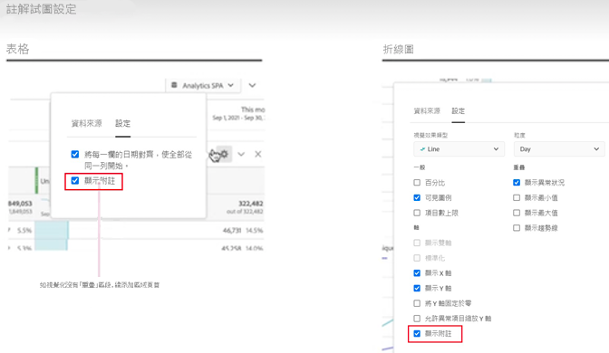
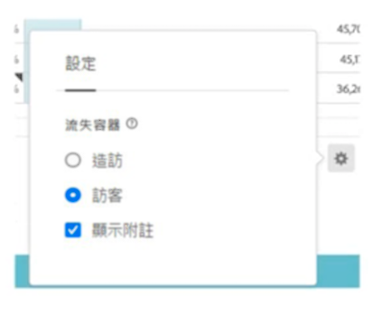

# 註解概觀

您可以利用註解，有效地向組織中其他利害關係人傳達內容相關資料的細微差別和深入分析。您可以利用註解，將行事曆事件與特定維度和量度連結。您可以用已知的資料問題、國定假日、行銷活動啟動等，針對日期或日期範圍加入註解。接著，您可以使用圖形方式顯示事件，並查看行銷活動或其他事件是否已對您的網站流量、行動應用程式使用情形、收入或任何其他量度造成影響。

例如，您與您的組織共用專案。如果您的不重複訪客數明顯下降，可以建立「**訪客數減少**」註解，而且將整個報告套裝設定為顯示範圍。您的使用者檢視包含該日期的任何報告套裝時，會在他們的專案中看到此註解以及他們的資料。

註解可以適用於：

* 單一日期或日期範圍。

* 您的整個資料集或特定量度、維度或區段。

* 建立註解的專案 (預設) 或所有專案。

* 建立註解的資料釋圖 (預設) 或所有資料釋圖。

有關建立註解時可使用的各種選項，請參閱[建立註解](create-annotations.md)。然後，您可以在[註解產生器](create-annotations.md#annotation-builder)中建置、修改和儲存註解。

您可以使用[註解管理器](manage-annotations.md)來管理註解。

## 開啟或關閉註解

可在幾個等級開啟或關閉註解：

| 層級 | 做法 |
|---|---|
| **視覺效果** | 啟用或停用 > **[!UICONTROL 設定]** > **[!UICONTROL 顯示註解]**。  |
| **專案** | 從 Workspace 專案選單中，選取&#x200B;**[!UICONTROL 專案]** > **[!UICONTROL 專案資訊和設定]**，並啟用或停用&#x200B;**[!UICONTROL 顯示註解]**。  |
| **使用者** | 從&#x200B;**[!UICONTROL 元件]**&#x200B;標籤選取&#x200B;**[!UICONTROL 偏好設定]**，或從 Workspace 專案選單中選取&#x200B;**[!UICONTROL 專案]** > **[!UICONTROL 使用者偏好設定]**。 在&#x200B;**[!UICONTROL 偏好設定]**&#x200B;中選取&#x200B;**[!UICONTROL 專案和分析]**。從左側標籤列選取&#x200B;**[!UICONTROL 資料]**。在底部，啟用或停用&#x200B;**[!UICONTROL 顯示註解]** (在&#x200B;**[!UICONTROL 自由格式表格]**&#x200B;標題下方)。  |

<!--
# Annotations overview

Annotations in Workspace enable you to effectively communicate contextual data nuances and insights to your organization. They let you tie calendar events to specific dimensions/metrics. You can annotate a date or date range with known data issues, public holidays, campaign launches, etc. You can then graphically display events and see whether campaigns or other events have affected your site traffic, revenue, or any other metric.

For example, let's say you are sharing projects with your organization. If you had a major spike in traffic due to a marketing campaign, you could create a "Campaign launch date" annotation and scope it for your whole report suite. When your users view any data sets that included that date, they see the annotation within their projects, alongside their data.

Keep this in mind:

* Annotations can be tied to a single date or to a date range.

* They can apply to your entire data set or to specified metrics, dimensions, or segments.

* They can apply to the project in which they were created (default) or to all projects.

* They can apply to the report suite in which they were created (default) or to all report suites.

## Permissions {#permissions}

By default, only Admins can create annotations. Users have rights to view annotations like they do with other other Analytics components (such as segments, calculated metrics, etc.).

However, Admins can give the [!UICONTROL Annotation Creation] permission (Analytics Tools) to users via the [Adobe Admin Console](https://experienceleague.adobe.com/docs/analytics/admin/admin-console/permissions/analytics-tools.html?lang=zh-Hant).

## Turn annotations on or off {#annotations-on-off}

Annotations can be turned on or off at several levels:

* At the Visualization level: [!UICONTROL Visualization] settings > [!UICONTROL Show annotations]

* At the Project level: [!UICONTROL Project info & settings] > [!UICONTROL Show annotations]

* At the User level: [!UICONTROL Components] > [!UICONTROL User preferences] > [!UICONTROL Data] > [!UICONTROL Show annotations]

-->