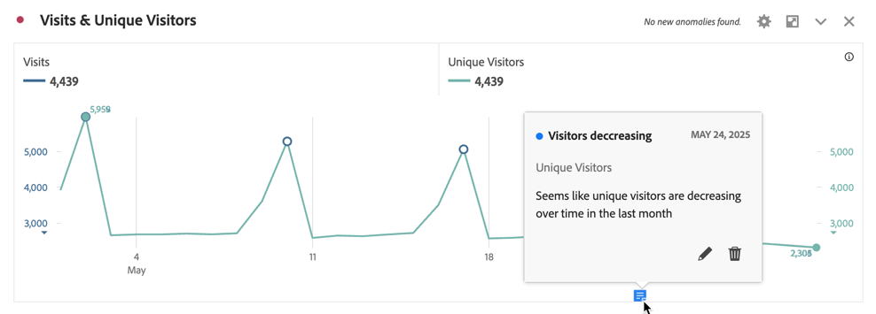

# 檢視註解

根據註解出現的位置以及橫跨一天還是日期範圍，註解的體現方式略有不同。

## 在Workspace中檢視註解

| 視覺化呈現 類型 | 說明 |
| --- | --- |
| **折線圖&#x200B;** **單日** | 當您在折線圖視覺化呈現中選取時，您會看到一個包含註解詳細資訊的快顯視窗。  如要在[註解產生器](create-annotations.md#annotation-builder) 中編輯註解，選取。若要刪除註解，請選取。 |
| **折線圖&#x200B;** **日期範圍** | 當您選取時，您會看到一個快顯視窗，其中包含註解詳細資訊，及底部有一行指示日期範圍。 如要在[註解產生器](create-annotations.md#annotation-builder) 中編輯註解，選取。若要刪除註解，請選取。 |
| **自由格式表格** | 在自由格式表格中，您可以透過視覺效果右上方的註解按鈕存取所有註解。選取以查看所有註解 (滾動清單)。  對於每個註解，您可以選取在[註解產生器](create-annotations.md#annotation-builder)中編輯註解和以刪除註解。 |

{style="table-layout:auto"}

## 在 PDF 檢視註解

當您以 PDF 形式下載專案或以 PDF 形式傳送專案時，PDF 的註解匯總在「註解摘要」區段。

<!--
# View annotations

Annotations manifest slightly differently, depending on whether they span a single day or a date range.

## View annotations in Line charts or Tables

| Date | Appearance |
| --- | --- |
| **Single day** |   
When you hover over the annotation, you can see its details, you can edit it by selecting the pen icon, or you can delete it:
  |
| **Date range** |  The icon changes and when you hover over it, the date range appears.

When you select it in the line chart, the annotation metadata appear, and you can edit or delete it:
In a table, an icon appears on every date in the date range.
|
| **Overlapping annotations** | On days that have more than one annotation tied to them, the icon appears in a grey color.

When you hover over the grey icon, all overlapping annotations appear:
 |

{style="table-layout:auto"}

## View annotations in a .pdf file

Since you cannot hover over icons in a .pdf file, this file (after export) provides notes of explanations at the bottom of a panel. Here is an example:

## View annotations with non-trended data

Sometimes annotation are shown with non-trended data, but tied to a specific dimension. In that case, they appear only in a summary annotation in the bottom right corner. Here is an example:

The summary chart appears in all visualization types in the corner, not just in non-trended freeform tables and summary numbers. It also appears in visualizations like [!UICONTROL Donut], [!UICONTROL Flow],[!UICONTROL Fallout],[!UICONTROL Cohort], and so on.

-->