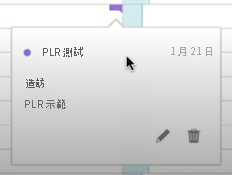
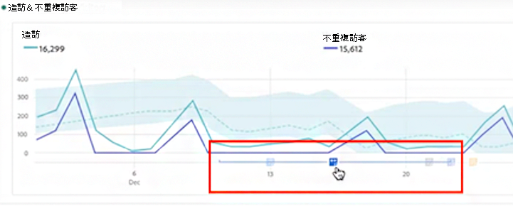
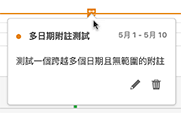
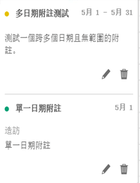
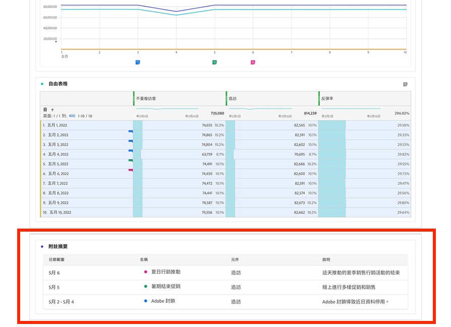

# 檢視註解

根據註解跨越一天還是跨越日期範圍，註解的體現方式略有不同。

## 在折線圖或表格中檢視註解

| 日期 | 外觀 |
| --- | --- |
| **一天** | 
當您將滑鼠停留在註解上時，您可以查看其詳細資料，您可以透過選取鋼筆圖示對其進行編輯，也可以將其刪除：
  |
| **日期範圍** | 圖示會變更，而且當滑鼠游標停留在圖示上方時，日期範圍就會出現。

當您在折線圖上將其選取時，註解中繼資料隨即顯示，您可以對其進行編輯或將其刪除：
在表格中，日期範圍內的每個日期都會出現圖示。
 |
| **重疊註解** | 在有一個以上關聯註解的日期，圖示會以灰色顯示。

將滑鼠停留在該灰色圖示上時，會顯示所有重疊的註解：
 |

{style="table-layout:auto"}

## 在 .pdf 檔案中檢視註解

由於在 .pdf 檔案中滑鼠游標無法停留在圖示上方，此檔案 (在匯出後) 會在面板底部提供解釋說明。其範例如下：

## 檢視非趨勢資料的註解

有時註解與非趨勢資料一起顯示，但繫結到特定維度。在此情況下，註解只會出現在右下角的摘要註解中。 其範例如下：

摘要圖表出現在角落的所有視覺效果類型中，而不僅僅是非趨勢自由形式表格和摘要數字中。它也會出現在[!UICONTROL 環形圖]、[!UICONTROL 流量]、[!UICONTROL 流失]、[!UICONTROL 同類群組]等視覺效果中。

