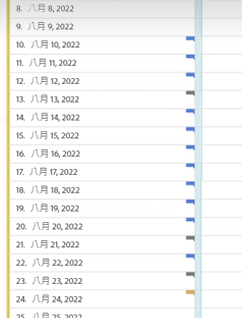

# 檢視附註

>[!NOTE]
>
>此功能目前在有限測試中。

根據附註跨越一天還是跨越日期範圍，附註的體現方式略有不同。

## 在線圖或表格中檢視附註

| 日期 | 外觀 |
| --- | --- |
| **一天** |  |
| **日期範圍** | 圖示會變更，而且當滑鼠游標停留在圖示上方時，日期範圍就會出現。

在表格中，日期範圍內的每個日期都會出現圖示。

請注意下列事項：日期若有一個以上關聯的附註，其圖示將是灰色。 |

## 在摘要圖表中檢視附註

## 在 .pdf 檔案中檢視附註

由於在 .pdf 檔案中滑鼠游標無法停留在圖示上方，此檔案 (在匯出後) 會在面板底部提供解釋說明。其範例如下：

## 查看不基於日期的注釋

有時注釋不與日期相關聯，而是與特定尺寸相關聯。 在這種情況下，它們只出現在右下角的摘要注釋中。 其範例如下：

