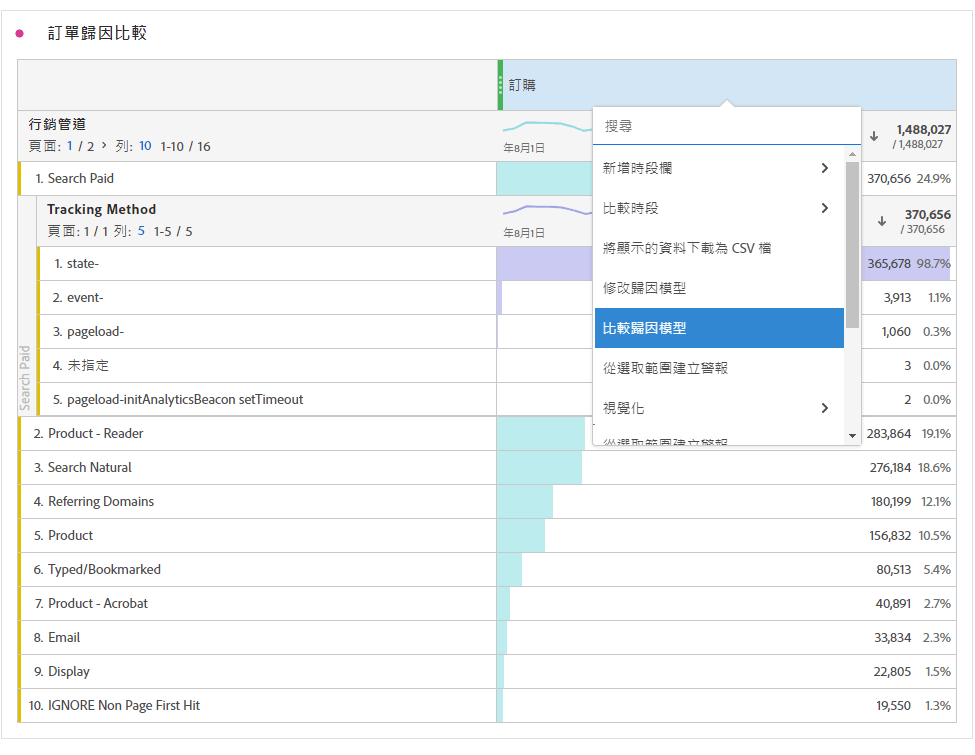

# 量度

量度可讓您量化 Analysis Workspace 中的資料點。它們最常用作視覺效果中的欄，並和維度相連結。

## 在 Analysis Workspace 中使用量度

量度在Analysis Workspace中的使用有彈性。 將量度拖曳至空白的自由格式表格，以檢視專案日期期間的量度趨勢。 您也可以拖曳出現維度時的量度，以檢視該量度與每個維度專案的比較情形。 將量度拖曳至現有量度標頭上方會取代量度，並將量度拖曳至標頭旁，可讓您並排看到兩個量度。

如需有關如何將量度和其他型別的元件新增到Analysis Workspace的資訊，請參閱[在Analysis Workspace中使用元件](use-components-in-workspace.md)。

## 量度類型

Adobe 提供了多種可用於 Analysis Workspace 中的量度類型：

* **標準量度**：您在專案中使用的大多數量度都屬於標準量度。範例包括[頁面檢視次數](/help/components/metrics/page-views.md)、[營收](/help/components/metrics/revenue.md)或[自訂事件](/help/components/metrics/custom-events.md)。如需詳細資訊，請參閱「元件」使用手冊中的[量度概觀](/help/components/metrics/overview.md)。

* **計算量度** ：以標準量度、靜態數字或演演算法函式為基礎的使用者定義量度。 使用者定義的計算量度會在可用元件清單中顯示計算機圖示。如需詳細資訊，請參閱「元件」使用手冊中的[計算量度概觀](/help/components/calculated-metrics/cm-overview.md)。

* **計算量度範本** ：Adobe定義的量度，其行為與計算量度類似。 您可以在 Workspace 專案中按原樣使用它們，或另存為副本以自訂其邏輯。計算量度範本會在可用元件清單中顯示 Adobe 圖示。

您可以檢視量度是否核准。 如果您想要瞭解量度的詳細資訊，請將滑鼠移至量度上，然後選取。 如需詳細資訊，請參閱[元件資訊](use-components-in-workspace.md#component-info)。

## 使用 Analysis Workspace 中的量度

在 Analysis Workspace 中能以多種方式使用量度。如需有關如何將量度和其他型別的元件新增到Analysis Workspace的資訊，請參閱[在Analysis Workspace中使用元件](/help/analyze/analysis-workspace/components/use-components-in-workspace.md)。

>[!BEGINSHADEBOX]

請參閱 [使用量度](https://video.tv.adobe.com/v/40817?quality=12&learn=on){target="_blank"}進行示範影片。

>[!ENDSHADEBOX]

## 建立計算量度

計算量度可讓您使用簡單的運運算元或統計函式，檢視量度彼此間的關聯性。

建立計算量度有數種方式。 您選擇的方法會決定計算量度是否可從所有專案的元件清單中使用，或僅用於建立該量度的專案。

### 為所有專案建立計算量度

您可以使用[計算量度產生器](/help/components/calculated-metrics/workflow/c-build-metrics/cm-build-metrics.md)來[建立計算量度](/help/components/calculated-metrics/workflow/cm-workflow.md)。 以這種方式建立時，計算量度可用於元件清單中，也可用於整個組織的專案。

### 為單一專案建立計算量度

您可以快速建立計算量度，該量度僅適用於建立該量度的專案。

若要建立單一專案的計算量度：

1. 在Analysis Workspace中，開啟您要建立計算量度的專案。

1. 在自由表格中，以滑鼠右鍵按一下單一欄的欄標題。

   或

   按住Shift鍵同時選取兩欄，然後以滑鼠右鍵按一下其中一個選取的欄。

1. 選取&#x200B;**[!UICONTROL 從選取專案建立量度]**

   

1. 若只要建立此專案的計算量度，請從可用的選項中選擇。

   選取單一欄時，可使用下列選項：

   * [!UICONTROL **平均值**]：建立新資料行，以顯示資料行維度元素集合中的平均值。 資料行值使用[Mean](/help/components/calculated-metrics/cm-reference/cm-functions.md#mean)函式。

   * [!UICONTROL **中位數**]：建立新資料行，顯示資料行維度元素集合的中位值。 資料行值使用[Median](/help/components/calculated-metrics/cm-reference/cm-functions.md#median)函式。

   * [!UICONTROL **資料行max**]：建立新資料行，以顯示資料行維度元素集合中的最大值。 資料行值使用[Column Maximum](/help/components/calculated-metrics/cm-reference/cm-functions.md#column-maximum)函式。

   * [!UICONTROL **資料行min**]：建立新資料行，以顯示資料行維度元素集合中的最小值。 資料行值使用[資料行最小值](/help/components/calculated-metrics/cm-reference/cm-functions.md#column-minimum)函式。

   * [!UICONTROL **資料行總和**]：建立新資料行，將資料行內量度的所有數值相加（跨越維度元素）。 資料行值使用[資料行Sum](/help/components/calculated-metrics/cm-reference/cm-functions.md#column-sum)函式。

   選取兩欄時，可使用下列選項：

   * [!UICONTROL **除**]：建立新資料行，將兩個選取資料行的值相除。

   * [!UICONTROL **減**]：建立新資料行，以減去兩個選取資料行的值。

   * [!UICONTROL **新增**]：建立新資料行，將兩個選取資料行的值相加。

   * [!UICONTROL **乘**]：建立將兩個選取資料行的值相乘的新資料行。

   * [!UICONTROL **百分比變更**]：建立新資料行，顯示兩個選取資料行之間的百分比變更。

[計算量度：實作較少的量度](https://experienceleague.adobe.com/zh-hant/docs/analytics-learn/tutorials/components/calculated-metrics/calculated-metrics-implementationless-metrics) (3:42)

## 比較不同歸因模型的量度

若要快速比較不同的歸因模型，請在量度上按一下滑鼠右鍵，然後選取&#x200B;**[!UICONTROL 比較歸因模型]**：

此快速鍵可讓您比較不同的歸因模型，而無須再次拖曳量度和進行設定。

## 使用[!UICONTROL 累積平均]函數以套用量度平滑處理

以下是有關該主題的影片：

>[!BEGINSHADEBOX]

如需示範影片，請參閱 [累積平均值](https://video.tv.adobe.com/v/27068?quality=12&learn=on){target="_blank"}。

>[!ENDSHADEBOX]

