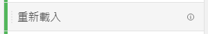
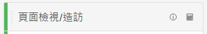
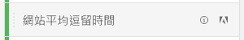

# 量度

量度可讓您量化 Analysis Workspace 中的資料點。它們最常用作視覺效果中的欄，並和維度相連結。

## 量度類型

Adobe 提供了多種可用於 Analysis Workspace 中的量度類型：

* **標準量度**：您在專案中使用的大多數量度都屬於標準量度。範例包括[頁面檢視次數](/help/components/metrics/page-views.md)、[營收](/help/components/metrics/revenue.md)或[自訂事件](/help/components/metrics/custom-events.md)。如需詳細資訊，請參閱「元件」使用手冊中的[量度概觀](/help/components/metrics/overview.md)。

  

* **計算量度**：以標準量度、靜態數字或演算法函式為根據的使用者定義量度。使用者定義的計算量度會在可用元件清單中顯示計算機圖示。如需詳細資訊，請參閱「元件」使用手冊中的[計算量度概觀](/help/components/c-calcmetrics/cm-overview.md)。

  

* **計算量度範本**：Adobe 定義的量度，其行為會類似計算量度。您可以在 Workspace 專案中按原樣使用它們，或另存為副本以自訂其邏輯。計算量度範本會在可用元件清單中顯示 Adobe 圖示。

  

## 使用 Analysis Workspace 中的量度

在 Analysis Workspace 中能以多種方式使用量度。如需有關如何將量度和其他型別的元件新增到Analysis Workspace的資訊，請參閱[在Analysis Workspace中使用元件](/help/analyze/analysis-workspace/components/use-components-in-workspace.md)。

>[!VIDEO](https://video.tv.adobe.com/v/40817/?quality=12)

## 計算量度

計算量度可讓您使用簡單的運算子或統計函式輕鬆查看量度彼此間的關係。建立計算量度的方式有好幾種：

* 按一下左側元件清單下量度標頭旁的加號圖示。
* 瀏覽至&#x200B;**[!UICONTROL 元件]** > **[!UICONTROL 計算量度]** > **[!UICONTROL 新增]**。
* 已選取一個或多個標頭欄儲存格時，在欄標頭上按一下右鍵 > **[!UICONTROL 根據選取範圍建立量度]**。此選項會自動為您建立計算量度，無需使用計算量度規則產生器。

[計算量度：實作較少的量度](https://experienceleague.adobe.com/docs/analytics-learn/tutorials/components/calculated-metrics/calculated-metrics-implementationless-metrics.html?lang=zh-Hant) (3:42)

## 比較不同歸因模型的量度

如果您想要快速輕鬆地比較一個歸因模型與另一個歸因模型，請在量度按一下右鍵，然後選取「**[!UICONTROL 比較歸因模型]**」：

此快速鍵可讓您輕鬆快速地比較不同的歸因模型，而無須再次拖曳量度和進行設定。

## 使用[!UICONTROL 累積平均]函數以套用量度平滑處理

以下是有關該主題的影片：

>[!VIDEO](https://video.tv.adobe.com/v/27068/?quality=12)
