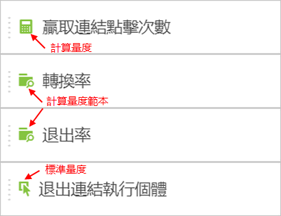
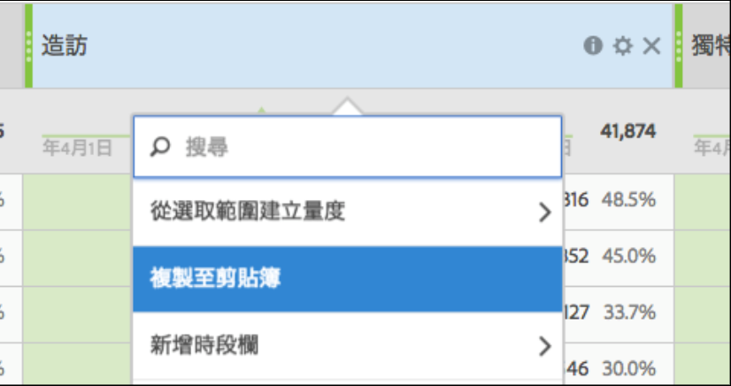

# 量度

在 Analysis Workspace 中使用量度有兩種方式。

您可以從[!UICONTROL 元件]功能表將標準量度、計算量度或計算量度範本拖曳至表格中:

> [!NOTE] 雖然這項操作看似簡單，但使用量度帶來的效果卻相當強大。將合適的量度拖曳至表格的量度區，就能新增量度到報表。您也可以依量度來劃分維度，讓您更精確地控制表格檢視。此外，您可以將量度當作維度插入表格，維度則當作量度，藉此建立特定時段報表。您可以盡情組合不同元件，瞭解各種效果。量度的可能性是無限的。

或者，您可以按一下&#x200B;**[!UICONTROL 「元件]** &gt; **[!UICONTROL 新增量度」]**。這會將您帶往「[計算量度產生器](https://marketing.adobe.com/resources/help/zh_TW/analytics/calcmetrics/)」，讓您從現有的量度建立自訂量度。

為了更方便快速建立計算量度，已將&#x200B;**[!UICONTROL 「從選取範圍建立量度」]**&#x200B;新增至自由表格中的欄滑鼠右鍵功能表。只要選取一個或多個標題欄儲存格，就可以看到這個選項。

[在 YouTube 觀看「使用參與率量度」](https://www.youtube.com/watch?v=ngmJHcg65o8&amp;list=PL2tCx83mn7GuNnQdYGOtlyCu0V5mEZ8sS&amp;index=32)(4:16)
