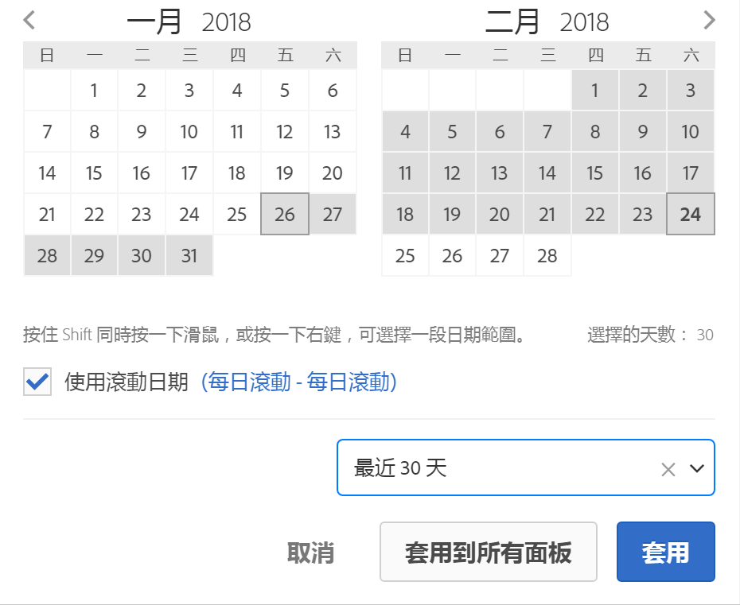

# 日曆和日期範圍概述

在日曆中，您可以指定日期和日期範圍，也可以選取預設集。

日曆選取範圍套用至面板層級，但您也可以選擇將其套用至所有面板。預設狀況下，Workspace 日曆會顯示當月與上個月。

按第一下會啟動日期範圍選取。接著往前或往後反白標示範圍，按第二下則可選取結束日期範圍。若此 `Shift`鍵在點選第一次日期時為按住狀態 (或已使用右鍵)，則會將該日期附加至範圍。

您也可以將日期 (和時間維度) 拖曳至 Workspace 專案中。您可以選取特定的日、週、月、年或滾動日期。

[在YouTube分析工作區中使用日期範圍和日曆](https://www.youtube.com/watch?v=L4FSrxr3SDA&list=PL2tCx83mn7GuNnQdYGOtlyCu0V5mEZ8sS&index=28) (4：07)

| 設定 | 說明 |
|--- |--- |
| 選擇的天數 | 選取的日/周/月/年。 |
| 使用滾動日期 | 滾動日期可讓您根據執行報表的時間，產生向前或向後一段時間的動態報表。例如，如果您想報告「上個月」進行的所有「訂購」(根據「已建立日期」欄 位) 並在 12 月執行該報表，您就會看到在 11 月進行的訂購。如果在 1 月執行該報表，則會看到在 12 月進行的訂購。日期預覽: 指出滾動日曆包含的時間期間。開始: 您可在當日、當週、當月、當季、今年之間做選擇。結束: 您可在當日、當週、當月、當季、今年之間做選擇。For an example, go [here](/help/analyze/analysis-workspace/components/calendar-date-ranges/custom-date-ranges.md). |
| 日期範圍 | 可讓您挑選預設日期範圍。「最近 30 天」是預設值。 |
| 套用到所有面板 | 可讓您不僅變更目前面板的選定日期範圍，也同時變更專案中的所有其他面板。 |
| 套用 | 僅將日期範圍套用至此面板。 |
