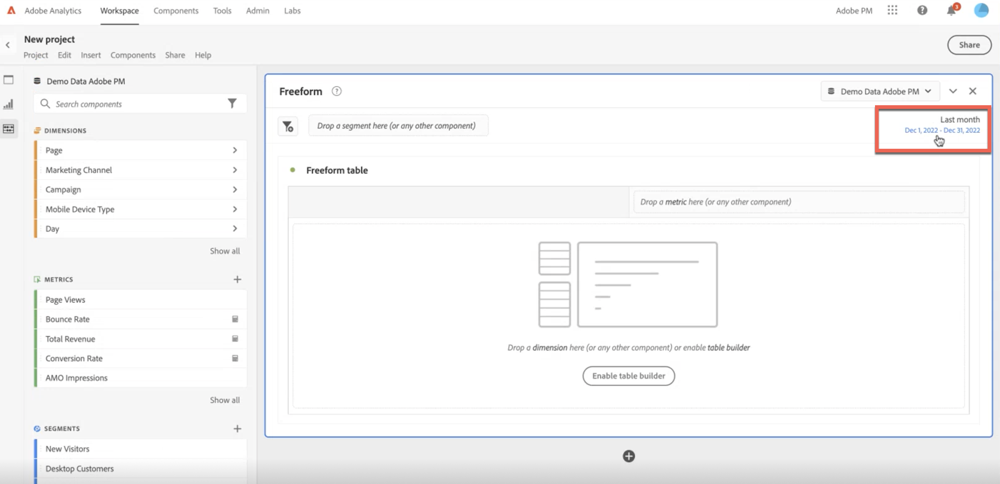

# 日曆和日期範圍概述

在日曆中，您可以指定日期和日期範圍，也可以選取預設集。

以下是有關在 Analysis Workspace 中使用日期範圍和行事曆的影片：

>[!VIDEO](https://video.tv.adobe.com/v/23973/?quality=12)

行事曆選取範圍會套用至面板層級，但您也可以選擇將其套用至所有面板。 按一下工作區中的日期範圍時，介面會顯示目前的日曆月份和上一個日曆月份。按一下這兩個日曆各自上方角落的向右和向左箭頭，即可進行調整。

{width="60%"}

## 選取並套用日期範圍 {#select-apply}

在日曆上按第一下會開始進行日期範圍選取。按第二下會完成日期範圍選取，並反白顯示選取的範圍。如果按住 `Shift` 鍵 (或使用滑鼠右鍵)，則會附加至目前選取的範圍。

您也可以將日期 (和時間維度) 拖曳至工作區專案中。您可以選取特定的日、週、月、年或滾動日期。

[在 Analysis Workspace 中使用日期範圍和行事曆](https://experienceleague.adobe.com/docs/analytics-learn/tutorials/analysis-workspace/calendar-and-date-ranges/using-dates-in-analysis-workspace.html?lang=zh-Hant) (4:07)

| 設定 | 說明 |
|--- |--- |
| 選擇的天數 | 所選日/週/月/年。 |
| 使日期範圍元件相對於面板行事曆 | 如果停用，在表格、視覺效果或面板拖放區域中使用的任何日期範圍元件都會覆寫面板行事曆。 
如果啟用，表格、視覺效果或面板放置區域內使用的任何日期範圍元件都會與面板日期範圍相關。 例如，如果面板日期範圍設為11月1日到11月30日，而自由表格中使用了「上週」日期範圍元件，則自由表格中的資訊會參照10月的最後一週。 |
| 使用滾動日期 | 您可以使用滾動日期，根據執行報告的時間來產生動態報告，往前或往後查看一段時間的情況。舉例來說，如果您想在報表中加入「上個月」所下的所有「訂單」資料 (以「已建立日期」欄位為依據) 並在 12 月執行報表運算，您就會在報表中看到 11 月下的訂單。如果在 1 月執行相同報表運算，則會看到在 12 月下的訂單。<ul><li>**[!UICONTROL 日期預覽]**：指出滾動日曆包含的時間期間。</li><li>**[!UICONTROL 開始]**：您可在當日、當週、當月、當季、今年之間做選擇。</li><li>**[!UICONTROL 結束]**：您可在當日、當週、當月、當季、今年之間做選擇。</li></ul>若要檢視範例，請參閱[自訂日期範圍](/help/analyze/analysis-workspace/components/calendar-date-ranges/custom-date-ranges.md)。 預設為已選取。 |
| 日期範圍 | 可讓您挑選預設日期範圍。「最近 30 天」是預設值。**[!UICONTROL 本週/月/季/年 (不包括今天)]** 可讓您從不包含今天部分日資料的日期範圍進行選擇。 |
| 套用到所有面板 | 可讓您不僅變更目前面板的選定日期範圍，也同時變更專案中的所有其他面板。 |
| 套用 | 僅將日期範圍套用至此面板。 |

## 關於相對面板日期範圍 {#relative-panel-dates}

如果您在 Workspace 中進行創作，則可以使日期範圍元件設為相對於面板行事曆。您最常見到三種相對面板日期生效的使用範例包含組合圖表、關鍵量度摘要和自由格式表格日期範圍。

若要使用相對面板日期範圍

1. 選取「**工作區**」標籤。
1. 選取&#x200B;**「空白專案」**。
1. 從左側邊欄新增維度、量度和區段。
1. 按一下面板日期範圍欄位以切換相關面板日期範圍設定。
1. 選取「**使日期範圍元件相對於面板行事曆**」。
   * 選取該選項以使日期範圍元件相對於面板行事曆。如果選取相對日期，則滾動日期將以面板行事曆的開始日期為準，而不是以今天日期為準。
   * 如果未選取此選項，則滾動日期將以今天日期為準。

   {width="60%"}

1. 按一下&#x200B;**套用**。相對日期顯示在右上角。

   

## 相對面板日期範圍的應用準則 {#guidelines}

使用相對面板日期範圍時，請記住以下應用準則。

### 公式和相對日期範圍 {#formula-relative-dates}

如果您選取相對的日期，則所有日期公式將使用面板的開始日期做為起點。

### 自訂行事曆和相對日期範圍 {#custom-calendar-formulas}

當您使用以週為準的自訂行事曆並新增月份或年份時，該公式會計算特定期限內的日 (day) 偏移數。 由於偏移的關係，實際日期可能會有所不同。 公式會選擇落在自訂行事曆內同一個位置的日期。 例如，自訂行事曆中第三週的第三個星期五。

### 關於使用滾動日期和相對面板日期範圍的區段 {#segments-relative-dates}

如果您建立一個區段或使用具有滾動日期的區段，例如，過去 7 天或過去 2 週，且您點選區段預覽，此時，系統將從&#x200B;*今天*&#x200B;開始滾動日期，而不是從面板開始日期來滾動。因此，當您實際使用表中的區段時，區段的預覽將不相符。預覽會受影響，而區段本身不會受影響。

## 面板日期範圍和預覽的應用準則 {#guidelines-panel-dates}

* 從 2 月版開始，元件和資料預覽將依據面板日期範圍顯示，而不是過去 90 天。
* 左側邊欄中列出的所有元件都將根據面板日期範圍提供。
* 區段和計算量度產生器中的所有日期預覽都將依據面板日期範圍 (除非從沒有關聯面板的元件管理員存取，則仍將依據過去 90 天) 顯示。
* 任何資料預覽都將依據面板日期範圍顯示資料或元件。