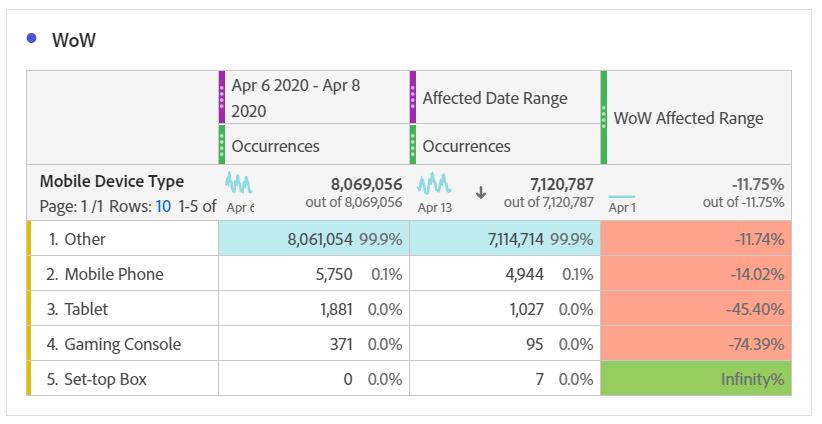
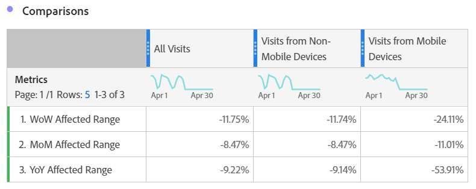

# 比較受事件影響的日期與先前的範圍

如果您的資料受 [到事件影響](/help/technotes/event-impacted.md)，您可以檢視歷史趨勢來評估其影響。 此比較對於瞭解事件對資料的影響程度非常有用，因此您可以決定要排除資料、新增附註至報表或忽略資料。

## 建立包含事件的日期範圍

建立包含事件的日期範圍，以開始探索該事件的影響。

1. 導覽至 **[!UICONTROL Components]** > **[!UICONTROL Date ranges]**。
2. 按一下 **[!UICONTROL Add]**.
3. 選擇事件發生的日期範圍。 按一下 **[!UICONTROL Save]**.

   

## 並排檢視事件日期和類似的先前範圍

您可以使用自由表格視覺化功能，比較事件日期範圍與先前日期範圍相似之間的任何度量。

1. 開啟工作區專案，並將「日」維度新增至自由表格。 套用堆疊在量度上的最近建立日期範圍，例如「發生次數」。

   

2. 以滑鼠右鍵按一下日期範圍，然後按一 **[!UICONTROL Add time period column]** 下> **[!UICONTROL Custom date range to this date range]**。
   * 如需一週比較，請選取事件範圍減去7天。 請確定該事件與此日期範圍之間的一週中的天數一致。
   * 如需月與月的比較，請選取上個月的事件範圍。 如果您想要對齊一週中的天數，也可以選取事件範圍減去28天。
   * 對於年度比較，請選取去年的活動範圍。
3. 當您選取所需的日期範圍時，這些日期範圍會新增至自由表格。 您可以按一下滑鼠右鍵，然後新增您想要比較的多個日期範圍。

   

## 計算事件與相似先前範圍之間的百分比差異

使用自由表格視覺化功能，比較事件日期範圍和類似先前日期範圍之間的維度值。 這些步驟說明您可以遵循的一週比一週的範例。

1. 開啟工作區專案，並新增非 **時間維度至自由表格** 。 例如，您可以使用「行動裝置類型」維度。 套用堆疊在量度上的最近建立日期範圍，例如「發生次數」:

   

2. 以滑鼠右鍵按一下日期範圍，然後按一 **[!UICONTROL Compare time periods]** 下> **[!UICONTROL Custom date range to this date range]**。 選取事件範圍減去7天。 請確定該事件與此日期範圍之間的一週中的天數一致。

   

3. 將產生的「百分比變更」量度重新命名為更具體的量度，例如「WoW受影響範圍」。 按一下資訊圖示，然後按一下編輯鉛筆以編輯量度名稱。

   

4. 重複步驟3和4以進行月與年的比較。 您可以在相同的表格或單獨的表格中執行此操作。

## 將比較日期範圍並排分析為列

如果您想進一步分析上述百分比變更，可將它們轉換為行。

1. 新增自由表格視覺化並啟用表格產生器。 此動作可讓您依所需順序放置百分比變更量度。
2. 按住 `Ctrl` (Windows) `Cmd` 或(Mac)，並將3%變更量度拖曳至表格的列中，一次拖曳一列。

   

3. 將「所有瀏覽」區段新增至表格的欄，以及任何其他所需區段。

   

4. 按一下 **[!UICONTROL Build]**. 從產生的表格中，您可以檢視任何所需區段的受影響範圍與上一週、月和年的比較。

   
