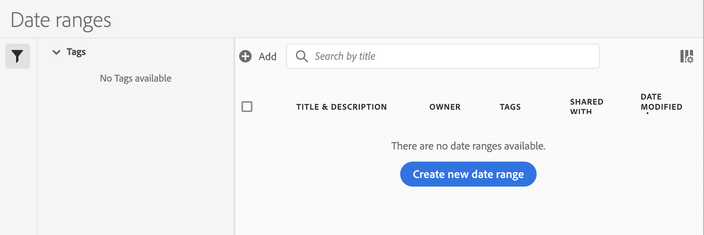
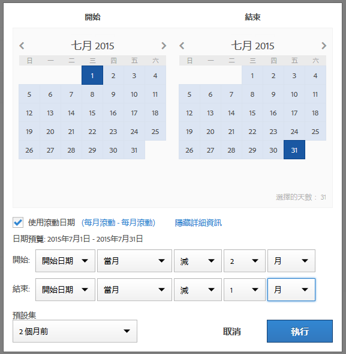
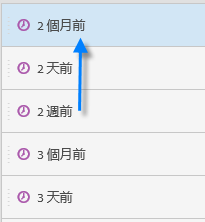
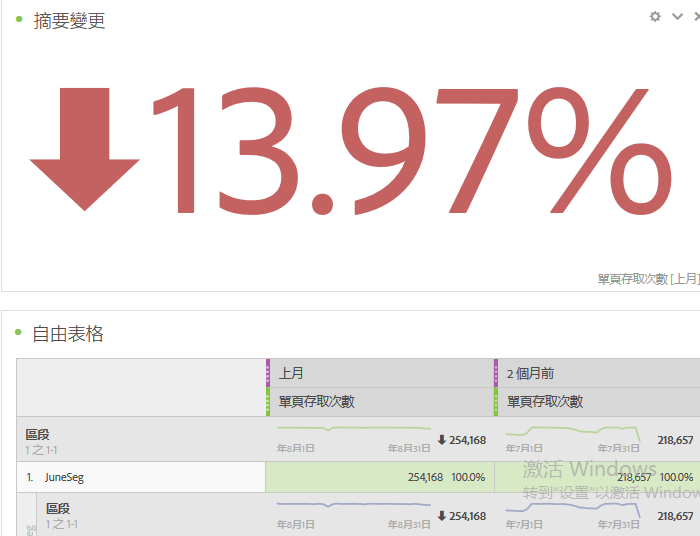
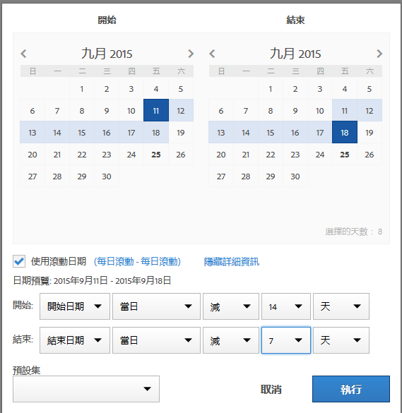

# 建立自訂日期範圍

您可以在Analysis Workspace中建立自訂日期範圍，並將其儲存為「時間」元件。

如需有關將現有日期範圍新增至專案的資訊，請參閱 [日曆和日期範圍概觀](/help/analyze/analysis-workspace/components/calendar-date-ranges/calendar.md).

若要建立自訂日期範圍：

1. 在Adobe Analytics中，選取 **[!UICONTROL 元件]** > **[!UICONTROL 日期範圍]**.

   

1. 選取 [!UICONTROL **建立新的日期範圍**].

1. 在日期範圍產生器中，指定下列資訊：

   | 選項 | 說明 |
   |---------|----------|
   | [!UICONTROL **標題**] | 日期範圍的標題，當使用者在Analysis Workspace中選取日期範圍時就會顯示。 |
   | [!UICONTROL **說明**] | 日期範圍的說明。 |
   | [!UICONTROL **標記**] | 您要套用至日期範圍的任何標籤。 |
   | [!UICONTROL **日期範圍**] | 可讓您挑選自訂日期範圍。 依預設，會選取最近30天。 |
   | [!UICONTROL **預設集**] | 從預設日期範圍清單中選擇，例如 [!UICONTROL **昨天**]， [!UICONTROL **過去7天**]， [!UICONTROL **過去30天**]，以此類推。 |
   | [!UICONTROL **開始時間**] | 日期範圍開始的當天時間。 |
   | [!UICONTROL **結束時間**] | 日期範圍結束的當日時間。 |
   | [!UICONTROL **使用遞延日期**] | 滾動日期可讓您根據執行報表的時間，產生向前或向後一段時間的動態報表。舉例來說，如果您想在報表中加入「上個月」所下的所有「訂單」資料 (以「已建立日期」欄位為依據) 並在 12 月執行報表運算，您就會在報表中看到 11 月下的訂單。如果在 1 月執行相同報表運算，則會看到在 12 月下的訂單。<ul><li>**[!UICONTROL 日期預覽]**：指出滾動日曆包含的時間期間。</li><li>**[!UICONTROL 開始]**：您可在當日、當週、當月、當季、今年之間做選擇。</li><li>**[!UICONTROL 結束]**：您可在當日、當週、當月、當季、今年之間做選擇。</li></ul> 預設為已選取。 |

1. 選取「[!UICONTROL **儲存**]」。

## 範例：「兩個月前」的日期範圍 {#section_C4109C57CB444BB2A79CC8082BD67294}

下列自訂日期範圍會顯示「兩個月前」的日期範圍，而「摘要變更」視覺效果會顯示方向變化。

自訂日期範圍會顯示在您專案中的「[!UICONTROL 日期範圍]」元件面板上方：

您可將此自訂日期範圍拖曳至使用「上個月」預設集之自訂每月滾動日期範圍旁的欄中，用以進行比較。新增「摘要變更」視覺效果並選取每個欄的總計，顯示方向變化：

## 範例：使用7天滾動日期範圍 {#section_7EF63B2E9FF54D2E9144C4F76956A8DD}

您可以建立日期範圍，指定一週前結束的7天滾動時段：

使用 *`rolling daily`*.

* 開始設定是 *`current day minus 6 days`*。

* 結束設定是 *`current day minus 7 days`*。

您可將此日期範圍當做元件，拖曳至其他自由表格上。
