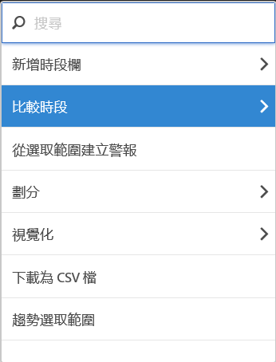
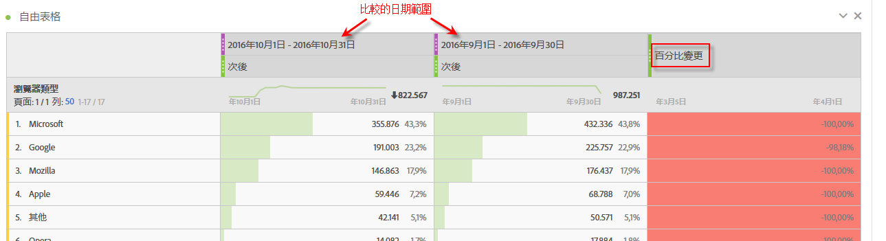
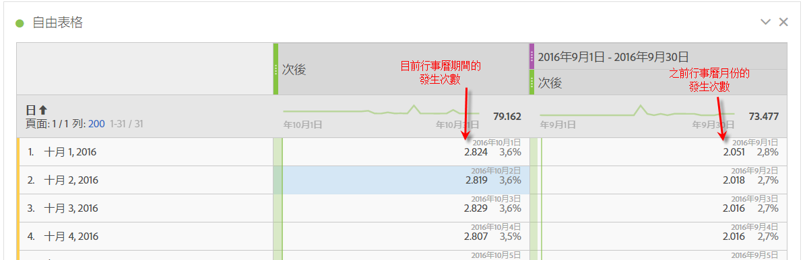
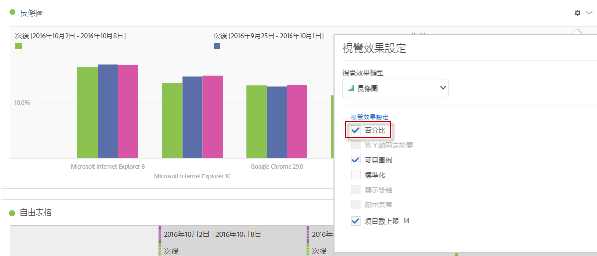
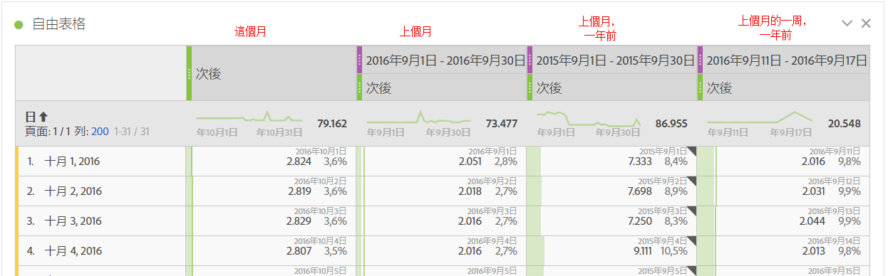
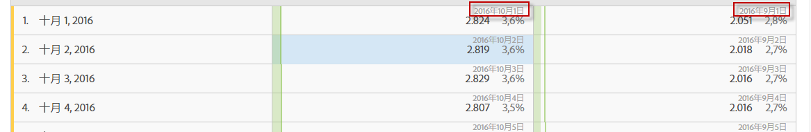
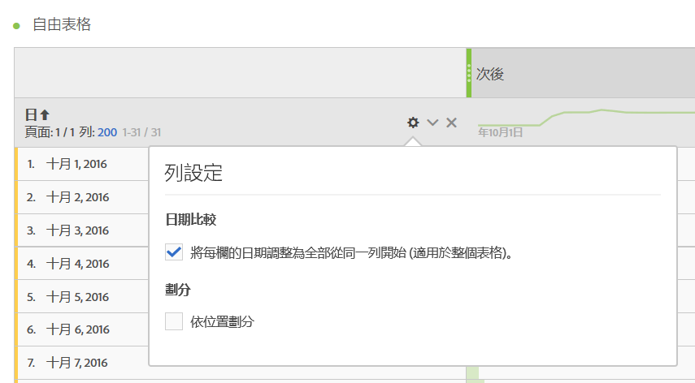

# 日期比較

您可以利用 Analysis Workspace 的「日期比較」功能，選取任何含有日期範圍的欄並建立常見的日期比較，例如逐年比較、逐季比較、逐月比較等。

## 比較時段

分析需要相關內容，而通常那些內容會由先前的時段提供。例如，「*您的表現與去年同時期比較，有多大改善或退步？」這個問題*&#x200B;是了解您的企業的基本問題。「日期比較」會自動包括「*差異*」欄，其中顯示與特定時段相較的百分比變化。

1. 建立[自由格式表格](/help/analyze/analysis-workspace/visualizations/freeform-table/freeform-table.md)，加入您要進行時段比較的任何維度和量度。
1. 開啟表格列的內容選單，並選取「**[!UICONTROL 比較時段]**」。

   

   >[!NOTE]
   >
   >此內容選單選項不適用於量度列、日期範圍列以及時間維度列。

1. 您有以下這些比較選項，取決於您如何設定表格的日期範圍：

   | 選項 | 說明 |
   |---|---|
   | **[!UICONTROL 此日期範圍之前的 *x* 週/月/季/年]** | 與緊接此日期範圍之前的所選日期範圍進行比較。 |
   | **[!UICONTROL 對比去年此日期範圍的 x 週/月/季/年]** | 與一年前的相同日期範圍比較。 |
   | **[!UICONTROL 根據此日期範圍的自訂日期範圍]** | 讓您定義自訂日期範圍。 |

   >[!NOTE]
   >
   >如果您選取自訂天數，例如 10 月 7 日至 10 月 20 日 (14 天的範圍)，您將僅有 2 個選項：「**[!UICONTROL 此日期範圍的前 14 天]**」和「**[!UICONTROL 將日期範圍自訂為此日期範圍]**」。

1. 比較結果如下所示：

   

   「百分比變化」欄中的列顯示紅色表示負值，而綠色表示正值。

## 新增時段欄以進行比較

您現在可以在表格的每個欄中新增時段，以新增不同於日曆設定的時段。

1. 以滑鼠右鍵按一下表格中的一欄，然後選取「**[!UICONTROL 新增時段欄]**」。

   

1. 您有以下這些比較選項，取決於您如何設定表格的日期範圍：

   | 選項 | 說明 |
   |---|---|
   | **[!UICONTROL 此日期範圍之前的 *x* 週/月/季/年]** | 使用緊接在此日期範圍之前的週/月/等時段建立一欄。 |
   | **[!UICONTROL 對比去年此日期範圍的 *x* 週/月/季/年]** | 新增一年前的相同日期範圍。 |
   | **[!UICONTROL 根據此日期範圍的自訂日期範圍]** | 讓您建立自訂日期範圍。 |

   >[!NOTE]
   >
   >如果您選取自訂天數，例如 10 月 7 日至 10 月 20 日 (14 天的範圍)，您只有 2 個選項：「**[!UICONTROL 此日期範圍之前 14 天]**」和「**[!UICONTROL 根據此日期範圍自訂日期範圍]**」。

1. 此時段會插入在您選取的欄上方：

   

1. 您可以新增任意數目的欄，以及混合及比對不同日期範圍：

1. 此外，您可以依各欄進行排序，而根據您所排序的欄，日子的次序也會變更。

## 對齊欄日期讓開始日期在同一列

您可以讓每一欄的日期與同一列中所有開始日期一致。

例如，您對上週 (截至 2024 年 10 月 5 日) 和前一週進行逐日比較。預設情況下，左欄將從 9 月 22 日開始，右欄則將從 9 月 29 日開始。

您可以在自由格式表格視覺化圖表的「[設定](/help/analyze/analysis-workspace/visualizations/freeform-table/freeform-table.md#settings-1)」中，啟用「**[!UICONTROL 將每一欄的日期對齊到同一列開始]**」，讓欄的日期在同一列開始。

使用此選項時請考慮下列事項：

* 所有新項目均根據預設啟用此設定。

* 此設定套用至整個表格。例如，如果您變更此設定是要在表格內部進行劃分，則設定會套用至整個表格。

<!--
# Date comparison

Date comparison in Analysis Workspace lets you take any column containing a date range and create a common date comparison, such as: year-over-year, quarter-over-quarter, month-over-month, etc.

>[!BEGINSHADEBOX]

See  [Date comparison](https://video.tv.adobe.com/v/30753?quality=12&learn=on){target="_blank"} for a demo video.

>[!ENDSHADEBOX]

## Compare time periods {#section_C4E36BFE0F5C4378A74E705747C9DEE4}

>[!NOTE]
>[!UICONTROL Compare Time Periods] leverages advanced Calculated Metrics. As a result, it is available only to customers with Analytics Select, Prime, and Ultimate SKUs. 

Analysis requires context, and often that context is provided by a previous time period. For example, the question "How much better or worse are we doing than at this time last year?" is fundamental to understanding your business. Date Comparison automatically include a "difference" column, which shows the percentage change compared to a specified time period.

1. Create a Freeform table, with any dimensions and metrics you want to compare over a time period.
1. Right-click a table row and select **[!UICONTROL Compare time periods]**.

   

   >[!NOTE]
   >
   >This right-click option is disabled for metric rows, date range rows, and time dimension rows.

1. Depending on how you have set the table's date range, you have these options for comparison: 

   |  Option  | Description  |
   |---|---|
   | **[!UICONTROL Prior week/month/quarter/year to this date range]** | Compares to the week/month/etc. immediately before this date range.  |
   | **[!UICONTROL This week/month/quarter/year last year to this date range]** | Compares to the same date range a year ago.  |
   | **[!UICONTROL Custom date range to this date range]** | Lets you select a custom date range.  |

   >[!NOTE]
   >
   >When you select a custom number of days, for example October 7 - October 20 (a 14-day range), you will get only 2 options: **[!UICONTROL Prior 14 days before this date range]**, and **[!UICONTROL Custom date range to this date range]**.

1. The resulting comparison looks like this:

   

   Rows in the Percent Change column appear red for negative values and green for positive values.

1. (Optional) As in any other Workspace projects, you can create visualizations based on these time comparisons. For example, here is a Bar graph:

   

   Note that in order to show the percentage change in the bar chart, you have to have the [!UICONTROL Percentages] setting checked in the [!UICONTROL Visualization Settings].

## Add a time period column for comparison {#section_93CC2B4F48504125BEC104046A32EB93}

You can now add a time period to each column in a table, enabling you to add a time period that is different from the one your calendar is set to. This is another way you can compare dates.

1. Right-click a column in the table and select **[!UICONTROL Add time period column]**. 

   

1. Depending on how you have set the table's date range, you have these options for comparison: 

   |  Option  | Description  |
   |---|---|
   | **[!UICONTROL Prior week/month/quarter/year to this date range]** | Adds a column with the week/month/etc. immediately before this date range.  |
   | **[!UICONTROL This week/month/quarter/year last year to this date range]** | Adds the same date range a year ago.  |
   | **[!UICONTROL Custom date range to this date range]** | Lets you select a custom date range.  |

   >[!NOTE]
   >
   >When you select a custom number of days, for example October 7 - October 20 (a 14-day range), you will get only 2 options: **[!UICONTROL Prior 14 days before this date range]**, and **[!UICONTROL Custom date range to this date range]**.

1. The time period will be inserted on top of the column you selected:

   

1. You can add as many time columns as you want, as well as mix and match different date ranges:

   

1. In addition, you can sort on each column, which will change the order of days depending on the column you are sorting on.

## Align column dates to start on the same row {#section_5085E200082048CB899C3F355062A733}

You can align the dates from each column to all start on the same row. 

For example, when you choose to align the dates, if you do a month-over-month comparison between October and September 2016, the left column will start with October 1 and the right column will start with September 1:

>[!NOTE]
>
>Consider the following when using this option:
>
>* This setting is enabled by default for all new projects.
>
>* This setting applies to the entire table. For example, if you change this setting for a breakdown within the table, it will change the setting for the entire table.
>

To enable this setting, if it is not already enabled:

1. In the table where you want to align column dates, select the **Settings** icon in the table header.

1. On the [!UICONTROL **Settings**] tab, select **[!UICONTROL Align Dates from each column to all start on the same row (applies to entire table)]**.

-->