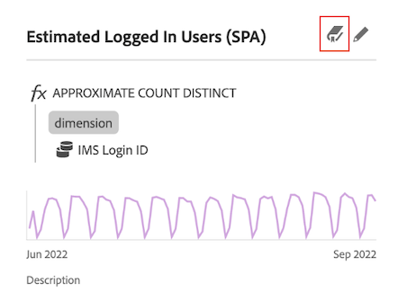

# 資料字典概觀

{{release-limited-testing}}

Analysis Workspace中的資料字典可協助使用者和管理員持續追蹤及深入了解其Analytics環境中的元件。

系統管理員負責組織資料字典中每個元件的相關資訊，並將其提供給使用者使用。

## 為用戶帶來的好處

資料字典可協助使用者更清楚了解自己可使用的每個元件。

資料字典中可用的資訊包括：

* 元件的功能和用途

* 元件通常與您正在檢視的元件搭配使用

* 與您檢視的元件類似

* 系統管理員是否批准元件

## 管理員的優點

資料字典可協助系統管理員在其Analytics環境中追蹤及組織元件。

以下是Analytics管理員使用資料字典的一些方式：

* 識別需要整合的重複元件。

* 識別未收集任何資料的元件，以便更新或刪除元件。

* 識別尚未核准的元件。

* 直接在Analysis Workspace中更新元件說明。 對資料字典中的元件說明所做的任何更新都會反映在報表套裝中。

   同樣地，報表套裝中對元件說明所做的任何更新都會反映在Analysis Workspace中。

   如需在Analysis Workspace或報表套裝中新增元件說明的詳細資訊，請參閱 [新增元件說明](/help/analyze/analysis-workspace/components/add-component-descriptions.md).

## 存取資料字典

您可以在Analysis Workspace內透過下列任一方式存取資料字典：

* 從 **資料字典** 圖示。

   

* 從 **資料字典** 圖示（位於元件的「資訊」彈出視窗中）。

   
<!--update screenshot; this was taken from a mock-->

* 從功能表： [!UICONTROL **說明**] > [!UICONTROL **資料字典**].

   <!--add screenshot-->

## 移動、最小化或關閉資料字典

開啟資料字典時(如 [存取資料字典](#access-the-data-dictionary))，則會顯示為Analysis Workspace上方的視窗。

您可以透過下列任一方式來操控「資料字典」視窗：

* 將其拖曳至Analysis Workspace內的任何區域

   如果您關閉並重新開啟Analysis Workspace，「資料字典」視窗會維持在您上次移動它的位置。 <!--True?-->

* 盡量減少

   最小化後，資料字典會在Analysis Workspace右下角顯示為藍色標籤。

   選取藍色標籤時，資料字典會開啟至您最近檢視的元件。

* 關閉它
