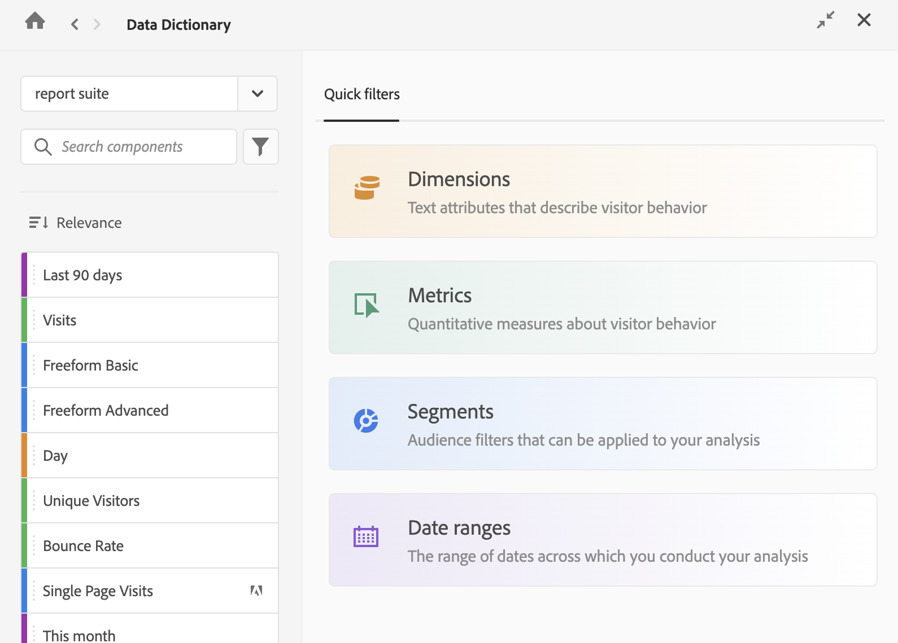

# 檢視資料字典中的元件資訊

資料字典允許您檢視有關元件的資訊，包括元件說明、類似的元件、經常搭配元件使用的其他元件等。

若要檢視資料字典中關於元件的資訊：

1. 前往包含要檢視之元件的 Analysis Workspace 專案。

1. 選取 Analysis Workspace 左邊欄的&#x200B;[!UICONTROL **資料字典**]&#x200B;圖示。（[存取資料字典](/help/analyze/analysis-workspace/components/data-dictionary/data-dictionary-overview.md#access-the-data-dictionary)中說明了存取資料字典的替代方式。）

   顯示資料字典視窗。

   

   <!--double-check this screenshot. I mocked the admin view up a bit to get rid of the Dictionary health tab.-->

1. 確保在下拉選單中選取包含您要檢視的元件報告套裝。依預設情況下，會顯示您已使用的報告套裝。

1. (可選) 在搜尋欄位中開始鍵入要檢視的元件名稱。

   元件的類型可依據顏色和圖示加以識別。**維度**是橙色的，**區段**是藍色的，**日期範圍**是紫色的，而&#x200B;**量度**是綠色的。Adobe 圖示代表計算量度範本或區段範本，計算機圖示則代表由貴組織中的 Analytics 管理員所建立的計算量度。

1. (可選) 選取 **篩選器** 圖示 ，然後選擇以下任一篩選器選項以篩選元件清單：

   | 選項 | 函數 |
   |---------|----------|
   | [!UICONTROL **已核准**] | 僅顯示標記為由管理員核准的元件。 |
   | [!UICONTROL **我的最愛**] | 僅顯示「我的最愛」清單中的元件。有關將元件新增到「我的最愛」清單的資訊，請參閱[元件概觀](/help/analyze/analysis-workspace/components/analysis-workspace-components.md)。 |
   | [!UICONTROL **維度**] | 僅顯示維度的元件。(當您首次存取資料字典時，此選項也可以在 [!UICONTROL **Quick filters**] 標籤中使用。) |
   | [!UICONTROL **量度**] | 僅顯示量度的元件。(當您首次存取資料字典時，此選項也可以在 [!UICONTROL **Quick filters**] 標籤中使用。) |
   | [!UICONTROL **區段**] | 僅顯示區段的元件。(當您首次存取資料字典時，此選項也可以在 [!UICONTROL **Quick filters**] 標籤中使用。) |
   | [!UICONTROL **日期範圍**] | 僅顯示日期範圍的元件。(當您首次存取資料字典時，此選項也可以在 [!UICONTROL **Quick filters**] 標籤中使用。) |
   | [!UICONTROL **全部顯示**] | 顯示所有元件。此選項僅提供給管理員使用。 |
   | [!UICONTROL **未經核准**] | 僅顯示尚未由管理員標記為「已核准」的元件。作為管理員，這有助於確定需要您檢閱和核准的元件。此選項僅提供給管理員使用。 |
   | [!UICONTROL **缺少說明**] | 僅顯示在說明欄位中還沒有說明的元件。此選項僅提供給管理員使用。 |
   | [!UICONTROL **顯示重複項目**] | 
僅顯示與所選報告套裝中的另一個元件具有相同名稱或相同定義的元件。名稱或定義必須完全相符才能顯示為重複項目。

此選項僅提供給管理員使用。

**注意：**&#x200B;對於定義，包括您建立的元件和 Adobe 提供的元件。對於名稱，目前僅包括您建立的元件，不包括 Adobe 提供的元件。顯示 Adobe 提供元件的重複名稱會在未來版本中新增。
 |
   | [!UICONTROL **無最近的資料**] | 僅顯示在過去 90 天內未收集任何資料的元件。此選項僅提供給管理員使用。 |
   | [!UICONTROL **由Adobe建立**] <!-- I don't see this option--> | 僅顯示由 Adobe 建立的元件。並不會顯示由管理員或您組織中的其他使用者建立的元件。 |

   {style="table-layout:auto"}

1. (可選) 選取「**排序**」圖示 ，然後選取以下任一篩選器選項以將元件清單排序：

   {{components-sort-options}}

1. 從元件清單中選取您要檢視的元件。

   顯示有關該元件的以下資訊：

   | 選項 | 函數 |
   |---------|----------|
   | [!UICONTROL **已核准**] | 
指出該元件已經過管理員檢閱與核准。

元件獲得核准後，管理員可以選取&#x200B;**已核准**&#x200B;按鈕來取消核准。
 |
   | [!UICONTROL **需要核准**] | 
指出該元件尚未經過管理員檢閱與核准。

管理員會看到&#x200B;[!UICONTROL **核准**]&#x200B;的選項。選擇此選項會讓使用者看到元件標記為「已核准」。
 |
   | [!UICONTROL **說明**] | 描述元件的預定功能。(此資訊由 Analytics 管理員新增，如[新增元件說明](/help/analyze/analysis-workspace/components/add-component-descriptions.md)中所述。) |
   | [!UICONTROL **經常與下列項目搭配使用**] | 
顯示您正在查看的元件最常與哪些元件一起使用。

在 5 種主要元件類型中最多顯示 5 個元件：量度、計算量度、維度、區段和日期範圍。

此清單顯示過去 90 天的資料。只會顯示您有權檢視的元件。

管理員可以在「[!UICONTROL **永遠包含**]」和「[!UICONTROL **永遠排除**]」下拉式欄位中選取所需的元件，來管理使用者在此區段中看到的元件。在管理顯示給使用者的元件之前，請先套用&#x200B;**全部顯示**&#x200B;篩選器，以確保您能看到所有未與您共用的元件。<!-- Soon we will make it so any fields that an admin doesn't have access to will be greyed out, and then they can enable the Show all filter to make it editable. -->
 |
   | [!UICONTROL **類似於**] | 
顯示與您正在查看的元件具有相似名稱的元件。

在 5 種主要元件類型中最多顯示 5 個元件：量度、計算量度、維度、區段和日期範圍。

只會顯示您有存取檢視權限的元件。

報告套裝中的任何重複元件也會顯示在此處。Analytics 管理員應識別並移除所有重複的元件，如[監視資料字典健康情況](/help/analyze/analysis-workspace/components/data-dictionary/monitor-data-dictionary-health.md)中所述。

管理員可以在「[!UICONTROL **永遠包含**]」和「[!UICONTROL **永遠排除**]」下拉式欄位中選取所需的元件，來管理使用者在此區段中看到的元件。在管理顯示給使用者的元件之前，請先套用&#x200B;**全部顯示**&#x200B;篩選器，以確保您能看到所有未與您共用的元件。<!-- Soon we will make it so any fields that an admin doesn't have access to will be greyed out, and then they can enable the Show all filter to make it editable. -->

**注意：**&#x200B;目前，「**類似於**」區段僅包括您建立的元件，不包括 Adobe 提供的元件。Adobe 提供的元件會在未來版本中新增。
 |
   | [!UICONTROL **標記**] | 顯示套用於元件的所有標記。具有管理員存取權限的使用者可以在編輯元件時新增標記。 |
   | [!UICONTROL **元件類型**] | 列出元件的類型，無論是維度、指標、區段還是日期範圍。 |
   | [!UICONTROL **建立者**] | 顯示建立元件的使用者名稱。 |
   | [!UICONTROL **預覽**] | 顯示元件在 Analysis Workspace 中的外觀預覽。 |
   | [!UICONTROL **上次修改日期**] | 顯示上次修改元件的日期。此部分會在檢視區段、計算量度和日期範圍時顯示。 |

   {style="table-layout:auto"}

1. (可選) 將元件從資料字典拖曳至 Analysis Workspace 中。
