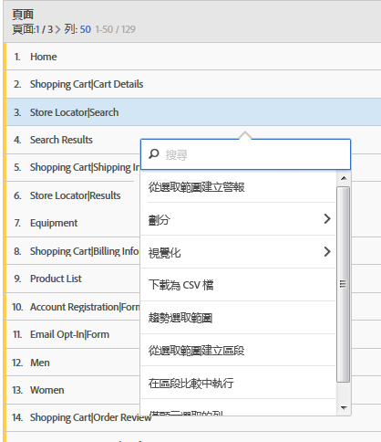
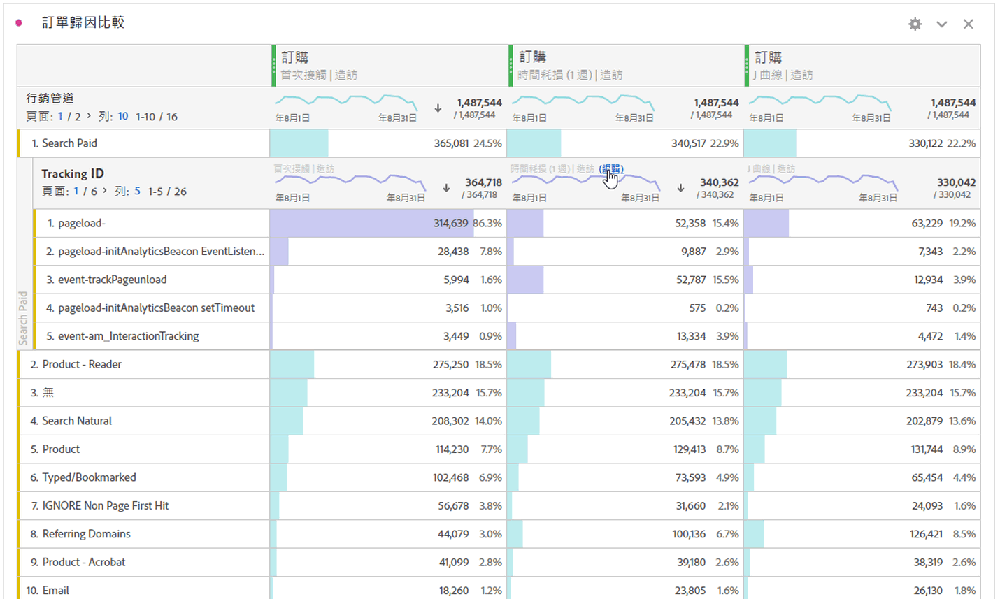

# 劃分維度

在 Analysis Workspace 中劃分維度和維度項目。

您可針對特定需求，以無限方式劃分資料；使用相關量度、維度、區段、時間表及其他分析劃分值來建立查詢。

1. [建立專案](/help/analyze/analysis-workspace/home.md)並搭配資料表格。
1. 在資料表格中，以滑鼠右鍵按一下某個條列項目，並選取&#x200B;**[!UICONTROL 劃分]** > *`<item>`*。

   

   您可以跨所選時段，依維度項目或客群細分群體來劃分量度。您也可以更深入鑽研至更詳細的層級。

   >[!NOTE]
   >
   >表格中顯示的劃分數目上限為 200。匯出劃分時，此限制會提高。

## 將歸因模型套用到資料劃分

表格中的任何劃分也可套用任何歸因模型。此歸因模型可與父欄相同或不同。舉例來說，您可以在「行銷管道」維度中分析線性訂單，但將「U 形訂單」套用至管道中的特定追蹤代碼。若要編輯套用到劃分的歸因模型，請將滑鼠移到劃分模型上方，然後按一下&#x200B;**[!UICONTROL 編輯]**：

這是將歸因模型套用至劃分或編輯劃分時的預期行為：

* 如果在沒有其他歸因時套用歸因，該歸因將套用於整個欄樹。

* 如果在套用了歸因後新增劃分，則將對新增的給定劃分使用預設值 (如果該維度具有預設值)。否則將使用父欄的劃分。某些維度具有預設配置。例如，「[!UICONTROL 時間]」維度和「[!UICONTROL 反向連結]」使用「[!UICONTROL 同一次接觸]」。「[!UICONTROL 產品]」維度使用「[!UICONTROL 上次接觸]」。其他維度沒有預設值，將使用父欄配置。

* 如果欄樹中已有歸因，則變更歸因只會影響正在編輯的歸因。

## 影片

>[!BEGINSHADEBOX]

如需示範影片，請參閱 [將維度和量度新增至Analysis Workspace中的專案](https://video.tv.adobe.com/v/30606?quality=12&learn=on){target="_blank"}。

>[!ENDSHADEBOX]

>[!BEGINSHADEBOX]

如需示範影片，請參閱 [在自由格式表格中使用維度](https://video.tv.adobe.com/v/40179?quality=12&learn=on){target="_blank"}。

>[!ENDSHADEBOX]

>[!BEGINSHADEBOX]

如需示範影片，請參閱 [依位置](https://video.tv.adobe.com/v/24033?quality=12&learn=on){target="_blank"}的維度劃分。

>[!ENDSHADEBOX]

