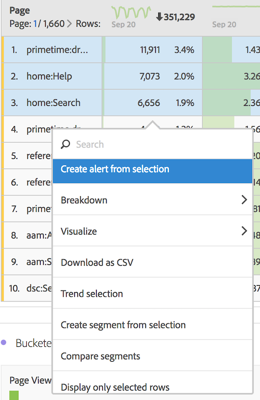

# 劃分維度

在 Analysis Workspace 中劃分維度和維度項目。

您可針對特定需求，以無限方式劃分資料；使用相關量度、維度、區段、時間表及其他分析劃分值來建立查詢。

1. [建立專案](../../../../analyze/analysis-workspace/build-workspace-project/t-freeform-project.md#task_C2C698ACC7954062A28E4784911E6CF2)並搭配資料表格。
1. In the data table, right-click a line item and select **[!UICONTROL Breakdown]** &gt; *`<item>`*.

   

   您可以跨所選時段，依維度值或讀者區段來劃分量度。您也可以更深入鑽研至更詳細的層級。

   >[!NOTE]
   >
   >表格中顯示的劃分數目限制為200。匯出劃分時，此限制會提高。

[YouTube分析工作區中的維度](https://www.youtube.com/watch?v=P9W0hhIHhCs&index=12&list=PL2tCx83mn7GuNnQdYGOtlyCu0V5mEZ8sS) (4：54)

[YouTube上的維度劃分](https://www.youtube.com/watch?v=3mQ2HN7-lIc&list=PL2tCx83mn7GuNnQdYGOtlyCu0V5mEZ8sS&index=13) (2：02)