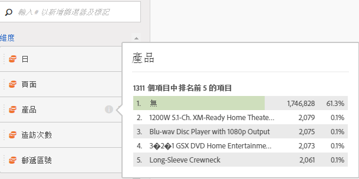
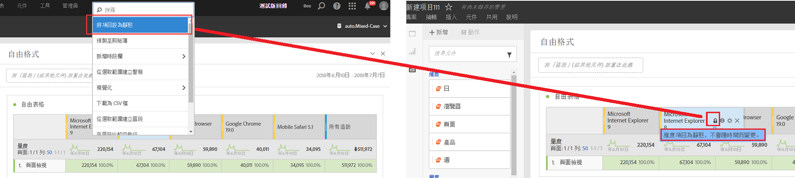

# 預覽維度

將滑鼠移到維度旁的資訊 (i) 圖示上，即會顯示非時間維度的前 5 個值 (而時間維度則是前 15 個值)。我們之前會將這些值保持為靜態 (亦即，所選的 5 個值從未變更)。

現在，我們會預設顯示動態值而不是靜態值，並可以選擇將這些值轉換為靜態值。其他注意事項：

* 隨著資料更新，動態維度欄也會隨之更新以顯示目前的 5/15 維度項目。
* 已複製或移動的動態維度欄將變為靜態。
* 滑鼠游標暫留在靜態維度欄時，您會看到一個鎖定圖示，表示該維度是靜態的。

## 顯示維度項目

當您將游標停留在維度上，並按一下旁邊的灰色向右箭頭，即會出現維度項目清單。任何維度項目清單通常會顯示最近 30 天排名最前的項目。

如果向下捲動至清單底部，您會看到&#x200B;**[!UICONTROL 顯示過去18個月排名最前的專案]**。 按一下此選項，即可檢視最近 547 天排名最前的維度項目。
