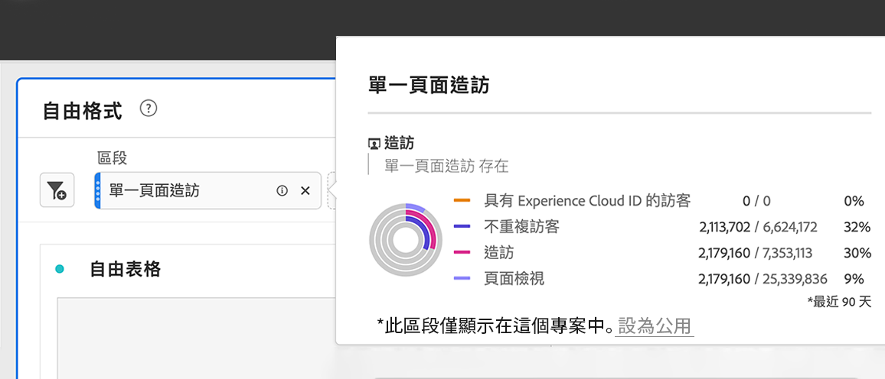

# 臨機專案區段

以下是建立臨機專案區段的影片：

>[!VIDEO](https://video.tv.adobe.com/v/23978/?quality=12)

如果您想要快速探索區段對專案可能有何影響，可以建立臨機專案區段，而不需前往區段產生器。 將這些區段視為暫時的專案層級區段。 它們通常不會是區段「程式庫」的一部分，例如左側邊欄中的元件區段。 不過，您可以儲存它們，如下所示。

若要比較臨機專案區段可以執行的動作與完整元件層級區段，請前往[此處](/help/analyze/analysis-workspace/components/segments/t-freeform-project-segment.md)。

1. 將任何元件類型（維度、維度項目、事件、量度、區段、區段範本、日期範圍）拖曳至面板頂端的區段拖放區域。 元件類型會自動轉換成區段。以下是如何為Twitter反向連結網域建立區段的範例：

   

   您的面板會自動套用此區段，您就能立即查看結果。

1. 您可以新增不限數量的元件至面板。
1. 如果您決定要儲存此區段，請參閱下方的區段。

請記住：

* 下列元件類型&#x200B;**無法**&#x200B;拖曳至區段拖放區域：計算量度以及無法建立區段的維度/量度。
* 為了完整的維度和事件，Analysis Workspace 建立了「存在」點擊區段。範例：`Hit where eVar1 exists`或`Hit where event1 exists`。
* 如將「未指定」或「無」拖曳至區段拖放區，就會自動轉換成「不存在」區段，以便系統正確處理區段。

>[!NOTE]
>
>此為專案內部專用的區段建立方式。

## 儲存隨選專案區段 {#ad-hoc-save}

您可以依照下列步驟來選擇儲存這些區段：

1. 在拖放區域中的區段上暫留並按一下「i」圖示。
1. 在顯示的資訊面板中，按一下&#x200B;**[!UICONTROL Save]**。

   

## 什麼是僅限專案的區段？

僅限專案的區段是快速區段或臨機工作區專案區段。 在區段產生器中編輯/開啟這些區段時，將會顯示僅限專案方塊。 如果他們在產生器中套用快速區段，但未勾選「可用」方塊，則它仍是僅限專案的區段，但無法在QS產生器中開啟它。 如果他們勾選方塊並儲存，現在就會是元件清單區段。