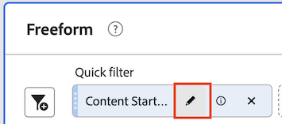

# 快速區段

快速區段可讓您輕鬆探索指定專案中的資料，而無須在 [區段產生器](/help/components/segmentation/segmentation-workflow/seg-build.md).

建立快速區段時，請考量下列事項：

* 快速區段僅適用於建立這些區段的專案。 您無法在其他專案中取得這些篩選器，且無法和其他使用者共用。
* 最多允許3個規則。
* 不支援巢狀容器或循序規則。

下列影片示範如何使用快速區段：

>[!VIDEO](https://video.tv.adobe.com/v/341466/?quality=12&learn=on)

## 建立快速區段

Analysis Workspace中的任何使用者都可建立快速區段。

若要建立快速區段：

1. 選擇以下方法之一以開始建立快速段：

   * **臨機（拖放）:** 從左側邊欄，將元件拖曳至 **區段** 圖示，然後選取 **編輯** 圖示來調整區段。

      

      >[!NOTE]
      >
      > 建立快速區段隨選（拖放）時，請考量下列事項：
      > * 不支援下列元件類型：計算量度和維度，以及無法建立區段的量度。
      > * 為了取得完整的維度和事件，Analysis Workspace 會建立「存在」點擊區段。範例：`Hit where eVar1 exists` 或 `Hit where event1 exists`。
      > * 若將「未指定」或「無」拖曳至區段拖放區，系統會自動轉換為「不存在」區段，以便在區段中正確處理。

   * **使用區段圖示：** 在自由表格中，選取 **區段** 圖示。

      

1. 調整下列任一設定：

   | 設定 | 說明 |
   | --- | --- |
   | [!UICONTROL 名稱] | 區段的預設名稱為區段中規則名稱的組合。您可以將區段重新命名為更好記的名稱。 |
   | [!UICONTROL 包含/排除] | 您可在區段定義中包含或排除元件，但不能同時包含和排除。 |
   | [!UICONTROL 點擊/造訪/訪客]容器 | 快速區段僅包含一個[區段容器](https://experienceleague.adobe.com/docs/analytics/components/segmentation/seg-overview.html#section_AF2A28BE92474DB386AE85743C71B2D6)，讓您在區段中包含 (或從中排除) 維度/量度/日期範圍。[!UICONTROL 訪客]包含特定於訪客所有造訪次數和頁面檢視的總體資料。[!UICONTROL 造訪次數]容器可讓您設定規則，以根據造訪次數來劃分訪客的資料，而[!UICONTROL 點擊]容器則可讓您根據個別頁面檢視來劃分訪客資訊。 預設容器為[!UICONTROL 點擊]。 |
   | [!UICONTROL 元件] (維度/量度/日期範圍) | 透過新增元件 (維度、量度、日期範圍或維度值) 來定義最多 3 個規則。有 3 種方法可以找到正確的元件:<ul><li>開始輸入，快速區段產生器就會自動尋找適當的元件。</li><li>使用下拉式清單來尋找元件。</li><li>從左側邊欄拖放元件。</li></ul> |
   | [!UICONTROL 運算子] | 使用下拉式選單尋找標準運算子和[!UICONTROL 相異計數]運算子。請參閱 [區段運算子](/help/components/segmentation/seg-reference/seg-operators.md). |
   | 加 (+) 號 | 新增另一個規則 |
   | AND/OR 限定詞 | 您可以對規則加入「AND」或「OR」的限定詞，但不能在單一區段定義中混合使用「AND」和「OR」。 |
   | [!UICONTROL 套用] | 將此區段套用在面板上。如果區段不含任何資料，系統會詢問您是否要繼續。 |
   | [!UICONTROL 開啟產生器] | 開啟區段產生器。在「區段產生器」中儲存或套用區段後，即不再視為「快速區段」。 它會成為元件清單區段資料庫的一部分。 
若要讓元件可供所有專案和左側邊欄使用，請選取選項 [!UICONTROL **將此區段可供所有專案使用，並新增至元件清單**].

如需詳細資訊，請參閱 [將快速區段儲存為元件清單區段](#save-a-quick-segment-as-a-component-list-segment) 這篇文章。

**注意：** 僅限在 [Adobe Admin Console](https://experienceleague.adobe.com/docs/analytics/admin/admin-console/permissions/summary-tables.html#analytics-tools) 可以開啟「區段產生器」。
 |
   | [!UICONTROL 取消] | 取消此快速區段（不要套用）。 |
   | [!UICONTROL 日期範圍] | 驗證器使用面板日期範圍進行資料查詢。但是在快速區段中套用的任何日期範圍都會覆蓋面板頂端的面板日期範圍。 |
   | 預覽 (右上角) | 讓您查看是否有有效的區段以及區段的範圍。代表您套用此區段時可預期看到的資料集劃分。您可能會收到一則通知，指出此區段沒有資料。在此情況下，您可以繼續或變更區段定義。 |

1. 選擇 [!UICONTROL **套用**] 來儲存變更。

## 編輯快速區段

1. 將滑鼠指標暫留在快速區段上，然後選取 **編輯** 表徵圖。

   

1. 編輯區段定義和/或區段名稱。

1. 選取&#x200B;[!UICONTROL **「套用」**]。

## 將快速區段儲存為元件清單區段

>[!IMPORTANT]
>
> 儲存快速區段時，請考量下列事項：
> 
> * 若要儲存快速區段，您需要 [Adobe Admin Console](https://experienceleague.adobe.com/docs/analytics/admin/admin-console/permissions/summary-tables.html#analytics-tools).
> 
> * 儲存或套用區段後，您就無法在快速區段產生器中編輯該區段。 請改為使用一般的區段產生器。

您可以選擇將快速區段儲存為元件清單區段。 元件清單區段的優點包括：

* 所有工作區專案的可用性
* 支援更複雜的區段以及循序區段

您可以從快速區段產生器或 [!UICONTROL 篩選器產生器].

### 儲存在快速區段產生器中 {#save2}

1. 套用快速區段後，將滑鼠指標暫留在該區段上並選取資訊(「i」)圖示。
1. 選擇 **[!UICONTROL 讓所有專案都可使用，並新增至元件清單]**.
1. (選擇性) 重新命名區段。
1. 選取&#x200B;**[!UICONTROL 「儲存」]**。

   區段現在會顯示在左側邊欄的元件清單中。 另請注意，區段的側邊欄會從淺藍色變更為深藍色，表示您無法再在快速區段產生器中編輯或開啟區段。

### 儲存於區段產生器 {#save3}

1. 套用快速區段後，將滑鼠指標暫留在該區段上並選取資訊(「i」)圖示。
1. 選取&#x200B;**[!UICONTROL 儲存區段]**
1. （選用）重新命名區段，然後選取 [!UICONTROL **套用**].

   返回「工作區」，注意區段的側邊欄已從淺藍色變更為深藍色，表示您無法再在快速區段產生器中編輯或開啟區段。 而透過將其儲存，該區段會成為元件清單的一部分。

套用區段後，您可以選取將其新增至區段元件清單，並供所有專案使用。

1. 將滑鼠懸停在已儲存的區段上，並選取鉛筆圖示。

1. 選擇 [!UICONTROL **開啟產生器**].

1. 在「區段產生器」頂端，請注意 [!UICONTROL **僅限專案區段**] 對話框：

   

1. 選取&#x200B;**[!UICONTROL 「使其可用於您的所有專案並將其新增至您的元件清單中」旁的複選框。]**

1. 選取&#x200B;**[!UICONTROL 「儲存」]**。

   該區段現在會顯示在所有專案的區段元件清單中。您也可以和組織中的其他人[共用區段](https://experienceleague.adobe.com/docs/analytics/analyze/analysis-workspace/curate-share/curate.html?lang=zh-Hant#concept_4A9726927E7C44AFA260E2BB2721AFC6)。

## 快速區段範例

下列區段範例結合維度和量度：

## 已知問題

1. 建立一個包含 2 個項目快速區段，並將其&#x200B;**[!UICONTROL 儲存]** 為 Test1。
1. 按一下「**[!UICONTROL 另存新檔]**」，並將此快速區段儲存為 Test2。
1. 編輯 Test2 快速區段，並將其再度儲存為 Test2.
請注意，Test1 快速區段已被 Test2 修改。
