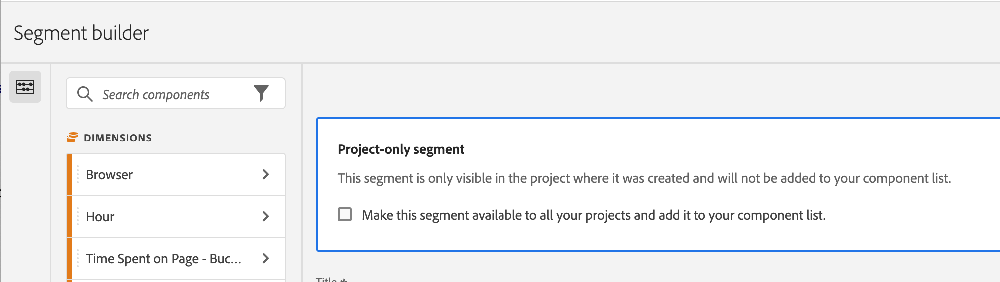

# 快速區段

快速區段可讓您輕鬆探索特定專案中的資料，無需在[區段產生器](/help/components/segmentation/segmentation-workflow/seg-build.md)中建立更複雜的元件清單區段。

建立快速區段時，請考慮以下事項：

* 快速區段僅適用於建立這些區段的專案。您無法在其他專案中取得這些區段，且無法和其他使用者共用這些區段。
* 最多允許訂定 3 條規則。
* 不支援巢狀容器或循序規則。

以下影片示範如何使用快速區段：

>[!VIDEO](https://video.tv.adobe.com/v/341466/?quality=12&learn=on)

## 建立快速區段

Ananalysis Workspace 中的任何使用者都可以建立快速區段。

若要建立快速區段：

1. 選擇以下一種方法，開始建立快速區段：

   * **臨時 (拖放)：**&#x200B;從左側邊欄，將元件拖曳至面板標題中的區段放置區域。

     

     您可以按照[編輯快速區段](#edit-quick-segments)中的說明編輯區段。

     >[!NOTE]
     >
     > 建立臨時快速區段 (拖放) 時，請考慮以下事項：
     > * 不支援下列元件類型：計算量度以及無法建立區段的維度/量度。
     > * 為了取得完整的維度和事件，Analysis Workspace 會建立「存在」點擊區段。範例：`Hit where eVar1 exists` 或 `Hit where event1 exists`。
     > * 如將「未指定」或「無」拖放至區段拖放區，就會自動轉換成「不存在」區段，以便在這些區段中可正確處理該區段。

   * **使用區段圖示：** 在自由表格中，選取面板標題中的「**區段**」圖示。

     

1. 調整以下任何設定：

   | 設定 | 說明 |
   | --- | --- |
   | [!UICONTROL 名稱] | 區段的預設名稱為區段中規則名稱的組合。您可將區段重新命名為更好記的名稱。 |
   | [!UICONTROL 包含/排除] | 您可在區段定義中包含或排除元件，但不能同時包含和排除。 |
   | [!UICONTROL 點擊/造訪/訪客]容器 | 快速區段僅包含一個[區段容器](https://experienceleague.adobe.com/docs/analytics/components/segmentation/seg-overview.html#section_AF2A28BE92474DB386AE85743C71B2D6)，讓您在區段中包含 (或從中排除) 維度/量度/日期範圍。[!UICONTROL 訪客]包含特定於訪客所有造訪次數和頁面檢視的總體資料。[!UICONTROL 造訪次數]容器可讓您設定規則，以根據造訪次數來劃分訪客的資料，而[!UICONTROL 點擊]容器則可讓您根據個別頁面檢視來劃分訪客資訊。 預設容器為[!UICONTROL 點擊]。 |
   | [!UICONTROL 元件] (維度/量度/日期範圍) | 透過新增元件 (維度、量度、日期範圍或維度值) 來定義最多 3 個規則。有 3 種方法可以找到正確的元件:<ul><li>開始輸入，然後快速區段產生器就會自動找到合適的元件。</li><li>使用下拉式清單來尋找元件。</li><li>從左側邊欄拖放元件。</li></ul> |
   | [!UICONTROL 運算子] | 使用下拉式選單尋找標準運算子和[!UICONTROL 相異計數]運算子。請參閱「[區段運算子](/help/components/segmentation/seg-reference/seg-operators.md)」。 |
   | 加 (+) 號 | 新增另一個規則 |
   | AND/OR 限定詞 | 您可以對規則加入「AND」或「OR」的限定詞，但不能在單一區段定義中混合使用「AND」和「OR」。 |
   | [!UICONTROL 套用] | 將此區段套用在面板上。如果區段不包含任何資料，系統會詢問您是否要繼續。 |
   | [!UICONTROL 開啟產生器] | 開啟區段產生器。在「區段產生器」中儲存或套用區段後，將無法再考慮「快速區段」。它會成為元件清單區段資料庫的一部分。 
若要使該元件適用於您的所有專案，並在左側邊欄中選取選項 [!UICONTROL **使該區段適用於您的所有專案，並將該區段新增至元件清單**]。

有關詳細資訊，請參閱本文的「[將快速區段另存為元件清單區段](#save-a-quick-segment-as-a-component-list-segment)」章節。

**註：** 僅擁有 [Adobe Admin Console](/help/admin/admin-console/permissions/analytics-tools.md) 中的「區段建立」權限的使用者可以開啟區段產生器。
 |
   | [!UICONTROL 取消] | 取消這個快速區段 (不要套用)。 |
   | [!UICONTROL 日期範圍] | 驗證器使用面板日期範圍進行資料查詢。但是在快速區段中套用的任何日期範圍都會覆蓋面板頂端的面板日期範圍。 |
   | 預覽 (右上角) | 讓您查看是否有有效的區段以及區段的範圍。代表您套用此區段時可預期看到的資料集劃分。您可能會收到一則通知，指出此區段沒有資料。這種情況下，您可繼續或變更區段定義。 |

1. 選取「[!UICONTROL **套用**]」以儲存您的變更。

## 編輯快速區段

1. 將滑鼠懸停在快速區段上，並選取「**編輯**」圖示。

   

1. 編輯區段定義和/或區段名稱。

1. 選取&#x200B;[!UICONTROL **「套用」**]。

## 將快速區段另存為元件清單區段

>[!IMPORTANT]
>
> 儲存快速區段時，請考慮以下事項：
> 
> * 若要儲存快速區段，您需要擁有 [Adobe Admin Console](/help/admin/admin-console/permissions/analytics-tools.md) 中的「區段建立」權限 。
> 
> * 儲存或套用區段後，無法再在快速品段產生器中進行編輯。相反地，您必須使用平常的區段產生器。

您可以選擇將快速區段另存為元件清單區段。元件清單區段的優點包括：

* 所有 Workspace 專案的適用性
* 支援更複雜的區段以及循序區段

您可以從快速區段產生器或從[!UICONTROL 篩選產生器]儲存區段。

### 在快速區段產生器中儲存 {#save2}

1. 套用快速區段後，將滑鼠懸停在上方，並選取資訊 (「i」) 圖示。
1. 選取「**[!UICONTROL 設為可用於所有專案，並新增至您的元件清單]**」。
1. (選擇性) 重新命名區段。
1. 選取&#x200B;**[!UICONTROL 「儲存」]**。

   區段現在會顯示在左側邊欄的元件清單中。另請注意，該區段的側邊列從淺藍色變為深藍色，表示無法再在快速區段產生器中編輯或開啟該區段。

### 在區段產生器中儲存。 {#save3}

1. 套用快速區段後，將滑鼠懸停在上方，並選取資訊 (「i」) 圖示。
1. 選取&#x200B;**[!UICONTROL 儲存區段]**
1. (選項) 重新命名該區段，然後選取「[!UICONTROL **套用**]」。

   返回 Workspace，並且注意該區段的側邊列從淺藍色變為深藍色，表示無法再在快速區段產生器中編輯或開啟該區段。而透過將其儲存，該區段會成為元件清單的一部分。

套用區段後，您可以選擇將其新增到區段元件清單中，並使其可用於所有專案。

1. 將滑鼠懸停在已儲存的區段上，並選取鉛筆圖示。

1. 選取「[!UICONTROL **開啟產生器**]」。

1. 在區段產生器的上方，請注意「[!UICONTROL **限專案區段**]」對話框：

   

1. 選取「**[!UICONTROL 使其可用於您的所有專案並將其新增至您的元件清單中]**」旁的核取方塊。

1. 選取「**[!UICONTROL 儲存]**」。

   該區段現在會顯示在所有專案的區段元件清單中。您也可以和組織中的其他人[共用區段](https://experienceleague.adobe.com/docs/analytics/analyze/analysis-workspace/curate-share/curate.html?lang=zh-Hant#concept_4A9726927E7C44AFA260E2BB2721AFC6)。

## 快速區段範例

以下是結合維度和量度的區段範例：

## 已知問題

1. 建立一個包含 2 個項目快速區段，並將其&#x200B;**[!UICONTROL 儲存]** 為 Test1。
1. 按一下「**[!UICONTROL 另存新檔]**」，並將此快速區段儲存為 Test2。
1. 編輯 Test2 快速區段，並將其再度儲存為 Test2。
請注意，Test1 快速區段已被 Test2 修改。
