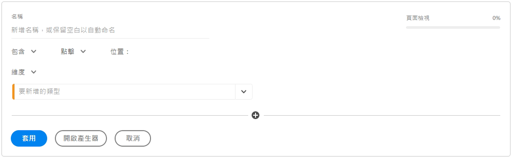

# 快速區段

您可以在專案中建立快速區段以迴避完整[區段產生器](/help/components/segmentation/segmentation-workflow/seg-build.md)的複雜性。快速區段

* 僅套用至建立專案的專案（您可以變更此項目）。
* 最多允許 3 個規則.
* 不要容納巢狀容器或循序規則。
* 在具有多個報表套裝的專案中工作。

若要比較快速區段的功能和成熟的元件清單區段，請至[這裡](/help/analyze/analysis-workspace/components/segments/t-freeform-project-segment.md)。

>[!IMPORTANT]
> 快速區段目前進行有限測試，預計於2021年10月21日正式推出。

## 先決條件

任何人都可以建立 [!UICONTROL 快速區段]. 不過，您需要 [!UICONTROL 區段建立] 權限 [Adobe Admin Console](https://experienceleague.adobe.com/docs/analytics/admin/admin-console/permissions/summary-tables.html?lang=zh-Hant#analytics-tools) 儲存快速區段或在 [!UICONTROL 區段產生器].

## 建立快速區段

在手繪多邊形表格中，請按一下面板標頭中的篩選器+ 圖示：

從此空白顯示窗設定快速區段：

| 設定 | 說明 |
| --- | --- |
| 名稱 | 區段的預設名稱是區段中規則名稱的組合。 您可以重新命名區段。 |
| 包含/排除 | 您可以在區段定義中包含或排除元件，但不能同時包括和排除元件。 |
| 點擊/造訪/訪客容器 | 快速區段包含一個 [區段容器](https://experienceleague.adobe.com/docs/analytics/components/segmentation/seg-overview.html?lang=zh-Hant#section_AF2A28BE92474DB386AE85743C71B2D6) 僅可讓您在區段中加入維度/量度/日期範圍（或將其排除在區段之外）。 [!UICONTROL 訪客]包含特定於訪客所有造訪次數和頁面檢視的總體資料。[!UICONTROL 造訪次數]容器可讓您設定規則，以根據造訪次數來劃分訪客的資料，而[!UICONTROL 點擊]容器則可讓您根據個別頁面檢視來劃分訪客資訊。預設容器為[!UICONTROL 點擊]。 |
| 元件 (維度/量度/日期範圍) | 新增元件（維度和/或量度及/或日期範圍）及其值，以定義最多3個規則。 有 3 種方法可以找到正確的元件：<ul><li>開始輸入， [!UICONTROL 快速區段] 產生器會自動尋找適當的元件。</li><li>使用下拉式清單來尋找元件。</li><li>從左側邊欄拖放元件。</li></ul> |
| 運算子 | 使用下拉式功能表尋找標準運算子和 [!UICONTROL Distinct Count] 運算子。[了解更多](https://experienceleague.adobe.com/docs/analytics/components/segmentation/segment-reference/seg-operators.html?lang=en) |
| 加 (+) 號 | 新增另一個規則 |
| AND/OR 限定詞 | 您可以對規則加入「AND」或「OR」的限定詞，但不能在單一區段定義中混合使用「AND」和「OR」。 |
| 套用 | 將此區段套用至面板。 如果區段不含任何資料，系統會詢問您是否要繼續。 |
| 開啟產生器 | 開啟區段產生器。 在「區段產生器」中儲存或套用區段後，即不再視為「快速區段」。 它會成為元件清單區段庫的一部分。 |
| 取消 | 取消此快速段 — 不要應用它。 |
| 日期範圍 | 驗證器使用面板日期範圍進行資料查詢。但快速區段中套用的任何日期範圍會覆寫面板頂端的面板日期範圍。 |
| 預覽 (右上角) | 可讓您查看您是否具備有效的區段，以及區段的廣度。 代表套用此區段時，您預期會看到的資料集劃分。 您可能會收到通知，指出此區段沒有資料。 若是如此，您可以繼續或變更區段定義。 |

以下是結合維度和量度的區段範例：

此區段會顯示在頂端。請注意其藍色條狀側邊欄，而非左側區段庫中元件層級區段的藍色側邊欄。

## 編輯快速區段

1. 將滑鼠懸停在快速區段上，並選取鉛筆圖示。
1. 編輯區段定義和/或區段名稱。
1. 按一下[!UICONTROL 「套用」]。

## 儲存快速區段

>[!IMPORTANT]
>儲存或套用區段後，您將無法在「快速區段產生器」中對其進行編輯，而只能在一般的區段產生器中進行編輯。

1. 套用快速區段後，將滑鼠指標暫留在該區段上並選取資訊(「i」)圖示。

   

1. 按一下&#x200B;**[!UICONTROL 「設為可用於所有專案，並新增至您的元件清單」]**。
1. （選用）重新命名區段。
1. 按一下「**[!UICONTROL 儲存]**」。

請注意區段的側邊欄如何從藍色條狀變更為藍色。 它現在會顯示在左側欄的元件清單中。

## 什麼是僅限專案的區段？

僅限專案的區段指快速區段或臨時工作區專案區段。在 [!UICONTROL 區段產生器]，則會顯示僅限專案的方塊。 如果您在產生器中套用快速區段，但未勾選「可用」方塊，則該區段仍為僅限專案的區段，但無法在 [!UICONTROL 快速區段產生器].

如果您勾選方塊，然後按一下 **[!UICONTROL 儲存]**，現在是元件清單區段。

