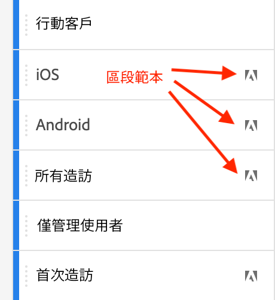
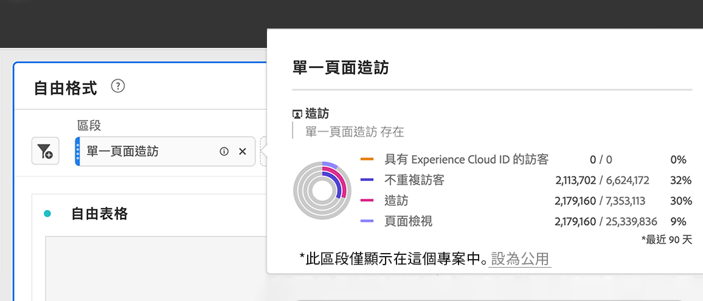

# 區段 {#topic_DC2917A2E8FD4B62816572F3F6EDA58A}

您可以建立不同類型的區段，視其需要的複雜程度、是否應僅套用至此專案等而定。 以下是區段類型的摘要：

| 區段類型 | 建立位置？ | 適用於何處？ | 多個容器？ | UI顏色 |
| --- | --- | --- | --- |
| 元件清單區段 | [區段產生器](/help/components/segmentation/segmentation-workflow/seg-build.md) | 從左側邊欄至所有專案 | 是 | 藍色 |
| 快速區段 | [快速區段產生器](/help/analyze/analysis-workspace/components/segments/quick-segments.md) | 僅限專案層級 | 無 | 灰色? |
| 臨機區段： | 請參閱下方 | 僅限專案層級 | 無 | ? |
|  — 臨機工作區專案區段 | 拖放至區段？ 在新項目中 |  |  |  |
|  — 計算量度型區段 | 計算量度產生器 |  |  |  |
|  — 以VRS為基礎的區段 | 虛擬報表套裝產生器 |  |  |  |
|  — 區段產生器「套用」 | 區段產生器 |  |  |  |

如需Adobe Analytics中分段的深入討論，請前往[此處](/help/components/segmentation/seg-overview.md)。

## 左側邊欄中的元件清單區段 {#section_3B07D458C43E42FDAF242BB3ACAF3E90}

「元件」功能表底下的區段欄會顯示區段及區段範本，並附有下列圖示：

[在 Analysis Workspace 中使用區段](https://experienceleague.adobe.com/docs/analytics-learn/tutorials/analysis-workspace/applying-segments/using-segments-in-analysis-workspace.html?lang=zh-Hant) (6:46)

## Analysis Workspace中的臨機（暫時）區段

以下是臨機區段的影片：

>[!VIDEO](https://video.tv.adobe.com/v/23978/?quality=12)

## 建立區段 {#section_693CFADA668B4542B982446C2B4CF0F5}

您可以將元件類型 (維度、維度項目、事件、量度、區段、區段範本、日期範圍) 拖曳至面板頂端的區段拖放區域，建立即時區段。

元件類型會自動轉換成區段。或者您可以按一下「新增區段」拖放方塊中的「+」標誌。

請記住：

* 下列元件類型&#x200B;**無法**&#x200B;拖曳至區段拖放區域：計算量度以及無法建立區段的維度/量度。
* 為了完整的維度和事件，Analysis Workspace 建立了「存在」點擊區段。例子：「點撃 eVar1 存在的位置」或「點撃 event1 存在的位置」。
* 如將「未指定」或「無」拖曳至區段拖放區，就會自動轉換成「不存在」區段，以便系統正確處理區段。

>[!NOTE]
>
>此為專案內部專用的區段建立方式。

您可以遵循下列步驟將這些區段設為公用 (全域)：

1. 在拖放區域中的區段上暫留並按一下「i」圖示。
1. 在顯示的資訊面板中，按一下&#x200B;**[!UICONTROL 「設為公用」]**。

   

## 套用區段的其他方法 {#section_10FF2E309BA84618990EA5B473015894}

>[!VIDEO](https://video.tv.adobe.com/v/30994/?quality=12)

另有數個可套用區段至自由格式專案的方法。

| 動作 | 說明 |
|--- |--- |
| 從選取項目建立區段 | 建立內嵌區段。選取行、以滑鼠右鍵按一下選取範圍，然後建立內嵌區段。此區段僅套用至開啟的專案，不會儲存為 Analytics 區段。1. 選取所需的列。2. 以滑鼠右鍵按一下選取項目。3. 按一下&#x200B;*「從選取項目建立區段」*。 |
| 元件 > 新增區段 | 顯示區段產生器。如需分段的詳細資訊，請參閱[區段產生器](https://experienceleague.adobe.com/docs/analytics/components/segmentation/segmentation-workflow/seg-build.html?lang=zh-Hant)。 |
| 「共用 > 共用專案」或「共用 > 監管專案資料」 | 在[「監管與共用」](https://experienceleague.adobe.com/docs/analytics/analyze/analysis-workspace/curate-share/curate.html?lang=zh-Hant#concept_4A9726927E7C44AFA260E2BB2721AFC6)中，您可以了解套用至專案的區段可如何供收件者使用於共用分析中。 |
| 使用區段作為維度 | 影片：[在 Analysis Workspace 中使用區段作為維度](https://experienceleague.adobe.com/docs/analytics-learn/tutorials/analysis-workspace/applying-segments/using-segments-as-dimensions-in-analysis-workspace.html?lang=en) |

