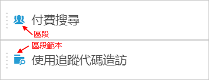
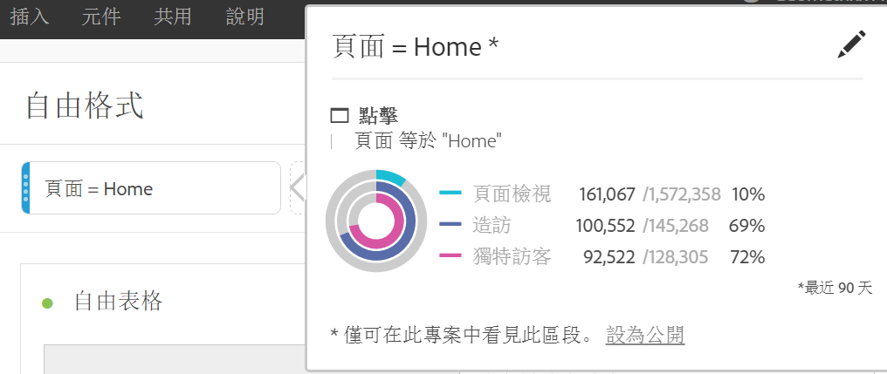

# 區段 {#topic_DC2917A2E8FD4B62816572F3F6EDA58A}

## Segment rail {#section_3B07D458C43E42FDAF242BB3ACAF3E90}

元件功能表底下的區段欄會顯示區段及區段範本，並附有下列圖示:

[在YouTube的分析工作區中使用區段](https://www.youtube.com/watch?v=QlUCdQDnni4)(6：46)

## Create segments {#section_693CFADA668B4542B982446C2B4CF0F5}

您可以將元件類型 (維度、維度項目、事件、量度、區段、區段範本、日期範圍) 拖曳至面板頂端的區段拖放區域，建立即時區段。

元件類型會自動轉換成區段。或者您可以按一下「新增區段」拖放方塊中的「+」標誌。

請記住：

* 下列元件類型&#x200B;**無法**&#x200B;拖曳至區段拖放區域: 計算量度以及無法建立區段的維度/量度。
* 為了完整的維度和事件，Analysis Workspace 建立了「存在」點擊區段。例子:「點撃 eVar1 存在的位置」或「點撃 event1 存在的位置」。
* 如果區段拖放區域中捨棄「未指定」或「無」，則會自動轉換成「不存在」區段，以便在區段中正確處理。

>[!NOTE]
>
>以此方式建立的區段是專案內部的。

您可以遵循下列步驟將這些區段設為公用 (全域):

1. 在拖放區域中的區段上暫留並按一下「i」圖示。
1. In the information panel that displays, click **[!UICONTROL Make public]**.

   

## Other methods for applying segments {#section_10FF2E309BA84618990EA5B473015894}

另有數個可套用區段至自由格式專案的方法。

<table id="table_45B3839D70674430AF3AC5AA3134F825"> 
 <thead> 
  <tr> 
   <th colname="col1" class="entry"> 動作 </th> 
   <th colname="col2" class="entry"> 說明 </th> 
  </tr> 
 </thead>
 <tbody> 
  <tr> 
   <td colname="col1"> 
從選取範圍建立區段 
 </td> 
   <td colname="col2"> 
建立內嵌區段。選取行、以滑鼠右鍵按一下選取範圍，然後建立內嵌區段。此區段僅套用至開啟的專案，不會儲存為 Analytics 區段。 
 
 
     <ol id="ol_1D1E661387354EBF992CC150915F642E"> 
      <li id="li_B96666FD426F4AEE8EAB61B2C00A07FB">選取行 </li> 
      <li id="li_C2245B3EA81F4FAC88A33647922535AF">以滑鼠右鍵按一下選取範圍 </li> 
      <li id="li_AB4F8988B9A84920ABA06A91094625F6">按一下「從選取範圍建立區段」。 </li> 
     </ol> 
 </td> 
  </tr> 
  <tr> 
   <td colname="col1">  元件 &gt; 新增區段 </td> 
   <td colname="col2"> 
顯示區段產生器。如需分段的詳細資訊，請參閱<a href="https://marketing.adobe.com/resources/help/en_US/analytics/segment/seg_build.html" format="https" scope="external">建立區段</a>。 
 </td> 
  </tr> 
  <tr> 
   <td colname="col1"> 
 共用 &gt; 共用專案或 
 
  共用 &gt; 組織專案資料  
 </td> 
   <td colname="col2"> 
In <a href="../../../analyze/analysis-workspace/curate-share/curate.md#concept_4A9726927E7C44AFA260E2BB2721AFC6" format="dita" scope="local"> Curate &amp; Share</a>, segments that you apply to the project are available in shared analysis for the recipient. 
 </td> 
  </tr> 
  <tr> 
   <td colname="col1"> 
使用區段做為維度 
 </td> 
   <td colname="col2"> 
影片: <a href="https://www.youtube.com/watch?v=WmSdReKTWto&amp;list=PL2tCx83mn7GuNnQdYGOtlyCu0V5mEZ8sS&amp;index=39" format="https" scope="external">在 Analysis Workspace 中使用區段做為維度</a> 
 </td> 
  </tr> 
 </tbody> 
</table>

