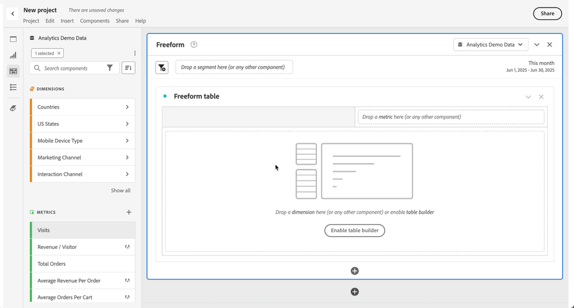
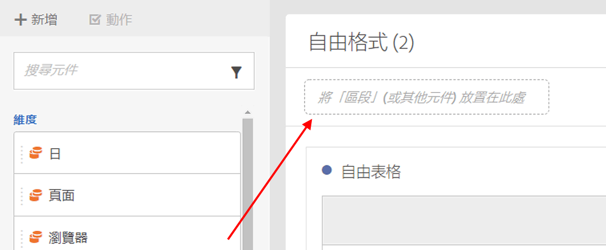

# 在 Analysis Workspace 中使用元件

元件組成任何 Analysis Workspace 專案的實際資料。元件由維度、量度、區段和日期範圍組成。您可以將元件拖曳至視覺效果或面板中，將其加入專案。

查閱[元件概觀](/help/analyze/analysis-workspace/components/analysis-workspace-components.md)，以進一步了解您可以新增的元件類型。

>[!TIP]
>
>如需各個元件的資訊，請使用 。如需詳細資訊，請參閱[元件資訊](#component-info)。

## 將元件新增至專案中

1. [在 Analysis Workspace 中建立專案](/help/analyze/analysis-workspace/build-workspace-project/create-projects.md)。

1. 對 Analysis Workspace 中的專案[新增面板](/help/analyze/analysis-workspace/c-panels/panels.md#create-a-panel)或[新增視覺效果](/help/analyze/analysis-workspace/visualizations/freeform-analysis-visualizations.md#add-visualizations-to-a-panel)。如果您在空白專案中新增元件，系統將會自動建立自由格式表格視覺效果。

1. 從底部面板選取「 **[!UICONTROL 元件]**」。您可以在左側面板中看到所有可用的元件。如需詳細資訊，請參閱[介面](/help/analyze/analysis-workspace/home.md#interface)。

1. 捲動至或搜尋要新增的元件，然後將其拖曳到專案中的面板或視覺效果中。

1. 您可以選擇將元件拖曳到面板頁首中的區段放置區域。此拖放動作將元件定義為一個區段，並將此區段套用至面板中的所有內容。如欲了解如何使用面板上的區段放置區域將面板分段，請參閱[面板概觀](/help/analyze/analysis-workspace/c-panels/panels.md)中的[放置區域](/help/analyze/analysis-workspace/c-panels/panels.md#drop-zone)。

1. 如需詳細資訊，請參閱下列章節：

   * [在專案中新增維度](#add-dimensions-to-a-project)

   * [在專案中新增量度](#add-metrics-to-a-project)

   * [在專案中新增區段](#add-segments-to-a-project)

   * [在專案中新增日期範圍](#add-date-ranges-to-a-project)

### 在專案中新增維度

[維度](/help/components/dimensions/overview.md)是Adobe Analytics中的變數，通常包含字串值。 相對地，[量度](/help/components/c-calcmetrics/cm-overview.md)包含繫結至維度的數值。基本報表會針對一個數值 (量度) 欄顯示字串值 (維度) 列。

1. 根據[在專案中新增元件](#add-components-to-a-project)的說明，開始為 Analysis Workspace 專案新增維度。

1. 選擇下列其中一項方法新增維度，並確定要分析的資料類型：

   

   * 將維度拖曳到 Analysis Workspace 的視覺效果 (例如自由格式表格) 中。

   * 根據[在專案中新增區段](#add-filters-to-a-project)的說明，從左側面板拖曳一或多個維度到區段放置區域，即可建立快速區段。

1. 您可以選擇使用其他元件劃分 Analysis Workspace 中的維度和維度項目。如需詳細資訊，請參閱[在 Workspace 中劃分維度](/help/analyze/analysis-workspace/components/dimensions/t-breakdown-fa.md)。

如欲了解如何使用 Analysis Workspace 的維度，請參閱[預覽維度](/help/analyze/analysis-workspace/components/dimensions/view-dimensions.md)、[劃分維度](/help/analyze/analysis-workspace/components/dimensions/t-breakdown-fa.md)以及[時間分段維度](/help/analyze/analysis-workspace/components/dimensions/time-parting-dimensions.md)。

### 在專案中新增量度

量度可讓您量化 Analysis Workspace 中的資料點。它們最常用作視覺效果中的欄，並和維度相連結。

若要將量度新增至 Analysis Workspace 中的專案：

1. 根據[在專案中新增元件](#add-components-to-a-project)的說明，開始為 Analysis Workspace 專案新增量度。

1. 選擇下列其中一項方法在 Analysis Workspace 中新增量度：

   

   * 將量度拖曳到空白自由格式表格中的量度放置區域，以查看該量度在專案日期期間的趨勢。

   * 已有維度時，可拖曳量度以查看各個維度項目的量度。

   * 將量度拖曳到現有量度頁首的頂部，即可將其取代。

   * 將量度拖曳到現有量度頁首的左側或右側，即可新增量度。

   * 將量度拖曳到現有量度頁首的上方或下方，即可建立量度重疊。

如需關於量度的詳細資訊，請參閱[設定量度](/help/analyze/analysis-workspace/components/apply-create-metrics.md)。

### 在專案中新增區段

[區段](/help/components/segmentation/seg-overview.md)可讓您根據特性或互動來識別人員、工作階段或事件的子集。

您可以透過以下任一方式使用 Analysis Workspace 區段：

* 在面板中新增區段
當您在面板中新增區段時，這些區段將會套用至面板內的所有內容。
如欲了解如何使用面板上的區段放置區域將面板分段，請參閱[面板概觀](/help/analyze/analysis-workspace/c-panels/panels.md)中的[放置區域](/help/analyze/analysis-workspace/c-panels/panels.md#drop-zone)。

* 在視覺效果中新增區段
當您在自由格式表格中的欄位新增區段時，這些區段將會套用至表格欄位內的所有內容。您也可以新增區段作為流失視覺效果的一部分。

* 在元件中使用區段
當您定義[計算量度](/help/components/c-calcmetrics/c-workflow/cm-workflow/c-build-metrics/metrics-with-segments.md)、[註解](/help/analyze/analysis-workspace/components/annotations/create-annotations.md#annotation-builder)，或甚至[區段](/help/components/segmentation/segmentation-workflow/seg-build.md)之類的元件時，您可以將區段作為定義的一部分使用。

### 在專案中新增日期範圍

[日期範圍](/help/analyze/analysis-workspace/components/calendar-date-ranges/calendar.md)確定 Analysis Workspace 中的報告時間段，並且可以套用至專案中一或多個面板，以及部分視覺效果 (例如自由格式表格)。

每個面板都包含一個預設的日期範圍。有多種方法可以更新面板的日期範圍。更新 Analysis Workspace 面板日期範圍的其中一種方法，是從左側面板拖曳日期範圍元件：

1. 或者，根據[在專案中新增元件](#add-components-to-a-project)的說明，將日期範圍新增至 Analysis Workspace 專案中。

1. 從左側面板拖放日期範圍至：

   * 目前日期範圍，可修改面板的日期範圍。

     

   * 自由格式表格視覺效果的量度或維度。請參閱[使用日期範圍](/help/analyze/analysis-workspace/components/calendar-date-ranges/calendar.md#use-date-ranges)，以了解更多資訊。

如欲了解如何在 Analysis Workspace 中使用和管理日期範圍，請參閱[日期範圍概觀](/help/analyze/analysis-workspace/components/calendar-date-ranges/calendar.md)。

## 元件資訊

將游標停留在任何元件上，即可顯示。選取後將會彈出一個視窗，其中包含有關該元件的附加資訊。

根據存取控制，您可以：

* 存取元件的[!UICONTROL 資料字典]定義。
* 存取已定義元件的元件產生器。

<!--
# Use components in Analysis Workspace

Components make up the actual data of any project in Analysis Workspace. Components consist of dimensions, metrics, segments, and date ranges. You can add components to a project by dragging them into visualizations or panels.

For overview information about the types of components you can add, see [Components overview](/help/analyze/analysis-workspace/components/analysis-workspace-components.md).

>[!TIP]
>
>For information about each component, select the Info icon next to a component's name in the left rail of Analysis Workspace, or see the [Analytics Components Guide](/help/components/home.md).

## Begin adding components to a project

1. [Create a project in Analysis Workspace](/help/analyze/analysis-workspace/build-workspace-project/create-projects.md) if you haven't already.

1. [Add a panel](/help/analyze/analysis-workspace/c-panels/panels.md) or [add a visualization](/help/analyze/analysis-workspace/visualizations/freeform-analysis-visualizations.md#add-visualizations-to-a-panel) to the project in Analysis Workspace. 

   If you add a component to a blank project, a freeform table visualization is automatically created.

1. Select the **[!UICONTROL Components]** icon in the left rail.

   

1. Scroll to or search for the component you want to add, then drag it to a panel or visualization within your project. 

1. (Optional) Drag a component to the segment drop zone in a panel header. 

   Segments apply to all content within the panel.

   For information about how you can use the segment drop zone on a panel to filter your panel, see [Drop zone](/help/analyze/analysis-workspace/c-panels/panels.md#drop-zone) in [Panels overview](/help/analyze/analysis-workspace/c-panels/panels.md).

   

1. For more detailed information, continue with one of the following sections, depending on the component type you are adding:

   * [Add dimensions to a project](#add-dimensions-to-a-project)

   * [Add metrics to a project](#add-metrics-to-a-project)

   * [Add segments to a project](#add-segments-to-a-project)

   * [Add date ranges to a project](#add-date-ranges-to-a-project)

## Add dimensions to a project

[Dimensions](/help/components/dimensions/overview.md) are variables in Adobe Analytics that typically contain string values. Common dimensions include [Page](/help/components/dimensions/page.md), [Referring domain](/help/components/dimensions/referring-domain.md), or an [eVar](/help/components/dimensions/evar.md). In contrast, [metrics](/help/components/metrics/overview.md) contain numeric values that tie to a dimension. A basic report shows rows of string values (dimension), against a column of numeric values (metric).

1. Start adding a dimension to your project in Analysis Workspace, as described in [Begin adding components to a project](#begin-adding-components-to-a-project).

1. Choose one of the following methods to add dimensions and determine the type of data you want to analyze:

   * Drag a dimension to a visualization (such as a freeform table) in Analysis Workspace.

     
   
   * Drag one or more dimensions from the left rail onto the segment drop zone to create an ad hoc segment, as described in [Add segments to a project](#add-segments-to-a-project).

     

1. (Optional) You can break down dimensions and dimension items in Analysis Workspace with other components. 

   For more information, see [Break down dimensions](/help/analyze/analysis-workspace/components/dimensions/t-breakdown-fa.md).

For more information about how to use dimensions in Analysis Workspace, see [Preview dimensions](/help/analyze/analysis-workspace/components/dimensions/view-dimensions.md), [Break down dimensions](/help/analyze/analysis-workspace/components/dimensions/t-breakdown-fa.md), and [Time-parting dimensions](/help/analyze/analysis-workspace/components/dimensions/time-parting-dimensions.md).

## Add metrics to a project

[Metrics](/help/analyze/analysis-workspace/components/apply-create-metrics.md) allow you to quantify data points in Analysis Workspace. They are most commonly used as columns in a visualization and tied to dimensions.

To add a metric to a project in Analysis Workspace:

1. Start adding a metric to your project in Analysis Workspace, as described in [Begin adding components to a project](#begin-adding-components-to-a-project).

1. Choose one of the following methods to add a metric in Analysis Workspace:

   * Drag a metric to the metric drop zone in an empty Freeform table to see that metric trended over the project's date period. 

     

   * Drag a metric when a dimension is present to see that metric compared to each dimension item. 

   * Drag a metric on top of an existing metric header to replace it.

   * Drag a metric next to a header to see both metrics side-by-side.

For more information about how to use metrics in Analysis Workspace, see [Metrics](/help/analyze/analysis-workspace/components/apply-create-metrics.md).

## Add segments to a project

[Segments](/help/components/segmentation/seg-overview.md) allow you to identify subsets of visitors based on characteristics or specific interactions.

You can use segments in Analysis Workspace in any of the following ways:

### Add segments to a panel

When you add segments to a panel, the segments apply to all content within the panel.

For information about how you can use the segment drop zone on a panel to filter your panel, see [Drop zone](/help/analyze/analysis-workspace/c-panels/panels.md#drop-zone) in [Panels overview](/help/analyze/analysis-workspace/c-panels/panels.md).

### Add segments to a column in a freeform table

When you add segments to a column in a freeform table, the segments apply to all content within the table column.

### Use segments when creating calculated metrics

In the Calculated metric builder, you can apply segments within your metric definition. 

For more information, see [Segmented metrics](/help/components/c-calcmetrics/c-workflow/cm-workflow/c-build-metrics/metrics-with-segments.md).

## Add date ranges to a project

[Date ranges](/help/analyze/analysis-workspace/components/calendar-date-ranges/custom-date-ranges.md) determine the reporting time frame in Analysis Workspace, and can be applied to one or more panels within a project.

Each panel includes a date range by default. There are multiple ways to update a date range for a panel. One way to update a date range for a panel in Analysis Workspace is to drag a date range component from the left rail:

1. Start adding a date range to your project in Analysis Workspace, as described in [Begin adding components to a project](#begin-adding-components-to-a-project).

1. Drag a date range from the left rail onto the current date range in the upper-right portion of the panel.

     

For more information about how to use calendars and date ranges in Analysis Workspace, see [Calendar and date ranges overview](/help/analyze/analysis-workspace/components/calendar-date-ranges/calendar.md).

-->