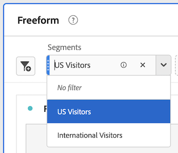

# 在Analysis Workspace中使用元件

元件構成Analysis Workspace中任何專案的實際資料。 元件包含維度、量度、區段和日期範圍。 您可以將元件拖曳至視覺效果或面板中，藉此新增元件至專案。

如需可新增之元件型別的概觀資訊，請參閱 [元件概觀](/help/analyze/analysis-workspace/components/analysis-workspace-components.md).

>[!TIP]
>
>如需各個元件的詳細資訊，請在Analysis Workspace的左側邊欄中選取元件名稱旁的「資訊」圖示，或參閱 [Analytics元件指南](/help/components/home.md).

## 開始新增元件至專案

1. [在Analysis Workspace中建立專案](/help/analyze/analysis-workspace/build-workspace-project/create-projects.md) 如果您尚未這樣做。

1. [新增面板](/help/analyze/analysis-workspace/c-panels/panels.md) 或 [新增視覺效果](/help/analyze/analysis-workspace/visualizations/freeform-analysis-visualizations.md#add-visualizations-to-a-panel) Analysis Workspace中的專案。

   如果您將元件新增至空白專案，則會自動建立自由表格視覺效果。

1. 選取左側邊欄中的「**[!UICONTROL 元件]**」圖示。

   

1. 捲動至或搜尋您要新增的元件，然後將其拖曳至專案中的面板或視覺效果。

   例如，您可以將區段拖曳至面板標頭中的區段放置區。

   

1. 如需更多詳細資訊，請根據您新增的元件型別，繼續下列其中一節：

   * [將維度新增至專案](#add-dimensions-to-a-project)

   * [將量度新增至專案](#add-metrics-to-a-project)

   * [將區段新增至專案](#add-segments-to-a-project)

   * [新增日期範圍至專案](#add-date-ranges-to-a-project)

## 將維度新增至專案

[Dimension](/help/components/dimensions/overview.md) 是Adobe Analytics中通常包含字串值的變數。 常見的維度包括[頁面](/help/components/dimensions/page.md)、[反向連結網域](/help/components/dimensions/referring-domain.md)或 [eVar](/help/components/dimensions/evar.md)。相對地，[量度](/help/components/metrics/overview.md)包含繫結至維度的數值。基本報表會針對一個數值 (量度) 欄顯示字串值 (維度) 列。

1. 如所述，開始將維度新增至Analysis Workspace中的專案 [開始新增元件至專案](#begin-adding-components-to-a-project).

1. 選擇下列其中一種方法來新增維度，並決定您要分析的資料型別：

   * 將維度拖曳至Analysis Workspace中的視覺效果（例如自由表格）。

     

   * 從左側邊欄將一或多個維度拖曳至區段托放區以建立臨機區段，如所述 [將區段新增至專案](#add-segments-to-a-project).

     

如需如何在Analysis Workspace中使用維度的詳細資訊，請參閱 [預覽維度](/help/analyze/analysis-workspace/components/dimensions/view-dimensions.md)， [劃分維度](/help/analyze/analysis-workspace/components/dimensions/t-breakdown-fa.md)、和 [時間分段維度](/help/analyze/analysis-workspace/components/dimensions/time-parting-dimensions.md).

## 將量度新增至專案

[量度](/help/analyze/analysis-workspace/components/apply-create-metrics.md) 可讓您量化Analysis Workspace中的資料點。 它們最常用作視覺效果中的欄，並和維度相連結。

若要在Analysis Workspace中新增量度至專案：

1. 開始在Analysis Workspace中將量度新增至您的專案，如所述 [開始新增元件至專案](#begin-adding-components-to-a-project).

1. 選擇下列其中一種方法，在Analysis Workspace中新增量度：

   * 將量度拖曳至空白自由表格中的量度拖放區域，可檢視專案日期期間的量度趨勢。

     

   * 存在維度時可將量度拖移，以查看該量度和每個維度項目的比較。

   * 將量度拖移到現有量度標頭的頂部，即可將其取代。

   * 將量度拖移到標頭旁邊，即可並排查看兩個量度。

如需如何在Analysis Workspace中使用量度的詳細資訊，請參閱 [量度](/help/analyze/analysis-workspace/components/apply-create-metrics.md).

## 將區段新增至專案

[區段](/help/components/segmentation/seg-overview.md) 可讓您根據特性或特定互動來識別訪客的子集。

若要在Analysis Workspace中新增區段至專案：

1. 如所述，開始在Analysis Workspace中將區段新增至您的專案 [開始新增元件至專案](#begin-adding-components-to-a-project).

1. 選擇下列其中一個方法，開始篩選面板：

   * 將個別區段從左側邊欄拖曳至區段托放區。

     

   * 按住Shift或Ctrl鍵，在左側邊欄中選取多個區段，然後按住Shift鍵，將區段拖放至區段拖放區域。

     

     這會建立下拉式功能表，讓面板的使用者選擇要套用的篩選器。 下拉式功能表包含 [!UICONTROL **無篩選器**] 使用者可選取的選項，此選項會讓面板保持未篩選狀態。

     您可以從下拉式選單中選取(x)以移除任何選項。 如果您移除 [!UICONTROL **無篩選器**] 選項，則需要篩選。

   * 將非區段元件拖放至拖放區域，以建立臨時區段。 這可讓您節省前往「區段產生器」的時間和精力。 以此方法建立的區段會自動被定義為點擊層級的區段。若要編輯此定義，可按一下區段旁邊的資訊圖示 (i)，然後按一下筆狀編輯圖示並在，即可在區段產生器內進行編輯。

     臨時區段是一種快速區段，屬於專案的本機型別。 除非您將其公開，否則它們不會顯示在左側邊欄中。

     如需更多資訊，請參閱[快速區段](/help/analyze/analysis-workspace/components/segments/quick-segments.md)。

如需有關如何使用面板上的區段放置區域來篩選面板的詳細資訊，請參閱 [拖放區域](/help/analyze/analysis-workspace/c-panels/panels.md#drop-zone) 在 [面板概觀](/help/analyze/analysis-workspace/c-panels/panels.md).

## 新增日期範圍至專案

[日期範圍](/help/analyze/analysis-workspace/components/calendar-date-ranges/custom-date-ranges.md) 決定Analysis Workspace中的報告時間範圍，並可套用至專案中一或多個面板。

依預設，每個面板都包含日期範圍。 更新面板的日期範圍有多種方式。 在Analysis Workspace中更新面板日期範圍的一種方法是從左側邊欄拖曳日期範圍元件：

1. 開始在Analysis Workspace中新增日期範圍至您的專案，如所述 [開始新增元件至專案](#begin-adding-components-to-a-project).

1. 從左側邊欄將日期範圍拖曳至面板右上角目前的日期範圍。

   

如需如何在Analysis Workspace中使用行事曆和日期範圍的詳細資訊，請參閱 [日曆和日期範圍概觀](/help/analyze/analysis-workspace/components/calendar-date-ranges/calendar.md).
