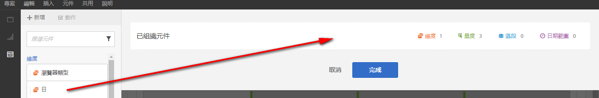
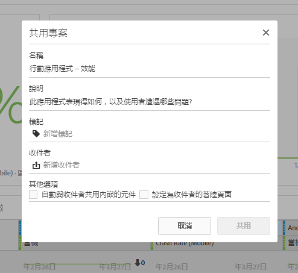

# 組織/共用概述

組織可讓您在共用專案前先限制元件。您可以與企業中的行銷人員及其他非分析人員共用專案及其元件。註解並套用標記至專案。

**影片概述**

>[!VIDEO](https://www.youtube.com/watch?v=LJJRskdmlOg&index=79&t=0s&list=PL2tCx83mn7GuNnQdYGOtlyCu0V5mEZ8sS)

**[!UICONTROL Workspace]** &gt; **[!UICONTROL 共用]** &gt; **[!UICONTROL 組織專案資料]**

## 組織專案資料

1. 指定建立和組織專案的權限。

   在建立或組織 Analysis Workspace 專案前，管理員必須先將您新增至已啟用&#x200B;**[!UICONTROL 「Analysis Workspace 存取權」]**&#x200B;權限的[群組](https://marketing.adobe.com/resources/help/en_US/reference/groups.html)或&#x200B;**[!UICONTROL 「所有報表存取權」]**&#x200B;使用者群組(**[!UICONTROL 管理員]** &gt; **[!UICONTROL 使用者管理]** &gt; **[!UICONTROL 群組]**)。

1. [建立及儲存](/help/analyze/analysis-workspace/build-workspace-project/t-freeform-project.md)專案，然後按一下&#x200B;**[!UICONTROL 「共用]** &gt; **[!UICONTROL 組織專案資料」]**。
1. 從左側的可拖曳元件堆疊中，將要共用的元件拖曳至&#x200B;**[!UICONTROL 「已組織元件」]**&#x200B;欄位。

   

   >[!IMPORTANT]
   >
   >共用專案不需要組織元件。您可以共用具備所有可用元件、預設元件或選定元件的專案。若想保留專案中的所有預設元件，最佳實務是在組織元件前先自行建立一個專案副本 (使用&#x200B;**[!UICONTROL 「另存新檔」]**)。在組織專案中的元件後，您就無法針對該專案使用其他元件。

1. 按一下&#x200B;**[!UICONTROL 完成]**。

這會導致專案的行為類似於 Analysis Workspace 中的典型專案，但只能選擇使用指定的元件。

## 共用已組織的專案

共用可讓貴公司中的其他 Analysis Workspace 使用者也能使用此專案。在其他人使用專案時，將會顯示您所完成的任何組織動作。

1. 組織好專案的元件後，按一下&#x200B;**[!UICONTROL 「共用]** &gt; **[!UICONTROL 共用專案」]**。

   

1. 新增收件者。
1. (選用) 您可以與所有收件者共用內嵌的專案元件 (區段、計算量度、日期範圍)。共用後，這些元件會出現在收件者的 Workspace 元件下拉式清單中。

   >[!IMPORTANT]
   >
   >這項動作不會沿用，僅在單次共用中有效。

1. 您可以選擇將此頁面設為收件者的著陸頁面。

   >[!IMPORTANT]
   >
   >這項動作不會沿用，僅在單次共用中有效。

1. 按一下&#x200B;**[!UICONTROL 共用]**。

<!-- 

 <b>Annotate and tag a project</b> 
 

An alternative way to collaborate on a project is to use the Information panel. This panel will be re-introduced in an upcoming release. 
 

 
 
<ul id="ul_EFD045FD9F3B4BF8A70637B00EE0BC9C"> 
 <li id="li_EC6C5EAF9C234E76BDA7FF0226B82083">Tag reports for sharing. </li> 
 <li id="li_CF6A438C55F847F8890F8CB674CAA4F7">Specify the recipient (filter by permission group or user name), the storage folder. In-product notifications let users know that they have a shared report waiting. </li> 
 <li id="li_C8E088DA43024277908705CB0F3A142A">Write messages or report descriptions for recipients. </li> 
 <li id="li_342EB4758C344B859757E23691068FA3"> Select the dimensions, metrics, and segments to recommend to a non-analyst colleague, who can view the report you are curating and sharing. Curating the component gives the recipient access to those components, based on their permission settings. </li> 
 <li id="li_6487500F9315481599B7F3897998879F"> Add suggested items to a previously configured report. These new items exist as recommended selectable options. </li> 
</ul>

 -->

