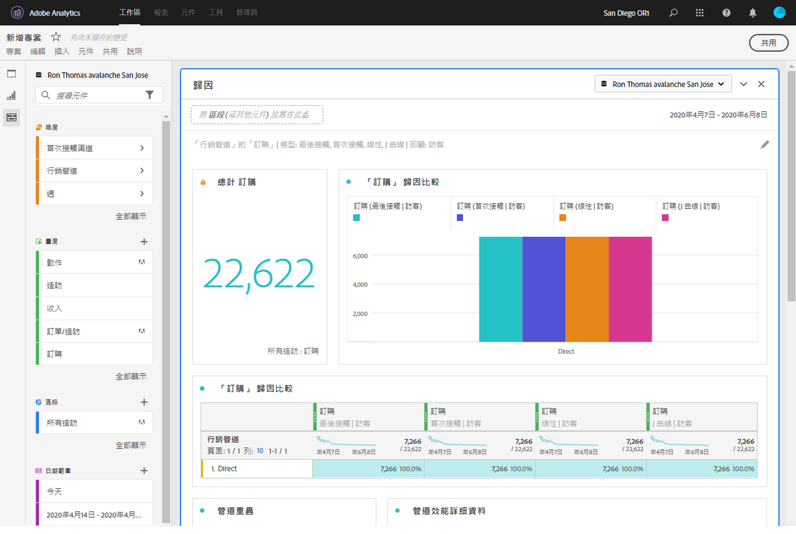

# 組織專案

管監功能可襄您在共用專案前先限制元件 (維度、量度、區段、日期範圍)。收件者在開啟專案時，將會看到您為其組織的限定元件集。組織是可選作業，但建議您在共用專案前先執行此步驟。

>[!NOTE]
> 產品設定檔為管理哪些元件可向使用者顯示的主要機制。這項機制可透過 Adobe Experience Cloud Admin Console 來管理。組織為次要的篩選器。

以下是有關專案策畫和共用的影片：

>[!VIDEO](https://video.tv.adobe.com/v/24711/?quality=12)

## 套用專案組織

1. 按一下&#x200B;**[!UICONTROL 共用]** > **[!UICONTROL 監管專案資料]**。專案中使用的元件將會自動新增。
   **注意**：如果一個專案有多個報表套裝，則專案中的每個報表套裝都會顯示一個組織欄位。
1. (可選) 若要新增更多元件，請從左側邊欄將您要共用的元件拖曳至[!UICONTROL 監管元件]欄位。
1. 按一下&#x200B;**[!UICONTROL 完成]**。

您也可以按一下&#x200B;**[!UICONTROL 監管與共用]**，從[!UICONTROL 「共用」]選單套用組織。此選項會自動將專案組織到專案中使用的元件。您可以依照上述步驟新增其他元件。

## 已監管的專案檢視

收件者在開啟已監管的專案時，將只會看到您已定義的組織元件集：

## 移除專案組織

若要移除專案組織並還原左側邊欄中的完整元件集：

1. 按一下&#x200B;**[!UICONTROL 共用]** > **[!UICONTROL 監管專案資料]**。
1. 按一下&#x200B;**[!UICONTROL 移除組織]**。
1. 按一下&#x200B;**[!UICONTROL 完成]**。

## 虛擬報表套裝組織

若要在報表套裝層級套用組織，以便將其同時套用至多個專案，您可以 [在虛擬報表套裝中組織元件](https://experienceleague.adobe.com/docs/analytics/components/virtual-report-suites/vrs-components.html?lang=zh-Hant).

>[!NOTE]
> 系統一律會先套用虛擬報表套裝組織，再套用專案組織。 換句話說，即使經監管的專案中含有特定元件，但只要經監管的虛擬報表套裝並未包含那些元件，系統便會將其篩除。

## 顯示所有元件選項

在已組織的專案或虛擬報表套裝中，收件者將會看到以下選項 **[!UICONTROL 全部顯示]** 元件。 [!UICONTROL 全部顯示]會根據下列條件顯示不同的元件集：

* 使用者的許可權層級（管理員或非管理員）
* 專案角色 (是否為擁有者/編輯者)
* 套用的組織型別（虛擬報表套裝或專案）
* 用戶擁有或讓其共用的元件。擁有/共用元件包括區段、計算量度和日期範圍。這些元件不包括實現的組件，例如evars，道具和自定義事件。\

這些元件不包括實施元件，例如 eVars、props 和自訂事件。

注意：非管理員檢視角色無法存取專案中的左側邊欄，這樣他們便會在下表中省略。

| 組織類型 | 管理員 | 非管理員專案擁有者或編輯角色 | 非管理員重複角色 |
|---|---|---|---|
| 已組織的虛擬報表套裝 | 所有未經監管的虛擬報表套裝元件 | 此角色擁有或已與其共用之未經組織的虛擬報表套裝元件 | 此角色擁有或已與其共用之未經組織的虛擬報表套裝元件 |
| 已監管的專案 | 所有未經監管的專案元件 | 所有未經監管的專案元件 | 此角色擁有或已與其共享之未經監管的專案元件 |
| 已組織的虛擬報表套裝中的已組織專案 | 所有未經監管的元件，如下所示 **[!UICONTROL 未經監管的專案元件]** 和 **[!UICONTROL 未經組織的虛擬報表套裝元件]** | 此角色擁有或已與其共用之所有未經監管的專案元件和未經監管的虛擬報表套裝元件 | 此角色擁有或已與其共用之未經組織的虛擬報告套裝和專案元件 |
