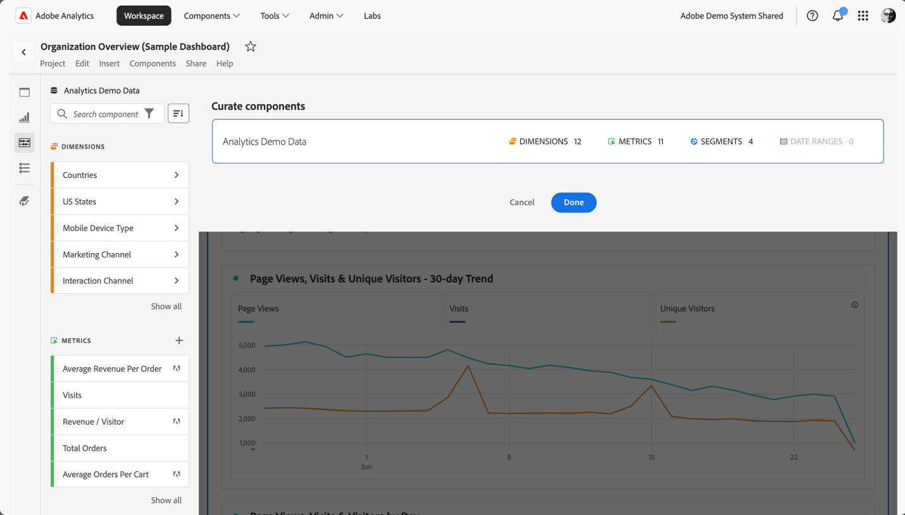

# 監管專案

管監功能可襄您在共用專案前先限制元件 (維度、量度、區段、日期範圍)。收件者在開啟專案時，將會看到您為他們組織好的數量有限的元件。組織是可選作業，但建議您在共用專案前先執行此步驟。

>[!NOTE]
> 產品設定檔為管理哪些元件可向使用者顯示的主要機制。這項機制可透過 Adobe Experience Cloud Admin Console 來管理。組織為次要的篩選器。

>[!BEGINSHADEBOX]

如需示範影片，請參閱 [組織專案](https://video.tv.adobe.com/v/24711?quality=12&learn=on){target="_blank"}。

>[!ENDSHADEBOX]

## 套用專案組織

1. 按一下「**[!UICONTROL 共用]** > **[!UICONTROL 組織專案資料]**」。專案中使用的元件將會自動新增。如果一個專案有多個報表套裝，則專案中的每個報表套裝都會顯示一個組織放置目標。
1. (選用) 若要新增更多元件，請從左側面板將您要共用的元件拖曳至資料視圖的「**[!UICONTROL 組織元件]**」放置區。
1. 選取「**[!UICONTROL 完成]**」。

收件者在開啟已組織的專案時，只會看到您已定義的組織好的元件集：

## 移除專案組織

若要移除專案組織並還原左側邊欄中的完整元件集：

1. 按一下「**[!UICONTROL 共用]** > **[!UICONTROL 組織專案資料]**」。
1. 選擇「**[!UICONTROL 移除組織]**」。
1. 選取「**[!UICONTROL 完成]**」。

## 虛擬報告套裝監管

若要在報告套裝層級套用監管，以便將其同時套用至多個專案，您可以[在虛擬報告套裝中監管元件](/help/components/vrs/vrs-components.md)。

>[!NOTE]
>
> 虛擬報告套裝監管一律會在專案監管之前套用。即使已組織的專案包含某些元件，但只要已組織的虛擬報表套裝不包含這些元件，系統就會將這些元件篩除。
> 

## 元件組織選項

在已組織的專案或虛擬報表套裝中，收件者將會在左側邊欄中看到&#x200B;**[!UICONTROL 顯示所有]**&#x200B;元件的選項。 「[!UICONTROL 全部顯示]」會根據下列條件顯示不同的元件集：

* 使用者的權限層級 (管理員或非管理員)
* 專案角色 (是否為擁有者/編輯者)
* 所套用的監管類型 (虛擬報告套裝或專案)
* 用戶擁有或讓其共用的元件。擁有/共用元件包括區段、計算量度和日期範圍。其中不包含實作的元件，例如eVar、prop和自訂事件。

注意：非管理員檢視角色無法存取專案中的左側邊欄，這樣他們便會在下表中省略。

| 組織類型 | 管理員 | 非管理員專案擁有者或編輯角色 | 非管理員重複角色 |
|---|---|---|---|
| **已組織的虛擬報表套裝** | 所有非監管的虛擬報告套裝元件 | 此角色擁有或已與其共用之非監管的虛擬報告套裝元件 | 此角色擁有或已與其共用之非監管的虛擬報告套裝元件 |
| **已組織的專案** | 所有未經監管的專案元件 | 所有未經監管的專案元件 | 此角色擁有或已與其共享之未經監管的專案元件 |
| 已組織虛擬報表套裝中的&#x200B;**已組織專案** | 在「**[!UICONTROL 非監管專案元件]**」和「**[!UICONTROL 非監管的虛擬報告套裝元件]**」下方顯示的所有非監管元件 | 此角色擁有或已與其共用之所有非監管的專案元件和非監管的虛擬報告套裝元件 | 此角色擁有或已與其共用之非監管的虛擬報告套裝和專案元件 |
