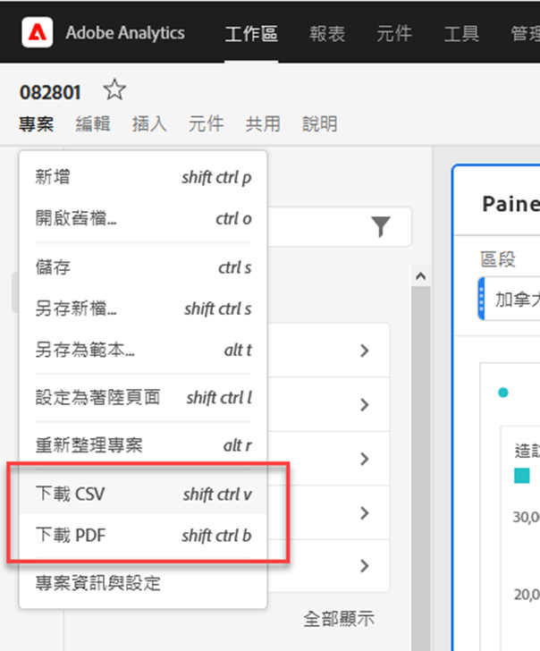
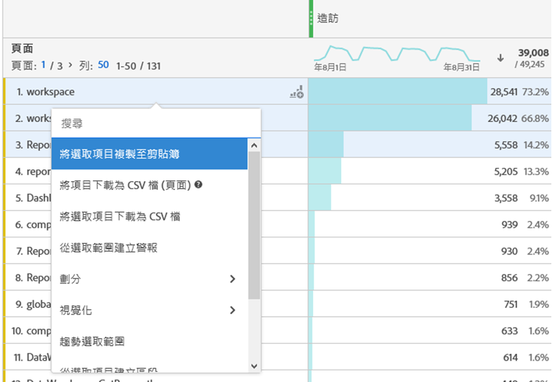
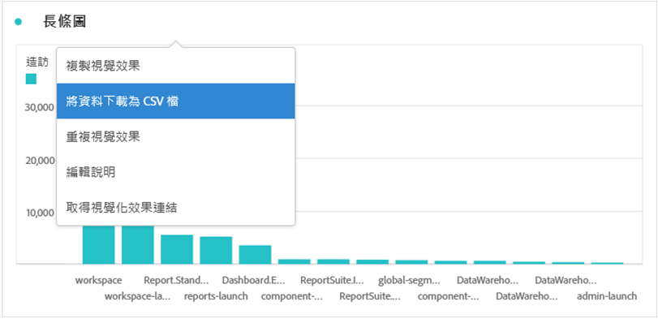
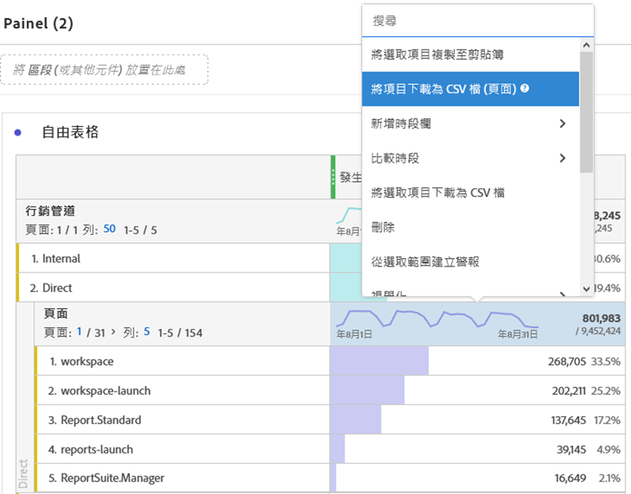
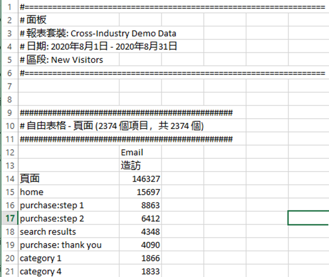

# 下載專案和資料

您可以將Analysis Workspace專案和資料下載至本機裝置。 此下載檔案可以是複製資料、CSV （逗號分隔值資料）檔案或PDF （可攜式檔案格式）檔案。

* 如果您想要在下載的檔案中加入視覺效果，請選取PDF選項。
* 如果您只需要純文字資料，請選取CSV和複製的資料選項。

匯出Adobe Analytics資料的其他方法在[匯出指南](/help/export/home.md)中說明。

## 將專案下載為PDF或CSV檔案 {#download-project}

### 將專案下載為PDF檔案

將專案下載為PDF時，請考量下列事項：

* 在專案下載至您的工作站之前，請勿離開專案。 由於專案在Adobe伺服器上重新執行以便PDF呈現，下載作業可能需要幾分鐘的時間。 呈現下載時，您可以繼續變更專案。 如果PDF的轉譯時間超過5分鐘，系統會提示您改為[傳送電子郵件給PDF](../curate-share/send-schedule-files.md)。
* 下載項目將呈現為單一頁面，而不套用任何分頁。
* PDF包含可在Analysis Workspace的瀏覽器頁面中看到的內容。 若要避免截斷內容，請選取「」以自動調整任何自訂大小的視覺效果或面板的大小。
* 在下載的PDF中，可點選自由表格中的[超連結](/help/analyze/analysis-workspace/visualizations/freeform-table/freeform-table-hyperlinks.md)。

若要將專案下載為PDF檔案：

1. 選取&#x200B;**[!UICONTROL 專案]** > **[!UICONTROL 下載PDF]**。

   綠色列會顯示下列訊息：  **[!UICONTROL 已要求您的下載。 請稍候。]**

1. 下載準備就緒後，綠色列會顯示以下訊息：  **[!UICONTROL *專案名稱&#x200B;*PDF已準備就緒。]**

1. 在綠色列上選取&#x200B;**[!UICONTROL 下載]**。

   根據您的瀏覽器設定，PDF會自動下載至您先前設定的資料夾，或提示您選擇將下載PDF的資料夾。

   檔案名稱由&#x200B;*專案名稱* - *報告套裝名稱* - *日期*&#x200B;組成。 例如，`Example Project - Omni-Channel - Luma - Jun 30, 2025.pdf`。

### 將專案下載為CSV檔案

1. 選取&#x200B;**[!UICONTROL 專案]** > **[!UICONTROL 下載CSV]**。

   根據您的瀏覽器設定，CSV檔案會自動下載到您先前設定的資料夾，或提示您選擇將下載CSV檔案的資料夾。

   檔案名稱由&#x200B;*專案名稱* - *報告套裝名稱* - *日期*&#x200B;組成。 例如，`Example Project - Omni-Channel - Luma - Jun 30, 2025.csv`。

## 將視覺效果內的資料複製到剪貼簿 {#copy-data}

內容功能表中的&#x200B;**[!UICONTROL 複製到剪貼簿]**&#x200B;選項可讓您從Analysis Workspace快速複製資料，並將資料貼到協力廠商工具中。

* 如果您想要複製顯示的表格資料，請選取表格標頭，並從內容功能表選取&#x200B;**將資料複製到剪貼簿**。
* 如果您想要複製資料的子集，請在表格中選取專案，然後從內容功能表中選取&#x200B;**將選取專案複製到剪貼簿**。

>[!TIP]
>
>您可以使用快速鍵&#x200B;**_cmd + c_** (macOS)或&#x200B;**_ctrl + c_** (Windows)，將您的選取內容複製到剪貼簿。 然後使用&#x200B;**_cmd + v_** (macOS)或&#x200B;**_ctrl + v_** (Windows)貼上資料。

{zoomable="yes"}

## 將視覺效果中的資料下載為CSV檔案 {#download-data}

從快顯選單下載為CSV選項可讓您將資料表格或任何視覺效果的資料來源下載為CSV檔。

若要進行此步驟：

* 從任何表格或視覺效果的標題中，選取內容功能表中的&#x200B;**[!UICONTROL 將資料下載為CSV檔]**。 這樣會將表格中顯示的資料或視覺效果的基本資料來源下載為 CSV 檔。

<!-- Only relevant as soon as CJA supports Map visualization 
  >[!NOTE]
  >
  >  Note: the Map visualization does not support this option.
-->

* 在表格中，從內容功能表選取&#x200B;**[!UICONTROL 將選取專案下載為CSV檔]**。 使用此選項只會下載選取內容，不會下載完整的顯示表格。

## 將專案下載為CSV檔案 {#download-items}

如果您想要分析表格中超過400列的可見資料，請從表格標頭或任何一列的內容功能表中選取&#x200B;**以CSV格式下載專案(_Dimension名稱_)**。 此選項可針對選取的維度匯出多達 50,000 個維度項目 (根據表格排序)，並有套用的排序選項和篩選器。如果您從表格頂端選取此選項，會匯出表格中的第一個維度。

自由表格中不強制執行任何限制。 為確保最佳效能，建議在少於20欄的表格中使用此選項。

>[!TIP]
>
> 如果您的維度超出 50,000 個項目，請下載已套用不同排序量度的檔案或套用區段。例如，在某個下載中依「瀏覽數」進行遞減排序，並在第二個下載中依「瀏覽數」進行遞增排序。 此訣竅可幫助您擷取較冷門的項目。

您可以在專案中進行多工處理，甚至可以在下載進行中時，導覽至相同索引標籤中的新 Workspace 專案。 如果您開啟新的瀏覽器索引標籤，下載作業就會暫停。如果您完全離開 Workspace 或關閉瀏覽器索引標籤，下載作業就會取消。

### 已下載的項目檔案 {#items-file}

下列自由表格功能會套用至下載的檔案：

* 所有面板區段都會套用為篩選條件。
* 表格中所選維度&#x200B;**上方**&#x200B;的劃分會套用為每一欄上方的篩選條件。
* 表格中所選維度&#x200B;**下方**&#x200B;的劃分則會被移除。

### 下載通知 {#notifications}

下載檔案時，您會看到下列通知：

* 已要求藍色&#x200B;**[!UICONTROL _資料表名稱&#x200B;_-_Dimension _.csv。_x _%完成]**，表示進度。 若要隨時取消下載，請選取&#x200B;**[!UICONTROL 取消下載]**。 若要關閉郵件，請選取，這不會取消下載。
* 綠色&#x200B;**[!UICONTROL _資料表名稱&#x200B;_-_Dimension _.csv在檔案下載完成後已下載]**&#x200B;完成通知。 檔案會下載至為瀏覽器設定的下載資料夾。

如果您一次要求多項下載，您會收到通知，告知您每項額外下載要等到前一個下載完成時才會排入佇列。

## 常見問答 {#faq}

| 問題 | 回答 |
| --- | --- |
| 為什麼我下載的PDF只包含一個頁面？ | [下載PDF](#download-as-csv-or-pdf)功能無法將下載的PDF分頁。 |
| 我可以使用&#x200B;**[!UICONTROL 將專案下載為CSV檔]**&#x200B;選項匯出50,000個以上的專案嗎？ | 雖然每項下載最多可包含 50,000 個維度項目，您還是可以變更表格的排序，以擷取較冷門的項目，或是套用篩選條件來下載更明確的項目。 |
| 「**[!UICONTROL 複製視覺效果]**」有什麼作用？ | 不同於&#x200B;[!UICONTROL **將資料複製到剪貼簿**]&#x200B;或&#x200B;[!UICONTROL **將選取專案複製到剪貼簿**]，**[!UICONTROL 複製視覺效果]**&#x200B;內容功能表選項不是匯出選項。 此選項可讓您[複製視覺效果](/help/analyze/analysis-workspace/visualizations/freeform-analysis-visualizations.md#context-menu)或[將面板](/help/analyze/analysis-workspace/c-panels/panels.md#context-menu)從Workspace中的某個位置複製到另一個位置。 例如，從某個面板複製到相同專案中的另一個面板，或從一個專案複製到另一個專案。 |

<!--

# Download 

There are several ways to export data from Analysis Workspace. The method you choose depends on what set of data you want to analyze and who needs to access it.

Exported data can be in the form of copied data, CSV, or PDF. A PDF is typically preferred if you want visualizations included in the file. CSV and copied data is preferred if you simply want plain-text data.

## Download a project as CSV or PDF {#download-project}

Consider the following when downloading projects:

* When downloading projects as a CSV or PDF, the project can be saved or unsaved when you request a project download. However, only saved projects can be [scheduled](/help/analyze/analysis-workspace/curate-share/t-schedule-report.md). 

* When downloading projects as a PDF:
  * Downloads can take several minutes to export because the project is re-run on Adobe servers before rendering in PDF format. We recommend not leaving the project until the PDF downloads in your browser. However, you can continue to make changes to the project while you wait. If a PDF takes longer than 5 minutes to render, you will be prompted to email it instead.
  * Downloads are rendered as a single page with no pagination applied.
  * PDF renderings contain what is on the page in Workspace. If a project has custom-sized visualizations and panels, you need to change them to be auto-sized (button in top-right corner) so that there will be no truncated content.
  * Any [hyperlinks](/help/analyze/analysis-workspace/visualizations/freeform-table/freeform-table-hyperlinks.md) that exist within freeform tables are not functional in the downloaded PDF. 

To download a project as a CSV or PDF file:

1. Do either of the following, depending on what format you want to download the project in:

   * **PDF:** Select **[!UICONTROL Project]** > **[!UICONTROL Download PDF]**.

     Choose this option if you want the downloaded file to contain all the displayed (visible) tables and visualizations in the project.

   * **CSV:** Select **[!UICONTROL Project]** > **[!UICONTROL Download CSV]**. 

     Choose this option if you want plain-text data.

   

1. (Conditional) If you chose to download a PDF, a message is shown after the project is ready to be downloaded. Click [!UICONTROL **Download**].
1. Click the **[!UICONTROL Download this file]** icon and save the file to a folder of your choice.

## Copy data to clipboard (hotkey: cmd + c) {#copy-data}

The right-click option **[!UICONTROL Copy to clipboard]** lets you quickly copy data from Workspace and paste it in a third-party tool. 

* If you want the displayed table copied, right-click the table header and choose **Copy data to clipboard**. 
* If you want a subset of data copied, make a selection in the table and then right-click > **Copy selection to clipboard**.

>[!TIP]
>
>You can use the hotkey `Ctrl+C` to copy your selection to the clipboard, then use `Ctrl+V` to paste it into a third-party tool.

## Download data as CSV {#download-data}

The right-click option **[!UICONTROL Download data as CSV]** allows you to download a table of data or the data source of any visualization as a CSV.

* From the header of any table or visualization, right-click and choose **[!UICONTROL Download data as CSV]**. This downloads the displayed data in the table or the underlying data source for a visualization as a CSV. 

  >[!NOTE]
  >
  >  Note: the Map visualization does not support this option.

* Within a table, right-click and choose **[!UICONTROL Download selection as CSV]**. Only the selection is downloaded with this option, as opposed to the full, displayed table.

## Download items as CSV {#download-items}

If you want to analyze more than the visible 400 rows of data in a table, right-click the table header or any row and select **Download items as CSV (_Dimension name_)**. This option exports up to 50,000 dimension items (based on the table sort) for the selected dimension, with filters and segments applied. If you chose this option from the top of the table, the first dimension in the table will be exported. While no limits are enforced in the freeform table, it is recommended that the Download items option be used in tables with less than 20 columns to ensure optimal performance.

>[!TIP]
>
> If your dimension exceeds 50,000 items, download the file with different sort metrics applied or apply a filter. For example, sort descending by Visits in one download and then ascending by Visits in a second download. This tip can help you retrieve longer-tail items.

You can multi-task within the project and even navigate to a new Workspace project in the same tab while the download is in progress. The download pauses if you open a new browser tab. The download is canceled if you leave Workspace completely or close the browser tab.

### Downloaded items file 

Features of the table will be applied to the downloaded file as follows:

* All panel segments are applied as filters.
* Breakdowns **above** the selected dimension in the table are applied as filters above each column. 
* Breakdowns **below** the selected dimension in the table are removed.

In the example above, Page items are downloaded with the panel segment (New Visitors Customers) and components above (Marketing Channel = Email) applied as filters, and the components below (Mobile Device Type) removed from the downloaded CSV.

### Download notifications

As the file downloads, you will see an informational notification with the progress. At any time, you can cancel the download by clicking **[!UICONTROL Cancel download]**. Closing the toast **will not** cancel the download. 

Once the file completes, you will see a completion notification and the file will download to your browser.

If you request more than one download at a time, you will receive a notification that each additional download will be queued until the prior download completes.

## FAQ {#faq}

| Question | Answer |
| --- | --- |
| Why is my downloaded PDF one page? | Workspace does not paginate downloaded PDFs at this time. |
| Can I export more than 50,000 items with the "Download items as CSV" option? | While each download can contain up to 50,000 dimension items, you can change the sort of your table to retrieve longer tail items, or apply a filter to download more specific items. |
| What does **[!UICONTROL Copy visualization]** do? | Unlike [!UICONTROL **Copy data to clipboard**] or [!UICONTROL **Copy selection to clipboard**], the **[!UICONTROL Copy visualization]** right-click option is not an export option. It allows you to copy a visualization or panel from one place in Workspace to another. For example, from one panel to another in the same project, or from one project to another project. [Intra-linking video](https://experienceleague.adobe.com/docs/analytics-learn/tutorials/analysis-workspace/visualizations/intra-linking-in-analysis-workspace.html?lang=zh-Hant) |

-->